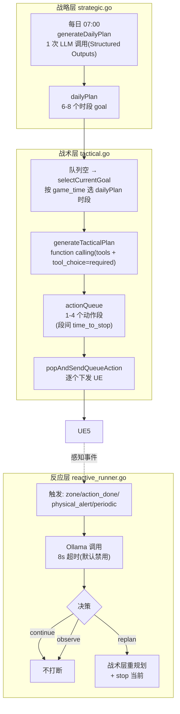
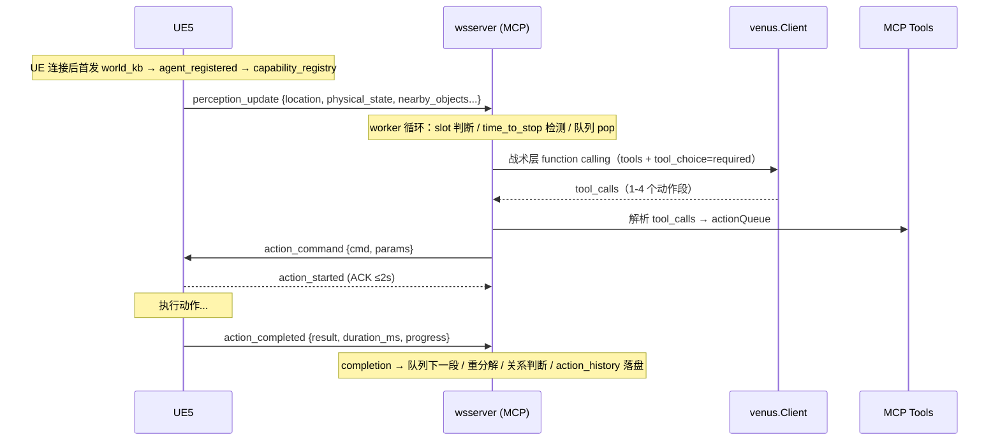
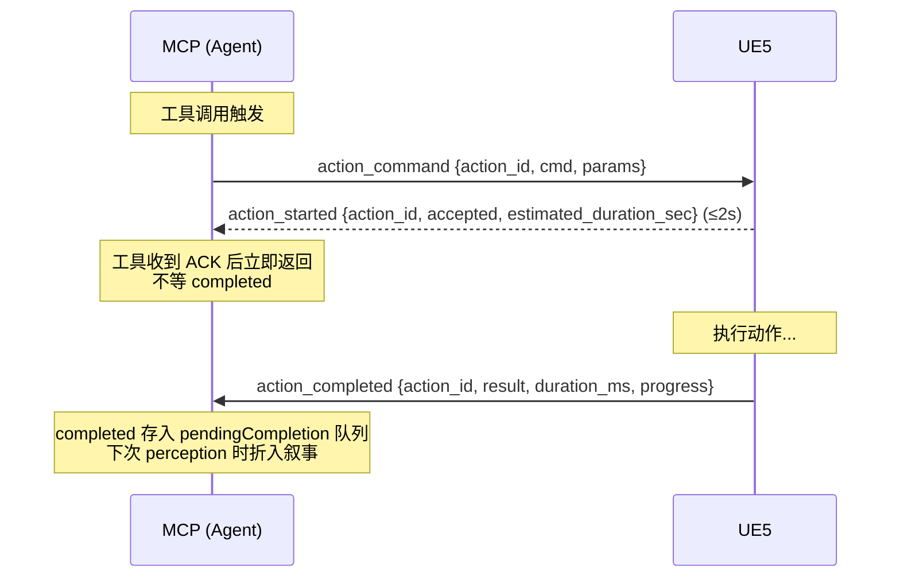
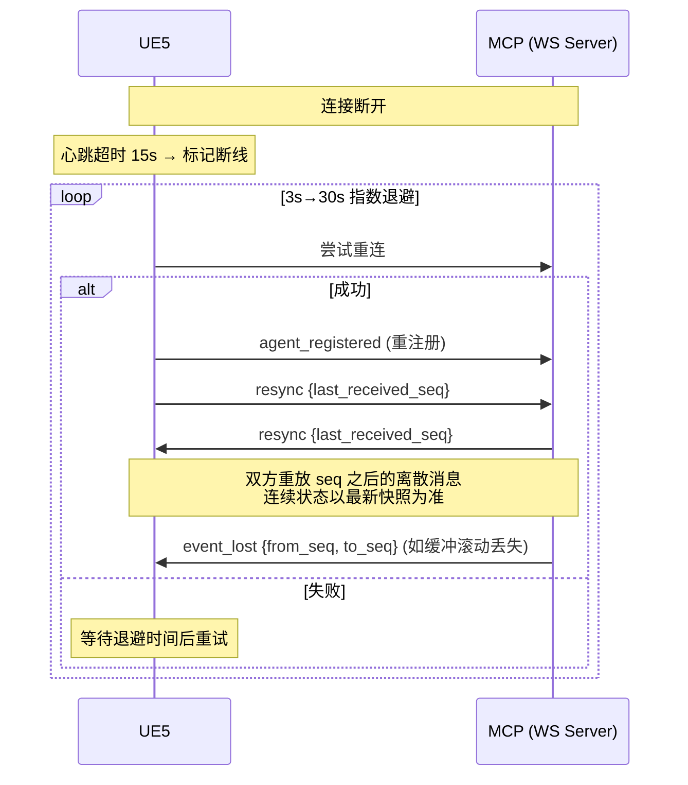

# CLAUDE.md

This file provides guidance to Claude Code when working with code in this repository.

## 项目定位

AgentTown_v3 — AI NPC 模拟系统。5 个 NPC（H-01~H-05，各自独立 profile 人设 + 工种），通过 MCP 协议驱动完整的"感知→决策→行动"闭环，对接真实 UE5（AgentTown 地图，2026-08-11 起弃用 Mock UE）。通信协议按 `docs/AgentTown_CommProtocol_Values.md` 实现。

**三层决策架构**：
- **战略层**（`pkg/prompt/strategic.go` + `cmd/agenttown-mcp/strategic.go`）：每日 07:00 生成当天计划（`dailyPlan`，6-8 个时段 goal）。system/user prompt 拆分、规则迁 user prompt、注入生产工作流概述与物理状态分档
- **战术层**（`pkg/prompt/tactical.go` + `cmd/agenttown-mcp/tactical.go`）：每个时段把 goal 分解为 1-4 个动作段，走 **OpenAI 原生 function calling**（`tools` 字段、`tool_choice=required`、多轮 agentic loop），段间用 `time_to_stop` 控制时长
- **反应层**（~~已退役 P4-12~~）：打断判定全部由事件系统（world_event + 路由器 + force 通道）承担；Ollama 仅保留 Stage 5 关系判断

**模块化架构**（2026-08-27 拆分，多 module 仓库）：
- **contract/**（契约 module，无依赖）：`protocol/`（7 字段信封+消息类型）+ `Transport` 接口（决策侧与连接侧的边界）
- **wsserver/**（连接 module）：WS 收发/seq 重放/ACK，实现 `contract.Transport`
- **根 module**（`agenttown-mcp/`）：agent 决策 + 装配壳 + `pkg/` 领域库，经根 `go.mod` 的 `replace => ./contract` / `=> ./wsserver` 引用本地 module
- 依赖倒置：agent 决策侧（`guardedExecutor`/`dialogueRunner`/`reactiveRunner`/worker 循环）只依赖 `contract.Transport` 接口，不依赖 wsserver 实现；入站消息经 `Runtime.HandleMessage`（`cmd/agenttown-mcp/runtime.go`）单入口分发，运输层只注册 `HandleMessage`/`OnDisconnect` 两个回调

**LLM 后端**：MCP 直连 Venus（OpenAI Chat Completions 协议），战略层用 `deepseek-v4-pro`、战术层用 `deepseek-v4.1-flash`（`--venus-strategic-model`/`--venus-model`）。反应层直连本地 Ollama（`qwen2.5:7b`），不走 Venus。

## 架构总览

```mermaid
graph LR
    subgraph UE["UE5 游戏世界"]
        UE5["真实 UE5<br/>AgentTown 地图<br/>5 个 NPC (H-01~H-05)"]
    end
    subgraph MCP["Linux 云环境"]
        MCP["agenttown-mcp (Go)<br/>MCP Server + WS Server<br/>:8760 HTTP / :9092 WS (stable)<br/>三层决策：战略+战术+反应"]
    end
    subgraph LLM["LLM 后端"]
        VENUS["Venus<br/>战略 deepseek-v4-pro<br/>战术 deepseek-v4.1-flash<br/>(OpenAI 兼容)"]
        OLLAMA["Ollama 本地<br/>qwen2.5:7b<br/>(反应层专用，默认禁用)"]
    end
    UE5 <-->|"WebSocket :9092<br/>7-field Envelope"| MCP
    MCP -->|"HTTP POST<br/>/v1/chat/completions<br/>(战略/战术层 function calling)"| VENUS
    MCP -->|"HTTP POST<br/>/api/chat<br/>(反应层)"| OLLAMA
```

### 组件职责

| 组件 | 语言 | 路径 | 端口 | 职责 |
|------|------|------|------|------|
| 真实 UE5 | C++/蓝图 | UE 侧 AgentTown 地图 | — | 游戏世界：物理状态、空间状态、动作执行、感知推送、world_kb/capability_registry 下发 |
| contract module | Go | `agenttown-mcp/contract/` | — | 契约：protocol（信封/消息类型）+ Transport 接口（两侧边界） |
| wsserver module | Go | `agenttown-mcp/wsserver/` | — | WS 连接：收发、seq 重放、ACK 等待，实现 contract.Transport |
| agenttown-mcp 根 module | Go 1.25+ | `agenttown-mcp/` | HTTP `:8760`, WS `:9092`（stable，脚本默认） | 协议适配、感知语义化、工具暴露、三层决策、LLM 桥接 |
| Venus | 远程 | `--venus-url` | — | OpenAI 兼容 LLM 服务（战略/战术层后端） |
| Ollama | 本地 | `--ollama-url` | `:11434`（默认禁用，需显式启用） | 反应层本地 LLM（qwen2.5:7b） |

### 三层决策架构

MCP 内置三层决策，由 `runPerceptionWorker`（`main.go:279`）事件驱动循环串联：



### 关键机制

- **worker 循环**：`runPerceptionWorker` 监听 `wake` 信号，队列空时调 `tacticalRefill` → `selectCurrentGoal` → `generateTacticalPlan` → 填 `actionQueue` → `popAndSendQueueAction` 下发
- **战术层 function calling 多轮对话**：`generateTacticalPlan` 经统一 agentic loop（`agenticTurn` → `SendLoop`）携带多轮历史（user/assistant tool_calls/占位 tool）。**不做滑动窗口截断**（已取消，原 8 轮截断会丢上下文导致目标漂移/重复动作），仅跨游戏日 `ClearConversation` 清空，单日内保留完整对话
- **战术层 user prompt 首条全量 + 后续精简引用**：日内不变块（【全天日程】+ 完整分解规则）只在每天第一条战术 user 消息出现；同计划后续轮次省略两块、改为核心约束速览 + 引用行（`TacticalInput.Compact`，实测每条 2100→~900 字符，-57%）。判定与置位：`AgentState.tacticalHeaderPlan` 记录"最近成功注入全量头的计划字符串"（成功 agenticTurn 后、parse 之前置位），与当前 dailyPlan 比对——不等（跨日/日内重规划）即重新全量注入；`ClearConversation` 随历史一起重置。dailyPlan=="" 的 `/debug/schedule` 路径永不精简
- **`<agent_state>` 状态栏**（事件驱动设计 §6.1，`agent_state_bar.go`）：`agenticTurn` 在 messages 末尾追加一条瞬态 user 消息，四行：当前游戏时间（`D<DayCount+1> HH:MM:SS`）、物理状态（`PhysicalLine` 分档自然语言，非裸数值）、当前日程与剩余时间（`[序号/总数] 时段 goal（剩余约 N 分钟）`，跨午夜经 `NormalizeTodToSlot` 归一）、当前动作与剩余时间（工具名+关键参数，剩余按 `time_to_stop` 目标时刻推算）。**不入会话历史**——每轮请求从 AgentState 现查现拼（旧状态栏留在历史里只会误导），前缀保持稳定、KV cache 只失效尾巴；成功落历史的是 userContent 本身。无感知数据（UE 未推首条 perception）返回空串跳过注入
- **venus 4001 重试**：战术层 LLM 调用返回 4001（venus 校验 tools JSON 失败，LLM 输出坏 JSON）时以相同请求体重试，上限 3 次（`maxTacticalRetries`，`isVenusErrorCode` 匹配错误码）；超时/连接错误不重试，走兜底。实测重试后 4001 全部被救回
- **多段动作计划 + time_to_stop**：LLM 一次返回 1-4 个动作段，段间设 `time_to_stop` 控制时长；到点 `ClearInFlightKeepQueue` 打断当前段、保留队列继续下一段；末段不设 time_to_stop 自然持续到时段切换
- **time_to_stop 兜底**（不依赖 LLM 自觉）：`fillDefaultTimeToStopForRest` 给非队尾休息动作补 1800s、`fillDefaultTimeToStopForWork` 给非队尾工作动作补 5400s——防止中间动作漏设导致队列卡死（NPC 一直坐长椅/一直工作）
- **LLM 失败兜底**：战术层分解失败且队列空时补发 `fallbackRetryActions()`（speak"网络波动了"+ generic_act look_around 30s），避免呆站，动作执行完 completion 再唤醒重试
- **zone 透传**：`mapTacticalAction` 对 `InteractSmartObject` 透传 LLM 填写的 `zone` 参数（UE 支持），否则"去中央广场长椅"会落到 NPC 所在 zone 的设施
- **move_to/turn_to 目标校验（2026-09-21）**：按 target_type 校验必填参数（agent/smart_object/zone → target_id 必填；position → target_position 必填），缺目标指令在 MCP 侧拒绝（不再透传 UE——实测 UE 对无目标 MoveTo 秒回 success，逃跑从未发生且队列瞬间耗尽触发连环 refill）；拒绝原因以 user role 注入会话历史（镜像动作完成结果的注入形态，带 tool_call_id），下一轮分解 LLM 可见并自我纠正。schema 层 `capabilityParamsSchema` 对 target_id/target_position 描述按 target_type 给完整指引（无论 registry 来自 seed 还是 UE push——UE push 的描述只提 actor，LLM 曾因此输出 target_type=zone 却无 target_id）。顺带修复：LLM 坐标经 json.Unmarshal 是 []any，旧 `[]float64` 断言不成立，target_position 从未透传过
- **`replanInProgress` mutex**：防止 worker 的战术层重规划和 `/debug/schedule` 注入并发调用 `tacticalHc` 冲突
- **`debugOverride`**：仅阻止 worker 的 idle-wait refill，**不阻止**正在 LLM 调用中的 refill——所以 `/debug/schedule` handler 会同时设 `replanInProgress=true` + `debugOverride=true`
- **`currentSlot` 加 `__debug__` 前缀**：防止注入的 slot 和 dailyPlan 同名 slot 碰撞触发 `redecomposeCount >= 1` 限制
- **反应层去抖**：`lastReactiveAt` map 按 trigger 类型去抖（periodic 60s / zone_change 45s）
- **反应层 replan**：决策为 `replan` 时调 `ac.tacticalRefillForReplan`，会重置 `actionQueue` 重新调战术层 LLM
- **world_event 事件系统（事件驱动设计 §四，P1 系列）**：runtime 分发 `world_event`（`world_event_dispatch.go`）。force=true 走硬保证通道——**零 LLM、零去抖、不可否决**，stop 在 WS 接收路径同步发出（goroutine 之前）+ 清在途追踪（stash 保 action_history）+ 注入【强制打断】hint + 异步 `forceInterruptReplan` 重规划（prompt 层渲染为【紧急事件】最高优先级指令，授权暂停时段目标、豁免时长填满）；失败兜底 `abandonCurrentPlan` 清旧队列走 worker 自然 refill。force=false 入 per-agent 事件队列（`pkg/agentstate/world_event_queue.go`，上限 64 丢最旧、event_id 去重防 seq 重放、drain 全取不 pop、仅 Stop 清——slot 切换/replan 不清，安全点在 completion 之后）。手动模式同反应层口径丢弃。联调注入端点 `POST /debug/event`（控制台"事件下发" tab，15 预设 + 自定义）
- **combat-detach 战斗让位（2026-09-22）**：攻击事件携带 `detach:true` = **UE 战斗 AI 接管身体，agent 让位**——与 force 反应语义相反（实测 bug：MCP 1 秒内重规划下发逃跑动作，UE 战斗 AI 从未拿到控制权）。入口 `handleCombatDetach`（handleForceEvent 首分支）：掐在途 LLM + 记住在途 action_id（`combatYieldPrevActionID`）但**宽限期内不发 stop**（`combatYieldTakeoverGrace`=2s wall：stop 的 UE 语义是"中断行为树"，迟到的 stop 会把 UE 刚启动的接管连同旧动作杀掉；UE 接管应自行停旧动作并回 interrupted completion，`recordActionCompletion` 里的挂钩收到即免 stop）+ `ClearForReplan`（清队列/slot/在途 stash，**事件队列保留**）+ 取消 timer + `clearReaction` + 清 slotSwitchPending + 置 `combatYield`；**不重规划不下发不 hint**，重复攻击幂等（仅刷新 TTL 起点与 lastEvent）。worker 让位守卫里 `checkCombatYieldTakeoverStop`：宽限期过旧动作仍未结束（接管未触发）→ MCP 代为 stop 恰一次，**脱管物理落地**（机器人停止 agent 行为——2026-09-22 用户报告"显示脱管但继续原动作"的修复）。其余抑制面：worker 守卫（processSlotSwitch **之前**）挡 slot 切换/pop/refill（`checkCombatYieldExpiry` 查 30 游戏分钟 TTL 兜底）、detectDayRollover 跳过、`route()`/`routerInterrupt()` 顶部守卫（事件留队列）、chat_invite 礼貌拒绝、guardedExecutor 拒绝、/debug/schedule 409。**归还**：让位中的 `combat_exit` 确定性接收（不走路由）；`reclaimFromCombatYield`：清让位 + 若旧动作仍未停再补一次精确 stop（STOP_ID_MISMATCH 无害）+ Echo 攻击回声 + `SetReplanHint(【战斗结束】…)`（tacticalHintLine 渲染战后恢复指引）+ **链式双跳 replan**（`forceInterruptReplan` 战术重规划 `selectCurrentGoal` 按游戏时间重推 → 完成后接 `maybeStrategicReplan` 战略层修订剩余时段——两者共享 replanInProgress slot 必须串行，战术先行让 NPC 尽快动起来；`maybeStrategicReplan` 顶部让位守卫挡住战术 replan 期间重复攻击重新让位的竞态窗口）。**属性基线与 delta（2026-09-23）**：让位入口快照 `combatYieldPhys`（首入口锁存，重复攻击不移动基线；无感知冷启动为 nil），归还时与当前值对比渲染"战斗期间物理属性变化：关节磨损 22→68（+46）…"——战术 hint 与战略修订原因共用（磨损暴涨正是"07:00 计划对当下无知"的典型案例）；无基线/无实变优雅降级（战略原因退"物理属性可能已显著变化"）。tacticalHintLine 的【战斗结束】分支越过警戒阈值时追加 `physicalAlertConstraints` 硬约束（与物理告警 hint 同一套"必须优先维护保养/充电"），泛化的"结合物理状态"升级为硬要求。让位状态**跨 UE 断线重连存续**（stop() 不清；TTL 有界兜底）。协议容错：UE 首版发 `event_type:"attacked"` 短名且缺 category——`pkg/prompt` 别名表 + `EffectiveCategory`/`EffectiveEventType` 统一归一，`IsCombatStartEvent`/`IsCombatExitEvent` 匹配 category 空或 player_interaction + 别名。**2026-09-22 晚联调跑通**（此前"三种配置（MCP 抢身体/静默+stop/静默+不 stop）均未触发"的根因是 UE 侧 C++ 改动未重新编译，非 MCP 侧问题）：UE 战斗行为树毫秒级抢占旧动作并即时回 interrupted completion（宽限期代为 stop 从未触发——回执先到即免 stop）、机器人真实逃跑、combat_exit 到达即归还（ttl_expiry=false）；exit 晚到/缺失时 30 游戏分钟 TTL 兜底归还（实测 exit 晚于 TTL 2s 到达的案例，落到非让位路径无害）
- **在途战术层 LLM 请求可取消（§3.3 唯一盲区，P1-4）**：`generateTacticalPlan` 咽喉点注册 cancel 句柄（coordMu + 世代号防旧调用误清新注册）；force 事件在接收路径同步掐掉在途调用（venus ctx 贯穿 HTTP，sendMu 随之中止释放）。半截思考零残留（`agenticTurn` 成功才落历史）。被取消方经 `cancelledByForce`（错误为 Canceled 且 parent ctx 存活——区别于超时 DeadlineExceeded 与父 ctx 关停）判定后**跳过一切失败兜底**：worker `tacticalRefill` 不补 fallback 动作（"网络波动"speak 会与 force 反应打架）、`tacticalRefillForReplan` 返回 `(false, cancelled=true)` 让调用方让位（不清队列不覆盖 hint）、`/debug/schedule` 返回 409。`forceReplanWaitLimit` 由 ~70s 收窄到 5s（取消后 holder 毫秒级释放 slot）
- **持续威胁情境 + 事件回声 + 反应衔接（P3-9 后续修复 A/B/C，2026-09-18）**：排查"被攻击后反应完成即声称威胁解除"的幻觉——事件是边沿触发，威胁在 combat_exit 到达前持续存在，但反应耗尽后的 refill prompt 里威胁痕迹为零（hint 已消费、事件未入队、未完成任务槽已被反应清空）。**A（情境状态）**：`activeSituations`（agentstate/active_situations.go）——`player_attacked/targeted` 在 handleWorldEvent 中央登记（同 kind 幂等保留最早起点）、`combat_exit` 解除、30 游戏分钟 TTL 兜底；注入四处：状态栏"当前处境"行、战术层【当前处境】段（每轮 refill 可见，防自行认定解除）、路由器输入、紧急事件块补"威胁在解除信号前视为持续"。**B（事件回声）**：force/router 打断的 replan 成功后 `EchoWorldEvent` 把事件再入队（跳过去重）——反应耗尽后的第一次日程 refill 在【发生的事件】里再见到它一次（消费即清）。**C（反向 hint 抑制）**：反应窗口仍 armed 的 refill 跳过"上次队列提前耗尽…安排长动作收尾"自动 hint（它会把 LLM 推回填满时段，恰与"刚被打断"的语境相反）；情境由 A 承载
- **事件驱动战略层 replan + 写回（§5.5，P3-9 升格）**：07:00 的计划对当天事件无知——反应跨时段被切断（advanceSlotIfNeeded 返回反应进行中）/ 反应超截止被切回日程（checkReactionDeadline 返回 true）/ **战斗让位归还（combat-detach 归还链第二跳，2026-09-23）**时触发 `maybeStrategicReplan`（`strategic_replan.go`，顶部让位守卫防竞态）：`generateDailyPlanCore`（triggerStrategicPlanning 抽出的无兜底核心）带修订上下文（原计划 + P4-10 未完成任务槽/上次结束原因）重规划**剩余时段** → `mergeRemainder` 合并（已过时段保留为既成事实）→ `SetDailyPlan` 写回（write-through 持久化）+ `SetCurrentPlanIndex` 指向首个新时段 + `RecordPlanRevision` 留痕（P5-15 反思输入）。节流：每游戏日上限 5 次（尝试即计数）+ 相邻间隔 ≥2 游戏小时（`TryBeginStrategicReplan` 原子判定）+ 手动模式不触发。失败/被 force 取消保留旧计划；持 replanInProgress slot 并注册 LLM 取消句柄
- **安全点 drain：事件队列 → 战术层第三输入（§4.4/§5.1，P3-7）**：`generateTacticalPlan` 咽喉点快照事件队列 → `FormatWorldEventList` 渲染 → 战术 prompt 【发生的事件】段（全量与 compact 形态都注入——事件是逐次数据非日内不变块）。**快照注入 + 成功后清空**（`ClearWorldEvents`）：LLM 失败/被 force 取消时事件保留在队列，下一次分解重新看到。drain 覆盖三个调用方（worker refill / force 与路由打断的 replan / debug schedule）——force 打断的重规划一次看到"紧急事件 hint + 队列攒下的事件"全貌
- **chat_invite 迁移（P4-14）**：UE 停发独立 `chat_invite`，统一按 `world_event`（`social.chat_invite_incoming`）推送；Agent 侧 `handleWorldEvent` 收到后**即时转交** dialogueRunner（不入队等安全点——对话建立有实时性要求，UE 会话状态机在等 rsp）；原三字段（conv_id/from/content）从 `data` 解包。旧独立消息分支保留为兼容路径（收到时转 world_event 再分发）。`chat_invite_rsp`/`chat_turn` 维持原消息类型不变
- **事件合成器（P4-12，`event_synthesizer.go`）**：本地检测到的状态变化（物理警戒带突破/动作异常完成/event_notification）合成 world_event 走统一事件管道——`dispatchSynthesizedEvent` 入队 + 路由器裁决。event_id 用 `synth_` 前缀与 UE 的 `evt_` 区分。UE 侧 world_event 推送就绪后本层整体删除。这是旧反应层退役后的替代：旧 Ollama continue/observe/replan 决策由路由器 interrupt/入队替代，物理告警升级（upgradeIfPhysicalAlert）由路由器 LLM 判断替代，去抖（lastReactiveAt）由 P2-6 反应护栏（severity 严格递增 + 截止时间）替代
- **轻量事件路由器（§4.3，P2-5）**：非 force 事件入队后异步走一次判决模型裁决（`event_router.go` + `pkg/jev`，Venus 判决 API `POST /v1/systemone`，`--jev-timeout` 默认 5s，per-agent `jevHc` 客户端做**无状态单发**——不碰会话历史，实测 ~0.5s）。请求 = 结构化 state：`conversation`（agentic loop 近期历史，`routerConversation` 取战术层会话尾部窗口 20 条——user 指令原文、assistant 文本或 tool_calls 单行渲染、tool 占位跳过）+ `user`（`prompt.BuildRouterUserAttributes`：npc/world[无区域行/无设施类别行]/role/relationships/physical_state/current_action/active_situations/event——空字段整体省略，规划上下文[生产工作流/设施名册]不入，对紧急度裁决是噪音）+ 三问：`should_interrupt`（noul 概率，阈值 0.5 严格大于）+ `motive`（choice：urgent/situation_resolved/social/no_interrupt，判据写在 instructions/criteria 里）+ `severity`（score 锚点 [日常小事, 紧急事件]）。`routerDecisionFromJev` 映射回 `RouterDecision`（severity=score×10 钳位；social 封顶 3；noul 高但 no_interrupt 自相矛盾 → 保守入队）；判不准倾向入队（超时/HTTP 错/缺 answer/矛盾全部降级 enqueue，事件已在队列不丢）。interrupt=true → `routerInterrupt`：撤下队列中该事件（`RemoveQueuedWorldEvent`，正在处理不再等安全点）+ 掐在途 LLM + stop 在途动作 + hint 带"路由裁决：紧急"+理由 → 复用 `forceInterruptReplan`。裁决输入含角色性格/人际关系（Stage 5）/当前动作与已执行时长/物理分档——同一事件不同 NPC 因关系/性格产生不同裁决（涌现验收点）。路由调用进 llmmetrics（layer="router"，事件路由）与 actual_prompts.md（`### 事件路由 · state` 段）
- **反应护栏（§4.5 两条，P2-6）**：打断（force 或路由）产生的规划窗口即"反应任务"，agentContext（coordMu）记录 `reactionActive/reactionSeverity/reactionDeadlineGameSec`。① **截止时间**：60 游戏分钟（`reactionDeadlineGameSec` var），worker 循环 `checkReactionDeadline`（replanBusy 守卫后）到期硬切——stop 在途 + 清队列 + 【反应截止】hint 回到日程；"仍 armed"即自反应起无日程 refill（refill/slot 切换/下线都会清除），截止硬切因此有明确归属。② **severity 严格递增**：路由打断须严格高于当前反应的 severity 才放行，否则事件保持入队（保守方向与 §4.3 一致）；force 不受限（§4.2 不可否决）但会重置窗口 bar。severity 收敛 0-10

### LLM 后端

MCP 直连 Venus（OpenAI Chat Completions 协议），战略/战术层调用 Venus。事件路由走 Venus 判决 API（`pkg/jev`，`POST /v1/systemone`，模型 `jev-1.13.0`——state+questions 三型问题：noul/choice/score，与 chat completions 同网关同凭据，`/v1/models` 列表不含它）。Ollama（`pkg/ollama/client.go`）仅剩关系判断用，默认禁用。

**function calling**：战术层经 `tools` 请求字段下发工具（由 `capability_registry` 派生），`tool_choice=required`，多轮 messages（system + 历史 + 最新 user）。战略层用 Structured Outputs（`response_format` json_schema strict）。

**启动示例**：
```bash
./agenttown-mcp --http :8760 --ws :9092 \
  --venus-url http://v2.open.venus.oa.com/llmproxy \
  --venus-api-key $VENUS_API_KEY \
  --venus-model deepseek-v4.1-flash \
  --venus-strategic-model deepseek-v4-pro
```

Venus 客户端无状态——每次调用全量 prompt，不复用会话链（战术层多轮历史由 MCP 侧 `agentstate.Conversation` 维护，非 Venus session）。战略/战术层 prompt 完全由 MCP 构造，所有上下文（角色、世界知识、物理状态）显式注入。

## 通信流向

核心消息流（三层决策细节见上方"三层决策架构"）：



## 常用命令

### 一键启动（云环境）

```bash
cd /data/workspace/dev
bash start-dev.sh              # dev 实例：端口 8770/9093，日志 logs-dev/
cd /data/workspace/stable
bash start-debug.sh            # stable 实例：端口 8760/9092，日志 logs/
```

`start-debug.sh`/`start-dev.sh` 执行顺序：**读取 .env → 拉起 MySQL → 编译+启动 MCP → 等健康检查通过**。UE5 端由外部启动连接 MCP 的 WS 端点（`:9092` stable / `:9093` dev）。

### Go 构建 / 测试

```bash
cd agenttown-mcp
go build ./...                                              # 编译检查（根 module，replace 自动解析本地 module）
go test ./...                                               # 全部测试
go test ./cmd/agenttown-mcp/ -v -count=1                    # 战术/战略层 + 决策
go test ./pkg/prompt/ -v -count=1                           # prompt 构建 + 物理分档
cd wsserver  && go test ./... -v -count=1                   # WS 缓冲/重放测试（独立 module）
cd contract  && go test ./... -v -count=1                   # 协议序列化测试（独立 module）
```

### 日志检查

**统一日志文件**：`logs/YYYY-MM-DD/debug-mcp.log`（stable 实例）或 `logs-dev/YYYY-MM-DD/debug-mcp.log`（dev 实例）。MCP 进程独占写入，JSON Lines 格式，含 UE + MCP + LLM 三层全链路；`YYYY-MM-DD` 为仿真启动日期

**推荐：用 `scripts/pretty_log.py` 可读化查看**（每条 JSON 渲染为多行，方向标记着色，长字段按行展开）：

```bash
# HTML 报告（推荐，自动打开浏览器，可折叠/搜索/过滤）
python scripts/pretty_log.py --html                       # 今天的日志
python scripts/pretty_log.py --html 2026-07-20            # 指定日期
python scripts/pretty_log.py --html -f PERCEPTION -n 50   # 最近 50 条 PERCEPTION
python scripts/pretty_log.py --html -o report.html        # 指定输出路径
python scripts/pretty_log.py --html --no-open             # 生成但不自动打开

# 终端渲染
python scripts/pretty_log.py                              # 查看今天的 debug-mcp.log
python scripts/pretty_log.py -f PERCEPTION -n 5           # 最近 5 条 MCP→LLM 感知原文
python scripts/pretty_log.py -f RESPONSE -n 5             # 最近 5 条 LLM 响应
python scripts/pretty_log.py --raw                        # 原始 JSON（grep/awk 友好）
```

`--html` 模式生成独立 HTML 文件（默认 `logs/YYYY-MM-DD/sim_report.html`），自动打开浏览器，支持：
- 点击条目展开/折叠详情
- 顶部按钮按方向过滤（UE→MCP / MCP→UE / PERCEPTION / RESPONSE / TOOL / HEARTBEAT）
- 搜索框（支持正则）
- 长字段（perception text / payload）自然换行，不受终端宽度限制
- 暗色主题，方向标记彩色高亮

**历史 Hermes 日志整合（DEPRECATED）**：`--hermes` 系列参数仅供解析 2026-08 之前的历史日志使用（Hermes Gateway 已移除）。新日志仅含 UE/MCP/LLM 三层，无 Hermes 容器日志。

方向过滤器（`-f`）简写：`UE→MCP` / `MCP→UE` / `PERCEPTION` / `RESPONSE` / `TOOL` / `HEARTBEAT`。heartbeat 默认隐藏。

**原始 grep（不渲染，单行 JSON）**：

```bash
grep '\[UE→MCP\]' logs/YYYY-MM-DD/debug-mcp.log           # UE5 → MCP（感知/状态/动作完成）
grep '\[MCP→UE\]' logs/YYYY-MM-DD/debug-mcp.log           # MCP → UE5（动作命令）
grep '\[MCP→LLM/PERCEPTION\]' logs/YYYY-MM-DD/debug-mcp.log    # MCP → LLM（感知文本）
grep '\[LLM→MCP/RESPONSE\]' logs/YYYY-MM-DD/debug-mcp.log      # LLM → MCP（LLM 响应 + narrative）
grep '\[MCP→LLM/STRATEGIC-PROMPT\]' logs/YYYY-MM-DD/debug-mcp.log   # 战略层 prompt（每日规划输入）
grep '\[LLM→MCP/STRATEGIC-RESPONSE\]' logs/YYYY-MM-DD/debug-mcp.log # 战略层 LLM 响应（每日计划 JSON）
grep '\[MCP→LLM/TACTICAL-PROMPT\]' logs/YYYY-MM-DD/debug-mcp.log    # 战术层 prompt（任务分解输入）
grep '\[LLM→MCP/TACTICAL-RESPONSE\]' logs/YYYY-MM-DD/debug-mcp.log  # 战术层 LLM 响应（actions JSON）
grep '队列已填充' logs/YYYY-MM-DD/debug-mcp.log           # 战术层任务队列形成（含完整 actions）
grep 'perception decision triggered' logs/YYYY-MM-DD/debug-mcp.log  # LLM 决策触发点
grep 'state_report' logs/YYYY-MM-DD/debug-mcp.log         # 状态报告摘要

# 按决策轮次关联：PERCEPTION / TOOL / RESPONSE 共享 agent_id + decision_epoch
# 例如查看 decision_epoch=1 的完整链路：
grep '"decision_epoch":1' logs/YYYY-MM-DD/debug-mcp.log   # 同一轮次的 PERCEPTION/TOOL/RESPONSE

# 战术规划链路：TACTICAL-PROMPT → TACTICAL-RESPONSE → 队列已填充 → 下发 action
# 例如查看某次战术分解的完整链路：
grep -E 'TACTICAL-PROMPT|TACTICAL-RESPONSE|队列已填充|\[战术层\] 下发 action' logs/YYYY-MM-DD/debug-mcp.log
```

**轮次关联**：`[MCP→LLM/PERCEPTION]`、`[LLM→MCP/TOOL]`、`[LLM→MCP/RESPONSE]` 三种日志都带结构化字段 `agent_id` 和 `decision_epoch`，匹配这两个字段即可关联同一次决策回合的输入 prompt、工具调用、LLM 响应。同一 `decision_epoch` 的 TOOL 可能出现在 RESPONSE 之前（工具调用在 LLM 流式输出时实时回调，而 RESPONSE 日志在 HTTP 响应完成后才写）。

**战术/战略层日志**：战略层和战术层使用独立的 LLM 调用（无状态，不复用决策链），因此不带 `decision_epoch`。链路按 `agent_id` + 时间顺序关联：`[MCP→LLM/STRATEGIC-PROMPT]` → `[LLM→MCP/STRATEGIC-RESPONSE]` → `[战略层] 每日计划生成成功`；`[MCP→LLM/TACTICAL-PROMPT]` → `[LLM→MCP/TACTICAL-RESPONSE]` → `[战术层] 队列已填充`（含完整 actions JSON）→ `[战术层] 下发 action`（逐个 pop）。

UE5 不写独立日志文件，MCP 的 `logs/`（stable）或 `logs-dev/`（dev）日志为唯一权威记录。

## 联调 Debug 工具

MCP 启动后暴露 HTTP debug 端点（dev 端口 `:8770`，stable `:8760`，以 `--http` flag 为准）：

| 端点 | 方法 | 用途 |
|------|------|------|
| `GET /debug/` | GET | 浏览器控制台 UI（单页 HTML，`//go:embed` 嵌入） |
| `POST /debug/action` | POST | 直接下发单个 action_command 到 UE（单步调试） |
| `POST /debug/schedule` | POST | 注入一条 schedule 到战术层，立即分解为 action 序列入队 |
| `POST /debug/event` | POST | 合成 world_event 注入事件系统（走与 UE 上报相同的分发入口；force 打断/入队全链路联调） |
| `GET /debug/kb` | GET | 返回 world_kb JSON（zones/objects） |
| `GET /debug/cap` | GET | 返回 capability_registry 当前状态（global + per-agent cmd） |
| `GET /debug/agents` | GET | 返回已注册 agent ID 列表（供前端 agent 下拉） |
| `GET /debug/logs` | GET | 返回最近 MCP 日志（环形缓冲 500 条，按 level 筛选） |
| `GET /debug/plan` | GET | 返回指定 agent 当日 dailyPlan 快照（items/current_slot/game_time） |
| `GET /debug/tactical` | GET | 返回所有 agent 战术层分解情况（当前时段 goal + 在途 action 及参数 + 待执行队列） |
| `GET /debug/ue-errors` | GET | 返回最近 UE 上报 error 消息（环形缓冲 50 条） |
| `GET /debug/llm-metrics` | GET | 返回 LLM 调用表现聚合指标（各层 E2E/TTFT/TPOT/ITL 分位数 + 错误分布 + 重试率 + JSON 正确率） |

### `/debug/schedule`（2026-07 新增）

给战术层注入一条单行 schedule，立即触发 LLM 分解 → 填充 actionQueue → signal worker 下发。**会强制中断当前在途 action**（`force` 默认 true）。

请求体：
```json
{
  "agent_id": "H-01",
  "schedule": "车间装配作业",
  "force": true
}
```

`schedule` 支持两种形态：
- 纯 goal：`"车间装配作业"`（时间段可选，内部用 `__debug__` 前缀避免和 dailyPlan 碰撞）
- 带时段：`"07:00-11:00: 车间装配作业"`（时段仅作 prompt 时长提示）

详见 `docs/DebugAction_Tool.md`。

### `/debug/event`（2026-09 新增，事件驱动 P4-13）

合成 `world_event` 注入事件系统，**走与 UE 上报完全相同的分发入口**（`Runtime.handleWorldEvent`）——force=true 走硬保证通道（同步 stop 在途动作 + 异步重规划），force=false 入队等安全点 drain。只注入入站消息，不直接向 UE 发任何东西，与 UE 自身推事件不冲突（注入事件的 event_id 用 `evt_debug_` 前缀与 UE 的 id 空间隔离）。

请求体（`event` 为完整 `WorldEventPayload`，缺省字段服务端自动补齐：`event_id`（evt_debug_*）、`occurred_at`（now）、`game_time`（该 NPC 当前权威游戏时间）、`data`（空对象））：
```json
{
  "agent_id": "H-01",
  "event": {
    "category": "player_interaction",
    "event_type": "player_attacked",
    "force": true,
    "severity": 10,
    "data": {"attacker": "player_1", "damage": 20, "damage_type": "physical"}
  }
}
```

`category`/`event_type` 六类别枚举见 `docs/AgentTown_WorldEvent_Protocol.md`。浏览器控制台"事件下发" tab 提供 14 个快速预设（被玩家攻击/脱离战斗/K-03 故障广播/能量跌破等）+ 自定义表单。

### 浏览器 UI

`/debug/` 单页控制台，多面板：
- **单 Action**：填 cmd + params，直接下发 UE
- **Schedule 注入**：填 schedule 文本，触发战术层分解
- **事件下发**：快速预设（被玩家攻击/战斗接管 detach/脱离战斗等 15 项，含 detach 复选框）+ 自定义 world_event，走事件系统分发入口
- **当日 schedule**：右侧面板展示 dailyPlan（时段 + goal + 当前高亮）
- **战术层分解情况**：全宽面板展示每个 NPC 当前时段 goal + 在途 action（含全部参数）+ 待执行队列（每 5s 刷新）
- **MCP 日志**：全宽面板，按 level 筛选的环形日志

UI 特性：curl 预览、历史记录（支持 replay）、响应字段高亮、强制中断复选框。

## 通信协议（v1.0）

### 7 字段信封

所有消息共用外层结构（`contract/protocol/envelope.go`），业务字段一律放入 `payload`：

```go
type Envelope struct {
    Version   string          `json:"version"`    // "1.0"
    MsgID     string          `json:"msg_id"`     // UUID
    Seq       int64           `json:"seq"`        // per-sender 单调递增
    Timestamp int64           `json:"timestamp"`  // Unix 毫秒
    Type      string          `json:"type"`
    AgentID   string          `json:"agent_id"`   // "system" 保留给系统消息
    Payload   json.RawMessage `json:"payload"`
}
```

### 关键约定

| 约定 | 内容 |
|------|------|
| 信封纯净 | `action_id` 等业务字段一律放入 payload，不得出现在信封顶层 |
| 时间单位 | 所有时间戳为**毫秒**；时长字段以 `_ms`/`_sec` 后缀标注 |
| 坐标单位 | UE5 厘米(cm)，position=[X,Y,Z]，rotation=[Pitch,Yaw,Roll] 度 |
| 保留 ID | `agent_id = "system"` 仅用于 heartbeat/error 等系统级消息 |
| 感知 vs 状态分工 | perception_update 负责空间+环境+物理状态全量三项；state_report 兜底物理状态 + 任务进度 |
| 物理 delta 阈值 | perception_update 携带全量 energy/fatigue/joint_wear 三项；state_report 兜底 |

### 消息类型总表

| type | 方向 | 用途 | 触发时机 |
|------|------|------|----------|
| `perception_update` | UE→Agent | 空间+环境感知（物理仅带变化项） | 每 N 游戏分钟（normal=60, behavior=15, quick-smoke=30）/ zone 变化 |
| `action_command` | Agent→UE | 下发动作指令 | 工具调用 / LLM 决策 |
| `action_started` | UE→Agent | 动作已接收的 ACK（≤2s） | UE 收到 action_command 后 |
| `action_completed` | UE→Agent | 动作完成回调 | 动作执行完毕 |
| `action_queued` | UE→Agent | 排队状态通知（queued/advanced/timeout） | auto_queue=true 的 action 目标 Smart Object 被占用且支持排队时 |
| `stop_action` | Agent→UE | 停止当前动作 | 反应层打断 |
| `event_notification` | Agent→Agent | 事件通知（内部路由） | Director 投放事件 |
| `state_report` | UE→Agent | 物理状态兜底上报 + 任务进度 | 兜底（perception_update 主数据源） |
| `agent_registered` | UE→Agent | 机器人上线 | RobotActor BeginPlay |
| `agent_unregistered` | UE→Agent | 机器人下线 | RobotActor EndPlay |
| `heartbeat` | 双向 | 心跳保活 | 每 5 秒 |
| `error` | 双向 | 错误上报 | 异常情况 |
| `capability_registry` | UE→Agent | NPC 能力声明（哪些 cmd 可执行） | UE 连接后 / 能力变更时 |
| `world_kb` | UE→Agent | 世界知识库下发（generated + authored） | UE 连接后（首个 `agent_registered` 之前） |
| `world_event` | UE→Agent | 世界事件上传（事件驱动反应层的判定输入；force=硬保证打断，非 force=入队/路由） | 事件发生那一刻（边沿触发），见 `docs/AgentTown_WorldEvent_Protocol.md` |

### 动作生命周期



**12 种 cmd**（7 原子 + 5 复合，2026-08-11 对齐真实 UE5 `capability_registry`）：
- 原子：`GenericAct`/`MoveTo`/`Wait`/`TurnTo`/`Speak`/`InteractSmartObject`/`Emote`
- 复合：`WorkShift`/`ChargeAtStation`/`SelfMaintenance`/`RestAtResidence`/`SurfInternet`

`Stop` 不再是 cmd，改为 `stop_action` 消息类型（Agent→UE）。`ExecuteComposite`/`PlayAnimation` 已移除，复合动作直接用各自 cmd 下发。

**error_code 取值**：`ACTION_FAILED` / `STOP_ID_MISMATCH` / `INVALID_MESSAGE` / `UNKNOWN_AGENT` / `INTERNAL_ERROR`

### 超时机制

| 操作 | 超时 | 超时后行为 |
|------|------|------------|
| action_started 等待 (ACK) | 2 秒 | 认为指令丢失，重发或重新决策 |
| action_completed 等待 | `estimated_duration_sec × 1.5`（默认 60s） | 发 stop_action + 重新决策 |
| LLM 调用 | 120 秒 | 返回错误，跳过该轮 |
| 心跳响应 | 15 秒 | 认为断线 |
| 重连尝试 | 3 秒间隔，指数退避到 30 秒 | 持续重试 |

### 排队机制（约定21，2026-08-11 新增）

当 Agent 发起 `auto_queue=true` 的 action 但目标 Smart Object 已被占用且支持排队时，UE 将 Agent 加入排队队列，通过 `action_queued` 消息通知状态变化。MCP 侧处理：

- **auto_queue 发送端**：`shouldAutoQueue(cmd)` 对 6 个智能体对象 cmd（`WorkShift`/`ChargeAtStation`/`SelfMaintenance`/`RestAtResidence`/`SurfInternet`/`InteractSmartObject`）返回 true，其他 cmd 默认 false。`guardedExecutor.SendAction` 和 `popAndSendQueueAction` 自动按 cmd 决定 `ActionCommandPayload.AutoQueue` 字段。`/debug/action` 路径传 false（手动调试不排队）
- **action_queued 接收端**：WS handler 解析 `ActionQueuedPayload` → `agentstate.RecordQueueStatus` 按 status 处理：`queued` 写入排队字段（actionID/group/position/estimatedWait/queuedAt）、`advanced`/`timeout` 清空。不触发反应层 Ollama 决策（queued 是信息性状态，下次 periodic/action_done 等触发时 prompt 的【排队状态】段会带上）
- **排队状态清理点**：`RecordActionCompletion`（action 完成）、`ClearForSlotSwitch`/`ClearForReplan`（slot 切换/replan）、`Stop`（agent 下线）都调 `clearQueueStatusLocked`，确保排队状态不残留
- **timeout 路径**：UE 在排队超时后会补一条 `action_completed {result: failed, reason: queue_timeout}`，走现有 `TriggerActionDone` 路径触发反应层重新决策
- **取消排队**：Agent 发 `stop_action` 即可。UE 收到后中断行为树，`QueueForSmartObject` 的 abort 处理会把自己移出队列，并回 `action_completed {result: interrupted}`
- **反应层 prompt 注入**：`ReactiveInput.QueuedFor` 由 `reactive_runner.buildInput` 从 snapshot 构造为 `正在排队等待 <group>（位置 N，预计等待 M 秒）`，注入 prompt 新增的【排队状态】段。不在排队时整段省略

## 数值系统

### 数值归属原则

**谁产生这个数值，谁就是主人，谁负责存储和变更。**

| 数值类别 | 主人 | 变更触发 | UE 需要 | 同步方式 |
|----------|------|----------|---------|----------|
| Agent 内部状态（mood/social_need/emotion） | Agent | LLM 反思 / 交互判断 | ❌ | 不同步 |
| 物理状态（energy/fatigue/joint_wear） | UE | 行为消耗 / 充电恢复 | ✅ 主人 | perception_update 全量上报（state_report 兜底） |
| 关系数值（familiarity/affection） | Agent | 交互后 LLM 更新 | ❌ | 不同步 |
| 空间状态（position/rotation/zone） | UE | 每帧 / Overlap 触发 | ✅ 主人 | perception_update 上报 |
| 任务状态（plan/queue/stack） | Agent | 分层思考产出 | ❌ | 不同步 |

### 物理状态三项

energy / fatigue / joint_wear，通过 `perception_update` 全量上传（`physical_state_delta` map 携带三项）。`state_report` 保留 `PhysicalState` 作为兜底（perception 未带物理状态时补写）。delta 阈值不再适用（perception_update 始终全量）。

## MCP 工具

所有工具在 `agenttown-mcp/adapters/agenttown/tools/`。14 个工具均以 `agent_id` 为第一参数、`decision_epoch` 为第二个必填参数。

**工具列表由 `capability_registry` 动态驱动**：UE 连接 MCP 后发送 `capability_registry` 声明可执行 cmd，MCP 据此调 `tools.ReconcileTools` 增删工具（`AddTool`/`RemoveTools`）。启动时 seed 内置 12 cmd 默认值（`BuiltinCmdCapabilities`），保证 UE 不发 `capability_registry` 也能跑。per-agent 差异化在 `guardedExecutor.SendAction` 这一咽喉点拦截——查 `CapabilityRegistry.HasCmd(agentID, cmd)`，不通过则拒绝下发。战术层 prompt 中的可用工具列表也按 registry 对 agentID 的有效能力集动态生成（`tacticalToolMeta` 是工具元数据单一来源）。

### 复合行为工具（5 个，各自独立 cmd）

| 工具 | 参数 | cmd | 说明 |
|------|------|-----|------|
| `work_shift` | agent_id, semantic_group, interaction | `WorkShift` | 工作班次（装配/分拣/作业） |
| `charge_at_station` | agent_id, semantic_group, interaction | `ChargeAtStation` | 在充电站充电 |
| `self_maintenance` | agent_id, semantic_group, interaction | `SelfMaintenance` | 自我维护保养 |
| `rest_at_residence` | agent_id, semantic_group, interaction | `RestAtResidence` | 在住所休息 |
| `surf_internet` | agent_id, semantic_group, interaction | `SurfInternet` | 上网浏览 |

5 个复合工具共享 `semantic_group` + `interaction` 参数 schema（按真实 UE5 `capability_registry` 声明的参数名），`semantic_group` 引用 `world_kb` 中对应 category 的物体 id（语义组名，如 `workbench`/`charger`/`sleep_pod`/`repair_table`/`computer`），UE5 从该组自动选一个空闲实例。`auto_queue` 作为 `params` 内字段传 `"true"`（约定21）。

### 原子行为工具（7 个 + 2 特殊）

| 工具 | 参数 | cmd |
|------|------|-----|
| `generic_act` | agent_id, thought, behavior | `GenericAct` |
| `move_to` | agent_id, target_type, target_id/target_position | `MoveTo` |
| `turn_to` | agent_id, target_type, target_id/target_position | `TurnTo` |
| `speak` | agent_id, content | `Speak` |
| `emote` | agent_id, emotion | `Emote` |
| `interact` | agent_id, semantic_group, interaction | `InteractSmartObject` |
| `wait` | agent_id, duration_sec | `Wait` |
| `scan_area` | agent_id | （请求即时 perception，无 cmd） |
| `stop` | agent_id | （发 `stop_action` 消息，非 cmd） |

`move_to`/`turn_to` 的 `target_type` 取值 `agent`/`smart_object`/`zone`/`position`；`target_id` 对应 actor id，`target_position` 对应 `[x,y,z]` 坐标。语义目标（如 `move_to(target_type="smart_object", target_id="workbench")`）由 UE 自行解析坐标，MCP 不做 KB 坐标解析。`generic_act` 是兜底通用动作，`behavior` 取值 `idle`/`look_around`/`wave_hand`/`groom`/`think`，替代旧 `PlayMontage`。

### 新增工具硬约束

- 命名 `<verb>` 或 `<verb>_<noun>`，全小写下划线
- `agent_id` 为第一参数，`decision_epoch` 为第二个必填参数
- Input/Output struct 带 `json` + `jsonschema` tag
- Output 首字段 `OK bool`
- Handler 第一个返回值传 `nil`，让 SDK 用 Output 填充 content
- 在 `RegisterAll` 注册

## 关键机制

### 启动顺序（硬约束）

MCP 是唯一的 LLM 调用入口，启动后即可接收感知事件、调用 Venus/Ollama、下发工具调用。

正确顺序（`start-debug.sh`/`start-dev.sh` 已保证）：
1. 停掉所有旧进程
2. 编译 MCP 二进制
3. 启动 MCP → 等 `:8760` + `:9092` 就绪
4. 启动 UE5（AgentTown 地图）→ 连接 MCP WS 端点
5. 仿真日志统一写入 `logs/YYYY-MM-DD/debug-mcp.log`（stable）或 `logs-dev/YYYY-MM-DD/debug-mcp.log`（dev），MCP 独占，无需合并

**UE 连接消息序列**（硬约束）：UE 连接 MCP 后按以下顺序首发系统消息：
1. `world_kb`（`agent_id="system"`）— 推送完整世界 KB（generated + authored JSON），MCP 合并+落盘+swap 内存 KB。**必须在首个 `agent_registered` 之前**，确保 worker 启动时捕获新 KB
2. `agent_registered` — 触发 worker 启动 + 战略层生成当日计划
3. `capability_registry` — 声明 NPC 能力，MCP 动态增删工具
4. `resync` → `state_report` → `perception_update` …

`world_kb` 仅在启动窗口内（首个 `agent_registered` 之前）接受；之后到达的 `world_kb` 被拒绝并告警（worker goroutine 已持 kb 指针，热替换会竞态）。合并失败保留旧 KB + 不写盘。

### 手动模式（`--auto-plan=false`）

默认 `--auto-plan=true` 保持自动决策行为。设为 `false` 时 MCP 进入手动模式：

- **战略层**：worker 启动时跳过 `generateDailyPlan`，`dailyPlan` 保持空
- **战术层**：worker 循环跳过 `tacticalRefill` 和 `sendIdleWait`，不主动填队列、不主动发 wait
- **反应层**：WS handler 4 处 `reactiveRunnerRef.trigger` 调用全部跳过，Ollama 不被调用
- **保留**：`popAndSendQueueAction`（`/debug/schedule` 注入的 action 进队列后由 `ac.signal()` 唤醒 worker 走此路径下发）、`/debug/action`（直接 `ws.SendAction` 下发，不经 worker）

手动模式适合联调时隔离 UE 端、单独验证 MCP 工具链/协议层/特定 schedule 分解效果。关闭后断连不再触发战略层重新规划（因为根本不调），间接缓解断连风暴导致的计划漂移。

### 持久化存储（`--mysql-dsn`，Stage 3）

默认 `--mysql-dsn=""` 为内存模式（`NoopStore`，无持久化，测试/quick-smoke 默认）。设为有效 MySQL DSN 时启用持久化层：

- **写入策略**：write-through 同步写。4 个调度字段（`dailyPlan`/`currentDay`/`currentPlanIndex`/`currentSlot`）任一变更即 upsert 到 `agent_schedule_state` 表（单行 per agent）。写入频率低（计划生成 1 次/天 + slot 切换 ~7 次/天），同步写无性能压力
- **加载时机**：`agent_registered` → `SetIdentity(agentID, store)` → `LoadPersistent` 从 DB 恢复 4 字段。冷启动（无行）保持默认值，worker 生成新计划；热重启（有行）跳过 `generateDailyPlan`，计划跨进程存活
- **降级**：DB 写失败仅 log warn，不回滚内存状态（内存已正确，DB 下次写追上）；`LoadPersistent` 非 `ErrNotFound` 错误降级为 cold start
- **迁移**：`//go:embed migrations/*.sql` 原生 SQL，启动时自动跑（`schema_migrations` 版本表跟踪）。无需外部迁移工具
- **持久化表全集**：`agent_schedule_state`（Stage 3 调度状态）+ `agent_memories`（Stage 4 记忆）+ `action_history`（Stage 4 动作历史）+ `agent_relationships`（Stage 5 关系数值，双向独立行）
- **优雅关停**：write-through 已同步落盘，SIGTERM 仅 `defer store.Close()`，无需 flush

DSN 必须含 `parseTime=true` 以正确扫描 `DATETIME` 列。示例：`user:pass@tcp(127.0.0.1:3306)/agenttown?parseTime=true&charset=utf8mb4`。

### 长期经历记忆（Stage 4）

Stage 4 在 Stage 3 的存储层之上接入 NPC 长期记忆：日终批量生成结构化记忆 + 战术层注入近期记忆 + 完整动作历史落盘。仅 `--mysql-dsn` 非空时启用，内存模式（`NoopStore`）全程 no-op。

- **action_history 记录**：`recordActionCompletion` 钩子在 `WasInFlight=true` 时单条 INSERT（`SaveActionRecord`）。`CompletionResult` 在 in-flight 清空前捕获 `Cmd`/`Params`/`Start` 三字段（Step 3 预埋），完整还原动作生命周期。`/debug/action` 路径不经 `recordActionStarted`，`WasInFlight=false`，自然不写历史。best-effort：5s 超时 + `slog.Warn`，不阻塞决策管线
- **日终记忆生成**：`detectDayRollover` 命中后先调 `generateDailyMemories`（`memory.go`），从昨日 `action_history(500)` 倒序转正序后格式化为编号列表，1 次 LLM 调用（复用战略层 Venus 客户端）产出 `{narrative, memories[]}` JSON：narrative 注入战略层 prompt 替代硬编码常量，memories 数组（每项含 type/content/importance/related_*_id）逐条 best-effort 写入 `agent_memories` 表。失败/冷启动返回空串，`generateDailyPlan` 内部回退到 `yesterdaySummaryForFirstDay` 常量
- **战术层记忆注入**：`tacticalRefill` + `tacticalRefillForReplan` 每次 refill 调 `loadTacticalMemories` 取 top-3 recent memories（`LoadRecentMemories` 按 `created_at DESC LIMIT 3`），格式化为 `- content（type）` bullet 列表注入战术层 prompt 新增的【过往经验】段（`TacticalInput.Memories`，Step 4 预埋）。流式 + 非流式两条路径都注入；`/debug/schedule` 调用路径保持空串（调试上下文不需记忆）
- **反应层不注入**：反应层决策（continue/observe/replan）是即时短路判断，不应被历史记忆拖慢，故 Stage 4 仅在战略/战术层注入
- **检索策略**：仅按 `created_at DESC` 取最近 N 条，`decay_score` 字段持久化但当前始终 1.0（Stage 4 不实现衰减/召回算法，预留 Stage 6+）
- **memory_type 取值**：`event` / `skill` / `relationship` / `daily_summary`，由 LLM 在生成时指定
- **JSON 解析容错**：`parseMemoryGenerationResult` 容忍 markdown 围栏 ```json ... ``` 和尾随散文，定位首个 `{` 到末个 `}` 后 `json.Unmarshal`

### 关系数值动态维护（Stage 5）

Stage 5 在 Stage 3/4 之上接入 NPC 间关系数值动态维护：动作完成时 Ollama 语义判断是否触发关系更新 → 双向 familiarity += 1 → 战术层 prompt 注入【人际关系】段。仅 `--mysql-dsn` 非空时启用，内存模式全程 no-op。

- **双向独立行**：`agent_relationships` 表复合 PK (agent_a, agent_b) 有序，A→B 和 B→A 各一行。A 主动与 B 交互时两次调 `SaveRelationship`（A→B + B→A），各自 upsert。affection 初期不动，仅 familiarity += 1
- **Ollama 语义判断**：每次动作完成时（`recordActionCompletion` 旁路异步 `go maybeUpdateRelationship`），仅当 `Params["target_agent_id"]` 非空才调 Ollama 判断该次 cmd+params 是否构成直接社交互动（yes/no）。5s 超时，失败/超时/无法解析 → false（保守，不触发更新）。不硬编码触发 cmd 列表，适配动态注册的新 cmd
- **关系数据流**：动作完成 → Ollama 判断 → 双向 `SaveRelationship(A,B,1,0)` + `SaveRelationship(B,A,1,0)` → DB upsert（familiarity+=1, interaction_count+=1, last_interaction_at=NOW()）→ 战术层 refill 调 `loadRelationships` 取关系行 → `formatRelationshipsForPrompt` 格式化 → 注入 prompt【人际关系】段
- **KB 种子导入**：`agent_registered` 时调 `seedRelationshipsFromKB`，遍历 `kb.Relationships` 对涉及 agentID 的关系用 `SeedRelationship` (INSERT IGNORE) 导入，不覆盖既有交互累积。重连走 else 分支提前 return，不会重复导入
- **战术层注入条件**：仅 `len(kb.Agents) > 1` 且关系非空才注入【人际关系】段；单 agent 场景不污染 prompt。`/debug/schedule` 路径保持空串（调试上下文不需关系注入）
- **自指保护**：`target == agentID` 时跳过（避免 agent 与自己建立关系）
- **异步非阻塞**：`go a.maybeUpdateRelationship(...)` 不阻塞 `recordActionCompletion` 主路径，best-effort 5s 超时 + slog.Warn

### world_kb 自动适配

UE 推送新 `world_kb` 后，MCP 重启即自动适配全链路，无需改任何代码：

- **三层共享 system prompt**：战略/战术/对话层的 system prompt 严格统一为 `BuildSharedSystemPrompt`（【世界背景】`WorldOverview` + 【人物背景】`AgentRole` + 【世界详细信息】`worldDetailCore` + 【生产工作流】），单次仿真内静态；所有层专属内容（规则、花名册、对话机制、JSON 格式）都在各层 user prompt。角色段 `AgentRole(kb, profiles, agentID)` 三层 per-field 回退；世界详情 `worldDetailCore` 从 KB 派生各区域描述 + 设施映射表 + 属性影响/使用门槛，LLM 不会编造 KB 外概念
- **工具列表动态派生**：`capability_registry` 驱动 `ReconcileTools` 增删工具；战术层 tools 经 `tacticalToolsFromRegistry` 从 registry 对 agent 的有效能力集生成 function calling 的 `tools` 数组（`capabilityParamsSchema` 转 JSON Schema + 追加 time_to_stop）。新 cmd 由 `registerGenericActionTool` 自动注册
- **反应层 prompt 注入角色**：`ReactiveInput.AgentRole` 由 `reactiveRunner.buildInput` 从 kb 取，注入反应层 prompt 开头。反应决策（continue/observe/replan）受 NPC 性格影响
- **反应层决策简化**：反应层仅支持 `continue`/`observe`/`replan` 三种决策（已移除 `interrupt`/`act`）。物理告警时代码层 `upgradeIfPhysicalAlert` 强制升级 continue/observe → replan
- **工具 jsonschema 描述去硬编码 id**：参数描述引用 `world_kb` 语义组名，LLM 从 prompt 注入的【世界详细信息】段获取合法 id
- **兜底每日计划从 KB 派生**：`DefaultDailyPlan(kb)` 用首个 zone 显示名 + 首个 object 显示名组装工作时段；`kb == nil` 时降级为中性表述

**仅启动时适配**：不支持运行时热替换 KB。worker 按值捕获 kb，swap 仅在 worker 启动前发生，当前架构安全。换 KB 流程：UE 推送新 `world_kb` → MCP 重启 → worker 启动时拿新 kb。

### NPC profile.md 人设档案

NPC 性格、背景、说话风格等 persona 字段从 `assets/profiles/<agentID>.md` 加载，作为三层决策 prompt 的 override 层：

- **三层 per-field 回退**：`prompt.AgentRole(kb, profiles, agentID)` 逐字段按 **profile 非空 > KB 非空 > hardcoded fallback 非空** 取值。任一层字段空则降级到下一层，避免空值覆盖有效值。
- **文件格式**：纯 markdown 固定标题分段，5 个字段：`## 名字` / `## 职业` / `## 背景` / `## 性格特质` / `## 说话风格`。性格特质按 `、` 或换行分隔为 trait 列表。
- **加载机制**：`pkg/profile.LoadDir(dir)` 启动时扫描 `*.md`，文件名（去 `.md`）= agentID → `*Profile` map。空目录或 `--profiles-dir=""` → `profiles=nil`，三层决策仅走 KB → fallback，行为与改动前完全一致。
- **进程级只读**：启动加载后不热重载（与 KB 启动时适配一致）。UE 推 `world_kb` 不触发 profile 重载。作为函数参数传递（与 kb 同级），不入 `agentContext`。
- **三层决策注入**：战略层（`BuildStrategic`）、战术层（`BuildTactical` via `TacticalInput.Profiles`）、反应层（`reactiveRunner.profiles` → `AgentRole`）、日终记忆层（`generateDailyMemories`）均接收 profiles 参数并透传到 `AgentRole`。`/debug/schedule` 路径传 nil（调试上下文不需 persona 注入）。
- **字段优先级示例**：H-01 的 `description` 和 `speech_style` 在 KB 中为空，profile.md 填充后三层决策可读到完整角色段；H-02/H-03 的 `display_name`/`profession`/`traits` 在 KB 已有值，profile.md 以更自然的中文表述覆盖（如 `supervisor、worker、maintainer` → `车间主管、装配工人、维护技师`）。

### 每周日程配置

NPC 行为随 7 天周期变化：前 5 天工作日、后 2 天休息日；第 2 天运动日（今天可以早点结束工作去运动）、第 3 天冥想日（21:00-22:00 集体冥想）。仅注入战略层 prompt，影响当日计划安排。

- **配置文件**：`assets/weekly_schedule.yaml`，7 条 `day_of_week` 1-7 各一条，每条声明 `type`（work/rest）、可选 `after_work` 语义标签（exercise/meditation，不注入 prompt）、可选 `note`（注入 prompt 的提示语）
- **加载机制**：`pkg/weeklyschedule.Load(path)` 启动时加载，`--weekly-schedule=""` → 禁用（nil，不注入【今日日程】段，行为不变），非空路径格式错 fail-fast。进程级只读，与 kb/profiles 同级参数化传递，不入 `agentContext`
- **星期映射**：UE `Environment.DayCount` 从 0 开始，`dayOfWeek = (dayCount % 7) + 1`（Day 0 → 周一，Day 6 → 周日）。`WeeklyLine(dayCount, sched)` 返回预格式化字符串（如"今天是周二（工作日）。下班后适合上网休闲放松。"），dayCount<0 或 nil 返回空
- **战略层注入**：`BuildStrategic` 接收 `dayContext string` 参数，【今日日程】段插在【你的角色】后、【物理状态】前。`pkg/prompt` 不依赖 `pkg/weeklyschedule`（预格式化字符串解耦，镜像 `PhysicalLine` 模式）
- **调用点**：worker 启动计划用 `ac.as.LatestDayCount()`（首条 perception 未到为 -1，无星期上下文）；跨日计划用 `detectDayRollover` 返回的 `newDay`
- **仅战略层**：战术层不动 — 它分解战略层为晚间时段写的 goal（如"傍晚去上网休闲"→`surf_internet` 复合动作）

### UE Busy 状态

长耗时复合动作（`WorkShift`/`ChargeAtStation`/`SelfMaintenance`/`RestAtResidence`/`SurfInternet`）由 UE5 行为树执行，MCP 侧通过 time_to_stop 或 slot 切换打断。感知循环自然推进时间，NPC 留在原位直到时间到达。

- 忙碌期间拒绝破坏性动作：`MoveTo`/`TurnTo`/`InteractSmartObject`/5 个复合 cmd/`Wait`
- 短动作立即执行 + 发 `action_completed`
- 完成的 busy 动作自动清除，下一次感知通知 LLM

### 断线重连与 Seq 重放补偿



- 双方各维护发送缓冲队列（最近 200 条 / 60 秒，仅离散消息）
- 重连后交换 `resync{last_received_seq}`，重放 seq 之后的离散消息（action_completed/event_notification）
- 连续状态（position/physical_state）不重放，以重连后最新快照为准
- 缓冲滚动丢失则发 `event_lost` 告警
- MCP 侧：首次 `agent_registered` 触发 worker 启动 + 战略层生成当日计划，重连再注册保留状态

### 事件驱动决策与 epoch

- 所有 perception 都更新最新世界缓存，但只有首次感知、动作完成、任务生命周期、关键环境变化、场景事件或物理警戒带变化才调用 LLM
- 纯时间变化、相同 scan_area、busy progress 普通变化不触发决策
- LLM 调用在途时合并触发原因，并只保留最新世界快照
- 每次实际决策生成单调递增 `decision_epoch`；全部 14 个工具必须携带当前 `[decision_context]` 中的 epoch
- guarded executor 在发送 UE 前校验 Agent 已注册、在线、decision_epoch 当前有效且 WebSocket 已连接
- `agent_unregistered` 立即失效当前决策；迟到工具调用被拒绝

### LLM 调用

MCP 直连 Venus（OpenAI Chat Completions 协议）。战略层用 Structured Outputs（json_schema strict），战术层用 function calling（tools + tool_choice=required + 多轮历史）。三层各自构造完整 prompt：
- **战略层**：每日 07:00 一次调用，`SendWithSchema` + `dailyPlanSchema`，输入 = `BuildSharedSystemPrompt`（共享 system prompt）+ user（物理状态/其他NPC/昨日总结/规则），输出 = 当日 plan JSON
- **战术层**：每个时段开始时调用，统一 agentic loop（`SendLoop`，tool_choice=required），输入 = `BuildSharedSystemPrompt`（共享 system prompt）+ user。user prompt 首条全量（全天日程/当前时段目标/实时状态/完整规则），同计划后续轮次精简（省略日程与完整规则，速览+引用行，见"TacticalInput.Compact"），工具经 `tools` 字段下发，输出 = tool_calls（1-4 动作段）
- **反应层**：触发时调本地 Ollama（5-8s 超时），输入 = `buildReactivePrompt(in)`（含角色/状态/在途动作/触发原因），输出 = `{"reaction": "...", "reason": "..."}`

### 感知格式化

UE5 推送 `perception_update` → MCP 的 `pkg/agentstate` 语义化（zone 判断、物理状态、附近物体、可见 NPC）→ 作为战术层 prompt 的【NPC与环境实时状态】段注入。`adapters/agenttown/perception/format.go` 已移除（旧的"第一人称叙事"流不再使用）。

### stdio vs HTTP 模式

`agenttown-mcp/cmd/agenttown-mcp/main.go` 运行模式由 `--http` flag 切换：
- **HTTP 模式**（`--http :8760`）：Streamable HTTP 在 `/mcp`，健康检查 `/healthz`，状态 `/status`。
- stdio 模式（默认）：本地 MCP 客户端用。

**stdio 模式禁止向 stdout 写日志**，否则污染 MCP 协议流。日志走 `internal/log` 打 stderr。

### 网络拓扑

MCP 监听 `0.0.0.0:8760`（HTTP）+ `0.0.0.0:9092`（WS，stable 脚本默认）。UE5 通过 `ws://<host>:9092/ws` 连接（dev 实例为 `:9093`）。Venus 远程服务通过 HTTPS 调用。Ollama 本地服务通过 `http://localhost:11434` 调用。

## 代码规范

- **Go 1.25+**（`go.mod` 声明 `go 1.25.0`）
- 错误包装：`fmt.Errorf("...: %w", err)`
- 包注释和导出符号注释写英文
- 新增 Go package 必须有 `*_test.go`
- 测试命名 `Test<Func>_<Scenario>`；禁止启真实子进程，用 `InMemoryTransport` / mock
- Python 代码用 `asyncio` + `websockets`，不用同步 HTTP 调用 LLM（MCP 接管所有 LLM 调用）
- 日志走 `logging` 模块，不直接 `print`（调试除外）
- WebSocket 库：Go 用 `github.com/coder/websocket`，Python 用 `websockets`

## 环境配置

### 环境变量（.env）

```bash
cp .env.example .env
# 编辑 .env，填入 VENUS_API_KEY
```

关键环境变量（`.env`，详见 `.env.example`）：
- `VENUS_API_KEY` — Venus 后端 API key（**必填**，MCP 直连 Venus 凭据）
- `AGENTTOWN_MCP_AUTO_PLAN` — 自动规划总开关（默认 `true`）
- `HTTP_PORT` / `WS_PORT` — MCP 监听端口（start-debug.sh 读取，默认 `8760`/`9092`）
- `MYSQL_DSN` / `MYSQL_DB` / `SKIP_MYSQL` — 持久化存储（默认内存模式）
- `OLLAMA_URL` / `OLLAMA_MODEL` / `OLLAMA_NUM_THREAD` — 反应层（默认禁用）

### MCP 启动 flag 速查

| flag | 默认值 | 说明 |
|------|--------|------|
| `--http` | `:8760` | MCP HTTP 监听地址（空=stdio 模式） |
| `--ws` | `:9090` | WebSocket 监听（UE5 连接；start-debug.sh 默认传 `:9092` stable / `:9093` dev） |
| `--venus-url` | `http://v2.open.venus.oa.com/llmproxy` | Venus 后端 URL |
| `--venus-api-key` | `""` | Venus API key（**必填**，否则 401）。env 回退 `VENUS_API_KEY` |
| `--venus-model` | `deepseek-v4.1-flash` | Venus 模型 ID（战术层） |
| `--venus-strategic-model` | `deepseek-v4-pro` | 战略层模型 ID（空值回退到 `--venus-model`） |
| `--venus-timeout` | `60s` | Venus 调用超时 |
| `--jev-model` | `jev-1.13.0` | 事件路由判决模型（Venus `/v1/systemone` 判决 API，与 chat completions 同网关同凭据；空串=禁用路由裁决，非 force 事件只入队等安全点 drain） |
| `--jev-timeout` | `5s` | 事件路由判决调用超时（实测单次 ~0.5s） |
| `--tactical-timeout` | `60s` | 战术层 LLM 调用超时（time_scale=90 下 ≈90 游戏分钟，slot 切换拖尾主因之一） |
| `--tactical-stream` | `false` | 战术层流式输出（`true` 时战术层走 `SendLoopStreaming`，可采集 TTFT/TPOT/ITL；非流式只能测 E2E） |
| `--llm-metrics-doc` | `docs/llm_metrics.md` | LLM 指标 markdown 报告落盘路径（每次 LLM 调用后 best-effort 覆盖写入；空串关闭） |
| `--auto-plan` | `true` | 自动规划总开关（false=手动模式，跳过战略/战术/反应层自动决策，仅响应 /debug/schedule 注入和 /debug/action 手动下发） |
| `--mysql-dsn` | `""` | MySQL DSN（空=内存模式无持久化；非空启用 Stage 3 存储层，DSN 需含 `parseTime=true`）。env 回退 `MYSQL_DSN` |
| `--ollama-url` | `""` | Ollama URL（**默认空串=禁用反应层**；设为 `http://localhost:11434` 启用） |
| `--ollama-model` | `qwen2.5:7b-instruct-q4_K_M` | 反应层模型 |
| `--ollama-num-thread` | `16` | Ollama CPU 推理线程数（0=默认 16，-1=让 Ollama 自决）。高核数 CPU 上默认用满所有核反而劣化，实测 96 vCPU EPYC 限制到 16 线程可获得 3x 加速 |
| `--world-kb` | `assets/world_kb.yaml` | 世界 KB 路径（fail-fast 启动加载；UE 推送 world_kb 时也写入此路径） |
| `--world-kb-manifest` | `assets/world_kb.manifest.json` | manifest.json 输出路径（UE 推送 world_kb 时写入；空串=跳过 manifest） |
| `--profiles-dir` | `assets/profiles` | NPC profile.md 目录（文件名 = `<agentID>.md`；空串=禁用 profile override，仅走 KB → fallback） |
| `--weekly-schedule` | `assets/weekly_schedule.yaml` | 每周日程配置 YAML（7 天周期：工作日/休息日/运动日/冥想日；空串=禁用，不注入【今日日程】段） |
| `--log-level` | `info` | `debug`/`info`/`warn`/`error` |

### 云开发环境（AnyDev / 远程 Linux）

云环境用 `start-debug.sh`（stable）/ `start-dev.sh`（dev）一键启动，或分组件启动：

```bash
# 1. 编译 MCP
cd agenttown-mcp && go build -o ../mcp ./cmd/agenttown-mcp && cd ..

# 2. 拷贝 .env（至少需要 VENUS_API_KEY）
cp .env.example .env  # 填入 VENUS_API_KEY

# 3. 启动 MCP（直连 Venus）
bash start-debug.sh    # stable 实例（或 bash start-dev.sh 起 dev 实例）

# 4. UE5 端启动 AgentTown 地图，连接 MCP 的 WS 端点（:9092 stable / :9093 dev）

# 5.（可选）启用反应层需在 MCP 启动时加 --ollama-url http://localhost:11434，
#    并启动本地 Ollama：
ollama serve &  # 或用 systemd
ollama pull qwen2.5:7b-instruct-q4_K_M
```

**云环境限制**：
- 内网工蜂 `git.woa.com` 一般可达，可用 HTTPS clone
- Venus `v2.open.venus.oa.com` 需确认云端网络可达

### stable / dev 目录分离（云开发环境）

云开发环境（AnyDev / 远程 Linux）下，项目 clone 到 `/data/workspace/` 下两个独立目录，用端口隔离同时运行：

| 目录 | 分支 | 用途 | MCP HTTP | MCP WS | debug 控制台 | 日志目录 |
|------|------|------|----------|--------|--------------|----------|
| `/data/workspace/stable` | `master` | 稳定运行、验证 | `:8760` | `:9092` | `http://localhost:8760/debug/` | `logs/` |
| `/data/workspace/dev` | `dev-working` | 日常开发、调试 | `:8770` | `:9093` | `http://localhost:8770/debug/` | `logs-dev/` |

**初始化**（每个目录独立 clone + 编译）：
```bash
cd /data/workspace
git clone https://git.woa.com/yitianchen/smartnpc.git stable
cd stable && git checkout master && cd ..
git clone https://git.woa.com/yitianchen/smartnpc.git dev
cd dev && git checkout dev-working && cd ..

# 各自编译 MCP（需要 Go 1.25+）
cd /data/workspace/stable/agenttown-mcp && go build -o ../mcp ./cmd/agenttown-mcp && cd ~
cd /data/workspace/dev/agenttown-mcp && go build -o ../mcp ./cmd/agenttown-mcp && cd ~

# 各自配 .env（至少 VENUS_API_KEY）
cp .env.example /data/workspace/stable/.env  # 填入 VENUS_API_KEY
cp .env.example /data/workspace/dev/.env
```

**启动 stable**（终端 1 — MCP）：
```bash
cd /data/workspace/stable
bash start-debug.sh     # 或直接 ./mcp --http :8760 --ws :9092 --venus-api-key "$VENUS_API_KEY"
```

**启动 dev**（终端 2 — MCP）：
```bash
cd /data/workspace/dev
bash start-dev.sh       # 偏移端口 8770/9093 + logs-dev/ 日志目录
```

**端口隔离原则**：stable 用 `8760/9092`，dev 用 `8770/9093`，互不干扰，可同时运行各自独立的仿真。日志分别写入 `/data/workspace/stable/logs/` 和 `/data/workspace/dev/logs-dev/`（各按 `YYYY-MM-DD/debug-mcp.log` 组织，由 `start-debug.sh` / `start-dev.sh` 分别写入）。

**本地 Windows 对比**：本地用 `D:\SmartNPC_v3`（dev worktree）和 `D:\SmartNPC_v3-stable`（stable worktree，`master` 分支）两个 worktree 实现同样的分离，端口约定一致。

## 文件地图

| 路径 | 说明 |
|------|------|
| `docs/AgentTown_CommProtocol_Values.md` | 通信协议与数值系统设计文档（唯一权威） |
| `docs/AgentTown_Reactive_Layer.md` | 反应层设计文档 |
| `docs/DebugAction_Tool.md` | 联调 Debug 工具 `/debug/action` + `/debug/schedule` 使用文档 |
| `agenttown-mcp/cmd/agenttown-mcp/main.go` | 入口：flag、端口、agentContext、worker 循环、guardedExecutor、debug handler、装配（Runtime 创建 + 回调注册） |
| `agenttown-mcp/cmd/agenttown-mcp/runtime.go` | Runtime：入站消息单入口分发（原 main() 的 SetMessageHandler 巨型闭包）+ OnDisconnect，实现契约回调 |
| `agenttown-mcp/cmd/agenttown-mcp/fake_transport_test.go` | fakeTransport：contract.Transport 测试替身（记录出站调用、可切换连接状态） |
| `agenttown-mcp/cmd/agenttown-mcp/strategic.go` | 战略层：每日计划生成 |
| `agenttown-mcp/cmd/agenttown-mcp/tactical.go` | 战术层：goal → action 分解 |
| `agenttown-mcp/cmd/agenttown-mcp/reactive.go` | 反应层纯函数：prompt 构建 + 决策解析 |
| `agenttown-mcp/cmd/agenttown-mcp/reactive_runner.go` | 反应层运行时：Ollama 调用 + WS 副作用 |
| `agenttown-mcp/cmd/agenttown-mcp/event_router.go` | 事件路由器运行时：jev 判决调用（routerQuestions 三问 + routerDecisionFromJev 映射）+ routerInterrupt |
| `agenttown-mcp/cmd/agenttown-mcp/memory.go` | Stage 4 记忆层：日终 LLM 总结 action_history → 结构化 memories + narrative |
| `agenttown-mcp/cmd/agenttown-mcp/relationship.go` | Stage 5 关系层：Ollama 判断 + 关系格式化 + KB 种子导入 |
| `agenttown-mcp/cmd/agenttown-mcp/capability.go` | NPC 能力注册表：per-agent cmd 能力声明（system 全局默认 + 具体 agent 覆盖） |
| `agenttown-mcp/cmd/agenttown-mcp/debug_ui.go` | `/debug/` 浏览器控制台 + `/debug/{kb,cap,agents,logs,plan,tactical,ue-errors,llm-metrics}` JSON 端点 |
| `agenttown-mcp/cmd/agenttown-mcp/metrics.go` | LLM 指标收集器单例 + `dumpLLMMetrics` 落盘 docs/llm_metrics.md（best-effort，仿 prompt_doc） |
| `agenttown-mcp/cmd/agenttown-mcp/web/debug.html` | debug 控制台单页 HTML（单 Action + Schedule 注入 + 当日 schedule + 战术层分解情况 + MCP 日志多面板） |
| `agenttown-mcp/contract/transport.go` | **契约 module**：Transport 接口 + MessageHandler/DisconnectHandler（决策侧与连接侧边界，无依赖） |
| `agenttown-mcp/contract/protocol/envelope.go` | Envelope + 12 消息类型 + 12 cmd + error_code 常量 |
| `agenttown-mcp/contract/protocol/messages.go` | 各消息 payload 结构体 + resync/event_lost/capability_registry |
| `agenttown-mcp/wsserver/server.go` | **连接 module**：WS 服务端，实现 contract.Transport（收发信封、seq、send buffer、重放、SendAction ACK 等待） |
| `agenttown-mcp/pkg/llmtypes/types.go` | LLM 共享响应类型（Response/Block/Content/Usage），venus/战略/战术层复用 |
| `agenttown-mcp/pkg/llmmetrics/` | LLM 指标聚合（E2E/TTFT/TPOT/ITL 分位数 + 错误分布 + 重试率 + JSON 正确率），手写最近秩分位数，无第三方依赖 |
| `agenttown-mcp/pkg/venus/client.go` | Venus 客户端：OpenAI Chat Completions 协议直连（唯一战略/战术层后端） |
| `agenttown-mcp/pkg/jev/client.go` | jev 判决模型客户端：事件路由专用（POST /v1/systemone，state+三型 questions：noul/choice/score） |
| `agenttown-mcp/pkg/ollama/client.go` | Ollama 客户端：反应层专用，非流式 |
| `agenttown-mcp/pkg/storage/store.go` | 持久化 Store 接口 + NoopStore（内存模式）+ ScheduleState |
| `agenttown-mcp/pkg/storage/mysql.go` | MySQLStore：write-through 持久化 + upsert |
| `agenttown-mcp/pkg/storage/migrations.go` | `//go:embed` 原生 SQL 迁移 runner |
| `agenttown-mcp/pkg/storage/migrations/0001_init.sql` | 初始 schema：调度状态表 + 预埋记忆/关系/动作历史表 |
| `agenttown-mcp/pkg/worldkb/loader.go` | world_kb.yaml 加载 + 内存索引 |
| `agenttown-mcp/pkg/worldkb/types.go` | KB/Zone/Object/Agent 权威类型（新 schema） |
| `agenttown-mcp/pkg/worldkb/query.go` | KB 查询：GetPosition/WhichZone/WhichObject/ResolveTarget |
| `agenttown-mcp/pkg/worldkb/merger.go` | `MergeMaps(gen, auth)` deep merge + 受保护字段白名单（protectedZone/Object/AgentFields）+ `MergeAndWriteBytes`（UE 推送 world_kb 时合并+落盘） |
| `agenttown-mcp/pkg/worldkb/validator.go` | `Validate(kb)` — ID 格式、cross-reference 合法性 |
| `agenttown-mcp/pkg/worldkb/serializer.go` | `WriteYAML`（按 ID 排序，原子替换）+ `WriteManifest`（SHA256 + RFC3339） |
| `agenttown-mcp/pkg/profile/profile.go` | NPC profile.md 加载：`LoadDir` 扫描 `*.md` → agentID → Profile map |
| `agenttown-mcp/pkg/weeklyschedule/loader.go` | 每周日程配置加载：`Load` 解析 7 天 YAML + `Day` 查询 |
| `agenttown-mcp/pkg/weeklyschedule/format.go` | `WeeklyLine(dayCount, sched)` 把 UE DayCount 映射到星期 + 注入【今日日程】段 |
| `agenttown-mcp/pkg/prompt/agent_role.go` | `AgentRole(kb, profiles, agentID)` 三层 per-field 回退构造【你的角色】段 |
| `agenttown-mcp/pkg/prompt/strategic.go` | 三层共享 system prompt `BuildSharedSystemPrompt` + 战略层 user prompt（`StrategicRules`/`BuildStrategicUserContext` 含【其他NPC】） |
| `agenttown-mcp/pkg/prompt/tactical.go` | 战术层 user prompt：`BuildTactical` + `TacticalRules`（system prompt 用共享 `BuildSharedSystemPrompt`，工具走 function calling tools 字段） |
| `agenttown-mcp/pkg/prompt/physical_bands.go` | 物理属性分档（电量/疲劳/关节磨损 3 阈值切 4 档）+ per-NPC `## 属性分段` 覆盖 |
| `agenttown-mcp/pkg/prompt/cmd_effects.go` | 设施每小时属性影响 + 使用门槛（由 world KB 声明速率派生） |
| `agenttown-mcp/pkg/prompt/kb_context.go` | 【世界详细信息】各区域可交互设施映射表（按实例真实分布） |
| `agenttown-mcp/adapters/agenttown/tools/registry.go` | 工具注册 + Executor 接口 |
| `agenttown-mcp/adapters/agenttown/tools/composite.go` | 5 个复合行为工具 |
| `agenttown-mcp/adapters/agenttown/tools/atomic.go` | 7 个原子行为工具 + 2 个特殊工具（scan_area/stop） |
| `agenttown-mcp/internal/log/logger.go` | slog JSON 日志（环形缓冲 + 写日志文件/stderr） |
| `assets/world_kb.yaml` | 世界 KB：7 zones / 57 objects / 5 agents（新 schema，locations 已合并进 objects） |
| `assets/world_kb.manifest.json` | merge 产物：源 SHA256 + 时间戳（UE 推送 world_kb 时写入） |
| `assets/profiles/H-01.md` ~ `H-05.md` | NPC 人设档案（5 个）：纯 markdown 固定标题分段（名字/职业/背景/性格特质/说话风格/属性分段），三层决策 persona override |
| `assets/weekly_schedule.yaml` | 每周日程配置：7 天周期（工作日/休息日/运动日/冥想日），战略层注入【今日日程】段 |
| `start-debug.sh` | 云环境启动脚本：拉起 MySQL + MCP + 读取 .env（stable 实例，端口 8760/9092，日志 logs/） |
| `start-dev.sh` | dev 实例启动 wrapper（偏移端口 8770/9093，日志 logs-dev/） |
| `start-tunnel.sh` | Windows 端 SSH 反向隧道脚本（云端 11435 → 本地 Ollama 11434，反应层用） |
| `scripts/pretty_log.py` | 日志可读化工具（HTML 报告 + 终端渲染；--hermes 系列参数 DEPRECATED 仅供历史日志） |
| `scripts/smoke_combat_detach.py` | combat-detach 冒烟脚本：模拟最小 UE 客户端（心跳 + perception 推进游戏时钟），经 `/debug/event` 注入 detach 攻击 → 断言宽限 stop/静默期零下发/脱管徽标 → combat_exit 归还重规划，无 UE 单侧验证全闭环 |
| `.env` | 环境变量（VENUS_API_KEY 等，不入库） |
| `.env.example` | 环境变量模板（分组注释 + 默认值 + 读取方说明） |

## Git 提交

格式：`<type>(<scope>): <subject>`（祈使句）
- type：`feat` / `fix` / `refactor` / `test` / `docs` / `chore` / `perf`
- scope：`protocol` / `mcp` / `mock-ue` / `venus` / `config` / `start-script` / `logging` / `llmtypes`
- **提交信息（subject 和 body）使用中文**

完成一项工作之后就主动commit。

## 里程碑

| Milestone | 状态 | 说明 |
|-----------|------|------|
| M-1 世界快照定义 | ✅ | 世界 KB + 场景人物设定（docs 已整理归档） |
| M-2 LLM Gateway | ✅（已归档） | Hermes Gateway + DeepSeek，2026-08 移除 |
| M-3 Hermes Agent Mind | ✅（已归档） | SOUL.md + SKILL.md + profile，2026-08 移除 |
| M-4 Translator | ✅ | MCP 工具注册 |
| M-5 Mock UE Bridge | ✅（已弃用） | Python async + WebSocket，2026-08-11 起转真实 UE5 |
| MCP 层 | ✅ | Go agenttown-mcp，12 cmd（5 复合+7 原子）+ 2 特殊工具 |
| 协议重构 Phase 1-7 | ✅ | 7 字段信封、消息类型、seq+ACK、物理状态、动作异步生命周期、断线重连+seq 重放 |
| 端到端闭环 | ✅ | 感知→LLM→工具→真实 UE5 全链路验证 |
| 三层决策架构 | ✅ | 战略层（每日计划）+ 战术层（任务分解）+ 反应层（Ollama 打断） |
| Venus 直连 | ✅ | MCP 直连 Venus，无状态调用，2026-08 取缔 Hermes |
| 三层决策注入 NPC 性格 | ✅ | `AgentRole` 共享 helper，战略/战术/反应层注入【你的角色】段 |
| 反应层 P0-P1 | ✅ | 本地 Ollama + zone/physical/periodic 触发 + replan 决策 |
| Debug 工具升级 | ✅ | `/debug/action` + `/debug/schedule`（注入 schedule 调试战术层） |
| 战术层流式输出 | ✅ | `--tactical-stream` flag（默认关，DeepSeek 高峰排队时回退） |
| 状态访问与业务逻辑分离 Stage 3 | ✅ | MySQL 持久化层：4 调度字段 write-through + `LoadPersistent` 热重启 + `//go:embed` SQL 迁移 |
| 状态访问与业务逻辑分离 Stage 4 | ✅ | 长期经历记忆：日终 LLM 批量生成 memories + 战略层注入昨日总结 + 战术层注入 top-3 近期记忆 + action_history 完整落盘 |
| 状态访问与业务逻辑分离 Stage 5 | ✅ | 关系数值动态维护：动作完成 Ollama 判断 + 双向 familiarity+=1 + 战术层注入【人际关系】段 + KB 种子导入 |
| 12 cmd 体系迁移 | ✅ | 旧 14 cmd（8 原子+6 复合）→ 新 12 cmd（7 原子+5 复合）对齐真实 UE5；统一 MoveTo（target_type+target_id/target_position）；复合动作共享 semantic_group+interaction schema（按真实 UE5 capability_registry 参数名）；GenericAct 兜底；MCP 不再做 KB 坐标解析 |
| NPC profile.md 人设档案 | ✅ | `pkg/profile` 加载 `assets/profiles/<agentID>.md`；三层 per-field 回退（profile > KB > hardcoded）；战略/战术/反应/记忆层透传 profiles 参数到 `AgentRole` |
| 每周日程配置 | ✅ | `pkg/weeklyschedule` 加载 `assets/weekly_schedule.yaml`；7 天周期（工作日/休息日/运动日/冥想日）；战略层注入【今日日程】段；`WeeklyLine` 预格式化解耦 pkg/prompt |
| 战术层 function calling 迁移 | ✅ | OpenAI 原生 function calling（`tools` 字段 + `tool_choice=required` + 多轮 agentic loop）；工具由 capability_registry 派生；多段动作计划（1-4 段 + time_to_stop）；会话历史仅跨游戏日清空（滑动窗口截断已取消） |
| 战略/战术层 prompt 重构 | ✅ | system/user 拆分；规则迁 user prompt；注入生产工作流概述；物理属性分档（电量/疲劳/关节磨损）；"各区域可交互设施"映射表按实例真实分布 |
| 战术层健壮性兜底 | ✅ | time_to_stop 兜底（非队尾休息 1800s/工作 5400s）；LLM 失败兜底动作（speak+look_around 防呆站）；zone 参数透传修复；**venus 4001 相同请求体重试（上限 3 次，实测全部救回）** |
| debug 控制台升级 | ✅ | 新增 `/debug/tactical`（战术层分解情况面板）、`/debug/cap`、`/debug/agents`、`/debug/logs`、`/debug/plan`、`/debug/ue-errors` |
| **wsserver/agent 模块化解耦** | ✅ | 三 module（根=agent 决策+壳 / contract=契约 / wsserver=连接）；`contract.Transport` 接口 + `Runtime` 入站单入口分发；决策侧 14 处具体类型改接口；replace 本地引用（2026-08-27，MR !57） |
| **事件驱动反应体系** | ✅ | `world_event` 事件通道（force 硬保证：零 LLM 零去抖微秒级打断 / 非 force 入队）+ 安全点 drain（事件 → 战术层第三输入）+ 反应护栏（60 游戏分钟截止 + severity 严格递增）+ 持续威胁情境与事件回声（防"幻觉解除威胁"）+ 事件合成器过渡层；旧 Ollama 反应层退役（2026-09，P1-P4 系列） |
| 事件路由器接入 jev 判决模型 | ✅ | 非 force 事件走 Venus 判决 API（`/v1/systemone`）三问裁决（should_interrupt/motive/severity），state 结构化携带 agentic loop 近期历史，实测单次 ~0.5s；同一事件不同 NPC 因性格/关系/当前动作产生不同裁决（涌现验收点）（2026-09，MR !67） |
| **combat-detach 战斗接管** | ✅ | `detach:true` = UE 战斗 AI 接管、agent 确定性让位（掐在途 LLM + 清队列 + 全抑制面 + 2s 宽限期 stop 保险丝）；combat_exit 确定性归还 + 30 游戏分钟 TTL 兜底；跨断线重连存续；协议容错（短名/缺 category 别名归一）；22 项单测 + 冒烟脚本；2026-09-22 联调跑通（毫秒级抢占、宽限 stop 零触发） |

## 当前已知问题（2026-08-27 仿真分析）

按严重度排序：

1. **UE 端 zone 查找 bug（no_smartobject_in_zone）**：带旋转（yaw≠0）的 zone（logistics_hub 41°、residential_quarters 45°）内物体查找失败——world_kb 导出与 UE 运行时的旋转方向约定不一致，`InteractSmartObject zone=logistics_hub` 全部秒拒（bench/process_machine 均中招）；WorkShift 等复合动作按 semantic_group 全地图查找不受影响。**需 UE 端修复**；MCP 侧可做规避（失败剥离 zone 重试 / 引导优先用 WorkShift）
2. **充电/维修动作被 slot 切换打断**：战略层给的充电 slot 仅 30 分钟，战术层动作（speak 前置 + tts 1500s）还没充完就撞上 slot 边界被 stop，充电未生效——低电量 NPC 尝试充电 8 次全部 interrupted，电量持续下降。修复方向：战略层给充电/维修安排 ≥1 小时 slot，或战术层在 slot 末尾不安排会被打断的长动作
3. **夜间时段切换请求突发超时**：22:00 前后所有 NPC 日程同时切到睡眠时段，5 个战术层请求 18 秒内并发打向 venus，后端排队导致 4 个 60s 超时（重试错峰后恢复）。修复方向：slot 切换触发的分解加随机错峰延迟
4. **战术层队列提前耗尽**：LLM 给的 action 总时长不够 slot 时长，触发重分解。已用 time_to_stop 兜底（rest/work 补默认值）部分缓解
5. **战略层日程质量参差**：同一 prompt 下 LLM 采样方差大（4-9 条不等），首段可能违反"禁止安排工作"硬约束。短时段裁剪逻辑已停用
6. ~~LLM 输出坏 tools JSON（venus 4001）~~ **已解决**（2026-08-27）：4001 相同请求体重试（上限 3 次）后全部被救回，长仿真中 0 次最终失败；超时类失败走兜底动作 + 下一感知周期重试，恢复时间 5-11 秒
7. ~~反应层冷启动超时~~ **已随反应层退役**（2026-09）：Ollama 反应层整体退役（P4-12），打断判定由事件系统承担；Ollama 仅剩 Stage 5 关系判断（异步 best-effort 5s 超时，不影响决策主路径）
8. **UE 双发攻击事件**（2026-09-22 战斗联调）：同一攻击 UE 同毫秒发两条事件（`player_attacked` 规范名 + `attacked` 短名）——MCP 侧幂等容错（重复 detach 仅刷新 TTL 起点），无害但建议 UE 收敛为单条规范命名
9. **combat_exit 偶发晚于 TTL 兜底**（2026-09-22 战斗联调）：部分战斗的 exit 晚于 30 游戏分钟 TTL 到达（实测 TTL 归还后 2s 才收到 exit，落到非让位路径无害）——若期望 agent 始终等 UE 归还信号而非超时接管，UE 侧需检查 exit 发出时机

## 历史重构记录

**取缔 Hermes、MCP 回归无状态**（2026-08 完成）：
- 移除 `pkg/hermes` 客户端、Docker 配置、启动脚本逻辑、`--llm-backend` flag
- 抽取 `pkg/llmtypes` 共享类型，Venus 成为唯一战略/战术层后端
- 三层决策注入 NPC 性格（`AgentRole` 共享 helper）
- `hermes/` 目录及 `docs/archive` 下 Hermes 文档已彻底移除
- `scripts/pretty_log.py` `--hermes` 系列参数 DEPRECATED，仅供历史日志解析

**战术层迁移 function calling**（2026-08 完成）：
- 战术层从 prompt 文本工具清单迁至 OpenAI 原生 function calling（`tools` 字段 + `tool_choice=required`）
- 多段动作计划（1-4 段 + time_to_stop）；多轮 agentic loop 保留会话历史
- time_to_stop 兜底 + LLM 失败兜底动作；历史截断（8 轮）后于 2026-08-27 取消（改为仅跨日清空）
- 战略/战术层 prompt 重构（system/user 拆分、规则迁 user prompt、生产工作流概述、物理分档"能量→电量"）

**wsserver/agent 模块化解耦**（2026-08-27 完成，MR !57）：
- 新建 `contract` 契约 module（protocol + Transport 接口）与 `wsserver` 连接 module，多 module 仓库（replace 本地引用；go.work 对嵌套 module 解析失败弃用）
- Stage 1 接口抽象：决策侧 14 处 `*wsserver.Server` → `contract.Transport`，debug UI 的 `Call` 并入 `SendAction`
- Stage 2 入站事件化：main() 的 SetMessageHandler 巨型闭包（~250 行）提取为 `Runtime.HandleMessage`/`OnDisconnect`
- Stage 3 module 物理拆分：`pkg/protocol`→`contract/protocol`、`pkg/wsserver`→`wsserver/`，import 路径全局改写
- Stage 4 测试加固：`fakeTransport` 测试替身 + executor 单测改写（SendAction 断连/capability gate/成功记账）
- agent 决策与 main 壳进一步分离（agent/app 两 module）待后续单独处理（main() 装配与决策深度交织，需重新设计 agent 工厂 API）
