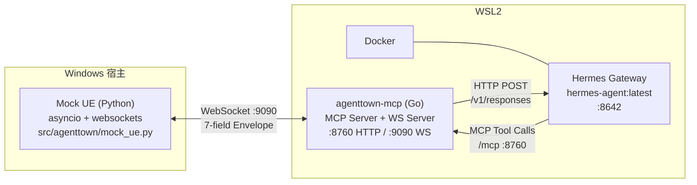
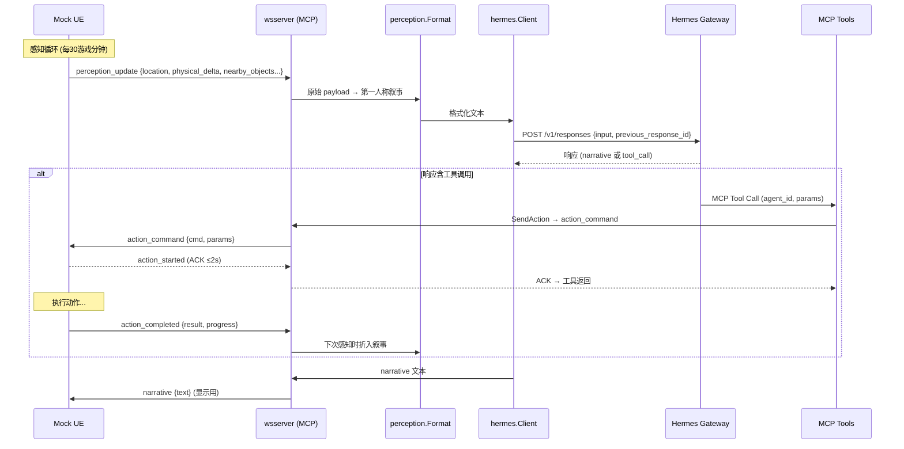
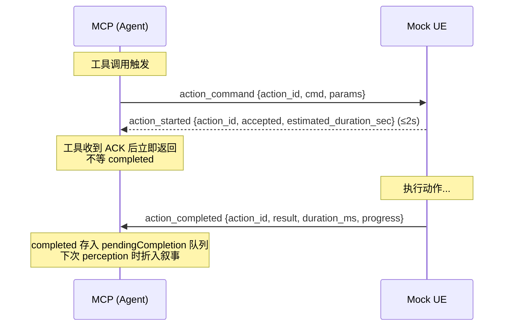
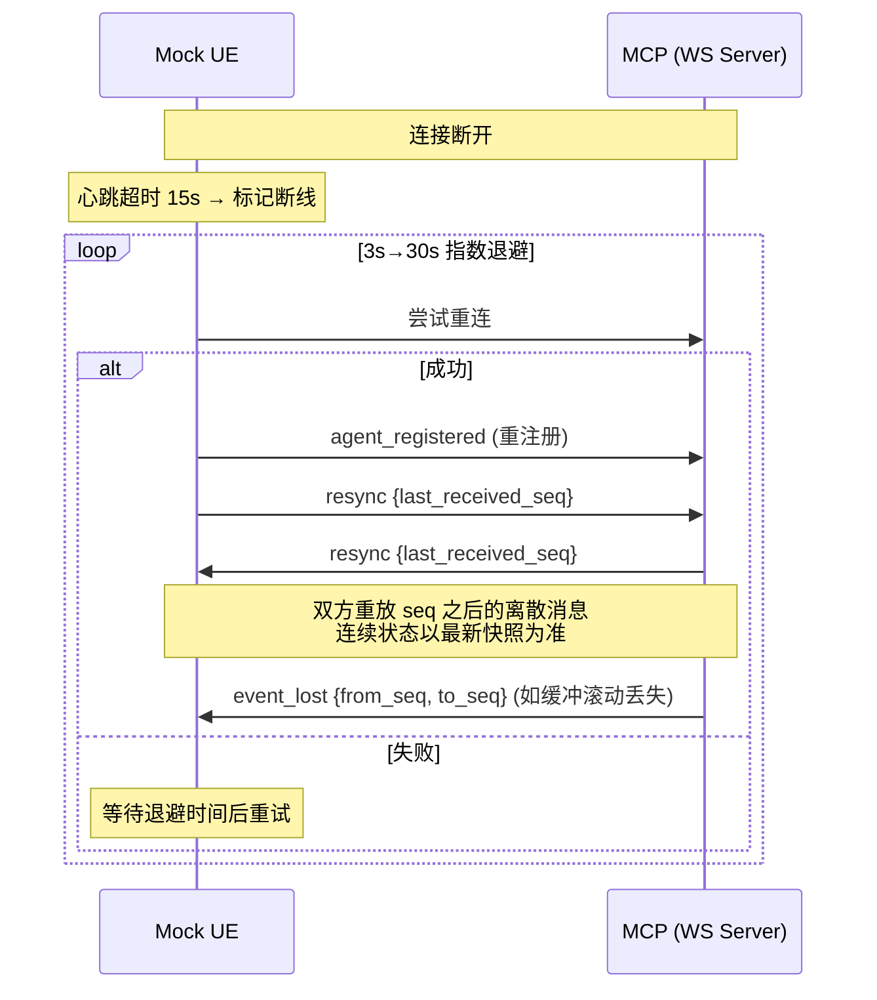

# CODEBUDDY.md

This file provides guidance to CodeBuddy Code when working with code in this repository.

## 项目定位

AgentTown_v3 — AI NPC 模拟系统。一期单 Agent（H-01 老陈，车间主管机器人），通过 MCP 协议驱动完整的"感知→决策→行动"闭环。通信协议按 `docs/AgentTown_CommProtocol_Values.md` 实现，Mock UE 模拟 UE5 游戏世界。

## 架构总览



### 三组件职责

| 组件 | 语言 | 路径 | 端口 | 职责 |
|------|------|------|------|------|
| Mock UE | Python 3.10+ | `src/agenttown/mock_ue.py` | — | 模拟 UE5：物理状态、空间状态、动作执行、感知推送 |
| agenttown-mcp | Go 1.25+ | `agenttown-mcp/` | HTTP `:8760`, WS `:9090` | 协议适配、感知语义化、工具暴露、Hermes 桥接 |
| Hermes Gateway | Docker | `docker/docker-compose.yml` | `:8642` | LLM Agent Mind：决策、工具调用、叙事生成 |

### 通信流向



## 常用命令

### 一键启动

```bash
bash start.sh                    # 全部重启 + 完整一天 (06:00-22:00)
bash start.sh --quick            # 快速测试 (06:00-10:00, 600x 加速)
bash start.sh --start 6 --end 12 --speed 600 --interval 15  # 自定义参数
SKIP_MCP_BUILD=1 bash start.sh   # 跳过 Go 编译，用已有二进制
```

`start.sh` 执行顺序：**先停全部 → 编译+部署 MCP → 启动 MCP → 启动 Hermes → 启动 Mock UE → 仿真结束后合并日志**。每步健康检查通过才继续。

### Go 构建 / 测试

```bash
cd agenttown-mcp
go build ./...                                              # 编译检查
go test ./...                                               # 全部测试
go test ./pkg/wsserver/ -v -count=1                         # WS 缓冲/重放测试
go test ./pkg/protocol/ -v -count=1                         # 协议序列化测试
go test ./adapters/agenttown/perception/ -v -count=1        # 感知格式化测试
```

### 日志检查

**统一日志文件**：`logs/mcp.log`（仿真结束后自动合并 Mock UE 日志）

```bash
# 查看统一日志（含 MockUE + MCP + Hermes 全链路）
cat logs/mcp.log | python -m json.tool  # 格式化 JSON 行

# 按通信方向过滤
grep '\[UE→MCP\]' logs/mcp.log           # Mock UE → MCP 的所有消息
grep '\[MCP→UE\]' logs/mcp.log           # MCP → Mock UE 的所有消息
grep '\[MCP→Hermes\]' logs/mcp.log       # MCP → Hermes 的感知文本
grep '\[Hermes→MCP\]' logs/mcp.log       # Hermes → MCP 的响应
grep '\[Hermes→MCP/TOOL\]' logs/mcp.log  # Hermes 调用的工具
grep '\[MockUE\]' logs/mcp.log           # Mock UE 侧摘要日志

# Mock UE 独立日志（仿真过程中的实时日志）
ls -t logs/day1_*.log | head -1

# Hermes 容器日志
wsl docker logs -f agenttown-h01
```

## 通信协议（v1.0）

### 7 字段信封

所有消息共用外层结构（`pkg/protocol/envelope.go`），业务字段一律放入 `payload`：

```go
type Envelope struct {
    Version   string          `json:"version"`    // "1.0"
    MsgID     string          `json:"msg_id"`     // UUID
    Seq       int64           `json:"seq"`        // per-sender 单调递增
    Timestamp int64           `json:"timestamp"`  // Unix 毫秒
    Type      string          `json:"type"`
    AgentID   string          `json:"agent_id"`   // "system" 保留给系统消息
    Payload   json.RawMessage `json:"payload"`
}
```

### 关键约定

| 约定 | 内容 |
|------|------|
| 信封纯净 | `action_id` 等业务字段一律放入 payload，不得出现在信封顶层 |
| 时间单位 | 所有时间戳为**毫秒**；时长字段以 `_ms`/`_sec` 后缀标注 |
| 坐标单位 | UE5 厘米(cm)，position=[X,Y,Z]，rotation=[Pitch,Yaw,Roll] 度 |
| 保留 ID | `agent_id = "system"` 仅用于 heartbeat/error 等系统级消息 |
| 感知 vs 状态分工 | perception_update 负责空间+环境；state_report 是物理状态权威通道 |
| 物理 delta 阈值 | energy/fatigue/health 变化 ≥5，joint_wear 变化 ≥1 才携带 |

### 消息类型总表

| type | 方向 | 用途 | 触发时机 |
|------|------|------|----------|
| `perception_update` | UE→Agent | 空间+环境感知（物理仅带变化项） | 每 30 游戏分钟 / zone 变化 |
| `action_command` | Agent→UE | 下发动作指令 | 工具调用 / LLM 决策 |
| `action_started` | UE→Agent | 动作已接收的 ACK（≤2s） | UE 收到 action_command 后 |
| `action_completed` | UE→Agent | 动作完成回调 | 动作执行完毕 |
| `stop_action` | Agent→UE | 停止当前动作 | 反应层打断 |
| `event_notification` | Agent→Agent | 事件通知（内部路由） | Director 投放事件 |
| `state_report` | UE→Agent | 物理状态权威上报 | 变化超阈值 / 每 15 秒兜底 |
| `agent_registered` | UE→Agent | 机器人上线 | RobotActor BeginPlay |
| `agent_unregistered` | UE→Agent | 机器人下线 | RobotActor EndPlay |
| `heartbeat` | 双向 | 心跳保活 | 每 5 秒 |
| `error` | 双向 | 错误上报 | 异常情况 |

### 动作生命周期



**9 种 cmd**：`MoveTo`/`TurnTo`/`PlayAnimation`/`Speak`/`Emote`/`Wait`/`InteractSmartObject`/`ExecuteComposite`/`Stop`

**error_code 取值**：`ACTION_FAILED` / `STOP_ID_MISMATCH` / `INVALID_MESSAGE` / `UNKNOWN_AGENT` / `INTERNAL_ERROR`

### 超时机制

| 操作 | 超时 | 超时后行为 |
|------|------|------------|
| action_started 等待 (ACK) | 2 秒 | 认为指令丢失，重发或重新决策 |
| action_completed 等待 | `estimated_duration_sec × 1.5`（默认 60s） | 发 stop_action + 重新决策 |
| LLM 调用 | 120 秒 | 返回错误，跳过该轮 |
| 心跳响应 | 15 秒 | 认为断线 |
| 重连尝试 | 3 秒间隔，指数退避到 30 秒 | 持续重试 |

## 数值系统

### 数值归属原则

**谁产生这个数值，谁就是主人，谁负责存储和变更。**

| 数值类别 | 主人 | 变更触发 | UE 需要 | 同步方式 |
|----------|------|----------|---------|----------|
| Agent 内部状态（mood/social_need/emotion） | Agent | LLM 反思 / 交互判断 | ❌ | 不同步 |
| 物理状态（energy/fatigue/joint_wear/health） | UE | 行为消耗 / 充电恢复 | ✅ 主人 | state_report 上报 |
| 关系数值（familiarity/affection） | Agent | 交互后 LLM 更新 | ❌ | 不同步 |
| 空间状态（position/rotation/zone） | UE | 每帧 / Overlap 触发 | ✅ 主人 | perception_update 上报 |
| 任务状态（plan/queue/stack） | Agent | 分层思考产出 | ❌ | 不同步 |

### 物理状态四项

energy / fatigue / joint_wear / health，通过 `state_report` 权威通道上报。delta 阈值：energy/fatigue/health ≥5，joint_wear ≥1。每 15 秒兜底全量上报。

## MCP 工具

所有工具在 `agenttown-mcp/adapters/agenttown/tools/`，15 个工具全部以 `agent_id` 为第一参数。Hermes 侧工具名为 `mcp__agenttown__<tool_name>`（双下划线）。

### 复合行为工具（→ `ExecuteComposite` cmd）

| 工具 | 参数 | 说明 |
|------|------|------|
| `work_assemble` | agent_id, target, duration_min | 工作组装 |
| `patrol_route` | agent_id, route_id | 巡逻路线 |
| `charge_at` | agent_id, station_id, duration_min | 充电 |
| `repair_target` | agent_id, target_agent_id | 维修目标 |
| `social_chat_with` | agent_id, target_agent_id | 社交对话 |
| `rest_idle` | agent_id, duration_min | 休息 |
| `archive_research` | agent_id, duration_min | 档案研究 |

### 原子行为工具

| 工具 | 参数 | cmd |
|------|------|-----|
| `move_to` | agent_id, target | MoveTo |
| `turn_to` | agent_id, target | TurnTo |
| `speak` | agent_id, content, target | Speak |
| `emote` | agent_id, emotion, mode | Emote |
| `interact` | agent_id, object_id, action | InteractSmartObject |
| `wait` | agent_id, duration_sec | Wait |
| `scan_area` | agent_id | 请求即时 perception |
| `stop` | agent_id | Stop |

`duration_min` 内部 ×60 转 `duration_sec`。语义目标（如 `move_to(target="workbench_01")`）由 Mock UE 解析坐标，Agent 不接触坐标。

### 新增工具硬约束

- 命名 `<verb>` 或 `<verb>_<noun>`，全小写下划线
- `agent_id` 为第一参数
- Input/Output struct 带 `json` + `jsonschema` tag
- Output 首字段 `OK bool`
- Handler 第一个返回值传 `nil`，让 SDK 用 Output 填充 content
- 在 `RegisterAll` 注册

## 关键机制

### 启动顺序（硬约束）

**MCP 必须先于 Hermes 启动**。Hermes 启动时连接 MCP 发现工具，MCP 不可用则连接失败后 parked，工具不注册，LLM 只能纯叙述。

正确顺序（`start.sh` 已保证）：
1. 停掉所有旧进程
2. 编译+部署 MCP 二进制到 WSL `~/agenttown-mcp`
3. 启动 MCP → 等 `:8760` + `:9090` 就绪
4. 启动 Hermes → 等 `:8642` 就绪 + MCP 日志出现 `session initialized`
5. 启动 Mock UE → 预检查通过后运行
6. 仿真结束后将 Mock UE 日志合并到 `logs/mcp.log`

### Mock UE Busy 状态

长耗时动作（`ExecuteComposite`）不跳跃时间，设置 `npc.busy_until_min`。感知循环自然推进时间，NPC 留在原位直到时间到达。

- 忙碌期间拒绝破坏性动作：`MoveTo`/`TurnTo`/`InteractSmartObject`/`ExecuteComposite`/`Wait`
- 短动作立即执行 + 发 `action_completed`
- 完成的 busy 动作自动清除，下一次感知通知 LLM

### 断线重连与 Seq 重放补偿



- 双方各维护发送缓冲队列（最近 200 条 / 60 秒，仅离散消息）
- 重连后交换 `resync{last_received_seq}`，重放 seq 之后的离散消息（action_completed/event_notification）
- 连续状态（position/physical_state）不重放，以重连后最新快照为准
- 缓冲滚动丢失则发 `event_lost` 告警
- MCP 侧：首次 `agent_registered` 触发 Hermes 会话重置，重连再注册保留会话

### Hermes 会话管理

- `hermes.Client` 通过 `previous_response_id` 链式维护会话
- 每天首次 `agent_registered` 触发 `ResetSession()`，开启新会话
- token 超 50K 阈值时自动摘要重置（`summarizeAndReset`）
- **上游错误检测**：Hermes 将上游 LLM API 错误（如 HTTP 400 empty tool_calls）包装为 200 响应返回。MCP 检测 `tokens=0` + narrative 以 `HTTP 4`/`HTTP 5` 开头时，清空 `prevResponseID` 断链，返回 `ErrUpstreamError`，下一轮以全新会话开始

### 感知格式化

Mock UE 推送 `perception_update` → MCP 的 `adapters/agenttown/perception/format.go` 转为第一人称叙事 → POST 给 Hermes。格式包括时段（清晨/上午/中午/下午/傍晚）、位置、物理状态、附近物体、pending action_completion 折入叙事。

### stdio vs HTTP 模式

`agenttown-mcp/cmd/agenttown-mcp/main.go` 运行模式由 `--http` flag 切换：
- **HTTP 模式**（`--http :8760`）：Streamable HTTP 在 `/mcp`，健康检查 `/healthz`，状态 `/status`。Hermes 通过此端点发现工具。
- stdio 模式（默认）：本地 MCP 客户端用。

**stdio 模式禁止向 stdout 写日志**，否则污染 MCP 协议流。日志走 `internal/log` 打 stderr。

### Docker 网络拓扑

Hermes 在 Docker 容器中运行，MCP 在 WSL 宿主机。`docker-compose.yml` 中 `extra_hosts: ["host.docker.internal:host-gateway"]` 让容器内解析宿主机 IP。MCP 监听 `0.0.0.0:8760`，Hermes 通过 `http://host.docker.internal:8760/mcp` 连接。

Mock UE 在 Windows 上通过 `ws://localhost:9090/ws` 连接 MCP（WSL2 localhost 转发）。

## 代码规范

- **Go 1.25+**（`go.mod` 声明 `go 1.25.0`）
- 错误包装：`fmt.Errorf("...: %w", err)`
- 包注释和导出符号注释写英文
- 新增 Go package 必须有 `*_test.go`
- 测试命名 `Test<Func>_<Scenario>`；禁止启真实子进程，用 `InMemoryTransport` / mock
- Python 代码用 `asyncio` + `websockets`，不用同步 HTTP 调用 Hermes（MCP 接管）
- 日志走 `logging` 模块，不直接 `print`（调试除外）
- WebSocket 库：Go 用 `github.com/coder/websocket`，Python 用 `websockets`

## 环境配置

```bash
cp .env.example .env
# 编辑 .env，填入 HERMES_AGENT_API_KEY（DeepSeek API key）
```

关键环境变量：
- `HERMES_AGENT_API_KEY` — DeepSeek API 密钥
- `AGENTTOWN_MCP_HTTP` — MCP HTTP 监听（默认 `:8760`）
- `AGENTTOWN_MCP_WS` — MCP WebSocket 监听（默认 `:9090`）

## 文件地图

| 路径 | 说明 |
|------|------|
| `docs/AgentTown_CommProtocol_Values.md` | 通信协议与数值系统设计文档（唯一权威） |
| `agenttown-mcp/pkg/protocol/envelope.go` | Envelope + 11 消息类型 + 9 cmd + error_code 常量 |
| `agenttown-mcp/pkg/protocol/messages.go` | 各消息 payload 结构体 + resync/event_lost |
| `agenttown-mcp/pkg/wsserver/server.go` | WS 服务端：收发信封、seq、send buffer、重放、Call/SendAction |
| `agenttown-mcp/pkg/wsserver/protocol.go` | 薄封装，重导出 protocol 包常量 |
| `agenttown-mcp/pkg/wsserver/server_test.go` | 缓冲淘汰/重放/rollover 测试 |
| `agenttown-mcp/pkg/hermes/client.go` | Hermes HTTP 客户端：会话链、token 阈值自动摘要重置、上游错误检测 |
| `agenttown-mcp/adapters/agenttown/tools/registry.go` | 工具注册 + Executor 接口 |
| `agenttown-mcp/adapters/agenttown/tools/composite.go` | 7 个复合行为工具 |
| `agenttown-mcp/adapters/agenttown/tools/atomic.go` | 8 个原子行为工具 |
| `agenttown-mcp/adapters/agenttown/tools/action_logger.go` | 工具调用日志（通过 MCP 主 logger） |
| `agenttown-mcp/adapters/agenttown/perception/format.go` | 感知 → 自然语言叙事 |
| `agenttown-mcp/cmd/agenttown-mcp/main.go` | 入口：端口配置、消息分发、agentContext |
| `agenttown-mcp/pkg/transport/http.go` | Streamable HTTP 传输 |
| `agenttown-mcp/internal/log/logger.go` | slog JSON 日志（写 stderr） |
| `src/agenttown/mock_ue.py` | Mock UE：协议常量、NPCState、物理状态、感知循环、动作处理、重连+重放 |
| `src/run_day.py` | Mock UE 启动入口 |
| `hermes/profiles/h01/SKILL.md` | Hermes 工具使用指南（复合+原子行为） |
| `start.sh` | 一键启动脚本（自动编译+部署+日志合并） |
| `scripts/test_phase7_reconnect.py` | Phase 7 端到端重连验证 |

## Git 提交

格式：`<type>(<scope>): <subject>`（祈使句）
- type：`feat` / `fix` / `refactor` / `test` / `docs` / `chore` / `perf`
- scope：`protocol` / `mcp` / `mock-ue` / `hermes` / `skill-md` / `docker` / `config` / `start-script` / `logging` / `codebuddy`
- **提交信息（subject 和 body）使用中文**

用户没明说"commit"时不要主动 commit。

## 里程碑

| Milestone | 状态 | 说明 |
|-----------|------|------|
| M-1 世界快照定义 | ✅ | `docs/我的方案/场景与人物设定.md` |
| M-2 LLM Gateway | ✅ | Hermes Gateway + DeepSeek |
| M-3 Hermes Agent Mind | ✅ | SOUL.md + SKILL.md + profile |
| M-4 Translator | ✅ | MCP 工具注册 |
| M-5 Mock UE Bridge | ✅ | Python async + WebSocket |
| MCP 层 | ✅ | Go agenttown-mcp，15 工具（7 复合+8 原子） |
| 协议重构 Phase 1-7 | ✅ | 7 字段信封、11 消息类型、seq+ACK、物理四态、动作异步生命周期、断线重连+seq 重放 |
| 端到端闭环 | ✅ | 感知→Hermes→工具→Mock UE 全链路验证 |
| 上游错误检测 | ✅ | Hermes 400 错误自动断链重置会话 |
