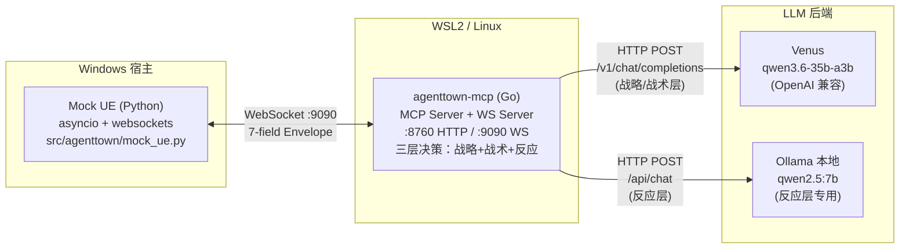
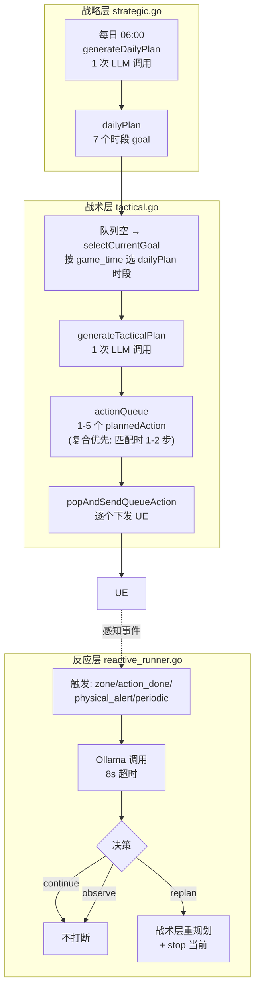
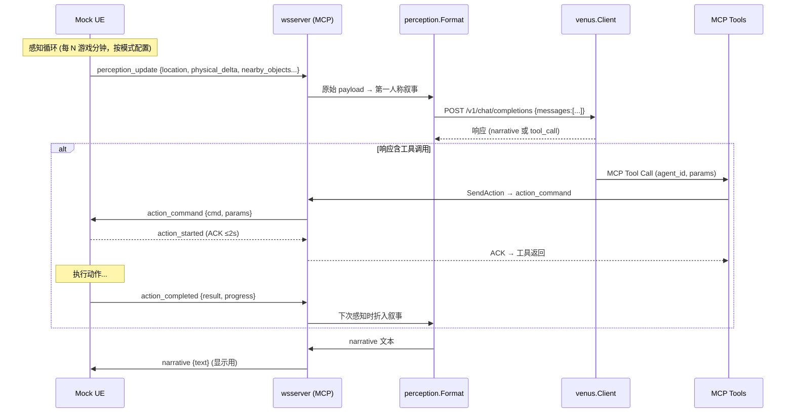
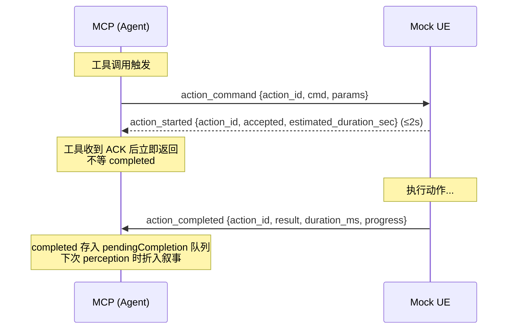
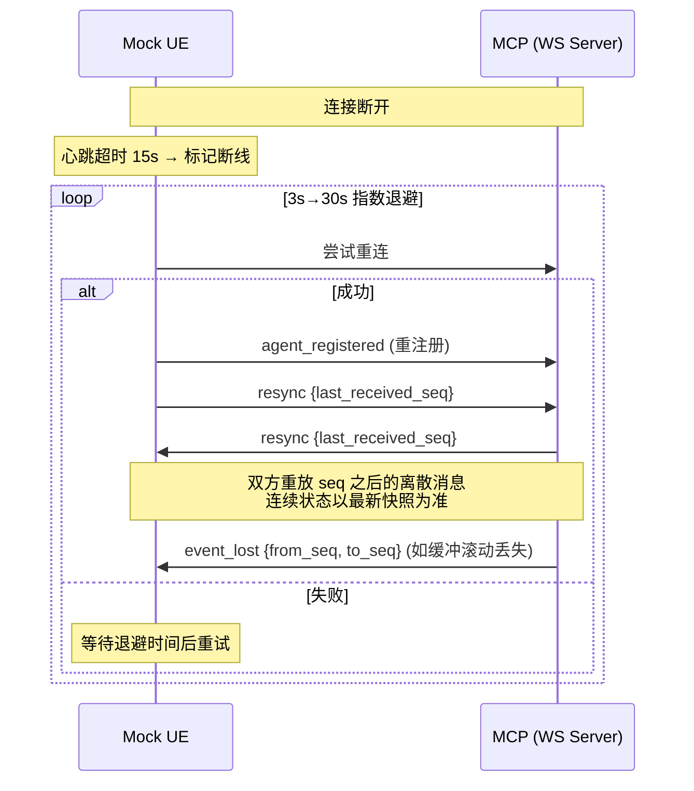

# CODEBUDDY.md

This file provides guidance to CodeBuddy Code when working with code in this repository.

## 项目定位

AgentTown_v3 — AI NPC 模拟系统。一期单 Agent（H-01 老陈，车间主管机器人），通过 MCP 协议驱动完整的"感知→决策→行动"闭环。通信协议按 `docs/AgentTown_CommProtocol_Values.md` 实现，Mock UE 模拟 UE5 游戏世界。

**三层决策架构**（2026-07 落地）：
- **战略层**（`strategic.go`）：每日 06:00 生成当天计划（`dailyPlan`），一条 LLM 调用产出 7 个时段的 goal
- **战术层**（`tactical.go`）：每个时段把 goal 分解为 1-5 个 action 进 `actionQueue`（复合优先：匹配复合动作时 1-2 步即可，否则 2-5 个原子动作组合），worker 逐个 pop 下发 UE
- **反应层**（`reactive.go` + `reactive_runner.go`）：监听 zone 变化/动作完成/物理警戒/周期触发，调本地 Ollama 决策 continue/observe/replan

**LLM 后端**：MCP 直连 Venus（OpenAI Chat Completions 协议），战略/战术层调用 Venus（`qwen3.6-35b-a3b`）。反应层始终直连本地 Ollama（`qwen2.5:7b`），不走 Venus。

## 架构总览



### 组件职责

| 组件 | 语言 | 路径 | 端口 | 职责 |
|------|------|------|------|------|
| Mock UE | Python 3.10+ | `src/agenttown/mock_ue.py` | — | 模拟 UE5：物理状态、空间状态、动作执行、感知推送 |
| agenttown-mcp | Go 1.25+ | `agenttown-mcp/` | HTTP `:8760`, WS `:9090` | 协议适配、感知语义化、工具暴露、三层决策、LLM 桥接 |
| Venus | 远程 | `--venus-url` | — | OpenAI 兼容 LLM 服务（战略/战术层后端） |
| Ollama | 本地 | `--ollama-url` | `:11434` | 反应层本地 LLM（qwen2.5:7b） |

### 三层决策架构

MCP 内置三层决策，由 `runPerceptionWorker`（`main.go:279`）事件驱动循环串联：



### 关键机制

- **worker 循环**：`runPerceptionWorker` 监听 `wake` 信号，队列空时调 `tacticalRefill` → `selectCurrentGoal` → `generateTacticalPlan` → 填 `actionQueue` → `popAndSendQueueAction` 下发
- **`replanInProgress` mutex**：防止 worker 的战术层重规划和 `/debug/schedule` 注入并发调用 `tacticalHc` 冲突。worker 在 main.go:311 检查此标志
- **`debugOverride`**：仅阻止 worker 的 idle-wait refill（main.go:327），**不阻止**正在 LLM 调用中的 refill——所以 `/debug/schedule` handler 会同时设 `replanInProgress=true` + `debugOverride=true`
- **`currentSlot` 加 `__debug__` 前缀**：防止注入的 slot 和 dailyPlan 同名 slot 碰撞触发 `redecomposeCount >= 1` 限制
- **反应层去抖**：`lastReactiveAt` map 按 trigger 类型去抖（periodic 60s / zone_change 45s）
- **反应层 replan**：决策为 `replan` 时调 `ac.tacticalRefillForReplan`，会重置 `actionQueue` 重新调战术层 LLM。规划失败时调 `fallbackStopAndRefill`：清空队列 + 清在途追踪 + stop_action + signal worker，让 worker 通过自然 `tacticalRefill` 路径重新规划（避免 75 游戏分钟延迟）

### LLM 后端

MCP 直连 Venus（OpenAI Chat Completions 协议），战略/战术层调用 Venus。反应层**始终**走 `pkg/ollama/client.go`（本地 Ollama，5-8s 超时），不受影响。

**启动示例**：
```bash
./agenttown-mcp --http :8760 --ws :9090 \
  --venus-url http://v2.open.venus.oa.com/llmproxy \
  --venus-api-key $VENUS_API_KEY \
  --venus-model qwen3.6-35b-a3b
```

Venus 客户端无状态——每次调用全量 prompt，不复用会话链。战略/战术层 prompt 完全由 MCP 构造，所有上下文（角色、世界知识、物理状态）显式注入。

## 通信流向



## 常用命令

### 一键启动

```bash
bash start.sh normal             # 完整日：06:00-22:00, 150x
bash start.sh behavior           # 行为联调：06:00-18:00, 60x, 场景事件
bash start.sh quick-smoke        # 协议烟测：06:00-10:00, 600x
bash start.sh --quick            # quick-smoke 兼容别名
bash start.sh behavior --speed 100 --end 12  # 模式参数覆盖
SKIP_MCP_BUILD=1 bash start.sh normal        # 跳过 Go 编译
```

`start.sh` 执行顺序：**先停全部 → 编译+部署 MCP → 启动 MCP → 启动 Mock UE → 仿真结束后合并日志**。每步健康检查通过才继续。

### Go 构建 / 测试

```bash
cd agenttown-mcp
go build ./...                                              # 编译检查
go test ./...                                               # 全部测试
go test ./pkg/wsserver/ -v -count=1                         # WS 缓冲/重放测试
go test ./pkg/protocol/ -v -count=1                         # 协议序列化测试
go test ./adapters/agenttown/perception/ -v -count=1        # 感知格式化测试
```

### 日志检查

**统一日志文件**：`logs/YYYY-MM-DD/debug-mcp.log`（MCP 进程独占写入，JSON Lines 格式，含 UE + MCP + LLM 三层全链路；`YYYY-MM-DD` 为仿真启动日期）

**推荐：用 `scripts/pretty_log.py` 可读化查看**（每条 JSON 渲染为多行，方向标记着色，长字段按行展开）：

```bash
# HTML 报告（推荐，自动打开浏览器，可折叠/搜索/过滤）
python scripts/pretty_log.py --html                       # 今天的日志
python scripts/pretty_log.py --html 2026-07-20            # 指定日期
python scripts/pretty_log.py --html -f PERCEPTION -n 50   # 最近 50 条 PERCEPTION
python scripts/pretty_log.py --html -o report.html        # 指定输出路径
python scripts/pretty_log.py --html --no-open             # 生成但不自动打开

# 终端渲染
python scripts/pretty_log.py                              # 查看今天的 debug-mcp.log
python scripts/pretty_log.py -f PERCEPTION -n 5           # 最近 5 条 MCP→LLM 感知原文
python scripts/pretty_log.py -f RESPONSE -n 5             # 最近 5 条 LLM 响应
python scripts/pretty_log.py --raw                        # 原始 JSON（grep/awk 友好）
```

`--html` 模式生成独立 HTML 文件（默认 `logs/YYYY-MM-DD/sim_report.html`），自动打开浏览器，支持：
- 点击条目展开/折叠详情
- 顶部按钮按方向过滤（UE→MCP / MCP→UE / PERCEPTION / RESPONSE / TOOL / HEARTBEAT）
- 搜索框（支持正则）
- 长字段（perception text / payload）自然换行，不受终端宽度限制
- 暗色主题，方向标记彩色高亮

**历史 Hermes 日志整合（DEPRECATED）**：`--hermes` 系列参数仅供解析 2026-08 之前的历史日志使用（Hermes Gateway 已移除）。新日志仅含 UE/MCP/LLM 三层，无 Hermes 容器日志。

方向过滤器（`-f`）简写：`UE→MCP` / `MCP→UE` / `PERCEPTION` / `RESPONSE` / `TOOL` / `HEARTBEAT`。heartbeat 默认隐藏。

**原始 grep（不渲染，单行 JSON）**：

```bash
grep '\[UE→MCP\]' logs/YYYY-MM-DD/debug-mcp.log           # Mock UE → MCP（感知/状态/动作完成）
grep '\[MCP→UE\]' logs/YYYY-MM-DD/debug-mcp.log           # MCP → Mock UE（动作命令/叙事）
grep '\[MCP→LLM/PERCEPTION\]' logs/YYYY-MM-DD/debug-mcp.log    # MCP → LLM（感知文本）
grep '\[LLM→MCP/RESPONSE\]' logs/YYYY-MM-DD/debug-mcp.log      # LLM → MCP（LLM 响应 + narrative）
grep '\[MCP→LLM/STRATEGIC-PROMPT\]' logs/YYYY-MM-DD/debug-mcp.log   # 战略层 prompt（每日规划输入）
grep '\[LLM→MCP/STRATEGIC-RESPONSE\]' logs/YYYY-MM-DD/debug-mcp.log # 战略层 LLM 响应（每日计划 JSON）
grep '\[MCP→LLM/TACTICAL-PROMPT\]' logs/YYYY-MM-DD/debug-mcp.log    # 战术层 prompt（任务分解输入）
grep '\[LLM→MCP/TACTICAL-RESPONSE\]' logs/YYYY-MM-DD/debug-mcp.log  # 战术层 LLM 响应（actions JSON）
grep '队列已填充' logs/YYYY-MM-DD/debug-mcp.log           # 战术层任务队列形成（含完整 actions）
grep 'perception decision triggered' logs/YYYY-MM-DD/debug-mcp.log  # LLM 决策触发点
grep 'state_report' logs/YYYY-MM-DD/debug-mcp.log         # 状态报告摘要

# 按决策轮次关联：PERCEPTION / TOOL / RESPONSE 共享 agent_id + decision_epoch
# 例如查看 decision_epoch=1 的完整链路：
grep '"decision_epoch":1' logs/YYYY-MM-DD/debug-mcp.log   # 同一轮次的 PERCEPTION/TOOL/RESPONSE

# 战术规划链路：TACTICAL-PROMPT → TACTICAL-RESPONSE → 队列已填充 → 下发 action
# 例如查看某次战术分解的完整链路：
grep -E 'TACTICAL-PROMPT|TACTICAL-RESPONSE|队列已填充|\[战术层\] 下发 action' logs/YYYY-MM-DD/debug-mcp.log
```

**轮次关联**：`[MCP→LLM/PERCEPTION]`、`[LLM→MCP/TOOL]`、`[LLM→MCP/RESPONSE]` 三种日志都带结构化字段 `agent_id` 和 `decision_epoch`，匹配这两个字段即可关联同一次决策回合的输入 prompt、工具调用、LLM 响应。同一 `decision_epoch` 的 TOOL 可能出现在 RESPONSE 之前（工具调用在 LLM 流式输出时实时回调，而 RESPONSE 日志在 HTTP 响应完成后才写）。

**战术/战略层日志**：战略层和战术层使用独立的 LLM 调用（无状态，不复用决策链），因此不带 `decision_epoch`。链路按 `agent_id` + 时间顺序关联：`[MCP→LLM/STRATEGIC-PROMPT]` → `[LLM→MCP/STRATEGIC-RESPONSE]` → `[战略层] 每日计划生成成功`；`[MCP→LLM/TACTICAL-PROMPT]` → `[LLM→MCP/TACTICAL-RESPONSE]` → `[战术层] 队列已填充`（含完整 actions JSON）→ `[战术层] 下发 action`（逐个 pop）。

Mock UE 不再写独立日志文件，但控制台仍输出 `[PERCEPTION]`/`[STATE]`/`[SPEAK]` 等人类可读摘要供实时观察。

## 联调 Debug 工具

MCP 启动后暴露 HTTP debug 端点（dev 端口 `:8770`，stable `:8760`，以 `--http` flag 为准）：

| 端点 | 方法 | 用途 |
|------|------|------|
| `GET /debug/` | GET | 浏览器控制台 UI（单页 HTML，`//go:embed` 嵌入） |
| `POST /debug/action` | POST | 直接下发单个 action_command 到 UE（单步调试） |
| `POST /debug/schedule` | POST | 注入一条 schedule 到战术层，立即分解为 action 序列入队 |
| `GET /debug/kb` | GET | 返回 world_kb JSON（zones/objects） |

### `/debug/schedule`（2026-07 新增）

给战术层注入一条单行 schedule，立即触发 LLM 分解 → 填充 actionQueue → signal worker 下发。**会强制中断当前在途 action**（`force` 默认 true）。

请求体：
```json
{
  "agent_id": "H-01",
  "schedule": "车间装配作业",
  "force": true
}
```

`schedule` 支持两种形态：
- 纯 goal：`"车间装配作业"`（时间段可选，内部用 `__debug__` 前缀避免和 dailyPlan 碰撞）
- 带时段：`"07:00-11:00: 车间装配作业"`（时段仅作 prompt 时长提示）

详见 `docs/DebugAction_Tool.md`。

### 浏览器 UI

`/debug/` 提供 tab 切换：
- **单 Action**：填 cmd + params，直接下发 UE
- **Schedule 注入**：填 schedule 文本，触发战术层分解

UI 特性：curl 预览、历史记录（支持 replay）、响应字段高亮、强制中断复选框。

## 通信协议（v1.0）

### 7 字段信封

所有消息共用外层结构（`pkg/protocol/envelope.go`），业务字段一律放入 `payload`：

```go
type Envelope struct {
    Version   string          `json:"version"`    // "1.0"
    MsgID     string          `json:"msg_id"`     // UUID
    Seq       int64           `json:"seq"`        // per-sender 单调递增
    Timestamp int64           `json:"timestamp"`  // Unix 毫秒
    Type      string          `json:"type"`
    AgentID   string          `json:"agent_id"`   // "system" 保留给系统消息
    Payload   json.RawMessage `json:"payload"`
}
```

### 关键约定

| 约定 | 内容 |
|------|------|
| 信封纯净 | `action_id` 等业务字段一律放入 payload，不得出现在信封顶层 |
| 时间单位 | 所有时间戳为**毫秒**；时长字段以 `_ms`/`_sec` 后缀标注 |
| 坐标单位 | UE5 厘米(cm)，position=[X,Y,Z]，rotation=[Pitch,Yaw,Roll] 度 |
| 保留 ID | `agent_id = "system"` 仅用于 heartbeat/error 等系统级消息 |
| 感知 vs 状态分工 | perception_update 负责空间+环境；state_report 是物理状态权威通道 |
| 物理 delta 阈值 | energy/fatigue/health 变化 ≥5，joint_wear 变化 ≥1 才携带 |

### 消息类型总表

| type | 方向 | 用途 | 触发时机 |
|------|------|------|----------|
| `perception_update` | UE→Agent | 空间+环境感知（物理仅带变化项） | 每 N 游戏分钟（normal=60, behavior=15, quick-smoke=30）/ zone 变化 |
| `action_command` | Agent→UE | 下发动作指令 | 工具调用 / LLM 决策 |
| `action_started` | UE→Agent | 动作已接收的 ACK（≤2s） | UE 收到 action_command 后 |
| `action_completed` | UE→Agent | 动作完成回调 | 动作执行完毕 |
| `stop_action` | Agent→UE | 停止当前动作 | 反应层打断 |
| `event_notification` | Agent→Agent | 事件通知（内部路由） | Director 投放事件 |
| `state_report` | UE→Agent | 物理状态权威上报 | 变化超阈值 / 每 15 秒兜底 |
| `agent_registered` | UE→Agent | 机器人上线 | RobotActor BeginPlay |
| `agent_unregistered` | UE→Agent | 机器人下线 | RobotActor EndPlay |
| `heartbeat` | 双向 | 心跳保活 | 每 5 秒 |
| `error` | 双向 | 错误上报 | 异常情况 |
| `capability_registry` | UE→Agent | NPC 能力声明（哪些 cmd 可执行） | UE 连接后 / 能力变更时 |
| `world_kb` | UE→Agent | 世界知识库下发（generated + authored） | UE 连接后（首个 `agent_registered` 之前） |

### 动作生命周期



**12 种 cmd**（7 原子 + 5 复合，2026-08-11 对齐真实 UE5 `capability_registry`）：
- 原子：`GenericAct`/`MoveTo`/`Wait`/`TurnTo`/`Speak`/`InteractSmartObject`/`Emote`
- 复合：`WorkShift`/`ChargeAtStation`/`SelfMaintenance`/`RestAtResidence`/`SurfInternet`

`Stop` 不再是 cmd，改为 `stop_action` 消息类型（Agent→UE）。`ExecuteComposite`/`PlayAnimation` 已移除，复合动作直接用各自 cmd 下发。

**error_code 取值**：`ACTION_FAILED` / `STOP_ID_MISMATCH` / `INVALID_MESSAGE` / `UNKNOWN_AGENT` / `INTERNAL_ERROR`

### 超时机制

| 操作 | 超时 | 超时后行为 |
|------|------|------------|
| action_started 等待 (ACK) | 2 秒 | 认为指令丢失，重发或重新决策 |
| action_completed 等待 | `estimated_duration_sec × 1.5`（默认 60s） | 发 stop_action + 重新决策 |
| LLM 调用 | 120 秒 | 返回错误，跳过该轮 |
| 心跳响应 | 15 秒 | 认为断线 |
| 重连尝试 | 3 秒间隔，指数退避到 30 秒 | 持续重试 |

## 数值系统

### 数值归属原则

**谁产生这个数值，谁就是主人，谁负责存储和变更。**

| 数值类别 | 主人 | 变更触发 | UE 需要 | 同步方式 |
|----------|------|----------|---------|----------|
| Agent 内部状态（mood/social_need/emotion） | Agent | LLM 反思 / 交互判断 | ❌ | 不同步 |
| 物理状态（energy/fatigue/joint_wear/health） | UE | 行为消耗 / 充电恢复 | ✅ 主人 | state_report 上报 |
| 关系数值（familiarity/affection） | Agent | 交互后 LLM 更新 | ❌ | 不同步 |
| 空间状态（position/rotation/zone） | UE | 每帧 / Overlap 触发 | ✅ 主人 | perception_update 上报 |
| 任务状态（plan/queue/stack） | Agent | 分层思考产出 | ❌ | 不同步 |

### 物理状态四项

energy / fatigue / joint_wear / health，通过 `state_report` 权威通道上报。delta 阈值：energy/fatigue/health ≥5，joint_wear ≥1。每 15 秒兜底全量上报。

## MCP 工具

所有工具在 `agenttown-mcp/adapters/agenttown/tools/`。14 个工具均以 `agent_id` 为第一参数、`decision_epoch` 为第二个必填参数。

**工具列表由 `capability_registry` 动态驱动**：UE 连接 MCP 后发送 `capability_registry` 声明可执行 cmd，MCP 据此调 `tools.ReconcileTools` 增删工具（`AddTool`/`RemoveTools`）。启动时 seed 内置 12 cmd 默认值（`BuiltinCmdCapabilities`），保证 UE 不发 `capability_registry` 也能跑。per-agent 差异化在 `guardedExecutor.SendAction` 这一咽喉点拦截——查 `CapabilityRegistry.HasCmd(agentID, cmd)`，不通过则拒绝下发。战术层 prompt 中的可用工具列表也按 registry 对 agentID 的有效能力集动态生成（`tacticalToolMeta` 是工具元数据单一来源）。

### 复合行为工具（5 个，各自独立 cmd）

| 工具 | 参数 | cmd | 说明 |
|------|------|-----|------|
| `work_shift` | agent_id, smart_object, interaction | `WorkShift` | 工作班次（装配/分拣/作业） |
| `charge_at_station` | agent_id, smart_object, interaction | `ChargeAtStation` | 在充电站充电 |
| `self_maintenance` | agent_id, smart_object, interaction | `SelfMaintenance` | 自我维护保养 |
| `rest_at_residence` | agent_id, smart_object, interaction | `RestAtResidence` | 在住所休息 |
| `surf_internet` | agent_id, smart_object, interaction | `SurfInternet` | 上网浏览 |

5 个复合工具共享 `smart_object` + `interaction` 参数 schema，`smart_object` 引用 `world_kb` 中对应 category 的物体 id。

### 原子行为工具（7 个 + 2 特殊）

| 工具 | 参数 | cmd |
|------|------|-----|
| `generic_act` | agent_id, thought, behavior | `GenericAct` |
| `move_to` | agent_id, target_type, target_id/target_position | `MoveTo` |
| `turn_to` | agent_id, target_type, target_id/target_position | `TurnTo` |
| `speak` | agent_id, content | `Speak` |
| `emote` | agent_id, emotion | `Emote` |
| `interact` | agent_id, smart_object, interaction | `InteractSmartObject` |
| `wait` | agent_id, duration_sec | `Wait` |
| `scan_area` | agent_id | （请求即时 perception，无 cmd） |
| `stop` | agent_id | （发 `stop_action` 消息，非 cmd） |

`move_to`/`turn_to` 的 `target_type` 取值 `agent`/`smart_object`/`zone`/`position`；`target_id` 对应 actor id，`target_position` 对应 `[x,y,z]` 坐标。语义目标（如 `move_to(target_type="smart_object", target_id="workbench")`）由 UE 自行解析坐标，MCP 不做 KB 坐标解析。`generic_act` 是兜底通用动作，`behavior` 取值 `idle`/`look_around`/`wave_hand`/`groom`/`think`，替代旧 `PlayMontage`。

### 新增工具硬约束

- 命名 `<verb>` 或 `<verb>_<noun>`，全小写下划线
- `agent_id` 为第一参数，`decision_epoch` 为第二个必填参数
- Input/Output struct 带 `json` + `jsonschema` tag
- Output 首字段 `OK bool`
- Handler 第一个返回值传 `nil`，让 SDK 用 Output 填充 content
- 在 `RegisterAll` 注册

## 关键机制

### 启动顺序（硬约束）

MCP 是唯一的 LLM 调用入口，启动后即可接收感知事件、调用 Venus/Ollama、下发工具调用。

正确顺序（`start.sh` 已保证）：
1. 停掉所有旧进程
2. 编译+部署 MCP 二进制到 WSL `~/agenttown-mcp`
3. 启动 MCP → 等 `:8760` + `:9090` 就绪
4. 启动 Mock UE → 预检查通过后运行
5. 仿真日志统一写入 `logs/YYYY-MM-DD/debug-mcp.log`（MCP 独占，无需合并）

**UE 连接消息序列**（硬约束）：UE 连接 MCP 后按以下顺序首发系统消息：
1. `world_kb`（`agent_id="system"`）— 推送完整世界 KB（generated + authored JSON），MCP 合并+落盘+swap 内存 KB。**必须在首个 `agent_registered` 之前**，确保 worker 启动时捕获新 KB
2. `agent_registered` — 触发 worker 启动 + 战略层生成当日计划
3. `capability_registry` — 声明 NPC 能力，MCP 动态增删工具
4. `resync` → `state_report` → `perception_update` …

`world_kb` 仅在启动窗口内（首个 `agent_registered` 之前）接受；之后到达的 `world_kb` 被拒绝并告警（worker goroutine 已持 kb 指针，热替换会竞态）。合并失败保留旧 KB + 不写盘。

### 手动模式（`--auto-plan=false`）

默认 `--auto-plan=true` 保持自动决策行为。设为 `false` 时 MCP 进入手动模式：

- **战略层**：worker 启动时跳过 `generateDailyPlan`，`dailyPlan` 保持空
- **战术层**：worker 循环跳过 `tacticalRefill` 和 `sendIdleWait`，不主动填队列、不主动发 wait
- **反应层**：WS handler 4 处 `reactiveRunnerRef.trigger` 调用全部跳过，Ollama 不被调用
- **保留**：`popAndSendQueueAction`（`/debug/schedule` 注入的 action 进队列后由 `ac.signal()` 唤醒 worker 走此路径下发）、`/debug/action`（直接 `ws.Call` 下发，不经 worker）

手动模式适合联调时隔离 UE 端、单独验证 MCP 工具链/协议层/特定 schedule 分解效果。关闭后断连不再触发战略层重新规划（因为根本不调），间接缓解断连风暴导致的计划漂移。

### 持久化存储（`--mysql-dsn`，Stage 3）

默认 `--mysql-dsn=""` 为内存模式（`NoopStore`，无持久化，测试/quick-smoke 默认）。设为有效 MySQL DSN 时启用持久化层：

- **写入策略**：write-through 同步写。4 个调度字段（`dailyPlan`/`currentDay`/`currentPlanIndex`/`currentSlot`）任一变更即 upsert 到 `agent_schedule_state` 表（单行 per agent）。写入频率低（计划生成 1 次/天 + slot 切换 ~7 次/天），同步写无性能压力
- **加载时机**：`agent_registered` → `SetIdentity(agentID, store)` → `LoadPersistent` 从 DB 恢复 4 字段。冷启动（无行）保持默认值，worker 生成新计划；热重启（有行）跳过 `generateDailyPlan`，计划跨进程存活
- **降级**：DB 写失败仅 log warn，不回滚内存状态（内存已正确，DB 下次写追上）；`LoadPersistent` 非 `ErrNotFound` 错误降级为 cold start
- **迁移**：`//go:embed migrations/*.sql` 原生 SQL，启动时自动跑（`schema_migrations` 版本表跟踪）。无需外部迁移工具
- **持久化表全集**：`agent_schedule_state`（Stage 3 调度状态）+ `agent_memories`（Stage 4 记忆）+ `action_history`（Stage 4 动作历史）+ `agent_relationships`（Stage 5 关系数值，双向独立行）
- **优雅关停**：write-through 已同步落盘，SIGTERM 仅 `defer store.Close()`，无需 flush

DSN 必须含 `parseTime=true` 以正确扫描 `DATETIME` 列。示例：`user:pass@tcp(127.0.0.1:3306)/agenttown?parseTime=true&charset=utf8mb4`。

### 长期经历记忆（Stage 4）

Stage 4 在 Stage 3 的存储层之上接入 NPC 长期记忆：日终批量生成结构化记忆 + 战术层注入近期记忆 + 完整动作历史落盘。仅 `--mysql-dsn` 非空时启用，内存模式（`NoopStore`）全程 no-op。

- **action_history 记录**：`recordActionCompletion` 钩子在 `WasInFlight=true` 时单条 INSERT（`SaveActionRecord`）。`CompletionResult` 在 in-flight 清空前捕获 `Cmd`/`Params`/`Start` 三字段（Step 3 预埋），完整还原动作生命周期。`/debug/action` 路径不经 `recordActionStarted`，`WasInFlight=false`，自然不写历史。best-effort：5s 超时 + `slog.Warn`，不阻塞决策管线
- **日终记忆生成**：`detectDayRollover` 命中后先调 `generateDailyMemories`（`memory.go`），从昨日 `action_history(500)` 倒序转正序后格式化为编号列表，1 次 LLM 调用（复用战略层 Venus 客户端）产出 `{narrative, memories[]}` JSON：narrative 注入战略层 prompt 替代硬编码常量，memories 数组（每项含 type/content/importance/related_*_id）逐条 best-effort 写入 `agent_memories` 表。失败/冷启动返回空串，`generateDailyPlan` 内部回退到 `yesterdaySummaryForFirstDay` 常量
- **战术层记忆注入**：`tacticalRefill` + `tacticalRefillForReplan` 每次 refill 调 `loadTacticalMemories` 取 top-3 recent memories（`LoadRecentMemories` 按 `created_at DESC LIMIT 3`），格式化为 `- content（type）` bullet 列表注入战术层 prompt 新增的【过往经验】段（`TacticalInput.Memories`，Step 4 预埋）。流式 + 非流式两条路径都注入；`/debug/schedule` 调用路径保持空串（调试上下文不需记忆）
- **反应层不注入**：反应层决策（continue/observe/replan）是即时短路判断，不应被历史记忆拖慢，故 Stage 4 仅在战略/战术层注入
- **检索策略**：仅按 `created_at DESC` 取最近 N 条，`decay_score` 字段持久化但当前始终 1.0（Stage 4 不实现衰减/召回算法，预留 Stage 6+）
- **memory_type 取值**：`event` / `skill` / `relationship` / `daily_summary`，由 LLM 在生成时指定
- **JSON 解析容错**：`parseMemoryGenerationResult` 容忍 markdown 围栏 ```json ... ``` 和尾随散文，定位首个 `{` 到末个 `}` 后 `json.Unmarshal`

### 关系数值动态维护（Stage 5）

Stage 5 在 Stage 3/4 之上接入 NPC 间关系数值动态维护：动作完成时 Ollama 语义判断是否触发关系更新 → 双向 familiarity += 1 → 战术层 prompt 注入【人际关系】段。仅 `--mysql-dsn` 非空时启用，内存模式全程 no-op。

- **双向独立行**：`agent_relationships` 表复合 PK (agent_a, agent_b) 有序，A→B 和 B→A 各一行。A 主动与 B 交互时两次调 `SaveRelationship`（A→B + B→A），各自 upsert。affection 初期不动，仅 familiarity += 1
- **Ollama 语义判断**：每次动作完成时（`recordActionCompletion` 旁路异步 `go maybeUpdateRelationship`），仅当 `Params["target_agent_id"]` 非空才调 Ollama 判断该次 cmd+params 是否构成直接社交互动（yes/no）。5s 超时，失败/超时/无法解析 → false（保守，不触发更新）。不硬编码触发 cmd 列表，适配动态注册的新 cmd
- **关系数据流**：动作完成 → Ollama 判断 → 双向 `SaveRelationship(A,B,1,0)` + `SaveRelationship(B,A,1,0)` → DB upsert（familiarity+=1, interaction_count+=1, last_interaction_at=NOW()）→ 战术层 refill 调 `loadRelationships` 取关系行 → `formatRelationshipsForPrompt` 格式化 → 注入 prompt【人际关系】段
- **KB 种子导入**：`agent_registered` 时调 `seedRelationshipsFromKB`，遍历 `kb.Relationships` 对涉及 agentID 的关系用 `SeedRelationship` (INSERT IGNORE) 导入，不覆盖既有交互累积。重连走 else 分支提前 return，不会重复导入
- **战术层注入条件**：仅 `len(kb.Agents) > 1` 且关系非空才注入【人际关系】段；单 agent 场景不污染 prompt。`/debug/schedule` 路径保持空串（调试上下文不需关系注入）
- **自指保护**：`target == agentID` 时跳过（避免 agent 与自己建立关系）
- **异步非阻塞**：`go a.maybeUpdateRelationship(...)` 不阻塞 `recordActionCompletion` 主路径，best-effort 5s 超时 + slog.Warn

### world_kb 自动适配

UE 推送新 `world_kb` 后，MCP 重启即自动适配全链路，无需改任何代码：

- **战略层 prompt 注入 KB + 角色 + 能力边界**：`generateDailyPlan` 接收 `kb` 和 `registry`，`buildStrategicContext(kb, agentID, registry)` 构造【你的角色】+【世界知识】+【区域设施映射】+【可用能力】四段——角色段复用 `buildAgentRoleContext(kb, agentID)`（三层决策共用 helper），从 `kb.GetAgent(agentID)` 取 `DisplayName`/`Profession`/`Description`/`Personality`；世界知识段复用 `buildKBContext(kb)`（与战术层同源）列出全部 zone/object id；可用能力段复用 `buildTacticalToolEntries`（与战术层同源）列出 `Kind=="composite"` 的复合动作，告知 AI 能力边界，避免规划无对应动作的 goal（如"整理仪容"）。LLM 据此规划当日计划，不会编造 KB 外概念，也不会规划无法由现有动作实现的活动。
- **战术层 prompt 注入 KB + 角色**：`buildTacticalPrompt` 接收 `kb` 和 `agentID`，注入【你的角色】段（同样复用 `buildAgentRoleContext`）+【世界知识】段。战术层分解动作时体现 NPC 角色风格。
- **反应层 prompt 注入角色**：`ReactiveInput.AgentRole` 由 `reactiveRunner.buildInput` 从 kb 取，注入反应层 prompt 开头。反应决策（continue/observe/replan）受 NPC 性格影响。
- **工具列表动态派生**：`capability_registry` 驱动 `ReconcileTools` 增删工具；`buildTacticalToolEntries` 按 registry 对 agent 的有效能力集生成 prompt 工具列表；`buildTacticalExample(kb)` 从 KB 取首个 zone/object 作示例。新 cmd 由 `registerGenericActionTool` 自动注册通用工具。
- **反应层决策简化**：反应层仅支持 `continue`/`observe`/`replan` 三种决策（已移除 `interrupt`/`act`）。物理告警时代码层 `upgradeIfPhysicalAlert` 强制升级 continue/observe → replan。
- **工具 jsonschema 描述去硬编码 id**：`MoveToInput.TargetID` / `InteractInput.SmartObject` / `WorkShiftInput.SmartObject` 等不再写死 `e.g. main_workshop`/`workbench_01`/`"H-01"`，改为引用 `world_kb`，LLM 从 prompt 注入的【世界知识】段获取合法 id。
- **兜底每日计划从 KB 派生**：`buildDefaultDailyPlan(kb)` 用首个 zone 显示名 + 首个 object 显示名组装工作时段；`kb == nil` 时降级为中性表述（不引用"车间"/"装配"/"充电"等当前 KB 专属词）。

**仅启动时适配**：不支持运行时热替换 KB。worker 按值捕获 kb，swap 仅在 worker 启动前发生，当前架构安全。换 KB 流程：UE 推送新 `world_kb` → MCP 重启 → worker 启动时拿新 kb。

### NPC profile.md 人设档案

NPC 性格、背景、说话风格等 persona 字段从 `assets/profiles/<agentID>.md` 加载，作为三层决策 prompt 的 override 层：

- **三层 per-field 回退**：`prompt.AgentRole(kb, profiles, agentID)` 逐字段按 **profile 非空 > KB 非空 > hardcoded fallback 非空** 取值。任一层字段空则降级到下一层，避免空值覆盖有效值。
- **文件格式**：纯 markdown 固定标题分段，5 个字段：`## 名字` / `## 职业` / `## 背景` / `## 性格特质` / `## 说话风格`。性格特质按 `、` 或换行分隔为 trait 列表。
- **加载机制**：`pkg/profile.LoadDir(dir)` 启动时扫描 `*.md`，文件名（去 `.md`）= agentID → `*Profile` map。空目录或 `--profiles-dir=""` → `profiles=nil`，三层决策仅走 KB → fallback，行为与改动前完全一致。
- **进程级只读**：启动加载后不热重载（与 KB 启动时适配一致）。UE 推 `world_kb` 不触发 profile 重载。作为函数参数传递（与 kb 同级），不入 `agentContext`。
- **三层决策注入**：战略层（`BuildStrategic`）、战术层（`BuildTactical` via `TacticalInput.Profiles`）、反应层（`reactiveRunner.profiles` → `AgentRole`）、日终记忆层（`generateDailyMemories`）均接收 profiles 参数并透传到 `AgentRole`。`/debug/schedule` 路径传 nil（调试上下文不需 persona 注入）。
- **字段优先级示例**：H-01 的 `description` 和 `speech_style` 在 KB 中为空，profile.md 填充后三层决策可读到完整角色段；H-02/H-03 的 `display_name`/`profession`/`traits` 在 KB 已有值，profile.md 以更自然的中文表述覆盖（如 `supervisor、worker、maintainer` → `车间主管、装配工人、维护技师`）。

### Mock UE Busy 状态

长耗时复合动作（`WorkShift`/`ChargeAtStation`/`SelfMaintenance`/`RestAtResidence`/`SurfInternet`）不跳跃时间，设置 `npc.busy_until_min`。感知循环自然推进时间，NPC 留在原位直到时间到达。

- 忙碌期间拒绝破坏性动作：`MoveTo`/`TurnTo`/`InteractSmartObject`/5 个复合 cmd/`Wait`
- 短动作立即执行 + 发 `action_completed`
- 完成的 busy 动作自动清除，下一次感知通知 LLM

### 断线重连与 Seq 重放补偿



- 双方各维护发送缓冲队列（最近 200 条 / 60 秒，仅离散消息）
- 重连后交换 `resync{last_received_seq}`，重放 seq 之后的离散消息（action_completed/event_notification）
- 连续状态（position/physical_state）不重放，以重连后最新快照为准
- 缓冲滚动丢失则发 `event_lost` 告警
- MCP 侧：首次 `agent_registered` 触发 worker 启动 + 战略层生成当日计划，重连再注册保留状态

### 事件驱动决策与 epoch

- 所有 perception 都更新最新世界缓存，但只有首次感知、动作完成、任务生命周期、关键环境变化、场景事件或物理警戒带变化才调用 LLM
- 纯时间变化、相同 scan_area、busy progress 普通变化不触发决策
- LLM 调用在途时合并触发原因，并只保留最新世界快照
- 每次实际决策生成单调递增 `decision_epoch`；全部 14 个工具必须携带当前 `[decision_context]` 中的 epoch
- guarded executor 在发送 UE 前校验 Agent 已注册、在线、decision_epoch 当前有效且 WebSocket 已连接
- `agent_unregistered` 立即失效当前决策；迟到工具调用被拒绝

### LLM 调用

MCP 直连 Venus（OpenAI Chat Completions 协议），无会话链——每次调用全量 prompt，不复用历史。战略/战术/反应三层各自构造完整 prompt：
- **战略层**：每日 06:00 一次调用，输入 = `buildStrategicContext(kb, agentID, registry)` + 7 时段模板，输出 = 当日 plan JSON
- **战术层**：每个时段开始时调用，输入 = `buildTacticalPrompt(...)`（含角色/世界知识/物理状态/工具列表/示例），输出 = NDJSON actions
- **反应层**：触发时调本地 Ollama（5-8s 超时），输入 = `buildReactivePrompt(in)`（含角色/状态/在途动作/触发原因），输出 = `{"reaction": "...", "reason": "..."}`

### 感知格式化

Mock UE 推送 `perception_update` → MCP 的 `adapters/agenttown/perception/format.go` 转为第一人称叙事 → POST 给 Venus（战略/战术层）或 Ollama（反应层）。格式包括时段（清晨/上午/中午/下午/傍晚）、位置、物理状态、附近物体、pending action_completion 折入叙事。

### stdio vs HTTP 模式

`agenttown-mcp/cmd/agenttown-mcp/main.go` 运行模式由 `--http` flag 切换：
- **HTTP 模式**（`--http :8760`）：Streamable HTTP 在 `/mcp`，健康检查 `/healthz`，状态 `/status`。
- stdio 模式（默认）：本地 MCP 客户端用。

**stdio 模式禁止向 stdout 写日志**，否则污染 MCP 协议流。日志走 `internal/log` 打 stderr。

### 网络拓扑

MCP 监听 `0.0.0.0:8760`（HTTP）+ `0.0.0.0:9090`（WS）。Mock UE 通过 `ws://localhost:9090/ws` 连接（WSL2 localhost 转发）。Venus 远程服务通过 HTTPS 调用。Ollama 本地服务通过 `http://localhost:11434` 调用。

## 代码规范

- **Go 1.25+**（`go.mod` 声明 `go 1.25.0`）
- 错误包装：`fmt.Errorf("...: %w", err)`
- 包注释和导出符号注释写英文
- 新增 Go package 必须有 `*_test.go`
- 测试命名 `Test<Func>_<Scenario>`；禁止启真实子进程，用 `InMemoryTransport` / mock
- Python 代码用 `asyncio` + `websockets`，不用同步 HTTP 调用 LLM（MCP 接管所有 LLM 调用）
- 日志走 `logging` 模块，不直接 `print`（调试除外）
- WebSocket 库：Go 用 `github.com/coder/websocket`，Python 用 `websockets`

## 环境配置

### 本地 Windows + WSL 开发（默认）

```bash
cp .env.example .env
# 编辑 .env，填入 VENUS_API_KEY
```

关键环境变量（`.env`）：
- `VENUS_API_KEY` — Venus 后端 API key（**必填**，MCP 直连 Venus 凭据）
- `AGENTTOWN_MCP_HTTP` — MCP HTTP 监听（默认 `:8760`）
- `AGENTTOWN_MCP_WS` — MCP WebSocket 监听（默认 `:9090`）

### MCP 启动 flag 速查

| flag | 默认值 | 说明 |
|------|--------|------|
| `--http` | `:8760` | MCP HTTP 监听地址（空=stdio 模式） |
| `--ws` | `:9090` | WebSocket 监听（Mock UE 连接） |
| `--venus-url` | `http://v2.open.venus.oa.com/llmproxy` | Venus 后端 URL |
| `--venus-api-key` | `""` | Venus API key（**必填**，否则 401） |
| `--venus-model` | `qwen3.6-35b-a3b` | Venus 模型 ID（战术层） |
| `--venus-strategic-model` | `qwen3.6-35b-a3b` | 战略层模型 ID（空值回退到 `--venus-model`） |
| `--venus-timeout` | `60s` | Venus 调用超时 |
| `--tactical-timeout` | `60s` | 战术层 LLM 调用超时 |
| `--tactical-stream` | `false` | 战术层流式输出（实验性，默认关） |
| `--auto-plan` | `true` | 自动规划总开关（false=手动模式，跳过战略/战术/反应层自动决策，仅响应 /debug/schedule 注入和 /debug/action 手动下发） |
| `--mysql-dsn` | `""` | MySQL DSN（空=内存模式无持久化；非空启用 Stage 3 存储层，DSN 需含 `parseTime=true`）。env 回退 `MYSQL_DSN` |
| `--ollama-url` | `http://localhost:11434` | Ollama URL（空串=禁用反应层） |
| `--ollama-model` | `qwen2.5:7b-instruct-q4_K_M` | 反应层模型 |
| `--ollama-num-thread` | `16` | Ollama CPU 推理线程数（0=默认 16，-1=让 Ollama 自决）。高核数 CPU 上默认用满所有核反而劣化，实测 96 vCPU EPYC 限制到 16 线程可获得 3x 加速 |
| `--world-kb` | `assets/world_kb.yaml` | 世界 KB 路径（fail-fast 启动加载；UE 推送 world_kb 时也写入此路径） |
| `--world-kb-manifest` | `assets/world_kb.manifest.json` | manifest.json 输出路径（UE 推送 world_kb 时写入；空串=跳过 manifest） |
| `--profiles-dir` | `assets/profiles` | NPC profile.md 目录（文件名 = `<agentID>.md`；空串=禁用 profile override，仅走 KB → fallback） |
| `--log-level` | `debug` | `debug`/`info`/`warn`/`error` |

### 云开发环境（AnyDev / 远程 Linux）

`start.sh` 是为 Windows+WSL 设计的，**纯 Linux 环境不能直接跑**。分组件启动：

```bash
# 1. 编译 MCP
cd agenttown-mcp && go build -o ../mcp ./cmd/agenttown-mcp && cd ..

# 2. 拷贝 .env（至少需要 VENUS_API_KEY）
cp .env.example .env  # 填入 VENUS_API_KEY

# 3. 启动 MCP（直连 Venus）
./mcp --http :8760 --ws :9090 \
  --venus-api-key "$VENUS_API_KEY" \
  --log-level debug 2>&1 | tee logs/$(date +%Y-%m-%d)/debug-mcp.log

# 4. 另开终端启动 Mock UE
pip install websockets pyyaml
python src/run_day.py

# 5.（可选）反应层需要本地 Ollama
ollama serve &  # 或用 systemd
ollama pull qwen2.5:7b-instruct-q4_K_M
```

**云环境限制**：
- 内网工蜂 `git.woa.com` 一般可达，可用 HTTPS clone
- Venus `v2.open.venus.oa.com` 需确认云端网络可达

### stable / dev 目录分离（云开发环境）

云开发环境（AnyDev / 远程 Linux）下，项目 clone 到 `/data/workspace/` 下两个独立目录，用端口隔离同时运行：

| 目录 | 分支 | 用途 | MCP HTTP | MCP WS | Mock UE 连接 | debug 控制台 |
|------|------|------|----------|--------|--------------|--------------|
| `/data/workspace/stable` | `master` | 稳定运行、验证 | `:8760` | `:9090` | `--mcp-ws ws://localhost:9090/ws` | `http://localhost:8760/debug/` |
| `/data/workspace/dev` | `dev-working` | 日常开发、调试 | `:8770` | `:9091` | 默认（`ws://localhost:9091/ws`） | `http://localhost:8770/debug/` |

**初始化**（每个目录独立 clone + 编译）：
```bash
cd /data/workspace
git clone https://git.woa.com/yitianchen/smartnpc.git stable
cd stable && git checkout master && cd ..
git clone https://git.woa.com/yitianchen/smartnpc.git dev
cd dev && git checkout dev-working && cd ..

# 各自编译 MCP（需要 Go 1.25+）
cd /data/workspace/stable/agenttown-mcp && go build -o ../mcp ./cmd/agenttown-mcp && cd ~
cd /data/workspace/dev/agenttown-mcp && go build -o ../mcp ./cmd/agenttown-mcp && cd ~

# 各自配 .env（至少 VENUS_API_KEY）
cp .env.example /data/workspace/stable/.env  # 填入 VENUS_API_KEY
cp .env.example /data/workspace/dev/.env
```

**启动 stable**（终端 1 — MCP，终端 2 — Mock UE）：
```bash
# 终端 1
cd /data/workspace/stable
./mcp --http :8760 --ws :9090 \
  --venus-api-key "$VENUS_API_KEY" --log-level debug

# 终端 2
cd /data/workspace/stable
python3 src/run_day.py --mcp-ws ws://localhost:9090/ws
```

**启动 dev**（终端 3 — MCP，终端 4 — Mock UE）：
```bash
# 终端 3
cd /data/workspace/dev
./mcp --http :8770 --ws :9091 \
  --venus-api-key "$VENUS_API_KEY" --log-level debug

# 终端 4
cd /data/workspace/dev
python3 src/run_day.py   # 默认连 :9091
```

**端口隔离原则**：stable 用 `8760/9090`，dev 用 `8770/9091`，互不干扰，可同时运行各自独立的仿真。日志分别写入 `/data/workspace/{stable,dev}/logs/YYYY-MM-DD/debug-mcp.log`。

**本地 Windows 对比**：本地用 `D:\SmartNPC_v3`（dev worktree，`dev-working` 分支）和 `D:\SmartNPC_v3-stable`（stable worktree，`master` 分支）两个 worktree 实现同样的分离，端口约定一致。

## 文件地图

| 路径 | 说明 |
|------|------|
| `docs/AgentTown_CommProtocol_Values.md` | 通信协议与数值系统设计文档（唯一权威） |
| `docs/AgentTown_Reactive_Layer.md` | 反应层设计文档 |
| `docs/DebugAction_Tool.md` | 联调 Debug 工具 `/debug/action` + `/debug/schedule` 使用文档 |
| `agenttown-mcp/cmd/agenttown-mcp/main.go` | 入口：flag、端口、消息分发、agentContext、worker 循环、debug handler |
| `agenttown-mcp/cmd/agenttown-mcp/strategic.go` | 战略层：每日计划生成 |
| `agenttown-mcp/cmd/agenttown-mcp/tactical.go` | 战术层：goal → action 分解 |
| `agenttown-mcp/cmd/agenttown-mcp/reactive.go` | 反应层纯函数：prompt 构建 + 决策解析 |
| `agenttown-mcp/cmd/agenttown-mcp/reactive_runner.go` | 反应层运行时：Ollama 调用 + WS 副作用 |
| `agenttown-mcp/cmd/agenttown-mcp/memory.go` | Stage 4 记忆层：日终 LLM 总结 action_history → 结构化 memories + narrative |
| `agenttown-mcp/cmd/agenttown-mcp/relationship.go` | Stage 5 关系层：Ollama 判断 + 关系格式化 + KB 种子导入 |
| `agenttown-mcp/cmd/agenttown-mcp/capability.go` | NPC 能力注册表：per-agent cmd 能力声明（system 全局默认 + 具体 agent 覆盖） |
| `agenttown-mcp/cmd/agenttown-mcp/debug_ui.go` | `/debug/` 浏览器控制台 + `/debug/kb` JSON 端点 |
| `agenttown-mcp/cmd/agenttown-mcp/web/debug.html` | debug 控制台单页 HTML（单 Action + Schedule 注入双 tab） |
| `agenttown-mcp/pkg/protocol/envelope.go` | Envelope + 12 消息类型 + 12 cmd + error_code 常量 |
| `agenttown-mcp/pkg/protocol/messages.go` | 各消息 payload 结构体 + resync/event_lost/capability_registry |
| `agenttown-mcp/pkg/wsserver/server.go` | WS 服务端：收发信封、seq、send buffer、重放、Call/SendAction |
| `agenttown-mcp/pkg/llmtypes/types.go` | LLM 共享响应类型（Response/Block/Content/Usage），venus/战略/战术层复用 |
| `agenttown-mcp/pkg/venus/client.go` | Venus 客户端：OpenAI Chat Completions 协议直连（唯一战略/战术层后端） |
| `agenttown-mcp/pkg/ollama/client.go` | Ollama 客户端：反应层专用，非流式 |
| `agenttown-mcp/pkg/storage/store.go` | 持久化 Store 接口 + NoopStore（内存模式）+ ScheduleState |
| `agenttown-mcp/pkg/storage/mysql.go` | MySQLStore：write-through 持久化 + upsert |
| `agenttown-mcp/pkg/storage/migrations.go` | `//go:embed` 原生 SQL 迁移 runner |
| `agenttown-mcp/pkg/storage/migrations/0001_init.sql` | 初始 schema：调度状态表 + 预埋记忆/关系/动作历史表 |
| `agenttown-mcp/pkg/worldkb/loader.go` | world_kb.yaml 加载 + 内存索引 |
| `agenttown-mcp/pkg/worldkb/types.go` | KB/Zone/Object/Agent 权威类型（新 schema） |
| `agenttown-mcp/pkg/worldkb/query.go` | KB 查询：GetPosition/WhichZone/WhichObject/ResolveTarget |
| `agenttown-mcp/pkg/worldkb/schema.go` | merge 输入 JSON schema（GeneratedDoc/AuthoredDoc）+ 受保护字段白名单 |
| `agenttown-mcp/pkg/worldkb/merger.go` | `Merge(gen, auth)` deep merge + `MergeAndWriteBytes`（UE 推送 world_kb 时合并+落盘） |
| `agenttown-mcp/pkg/worldkb/validator.go` | `Validate(kb)` — ID 格式、cross-reference 合法性 |
| `agenttown-mcp/pkg/worldkb/serializer.go` | `WriteYAML`（按 ID 排序，原子替换）+ `WriteManifest`（SHA256 + RFC3339） |
| `agenttown-mcp/pkg/profile/profile.go` | NPC profile.md 加载：`LoadDir` 扫描 `*.md` → agentID → Profile map |
| `agenttown-mcp/pkg/prompt/agent_role.go` | `AgentRole(kb, profiles, agentID)` 三层 per-field 回退构造【你的角色】段 |
| `agenttown-mcp/adapters/agenttown/tools/registry.go` | 工具注册 + Executor 接口 |
| `agenttown-mcp/adapters/agenttown/tools/composite.go` | 5 个复合行为工具 |
| `agenttown-mcp/adapters/agenttown/tools/atomic.go` | 7 个原子行为工具 + 2 个特殊工具（scan_area/stop） |
| `agenttown-mcp/adapters/agenttown/perception/format.go` | 感知 → 自然语言叙事 |
| `agenttown-mcp/internal/log/logger.go` | slog JSON 日志（写 stderr） |
| `assets/world_kb.yaml` | 世界 KB：7 zones / 3 objects / 1 agent（新 schema，locations 已合并进 objects） |
| `assets/world_kb.manifest.json` | merge 产物：源 SHA256 + 时间戳（UE 推送 world_kb 时写入） |
| `assets/profiles/H-01.md` / `H-02.md` / `H-03.md` | NPC 人设档案：纯 markdown 固定标题分段（名字/职业/背景/性格特质/说话风格），三层决策 persona override |
| `src/agenttown/mock_ue.py` | Mock UE：协议常量、NPCState、物理状态、感知循环、动作处理、重连+重放 |
| `src/run_day.py` | Mock UE 启动入口 |
| `start.sh` | 一键启动脚本（Windows+WSL 专用） |
| `start-debug.sh` | UE 联调启动脚本（MCP 跑 Windows 原生，监听 0.0.0.0） |
| `start-dev.sh` | dev 实例启动 wrapper（偏移端口 8770/9091） |
| `scripts/pretty_log.py` | 日志可读化工具（HTML 报告 + 终端渲染；--hermes 系列参数 DEPRECATED 仅供历史日志） |
| `.env` | 环境变量（VENUS_API_KEY 等，不入库） |
| `hermes/` | **存档保留**：Hermes Gateway profile/SOUL.md/SKILL.md，不再被任何代码加载，仅供历史参考 |

## Git 提交

格式：`<type>(<scope>): <subject>`（祈使句）
- type：`feat` / `fix` / `refactor` / `test` / `docs` / `chore` / `perf`
- scope：`protocol` / `mcp` / `mock-ue` / `venus` / `config` / `start-script` / `logging` / `llmtypes`
- **提交信息（subject 和 body）使用中文**

完成一项工作之后就主动commit。

## 里程碑

| Milestone | 状态 | 说明 |
|-----------|------|------|
| M-1 世界快照定义 | ✅ | `docs/我的方案/场景与人物设定.md` |
| M-2 LLM Gateway | ✅（已归档） | Hermes Gateway + DeepSeek，2026-08 移除 |
| M-3 Hermes Agent Mind | ✅（已归档） | SOUL.md + SKILL.md + profile，2026-08 移除 |
| M-4 Translator | ✅ | MCP 工具注册 |
| M-5 Mock UE Bridge | ✅ | Python async + WebSocket |
| MCP 层 | ✅ | Go agenttown-mcp，14 工具（5 复合+7 原子+2 特殊） |
| 协议重构 Phase 1-7 | ✅ | 7 字段信封、11 消息类型、seq+ACK、物理四态、动作异步生命周期、断线重连+seq 重放 |
| 端到端闭环 | ✅ | 感知→LLM→工具→Mock UE 全链路验证 |
| 三层决策架构 | ✅ | 战略层（每日计划）+ 战术层（任务分解）+ 反应层（Ollama 打断） |
| Venus 直连 | ✅ | MCP 直连 Venus，无状态调用，2026-08 取缔 Hermes |
| 三层决策注入 NPC 性格 | ✅ | `buildAgentRoleContext` 共享 helper，战略/战术/反应层注入【你的角色】段 |
| 反应层 P0-P1 | ✅ | 本地 Ollama + zone/physical/periodic 触发 + replan 决策 |
| Debug 工具升级 | ✅ | `/debug/action` + `/debug/schedule`（注入 schedule 调试战术层） |
| 战术层流式输出 | ✅ | `--tactical-stream` flag（默认关，DeepSeek 高峰排队时回退） |
| 状态访问与业务逻辑分离 Stage 3 | ✅ | MySQL 持久化层：4 调度字段 write-through + `LoadPersistent` 热重启 + `//go:embed` SQL 迁移 |
| 状态访问与业务逻辑分离 Stage 4 | ✅ | 长期经历记忆：日终 LLM 批量生成 memories + 战略层注入昨日总结 + 战术层注入 top-3 近期记忆 + action_history 完整落盘 |
| 状态访问与业务逻辑分离 Stage 5 | ✅ | 关系数值动态维护：动作完成 Ollama 判断 + 双向 familiarity+=1 + 战术层注入【人际关系】段 + KB 种子导入 |
| 12 cmd 体系迁移 | ✅ | 旧 14 cmd（8 原子+6 复合）→ 新 12 cmd（7 原子+5 复合）对齐真实 UE5；统一 MoveTo（target_type+target_id/target_position）；复合动作共享 smart_object+interaction schema；GenericAct 兜底；MCP 不再做 KB 坐标解析 |
| NPC profile.md 人设档案 | ✅ | `pkg/profile` 加载 `assets/profiles/<agentID>.md`；三层 per-field 回退（profile > KB > hardcoded）；战略/战术/反应/记忆层透传 profiles 参数到 `AgentRole` |

## 当前已知问题（2026-07-29 仿真分析）

按严重度排序：

1. **战术层输出 schema 漂移**：模型偶尔把 `target_id` 放顶层而非 `params` 内，或发明不存在的动作（如 `patrol_route`/`chat_with` 等旧体系遗留名）。**部分缓解**：三层决策 prompt 现注入【你的角色】+【世界知识】段（`buildAgentRoleContext` + `buildKBContext`），LLM 可见 KB 内合法 zone/object/agent 名，减少编造 KB 外概念；工具 jsonschema 描述已去硬编码 id 示例；新 12 cmd 体系已移除易诱导漂移的 `patrol_route`/`chat_with` 等动作，改用 `generic_act(behavior=look_around)` + `move_to` + `speak` 组合
2. **战术层队列提前耗尽**：模型给的 action 总时长不够 slot 时长，触发频繁重分解（50 秒内重调 LLM），浪费 token
3. **反应层冷启动超时**：Ollama 模型卸载后首 call >8s 超时，预热后稳定 1.3s
4. **反应层 0% replan 率**：当前 prompt 强偏向 continue/observe，从未触发 replan（成本中心问题）

## 历史重构记录

**取缔 Hermes、MCP 回归无状态**（2026-08 完成）：
- 移除 `pkg/hermes` 客户端、Docker 配置、启动脚本逻辑、`--llm-backend` flag
- 抽取 `pkg/llmtypes` 共享类型，Venus 成为唯一战略/战术层后端
- 三层决策注入 NPC 性格（`buildAgentRoleContext` 共享 helper）
- `hermes/` 目录仅作存档保留，不再被任何代码加载
- `scripts/pretty_log.py` `--hermes` 系列参数 DEPRECATED，仅供历史日志解析
