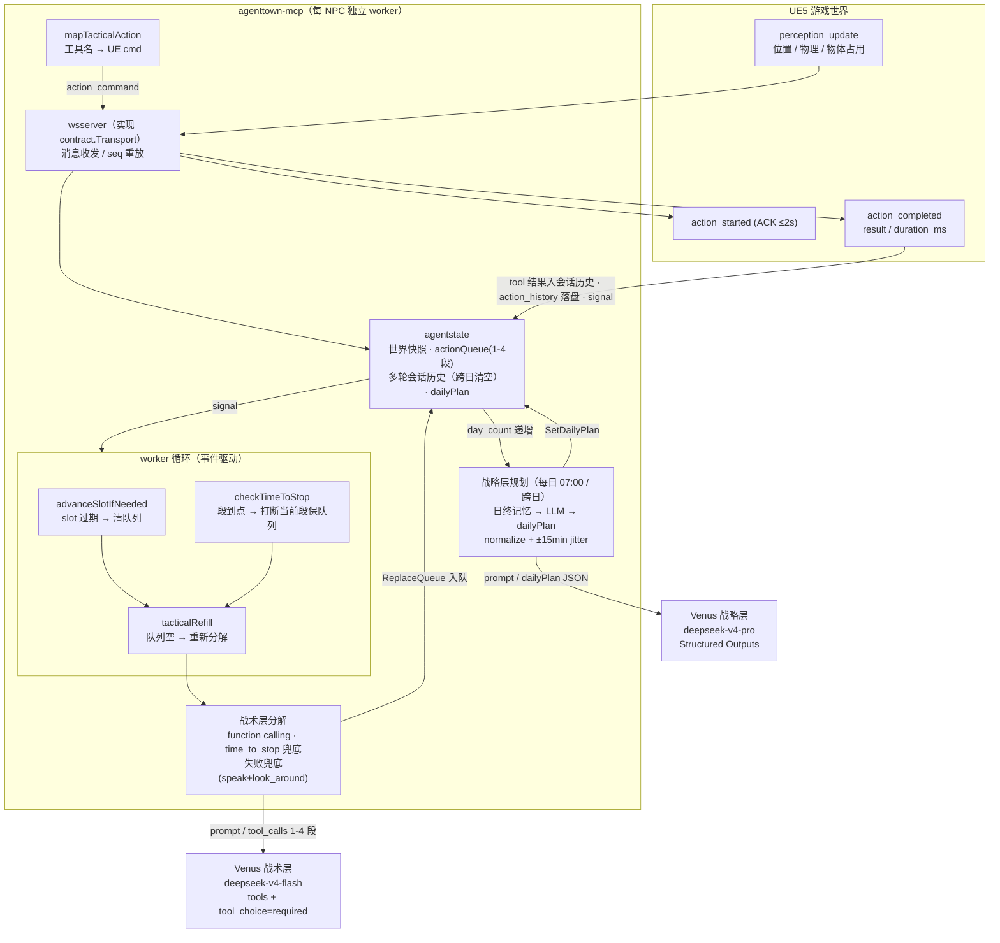

# AgentTown — AI NPC 模拟系统

AI NPC 模拟系统：5 个 NPC（H-01~H-05）通过 MCP 协议驱动"感知 → 决策 → 行动"闭环，对接真实 UE5（AgentTown 地图）。MCP 侧内置三层决策（战略/战术/反应），直连 Venus LLM。

## 项目结构

多 module 仓库：连接侧（contract + wsserver）与 agent 决策侧物理拆分，决策侧只依赖 `contract.Transport` 接口、不依赖 wsserver 实现。

```
agenttown-mcp/                  # 根 module：agent 决策 + 装配壳 + 领域库
  cmd/agenttown-mcp/            # 入口 + 三层决策 + capability + debug UI + 记忆/关系层
  pkg/
    prompt/                     # 战略/战术层 prompt 构建（system/user 拆分、物理分档、设施映射）
    agentstate/                 # 每-NPC 业务状态（队列、会话历史、物理状态、schedule）
    venus/                      # Venus LLM 客户端（function calling + Structured Outputs）
    ollama/                     # 反应层本地 Ollama 客户端
    transport/                  # streamable HTTP（MCP /mcp 端点）
    worldkb/                    # 世界 KB 加载/合并/查询
    profile/                    # NPC 人设档案（assets/profiles/*.md）
    weeklyschedule/             # 每周日程配置
    storage/                    # MySQL 持久化（内存模式默认）
  adapters/agenttown/tools/     # MCP 工具（5 复合 + 7 原子 + 2 特殊）
  contract/                     # 契约 module（无依赖）：protocol（7 字段信封+消息类型）+ Transport 接口（决策侧与连接侧的边界）
  wsserver/                     # 连接 module：WS 收发/seq 重放/ACK，实现 contract.Transport
assets/
  world_kb.yaml                 # 世界 KB：7 zones / 57 objects / 5 agents
  profiles/H-01.md ~ H-05.md    # NPC 人设档案
  weekly_schedule.yaml          # 每周日程（工作日/休息日/运动日/冥想日）
docs/                           # 设计文档（协议/工作流/对话/世界 KB 等）
scripts/pretty_log.py           # 日志可读化工具（HTML 报告）
start-debug.sh / start-dev.sh   # 启动脚本（stable / dev 实例）
.env.example                    # 环境变量模板
CODEBUDDY.md                    # 完整开发手册
```

依赖方向（单向、无环）：

```
contract（协议 + Transport 接口）← 无依赖
wsserver（连接实现）            ← 依赖 contract
根 module（agent 决策 + 壳）     ← 依赖 contract + wsserver
```

根 `go.mod` 通过 `replace => ./contract` / `=> ./wsserver` 引用本地 module；发布时把 replace 换成 tag 版本即可独立替换 agent 侧。

## Agent 内部数据流

每 NPC 一个独立 worker，事件驱动（perception_update / action_completed 唤醒）：



## 快速开始

### dev 与 stable 仓库的关系

同一个远端仓库（`git.woa.com/yitianchen/smartnpc.git`）clone 成**两个独立目录**，用不同分支 + 端口 + 数据库 + 日志目录完全隔离，可同时运行：

| 目录 | 分支            | MCP HTTP / WS | MySQL 库 | 日志目录 |
|------|---------------|---------------|----------|----------|
| `/data/workspace/stable` | `master`      | `8760` / `9092` | `agenttown_stable` | `logs/` |
| `/data/workspace/dev` | `dev-working` | `8770` / `9093` | `agenttown_dev` | `logs-dev/` |

`start-dev.sh` 只是 `start-debug.sh` 的 wrapper（export 偏移端口 + dev 库名 + `logs-dev/`），实际启动逻辑都在 `start-debug.sh`。

### 拉取并配置

```bash
cd /data/workspace

# 1. 分别 clone（stable 用 master，dev 用开发分支）
git clone https://git.woa.com/yitianchen/smartnpc.git stable
git -C stable checkout master
git clone https://git.woa.com/yitianchen/smartnpc.git dev
git -C dev checkout dev-working

# 2. 各自配 .env（至少 VENUS_API_KEY）
cp /data/workspace/stable/.env.example /data/workspace/stable/.env   # 填入 VENUS_API_KEY
cp /data/workspace/dev/.env.example    /data/workspace/dev/.env
```

编译由启动脚本自动完成（`start-debug.sh` 内置 build step，会 `go build -o agenttown-mcp[-dev]` 到 `agenttown-mcp/` 下；多 module 经根 `go.mod` 的 `replace` 自动解析本地 contract/wsserver，无需额外操作）。如需手动编译：

```bash
cd /data/workspace/stable/agenttown-mcp && go build -o agenttown-mcp     ./cmd/agenttown-mcp
cd /data/workspace/dev/agenttown-mcp    && go build -o agenttown-mcp-dev ./cmd/agenttown-mcp
```

### 启动

```bash
# dev 实例（日常开发调试）
cd /data/workspace/dev && bash start-dev.sh

# stable 实例（稳定运行验证）
cd /data/workspace/stable && bash start-debug.sh

# 停止
bash start-dev.sh --stop          # 或 bash start-debug.sh --stop
```

**`--drop-tables`（重置数据库）**：MySQL 持久化模式下，`--drop-tables` 会 `DROP DATABASE + CREATE` 清空该实例的库（`agenttown_dev` / `agenttown_stable`），MCP 启动时由 migrations 从零重建全部表。用于清掉累积的调度状态/记忆/关系、做"干净日"重跑。默认 false（保留累积状态）。

```bash
bash start-dev.sh --drop-tables      # 清空 dev 库后重启
bash start-debug.sh --drop-tables    # 清空 stable 库后重启
```

### 编译 / 测试

```bash
cd agenttown-mcp
go build ./...                  # 编译检查（根 module，replace 自动解析本地 module）
go test ./...                   # 根 module 全量测试

# 连接侧两个 module 也可独立构建/测试
cd contract  && go build ./... && go test ./...
cd wsserver && go build ./... && go test ./...
```

**debug 控制台**：`http://localhost:8770/debug/ `（dev）或 `:8760`（stable）——单 Action 下发、Schedule 注入、当日 schedule、战术层分解情况、MCP 日志。

## 关键信息

- **模块化架构**：三 module（根=agent 决策+壳 / contract=契约 / wsserver=连接），依赖倒置——agent 决策侧只依赖 `contract.Transport` 接口，入站消息经 `Runtime.HandleMessage` 单入口分发，运输层与决策层互不耦合具体实现
- **三层决策结构**：战略层（每日 07:00 生成 6-8 时段计划）→ 战术层（每时段把 goal 分解为 1-4 动作段）→ 反应层（当前由于延迟较高、表现不佳，默认禁用，Ollama 决策 continue/observe/replan）
- **LLM 上下文工程**：战略层与战术层按照 `system`, `user`, `assistant`, `tool` 四个 role 来构建请求体中的 messages 字段，形成 agentic loop
- **战略层工作原理**：生成 json 数组格式化日程安排，例如 `{"time":"07:00-9:00","goal":"在跑步机跑步锻炼"}`，注入后续战术层中
- **战术层工作原理**：生成每个时段的动作安排（可由多个动作组成，组成队列依次下发），填写 `tools` 字段 + `tool_choice=required`；工具由 UE 端上传的 `capability_registry` 派生；每条动作用 `time_to_stop` 控制时长；允许战术层根据实际属性等情况自主裁量
- **LLM 后端**：战略层 `deepseek-v4-pro`、战术层 `deepseek-v4-flash`（Venus，OpenAI 兼容）；反应层本地 Ollama（默认禁用）
- **物理属性分档**：UE端传来电量/疲劳/关节磨损切分为 4 档，把属性值按档位转化为自然语言标签注入 prompt；每个 NPC 的个性化分档设置可经 `profile.md` 的 `## 属性分段` 覆盖
- **UE 端信息自动更新**：UE 连接后推送能力声明，MCP 据此动态增删工具；`world_kb` 推送合并落盘
- **持久化**：默认内存模式；`MYSQL_DSN` 非空启用 MySQL（记忆 + 动作历史 + NPC 关系）
- **日志**：`logs/YYYY-MM-DD/debug-mcp.log`（stable）或 `logs-dev/...`（dev），JSON Lines 全链路
