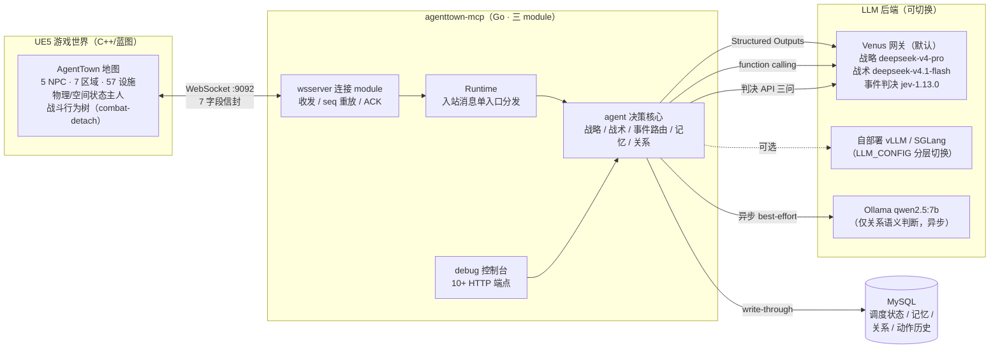
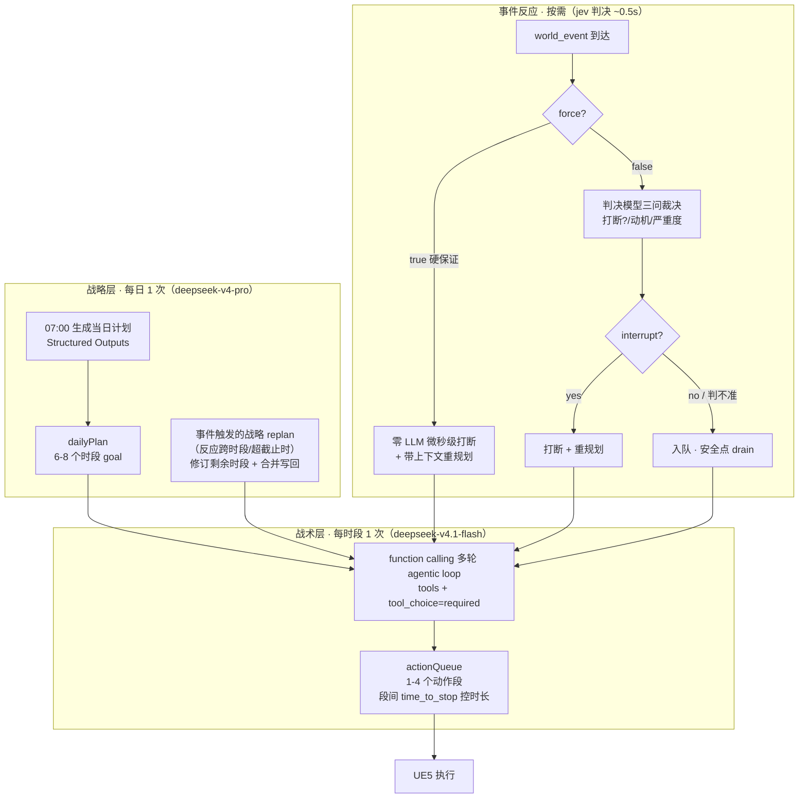
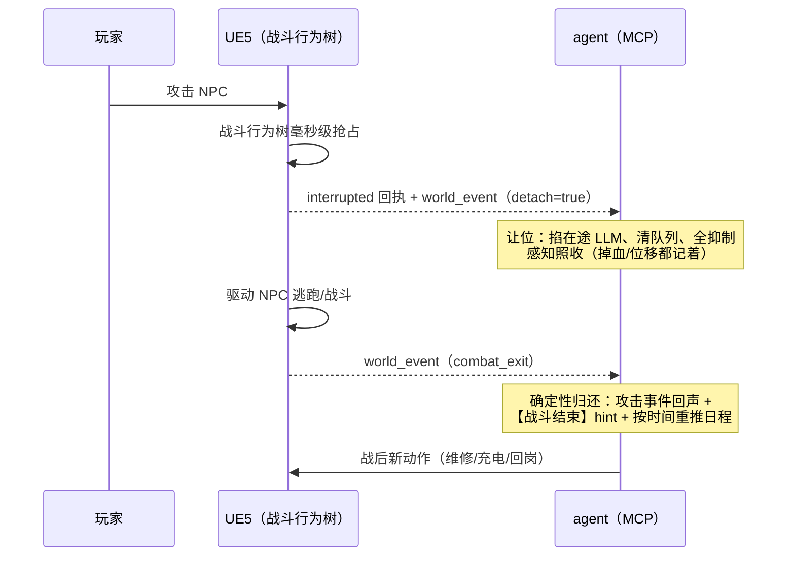

# AgentTown — LLM 驱动的 AI NPC 模拟系统

AgentTown 是一个让 AI NPC 在游戏世界里**长期自主生活**的模拟系统：在 UE5 构建的机器人小镇中，5 个拟人 NPC（H-01~H-05）各自拥有独立的性格人设与工种，白天上班装配、累了充电、闲时社交上网、被攻击了逃跑、受损了维修——所有行为由 LLM 实时决策，经 MCP 协议驱动真实 UE5 世界，形成完整的"感知 → 决策 → 行动 → 反应"闭环。

它不是脚本 NPC：

- **同一事件，不同反应**——"K-03 故障"广播推给所有 NPC，胆小的立刻丢下手里的活，沉着的入队继续工作。事件判决的输入包含每个 NPC 的性格、人际关系、当前动作与持续处境，反应分化是设计出来的涌现
- **日程自己规划**——每天 07:00 由 LLM 结合昨日记忆、今日星期属性（工作日/运动日/冥想日）和实时物理状态生成当天计划；被突发事件打断后还能修订剩余时段
- **会犯错也会自我纠正**——MCP 侧校验拒绝的非法动作指令（如缺目标的移动），拒绝原因回注会话历史，下一轮规划自行改正
- **有记忆、有关系**——日终 LLM 总结当日经历沉淀为结构化记忆；NPC 间交互累积双向关系数值，反过来影响后续决策
- **被攻击真的会跑**——玩家攻击时 UE 战斗行为树接管 NPC 身体、agent 确定性让位（控制权毫秒级交接），脱战后 agent 带战后上下文（掉血/位移/战斗事件对）重新接管，自主决定先维修还是回岗

| 维度 | 数据 |
|------|------|
| NPC | 5 个（H-01~H-05），profile.md 人设按三层回退注入全部决策层 |
| 世界 | 7 区域 / 57 可交互设施（UE5 AgentTown 地图，world_kb 数据驱动） |
| 动作 | 12 种 cmd（7 原子 + 5 复合）+ 2 特殊工具，UE `capability_registry` 动态派生 |
| 决策延迟 | 强制事件微秒级（零 LLM 硬保证通道）；事件判决 ~0.5s；战术分解秒级 |
| 仿真规模 | time_scale 90（1 现实秒 ≈ 90 游戏秒），多游戏日无人值守连续运行 |
| 技术栈 | Go 1.25（三 module）· UE5 C++/蓝图 · Venus LLM（OpenAI 兼容）· MySQL · WebSocket |

---

## 系统架构

### 总体架构



| 组件 | 语言 | 职责 |
|------|------|------|
| 真实 UE5 | C++/蓝图 | 游戏世界：物理/空间状态权威、动作执行、感知推送、世界事件上传、战斗行为树接管 |
| contract module | Go | 契约：7 字段信封协议 + `Transport` 接口（决策侧与连接侧边界，零依赖） |
| wsserver module | Go | 连接：WS 收发、seq 重放补偿、ACK 等待，实现 `contract.Transport` |
| 根 module | Go | agent 决策 + 装配壳 + `pkg/` 领域库（prompt / worldkb / storage / jev / …） |
| Venus / 自部署推理 | 远程/本地 | OpenAI 兼容 LLM 服务：战略（每日 1 次）、战术（每时段 1 次）、事件判决（按需） |
| MySQL | 本地 | 持久化（可选）：调度状态、长期记忆、关系数值、动作历史 |

### 三 module 模块化设计

连接侧与 agent 决策侧物理拆分，**依赖倒置**——决策核心只依赖 `contract.Transport` 接口、不感知 WS 实现；入站消息经 `Runtime.HandleMessage` 单入口分发，运输层只注册两个回调。测试用 fake Transport 替身即可覆盖全部分发逻辑。

```
agenttown-mcp/                  # 根 module：agent 决策 + 装配壳 + 领域库
  cmd/agenttown-mcp/            # 入口 + Runtime 分发 + 三层决策 + 事件路由 + debug UI
  pkg/
    prompt/                     # 三层共享 system prompt + 各层 user prompt + 物理分档 + 事件渲染
    agentstate/                 # 每 NPC 业务状态：动作队列/会话历史/事件队列/持续情境/调度状态
    jev/                        # 事件判决模型客户端（state + 三型问题）
    venus/                      # LLM 客户端（function calling + Structured Outputs + 流式）
    llmconfig/                  # --llm-config 分层后端配置（战略/战术各自 URL+模型）
    llmmetrics/                 # LLM 指标聚合（E2E/TTFT/TPOT/ITL 分位数 + 错误分布）
    llmtokens/ llmtypes/        # token 计数 / 共享响应类型
    ollama/                     # 本地 Ollama 客户端（关系语义判断）
    transport/                  # Streamable HTTP（MCP /mcp 端点）
    worldkb/                    # 世界 KB 加载/合并/校验/查询
    profile/                    # NPC 人设档案（assets/profiles/*.md）
    weeklyschedule/             # 每周日程配置（7 天周期）
    storage/                    # MySQL 持久化 + //go:embed 迁移（默认内存模式）
  adapters/agenttown/tools/     # MCP 工具（5 复合 + 7 原子 + 2 特殊，registry 动态增删）
  internal/log/                 # slog JSON 日志（环形缓冲 + 文件/stderr）
  contract/                     # 契约 module（无依赖）：protocol + Transport 接口
  wsserver/                     # 连接 module：WS 收发/seq 重放/ACK，实现 contract.Transport
```

依赖方向（单向、无环）：

```
contract（协议 + Transport 接口）← 无依赖
wsserver（连接实现）            ← 依赖 contract
根 module（agent 决策 + 壳）     ← 依赖 contract + wsserver
```

根 `go.mod` 通过 `replace => ./contract` / `=> ./wsserver` 引用本地 module；发布时把 replace 换成 tag 版本即可独立替换 agent 侧。

### 三层决策架构

不同时间尺度的决策匹配不同档次的模型——**成本结构是设计出来的**：贵的 pro 模型每天只花 1 次在"今天怎么过"上，时段分解用 flash 快模型，最频繁的事件裁决交给专用判决模型（~0.5s）。



| 层 | 频率 | 模型 | 输入 | 输出 |
|----|------|------|------|------|
| 战略层 | 每日 07:00 一次 + 事件触发 replan | deepseek-v4-pro | 共享 system prompt + 物理/昨日总结/星期属性/其他 NPC | dailyPlan（6-8 时段 JSON，Structured Outputs） |
| 战术层 | 每时段 1 次，队列耗尽时 refill | deepseek-v4.1-flash | 共享 system prompt + 时段目标/实时状态/事件队列/记忆/关系 | tool_calls（1-4 动作段 + time_to_stop） |
| 事件判决 | 每条非 force 事件 | jev-1.13.0（Venus 判决 API） | 结构化 state（人设/关系/近期行为/当前动作/持续处境） | 三问：是否打断/动机/严重度 |
| 关系判断 | 动作完成后异步 | Ollama qwen2.5:7b | cmd + params | 是否构成社交互动（yes/no） |

### 事件驱动反应体系

反应不走轮询、不走大模型闲聊，而是**边沿触发的事件通道 + 确定性优先**：

- **事件 ≠ 心跳**：位置/电量等连续量走 `perception_update` 只刷状态；只有"有发生那一刻的事"（能量跨阈值、进出 zone、被攻击、设备故障）才走 `world_event`，且边沿触发、去抖防风暴
- **force 硬保证通道**：UE 打标的强制事件（被攻击/剧情指令）零 LLM、零去抖、不可否决，微秒级打断在 WS 接收路径同步完成
- **判决路由**：非 force 事件由判决模型裁决（~0.5s），输入含 NPC 性格/关系/当前动作/持续处境——同一事件不同 NPC 产生分化反应；判不准一律保守入队，事件零丢失
- **安全点 drain**：入队事件在当前动作完成后一次性注入战术层 prompt（第三输入），快照注入 + 成功后清空，LLM 失败事件不丢
- **反应护栏**：打断产生的"反应任务"有 60 游戏分钟截止硬切 + severity 严格递增（低级别事件不能打断高级别反应），防连环打断与无限反应
- **持续威胁情境 + 事件回声**：威胁在解除信号到达前持续注入每轮 prompt，防"反应做完就自称威胁解除"的幻觉；被打断后的第一次重规划能再见到原始事件
- **在途 LLM 可取消**：强制事件能掐掉飞行中的战术层请求（ctx 贯穿 HTTP），半截思考零残留

### combat-detach 战斗接管

玩家攻击 NPC 时 UE 战斗行为树接管身体，这是一套**确定性控制权交接协议**（全程不过模型）：



每个方向都有兜底：UE 忘发 `combat_exit` → 30 游戏分钟 TTL 租约自动收回；UE 接管未生效 → 2s 宽限期后代为停动作（宽限期内不 stop，避免杀掉刚启动的接管）；断线重连让位状态存续；重复攻击幂等。2026-09-22 联调跑通：UE 抢占与打断回执同毫秒完成，宽限期保险丝零触发。

### 关键机制速览

| 机制 | 要点 |
|------|------|
| 7 字段信封 | 所有消息共用外层（version/msg_id/seq/timestamp/type/agent_id/payload），业务字段一律入 payload |
| seq 重放补偿 | 双方发送缓冲（200 条/60s），断线重连交换 resync 重放离散消息，连续状态以最新快照为准 |
| 动作异步生命周期 | action_command → action_started（ACK ≤2s）→ action_completed（result/duration），超时重决策 |
| 智能设施排队 | 目标被占用时自动排队（auto_queue），queued/advanced/timeout 状态推送，超时回退重决策 |
| world_kb 自动适配 | UE 推送新 KB → 重启即全链路适配（prompt/工具 schema/兜底日程全从 KB 派生），换地图零代码 |
| NPC 人设注入 | profile.md（名字/职业/背景/性格/说话风格/属性分段）三层回退（profile > KB > 内置），贯穿所有决策层 |
| 长期记忆 | 日终 LLM 总结 action_history → 结构化记忆 + 叙事，注入后续战略/战术 prompt |
| 关系数值 | 交互后 Ollama 语义判断 → 双向 familiarity 累积 → 注入【人际关系】段 |
| LLM 可靠性兜底 | 坏 tools JSON 同请求重试（实测 100% 救回）、time_to_stop 兜底、失败兜底动作防呆站 |
| 全链路可观测 | 统一 JSONL 日志（UE/MCP/LLM 三层）、decision_epoch 串联决策轮次、LLM 分位数指标 |

---

## 通信协议

- **传输**：WebSocket（UE5 → MCP `ws://<host>:9092/ws`），7 字段信封，时间戳毫秒、坐标厘米（UE5 单位）
- **消息类型**（16 种）：`world_kb` / `agent_registered` / `capability_registry`（UE 连接首发三连）→ `perception_update` / `state_report`（感知）→ `action_command` / `action_started` / `action_completed` / `action_queued` / `stop_action`（动作生命周期）→ `world_event`（事件通道）→ `chat_invite_rsp` / `chat_turn`（对话）→ `heartbeat` / `error` / `resync` / `event_lost`（系统级）
- **12 种 cmd**：原子 `GenericAct` / `MoveTo` / `Wait` / `TurnTo` / `Speak` / `InteractSmartObject` / `Emote`；复合 `WorkShift` / `ChargeAtStation` / `SelfMaintenance` / `RestAtResidence` / `SurfInternet`。语义目标（`semantic_group`）由 UE 解析，MCP 不做坐标换算

完整协议（字段表/数值系统/时序图）见 `docs/AgentTown_CommProtocol_Values.md`；事件通道见 `docs/AgentTown_WorldEvent_Protocol.md`。

---

## 部署指南

### 环境要求

| 依赖 | 版本/要求 | 说明 |
|------|-----------|------|
| Go | 1.25+ | 编译 agenttown-mcp（三 module 经 replace 自动解析） |
| LLM 后端 | Venus 凭据 或 自部署推理 | 二选一，见下节 |
| MySQL | 8.x（可选） | 默认内存模式（无持久化）；启用后记忆/关系/动作历史可跨重启 |
| UE5 | AgentTown 地图 | UE 侧由外部启动，连接 MCP WS 端点 |
| Python | 3.x（可选） | 日志工具 `scripts/pretty_log.py`、冒烟/压测脚本 |

### LLM 后端配置（两种模式）

**模式一：Venus（默认）**——OpenAI 兼容网关，战略 `deepseek-v4-pro` / 战术 `deepseek-v4.1-flash` / 事件判决 `jev-1.13.0`。只需在 `.env` 填 `VENUS_API_KEY`。

**模式二：自部署推理服务（vLLM / SGLang）**——`assets/llm_backend.yaml` 分层配置战略/战术各自的后端地址与模型，`.env` 设 `LLM_CONFIG=assets/llm_backend.yaml` 即切换（不再要求 VENUS_API_KEY）：

```yaml
strategic:                      # 战略层（低频，可用大模型）
  base_url: "http://127.0.0.1:8000"   # 服务根地址，客户端自动拼 /v1/chat/completions
  model: "Qwen2.5-32B-Instruct"
tactical:                       # 战术层 + 对话层（高频）
  base_url: "http://127.0.0.1:8000"
  model: "Qwen2.5-7B-Instruct-GPTQ-Int4"
```

推理服务跑在远程容器（如 AutoDL）时，Windows 端用 `bash start-vllm-tunnel.sh` 建立 SSH 正向隧道把容器 `:8000` 映射到本地，MCP 指向 `127.0.0.1` 即可。

### 快速开始

同一个远端仓库 clone 成**两个独立目录**，用不同分支 + 端口 + 数据库 + 日志目录完全隔离，可同时运行：

| 目录 | 分支 | MCP HTTP / WS | MySQL 库 | 日志目录 |
|------|------|---------------|----------|----------|
| `/data/workspace/stable` | `master` | `8760` / `9092` | `agenttown_stable` | `logs/` |
| `/data/workspace/dev` | 开发分支 | `8770` / `9093` | `agenttown_dev` | `logs-dev/` |

```bash
# 1. clone 两份（stable 用 master，dev 用开发分支）
cd /data/workspace
git clone https://git.woa.com/yitianchen/smartnpc.git stable && git -C stable checkout master
git clone https://git.woa.com/yitianchen/smartnpc.git dev

# 2. 各自配 .env（至少 VENUS_API_KEY；自部署后端改用 LLM_CONFIG）
cp stable/.env.example stable/.env    # 编辑填入凭据
cp dev/.env.example    dev/.env

# 3. 启动（脚本自动完成：停旧进程 → 拉起 MySQL → 编译 → 启动 MCP → 健康检查）
cd /data/workspace/dev && bash start-dev.sh        # dev 实例
cd /data/workspace/stable && bash start-debug.sh   # stable 实例

# 4. 启动 UE5（AgentTown 地图），连接 MCP WS 端点：
#    stable: ws://<host>:9092/ws    dev: ws://<host>:9093/ws
#    UE 连接后按序首发：world_kb → agent_registered → capability_registry
#    随后 resync → state_report → perception_update，仿真开始
```

启动脚本常用操作：

```bash
bash start-dev.sh --stop           # 停止所有服务
bash start-dev.sh --drop-tables    # 清空该实例 MySQL 库后重启（migrations 从零重建），
                                   # 用于清掉累积的调度/记忆/关系做"干净日"重跑
```

手动编译（脚本已内置，一般不需要）：

```bash
cd agenttown-mcp
go build -o agenttown-mcp      ./cmd/agenttown-mcp   # stable
go build -o agenttown-mcp-dev  ./cmd/agenttown-mcp   # dev
```

### 环境变量速查（`.env`）

| 变量 | 必填 | 默认 | 说明 |
|------|------|------|------|
| `VENUS_API_KEY` | ✅* | — | Venus 凭据（*设了 `LLM_CONFIG` 切自建后端时可不填） |
| `LLM_CONFIG` | | 空 | LLM 后端分层配置文件路径（自建 vLLM/SGLang 切换） |
| `HTTP_PORT` | | 8760 | MCP HTTP 端口（debug 控制台 + 健康检查） |
| `WS_PORT` | | 9090 | WS 端口（启动脚本对 stable/dev 分别传 9092/9093） |
| `AGENTTOWN_MCP_AUTO_PLAN` | | true | false=手动模式：跳过自动决策，仅响应 debug 注入，联调隔离用 |
| `MYSQL_DB` | | 按实例 | MySQL 库名（脚本据此建库 + 拼默认 DSN） |
| `MYSQL_DSN` | | 空=内存模式 | 完整 DSN（优先级高于 MYSQL_DB，须含 `parseTime=true`） |
| `SKIP_MYSQL` | | 空 | =1 跳过 MySQL 启动，MCP 降级内存模式 |
| `OLLAMA_URL` | | 空=禁用 | 关系判断本地推理地址（如 `http://localhost:11434`） |
| `OLLAMA_MODEL` | | qwen2.5:7b-instruct-q4_K_M | 关系判断模型 |
| `OLLAMA_NUM_THREAD` | | 16 | CPU 推理线程数（高核数机器限线程反而更快，实测 96 vCPU 限 16 线程 3x 加速） |

MCP 进程级 flag（`--venus-model` / `--jev-timeout` / `--tactical-stream` / `--world-kb` / `--profiles-dir` 等）完整清单见 `CLAUDE.md` 的 flag 速查表。

### 数据持久化

默认内存模式（`NoopStore`，无持久化，测试友好）。`.env` 配置 MySQL 后启用：

| 表 | 内容 |
|----|------|
| `agent_schedule_state` | 4 个调度字段 write-through（dailyPlan/天数/时段索引），热重启计划跨进程存活 |
| `agent_memories` | 日终生成的结构化记忆（event/skill/relationship/daily_summary） |
| `agent_relationships` | NPC 间关系数值（双向独立行，familiarity/interaction_count） |
| `action_history` | 全量动作生命周期记录（cmd/params/起止），日终记忆与排障的数据源 |

schema 由 `//go:embed migrations/*.sql` 启动时自动迁移，无需外部工具。DB 写失败仅降级告警，不阻塞决策。

### 日志与排障

**统一日志**：`logs/YYYY-MM-DD/debug-mcp.log`（stable）或 `logs-dev/...`（dev），JSON Lines 全链路（UE/MCP/LLM 三层）。推荐用可读化工具：

```bash
python scripts/pretty_log.py --html              # HTML 报告（可折叠/搜索/方向过滤，自动开浏览器）
python scripts/pretty_log.py -f PERCEPTION -n 5  # 终端看最近 5 条感知原文
grep '队列已填充' logs-dev/$(date +%F)/debug-mcp.log   # 原始 grep 也友好（单行 JSON）
```

**debug 控制台**：`http://localhost:8770/debug/`（dev）或 `:8760`（stable）：

| 端点 | 用途 |
|------|------|
| `GET /debug/` | 浏览器控制台（多面板单页） |
| `POST /debug/action` | 直接下发单个 action（单步调试） |
| `POST /debug/schedule` | 注入 schedule 触发战术层分解 |
| `POST /debug/event` | 合成 world_event 走完整事件管道（15 预设 + 自定义，**无 UE 也能联调事件全链路**） |
| `GET /debug/tactical` | 各 NPC 当前时段 goal + 在途动作 + 待执行队列（含脱管状态） |
| `GET /debug/plan` | 当日 dailyPlan 快照 |
| `GET /debug/kb` / `GET /debug/cap` | world_kb / 能力注册表现状 |
| `GET /debug/agents` / `GET /debug/logs` / `GET /debug/ue-errors` | agent 列表 / 环形日志 / UE 错误 |
| `GET /debug/llm-metrics` | LLM 调用指标（各层 E2E/TTFT/TPOT/ITL 分位数 + 错误分布 + 重试率） |

**无 UE 冒烟**：`scripts/smoke_combat_detach.py` 模拟最小 UE 客户端（心跳 + perception 推进），单侧验证战斗让位→归还全闭环；`scripts/` 下另有 Venus 延迟压测、world_kb E2E、断线重连（phase7）等脚本。

---

## 编译与测试

```bash
cd agenttown-mcp
go build ./...                  # 根 module（replace 自动解析 contract/wsserver）
go test ./...                   # 全量测试（决策/事件路由/combat-detach/战略 replan 等）

# 两个子 module 独立构建/测试
cd contract  && go build ./... && go test ./...
cd wsserver && go build ./... && go test ./...
```

测试纪律：新增 package 必须带 `*_test.go`；用 `fakeTransport`（contract.Transport 测试替身）与 mock LLM，禁止启真实子进程。关键路径有行为级测试覆盖（如 combat-detach 22 项：让位入口/幂等/抑制面/双归还触发器/宽限期/协议容错）。

---

## 目录结构

```
agenttown-mcp/                  # Go 三 module 仓库主体（见"三 module 设计"）
assets/
  world_kb.yaml                 # 世界 KB：7 zones / 57 objects / 5 agents
  world.generated.json / world.authored.json   # UE 推送的世界数据（merge 输入）
  llm_backend.yaml              # 自部署 LLM 后端分层配置
  profiles/H-01.md ~ H-05.md    # NPC 人设档案
  weekly_schedule.yaml          # 每周日程（工作日/休息日/运动日/冥想日）
docs/                           # 设计文档（协议/事件/架构/对话/KB，见下方索引）
scripts/
  pretty_log.py                 # 日志可读化（HTML 报告 + 终端渲染）
  smoke_combat_detach.py        # combat-detach 无 UE 冒烟
  test_world_kb_e2e.py          # world_kb 推送 E2E
  test_phase7_reconnect.py      # 断线重连 + seq 重放验证
  bench_venus_latency.py / eval_venus_models.py   # LLM 压测/评估
  push_world_kb.py / setup-cloud-env.sh
start-debug.sh                  # stable 启动（MySQL + 编译 + MCP + 健康检查）
start-dev.sh                    # dev 启动 wrapper（偏移端口/库名/日志目录）
start-tunnel.sh                 # Windows→云端 SSH 反向隧道（Ollama 用）
start-vllm-tunnel.sh            # Windows→AutoDL SSH 正向隧道（自部署 vLLM 用）
.env.example                    # 环境变量模板（分组注释）
CLAUDE.md                       # 工程手册（架构/机制/命令/文件地图，最全）
```

## 文档索引

| 文档 | 内容 |
|------|------|
| `CLAUDE.md` | 工程手册：架构总览、全部关键机制、命令、flag、文件地图 |
| `docs/AgentTown_Architecture_Highlights.md` | 项目架构与技术亮点总览（评审/onboarding 入口） |
| `docs/AgentTown_CommProtocol_Values.md` | 通信协议与数值系统（唯一权威） |
| `docs/AgentTown_WorldEvent_Protocol.md` | UE → Agent 事件上传协议（含 combat-detach） |
| `docs/AgentTown_EventDrivenAgent_Design.html` | 事件驱动异步 Agent 设计 |
| `docs/AgentTown_EventDriven_Implementation_Plan.md` | 事件驱动实施计划（P0-P5） |
| `docs/AgentTown_Core_DeepDive.md` | 核心机制深潜 |
| `docs/AgentTown_Dialogue_Design.md` | 对话系统设计 |
| `docs/AgentTown_WorldKB_Design.md` | 世界 KB 设计 |
| `docs/DebugAction_Tool.md` | Debug 工具使用文档 |
| `docs/llm_metrics.md` | LLM 指标报告（运行时自动生成） |
