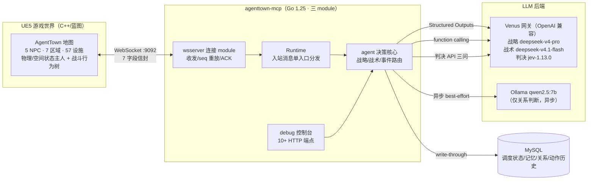
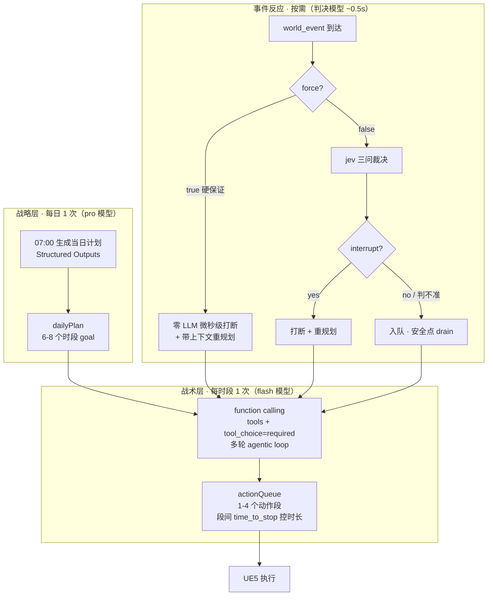
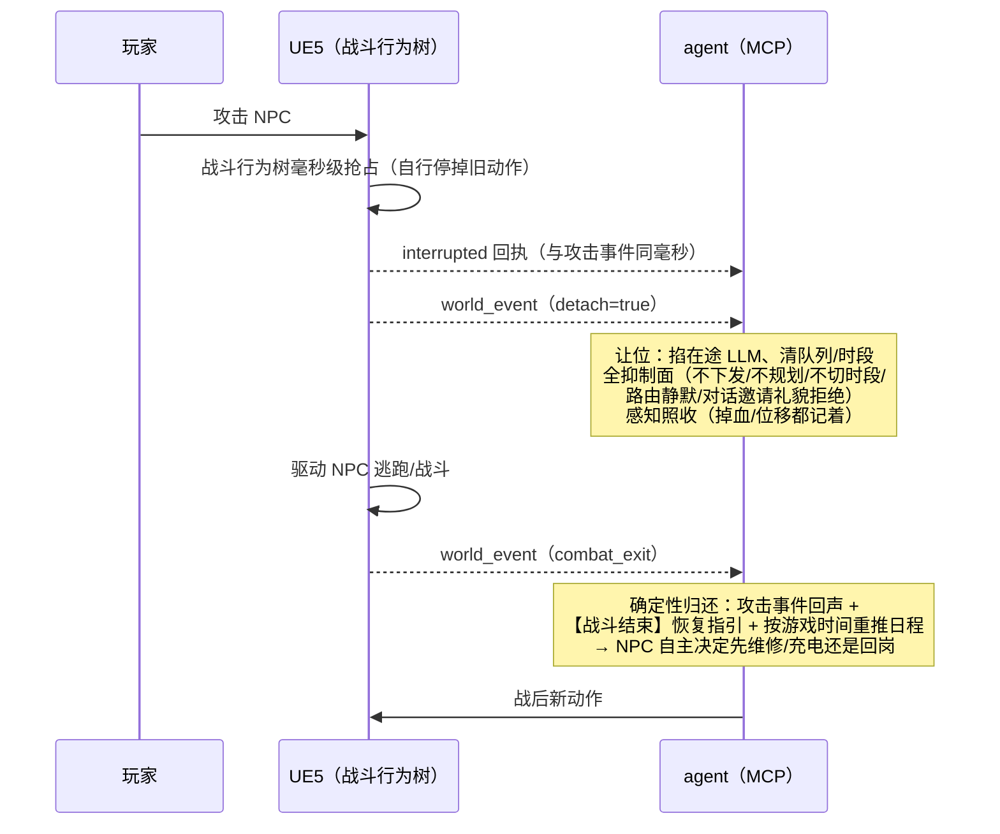

# AgentTown_v3 项目架构与技术亮点

> 版本：v1.0（2026-09-23）
> 定位：项目总览 + 核心设计 + 工程亮点速览，面向评审汇报与新成员 onboarding。
> 本文只讲设计与结论，实现细节见文末文档索引。

---

## 一、项目概述

AgentTown_v3 是一个 **AI NPC 模拟系统**：在 UE5 打造的机器人小镇里，5 个拟人 NPC（H-01~H-05，各有独立人设与工种）自主地生活——白天上班装配、累了充电、闲时社交上网、被攻击了逃跑、被打坏了去维修。所有行为由 LLM 驱动，通过 MCP 协议对接真实 UE5 世界，形成完整的"**感知 → 决策 → 行动**"闭环。

它不是脚本 NPC：同一事件推给不同 NPC，会因性格、人际关系、当前状态产生不同反应；日程不是配置死的，而是每天由 LLM 结合昨日经历重新规划；行为会犯错也会自我纠正（被拒绝的动作指令，下一轮规划能看到拒绝原因）。

| 维度 | 数据 |
|------|------|
| NPC | 5 个，各自独立 profile 人设（职业/背景/性格/说话风格） |
| 世界 | 7 个区域 / 57 个可交互设施（UE5 真实地图） |
| 动作 | 12 种 cmd（7 原子 + 5 复合）+ 2 特殊工具，UE 能力注册表动态驱动 |
| 仿真 | time_scale 90（1 现实秒 ≈ 90 游戏秒），多游戏日连续无人值守 |
| LLM 用量 | 战略层每日 1 次（pro 模型）/ 战术层每时段 1 次（flash 模型）/ 事件判决按需（~0.5s/次） |
| 决策链路 | UE5 ↔ MCP（Go）双向 WebSocket，全链路日志可回放 |

---

## 二、总体架构

**三 module 契约式架构**（2026-08-27 重构）：

| module | 职责 | 依赖 |
|--------|------|------|
| `contract` | 契约：7 字段信封协议 + `Transport` 接口（决策侧与连接侧边界） | 无（零依赖） |
| `wsserver` | 连接：WS 收发、seq 重放、ACK 等待，实现 `contract.Transport` | contract |
| 根 module | agent 决策 + 装配壳 + `pkg/` 领域库（prompt/worldkb/storage/jev/…） | contract + wsserver |

关键设计：**依赖倒置**——决策核心只依赖 `Transport` 接口，不感知 WS 实现；入站消息经 `Runtime.HandleMessage` 单入口分发，运输层只注册两个回调。测试用 fake Transport 替身即可覆盖全部分发逻辑。

---

## 三、核心设计

### 3.1 三层决策：把"人格"拆到三个时间尺度

**成本结构是设计出来的**：贵的 pro 模型每天只花 1 次在"今天怎么过"上；时段分解用 flash 快模型；最频繁的"这个事件要不要打断"交给专用判决模型，单次 ~0.5 秒。不同时间尺度匹配不同档次的模型，长仿真 LLM 开销可控。

**人格贯穿三层**：角色人设（profile > KB > 兜底的三层回退）注入所有层的 prompt——战略层决定"今天的安排体现性格"，战术层决定"怎么做体现性格"，判决层决定"什么事对**这个**NPC 算紧急"。

**战略层会改计划**：反应跨时段被切断、反应超截止被切回日程时，带修订上下文（原计划 + 未完成任务 + 上次结束原因）重规划**剩余时段**，已过时段保留为既成事实合并写回。节流：每游戏日至多 5 次、间隔 ≥2 游戏小时。

### 3.2 事件驱动反应体系：从轮询到边沿触发

反应体系是本项目最有辨识度的部分（2026-09 完成，取代旧 Ollama 轮询反应层）。三条协议级设计原则：

1. **事件 ≠ 心跳**：位置/电量等连续量走感知通道只刷状态栏；只有"有发生那一刻的事"（能量跨过 20、走进新 zone、被攻击）才走事件通道，且**边沿触发**——跨过阈值推一次，继续掉不推。
2. **force 不可否决**：UE 打标的强制事件（被攻击、剧情强制）走硬保证通道——零 LLM、零去抖、无任何抑制逻辑，消息到达即打断。**打标责任在 UE 硬编码**，不依赖模型判断。
3. **UE 只报事实，紧急度由 agent 判**：severity 是客观量级；同一条"K-03 故障"广播推给所有 NPC，胆小的立刻丢下手里的活，沉着的入队继续干——**同一事件、N 种反应**，这是 AI NPC 区别于脚本 NPC 的涌现验收点。

非 force 事件由**轻量判决模型**裁决三问：该不该打断（概率）、动机（紧急/情境解除/社交/不打断）、严重度打分。输入是结构化 state（性格、人际关系、当前动作与已执行时长、物理状态分档、持续处境）——**判决有依据、可解释**。判不准一律倾向入队（保守方向，事件不丢）。

配套的工程护栏：

- **安全点 drain**：入队事件在当前动作完成后一次性全量注入战术层 prompt（第三输入），快照注入 + 成功后清空——LLM 失败事件不丢，下次重新看到
- **反应护栏**：打断产生的"反应任务"有 60 游戏分钟截止时间（到期硬切回日程）+ severity 严格递增（低级别事件不能打断高级别反应，防连环打断）
- **持续威胁情境**：威胁（被攻击/被瞄准）在解除信号到达前持续存在——情境状态每轮注入 prompt，防止"反应做完了就自称威胁解除"的幻觉；配套**事件回声**机制，被打断后的第一次重规划能再见到原始事件一次
- **在途 LLM 可取消**：强制事件能掐掉正在飞行中的战术层请求（venus ctx 贯穿 HTTP），半截思考零残留——被取消方跳过一切失败兜底，避免兜底动作与紧急反应打架

### 3.3 combat-detach：确定性控制权交接（2026-09-22 联调跑通）

玩家攻击 NPC 时，UE 的战斗行为树会接管 NPC 身体——这要求 agent **让位**，而非"做出战斗反应"。这是一套确定性交接协议，**全程不过模型**：

设计上值得强调的四点：

- **交接是确定性的，双方都不做判断**：detach 即让位（agent 无权否决），combat_exit 即归还（不走路由裁决——让位期间 agent 没有上下文，模型判决必然瞎判）
- **让位 = 沉默**：接管的全部可见效果在 UE 侧；agent 不是"改做战斗反应"而是彻底不出声，越安静交接越干净
- **每个方向都有兜底**：UE 忘发 combat_exit → 30 游戏分钟 TTL 自动收回；UE 接管没生效 → 2 秒宽限期后代为停一次动作（宽限期内不 stop，因为 stop 的 UE 语义是"中断行为树"，会把刚启动的接管连根杀掉——实测跑通后这条保险丝从未触发，UE 每次都毫秒级抢占并即时回执）；断线重连 → 让位状态存续（UE 重连后不会重发 detach）
- **协议容错**：UE 首版事件名不规范（短名、缺类别字段），agent 侧别名归一化，两种拼法行为一致——联调期协议偏差不阻塞

### 3.4 战术层 agentic loop 与 prompt 工程

战术层是 OpenAI 原生 function calling 的多轮 agentic loop：工具经 `tools` 字段下发（由 UE 能力注册表动态派生）、`tool_choice=required`、携带多轮会话历史。Prompt 工程上有三个有意识的优化：

1. **日内不变块只发一次**：全天日程 + 完整分解规则只在每天第一条 user 消息全量出现，同计划后续轮次省略、改为核心约束速览 + 引用行——实测每条 2100 → ~900 字符（**-57%**）
2. **瞬态状态栏**：当前游戏时间/物理状态/日程进度/动作剩余，每轮从状态现查现拼、**不入会话历史**（旧状态留在历史里只会误导），前缀保持稳定——LLM 服务的 KV cache 只失效尾巴
3. **物理状态分档自然语言**：不喂裸数值，按阈值切档（"电量偏低，建议尽快充电"），LLM 不需要心算

自我纠正闭环：MCP 侧校验动作指令（如 move_to 缺目标参数直接拒绝），拒绝原因以 user 消息注入会话历史——下一轮分解 LLM 可见并改正，实测有效（曾修复"无目标移动秒成功触发连环重规划"）。

---

## 四、工程亮点

**1. LLM 不可靠性的系统性兜底**——长仿真 0 次最终失败：
- venus 4001（LLM 输出坏 tools JSON）相同请求体重试，上限 3 次，实测 100% 救回
- time_to_stop 兜底：LLM 漏设段间时长时自动补默认值（休息 30 分钟/工作 90 分钟），防队列卡死
- LLM 失败兜底动作（说话 + 环顾 30 秒），防 NPC 呆站；动作完成后再唤醒重试
- 在途请求可取消 + 半截思考零残留（见 §3.2）

**2. 全链路可观测**：
- 统一 JSONL 日志（UE/MCP/LLM 三层），`decision_epoch` 字段串联一轮决策的输入 prompt、工具调用、响应
- `pretty_log.py` 渲染可折叠/搜索/过滤的 HTML 报告；方向标记（UE→MCP / MCP→LLM / LLM→MCP / MCP→UE）全链路可读
- LLM 指标聚合：各层 E2E/TTFT/TPOT/ITL 分位数 + 错误分布 + 重试率 + JSON 正确率，`/debug/llm-metrics` 实时可查
- 实际下发 prompt 全文落盘（`docs/actual_prompts.md`），评审可逐条核对

**3. 联调工具链**：浏览器 debug 控制台（10+ HTTP 端点）——单步动作下发、schedule 注入、**事件注入**（15 个预设 + 自定义，走与 UE 上报完全相同的分发入口，无 UE 也能联调事件全链路）、战术层分解情况实时面板（含脱管状态徽标）、日志环形缓冲。配套冒烟脚本（如 combat-detach：模拟最小 UE 客户端断言让位→归还全闭环）。

**4. 协议工程**：7 字段信封纯净（业务字段全在 payload）；毫秒时间戳/厘米坐标单位约定；断线重连 seq 重放（200 条/60 秒发送缓冲 + resync + event_lost 告警）；智能设施排队机制（占用时排队、状态推送、超时回退）；动作异步生命周期（ACK ≤2s + completed 回调 + 超时重决策）。

**5. 数据驱动适配**：UE 推送新 `world_kb` → MCP 重启即全链路自动适配（三层共享 system prompt、工具列表、参数 schema 描述、兜底日程全部从 KB 派生）——**换地图零代码改动**。NPC 人设（profile.md）与每周日程（YAML）同为数据文件，进程级只读、参数化传递。

**6. 持久化与长期演化**（Stage 3/4/5）：4 个调度字段 write-through 同步落盘，热重启计划跨进程存活；日终 LLM 批量总结动作历史 → 结构化记忆 → 注入后续战略/战术 prompt；NPC 间关系数值动态维护（交互后语义判断 → 双向 familiarity 累积 → 注入【人际关系】段）。`//go:embed` 原生 SQL 迁移，无需外部工具。

**7. 测试纪律**：三个 module 独立单测全绿；事件系统/combat-detach 等关键路径均有行为级测试（22 项 combat-detach 用例覆盖让位入口/幂等/抑制面/双归还触发器/宽限期/协议容错）；contract.Transport 测试替身使决策逻辑无网络可测。

---

## 五、实测效果（均已跑通验证）

| 项 | 实测结果 |
|----|----------|
| 事件判决延迟 | 单次 ~0.5s（5s 超时预算内，per-agent 无状态单发） |
| 战术层 prompt 压缩 | 2100 → ~900 字符/条（-57%），语义无损 |
| venus 4001 重试 | 长仿真 0 次最终失败（重试全部救回） |
| 战斗接管交接 | 攻击事件与打断回执**同毫秒**（UE 抢占生效）；宽限期代为 stop 零触发；combat_exit 归还 + TTL 兜底并存 |
| 涌现验证 | 同一故障广播，不同 NPC 因性格/关系产生"立即中断"vs"入队继续"的分化反应 |
| 仿真稳定性 | 多游戏日连续无人值守运行，断线重连后状态/计划/让位状态均正确恢复 |

---

## 六、里程碑

| 时间 | 里程碑 |
|------|--------|
| 2026-07 | 世界快照定义、MCP 工具层、端到端闭环（感知→LLM→工具→UE） |
| 2026-08 初 | 协议重构 Phase 1-7（信封/seq/ACK/异步生命周期/断线重放）；三层决策架构 |
| 2026-08 中 | 取缔 Hermes Gateway，MCP 直连 Venus；真实 UE5 对接（弃用 Mock）；12 cmd 体系迁移 |
| 2026-08 下 | 战术层 function calling 迁移 + 多段动作计划；prompt 重构（system/user 拆分、物理分档）；Stage 3/4/5（持久化/记忆/关系）；wsserver/agent 模块化解耦（MR !57） |
| 2026-09 | **事件驱动反应体系**（world_event 协议 + force 硬保证 + 安全点 drain + 反应护栏 + 持续威胁情境）；**事件路由接入 jev 判决模型**（MR !67）；**combat-detach 战斗接管**（联调跑通） |

---

## 七、后续规划

- **P5 系列**：否决记录进睡眠期反思（决策可追溯）、slot 边界随机抖动（防多 NPC 同时段切换打爆 LLM 后端）、高倍率流水线化预分解（可选）
- **事件合成器退役**：本地状态变化合成事件的过渡层，UE 侧 world_event 推送覆盖齐备后整体删除
- **UE 侧协同项**：带旋转 zone 的物体查找 bug；攻击事件双发收敛（规范名 + 短名各一条）；combat_exit 发出时机对齐；瞄准事件路径收敛

---

## 附：文档索引

| 文档 | 内容 |
|------|------|
| `docs/AgentTown_CommProtocol_Values.md` | 通信协议与数值系统（唯一权威） |
| `docs/AgentTown_WorldEvent_Protocol.md` | UE → Agent 事件上传协议（含 combat-detach） |
| `docs/AgentTown_EventDrivenAgent_Design.html` | 事件驱动异步 Agent 设计（实现依据） |
| `docs/AgentTown_EventDriven_Implementation_Plan.md` | 事件驱动实施计划（P0-P5 系列） |
| `docs/AgentTown_Core_DeepDive.md` | 核心机制深潜 |
| `docs/AgentTown_Dialogue_Design.md` | 对话系统设计 |
| `docs/DebugAction_Tool.md` | Debug 工具使用文档 |
| `CLAUDE.md` | 工程事实全集（架构/机制/命令/文件地图） |
