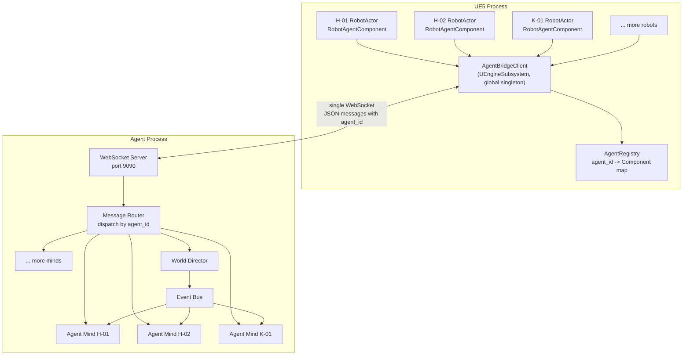
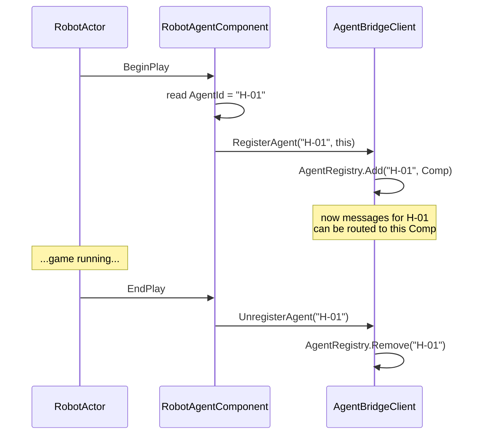
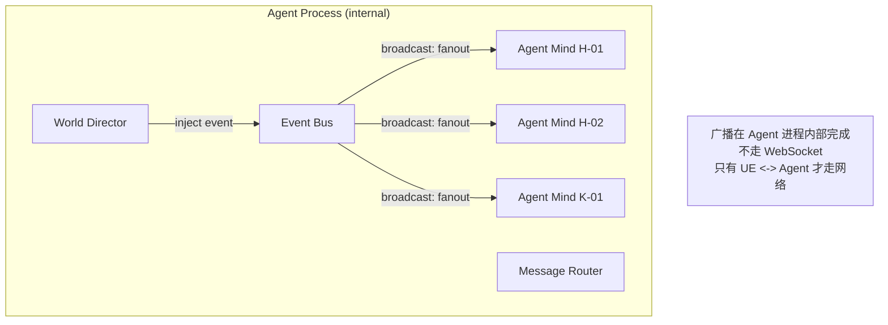
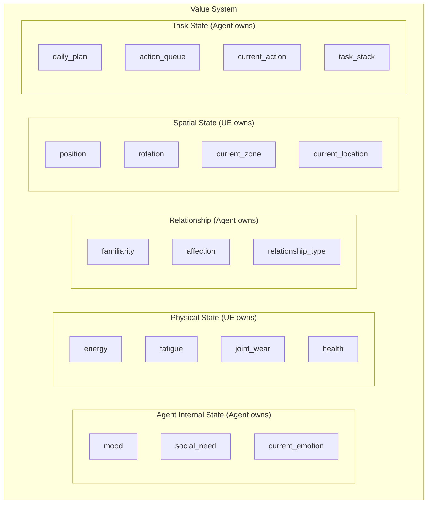
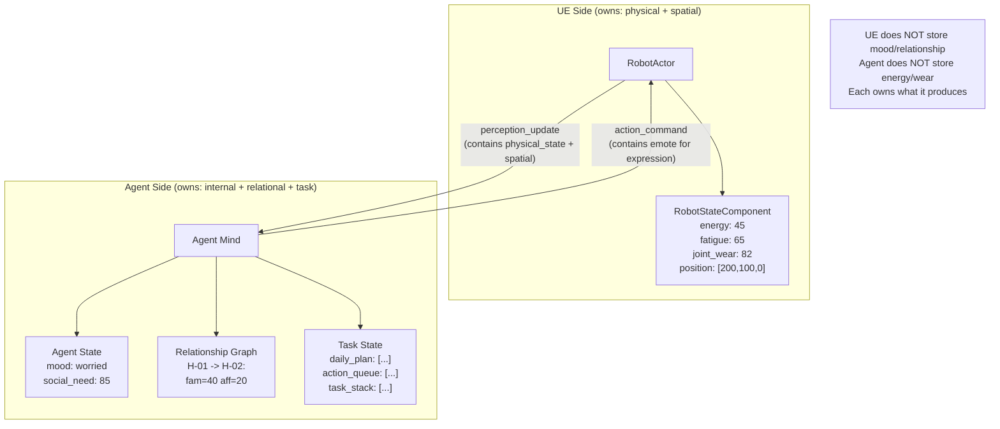
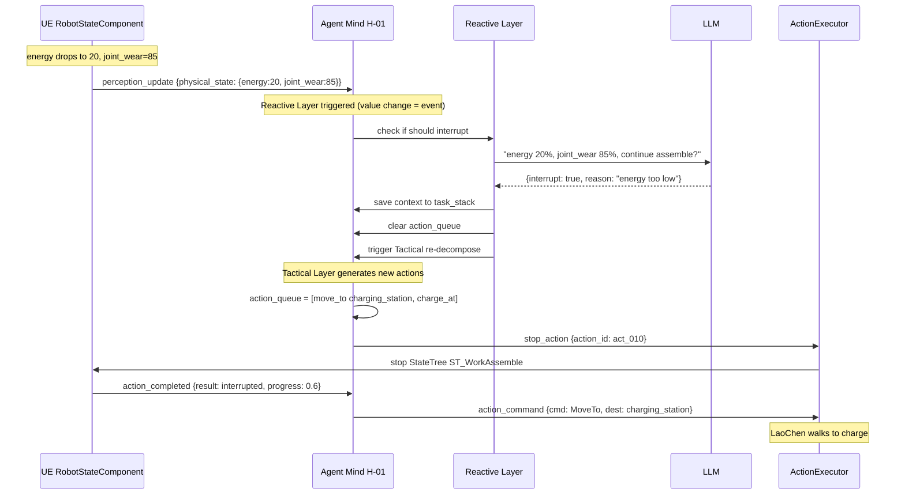
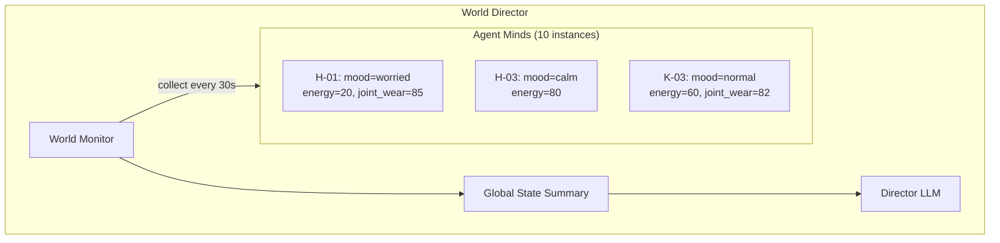
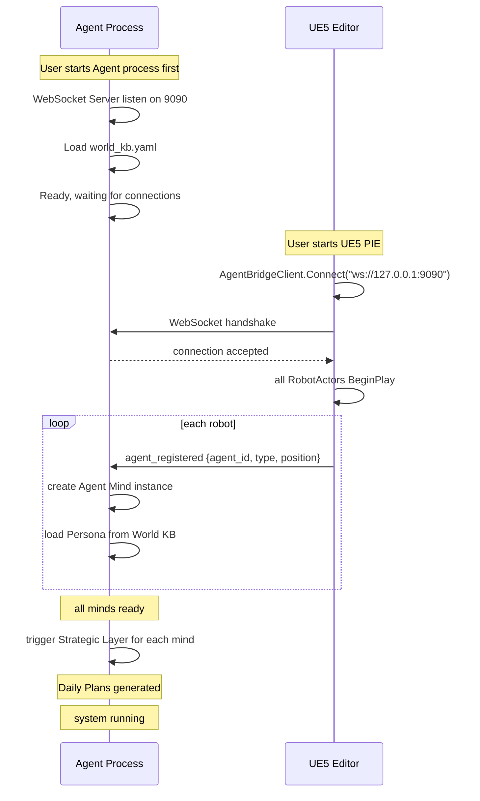
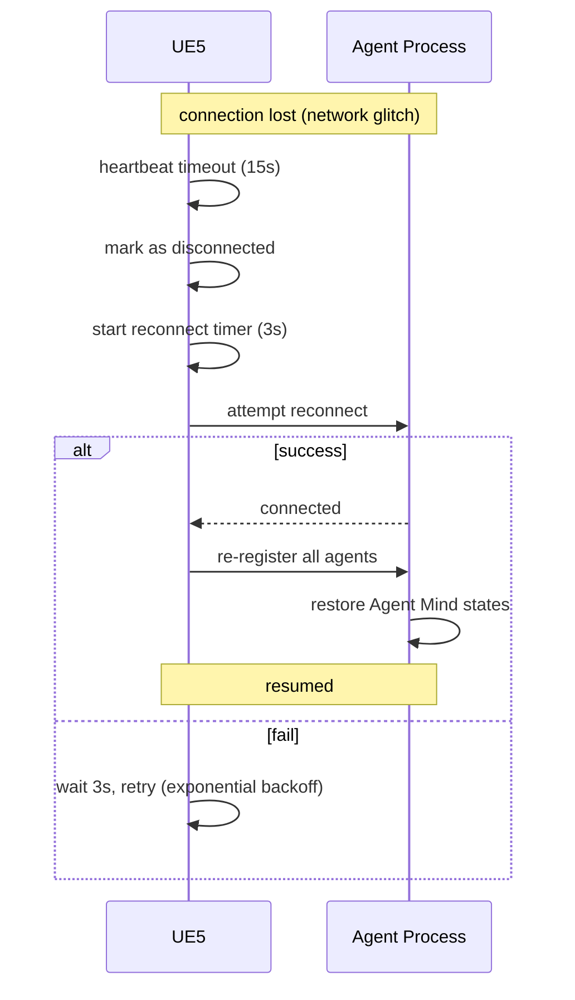
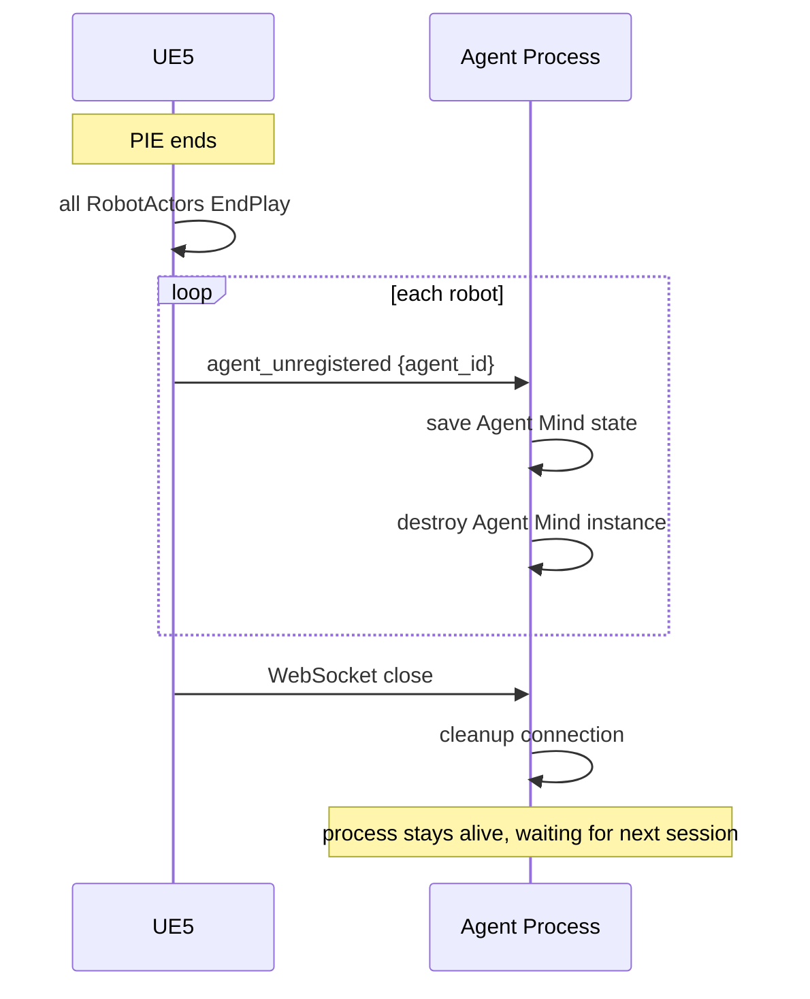

# Agent Town 通信协议与数值系统设计

> 本文档定义 UE5 进程与 Agent 进程之间的通信架构、消息协议、数值归属与同步机制。
> 作为 `AgentTown_Design.md` 和 `AgentTown_Core_DeepDive.md` 的补充。

---

## 目录

1. [通信架构](#一通信架构)
2. [消息协议规范](#二消息协议规范)
3. [数值系统设计](#三数值系统设计)
4. [连接生命周期](#四连接生命周期)
5. [错误处理与容错](#五错误处理与容错)

---

## 一、通信架构

### 1.1 核心原则：单连接 + agent_id 路由

UE5 进程与 Agent 进程之间**只有一条 WebSocket 连接**，所有机器人的消息复用这条连接，靠 `agent_id` 字段区分归属。



### 1.2 为什么单连接

| 维度 | 多连接（每 Agent 一条） | 单连接 + agent_id（推荐）✅ |
|------|------------------------|----------------------------|
| 连接管理 | 10 个连接分别保活、重连 | 1 个连接，简单 |
| UE 侧复杂度 | 每个 RobotActor 各自管 WS | 全局一个 Client，统一收发 |
| Agent 侧复杂度 | 管理多个 WS 端点 | 1 个 Server，内部路由 |
| 断线恢复 | 任一断了单独处理 | 1 条断了统一重连 + 全量同步 |
| World Director | 要和多连接通信 | 和 Router 通信，简单 |
| 广播效率 | 发给 N 个连接各一次 | Router 内部广播，一次完成 |
| 资源消耗 | N 条 TCP 连接 | 1 条 TCP 连接 |
| 调试 | 多条日志流 | 1 条日志流，时序清晰 |

### 1.3 UE 侧组件

#### AgentBridgeClient（全局单例）

| 项 | 说明 |
|---|------|
| 类型 | `UEngineSubsystem` 或 `UGameInstanceSubsystem` |
| 职责 | 管理 WebSocket 连接、收发消息、路由到 RobotAgentComponent |
| 生命周期 | UE 启动时创建，整个游戏期间常驻 |

**核心接口**：

```cpp
class UAgentBridgeClient : public UEngineSubsystem
{
public:
    // 连接管理
    void Connect(const FString& Url = "ws://127.0.0.1:9090");
    void Disconnect();
    bool IsConnected() const;

    // 发送消息
    void SendMessage(const FString& Json);

    // Agent 注册（RobotAgentComponent 调用）
    void RegisterAgent(const FString& AgentId, URobotAgentComponent* Comp);
    void UnregisterAgent(const FString& AgentId);

    // 收到消息的回调
    void OnMessageReceived(const FString& Json);

private:
    // agent_id -> RobotAgentComponent 映射
    TMap<FString, URobotAgentComponent*> AgentRegistry;

    // WebSocket 实例
    TSharedPtr<IWebSocket> WebSocket;
};
```

#### AgentRegistry 注册流程



### 1.4 Agent 侧组件

#### WebSocket Server

| 项 | 说明 |
|---|------|
| 职责 | 监听端口、接受连接、收发原始 JSON |
| 实现 | 语言无关（可用任意 WebSocket 库） |

#### Message Router

| 项 | 说明 |
|---|------|
| 职责 | 解析消息 type + agent_id，分发给对应处理器 |
| 输入 | 原始 JSON |
| 输出 | 分发到 Agent Mind / World Director / 回传 UE |

**路由规则**：

| 消息方向 | type | 路由目标 |
|----------|------|----------|
| UE → Agent | `perception_update` | 按 agent_id → 对应 Agent Mind |
| UE → Agent | `action_completed` | 按 agent_id → 对应 Agent Mind |
| UE → Agent | `agent_registered` | → Agent Manager（创建新 Agent Mind） |
| UE → Agent | `agent_unregistered` | → Agent Manager（销毁 Agent Mind） |
| Agent → UE | `action_command` | 按 agent_id → UE 侧对应 RobotAgentComponent |
| Agent → UE | `stop_action` | 按 agent_id → UE 侧对应 RobotAgentComponent |
| Director → Agent | `event_notification` | 按 agent_id → 对应 Agent Mind（内部内存路由，不走网络） |

### 1.5 广播机制



**关键**：Agent 进程内部的路由是内存操作。只有 UE ↔ Agent 之间才走那一条 WebSocket。

---

## 二、消息协议规范

### 2.1 统一消息封装

所有消息共用外层结构：

```json
{
  "msg_id": "uuid-550e8400-e29b-41d4-a716-446655440000",
  "timestamp": 1719456000,
  "type": "message_type",
  "agent_id": "H-01",
  "payload": { ... }
}
```

| 字段 | 类型 | 必填 | 说明 |
|------|------|------|------|
| msg_id | string (UUID) | ✅ | 消息唯一 ID，用于去重和追踪 |
| timestamp | int (Unix epoch) | ✅ | 发送时间戳（秒） |
| type | string | ✅ | 消息类型（见下表） |
| agent_id | string | ✅ | 所属 Agent ID（如 "H-01"） |
| payload | object | ✅ | 消息体，结构因 type 而异 |

### 2.2 消息类型总表

| type | 方向 | 用途 | 触发时机 |
|------|------|------|----------|
| `perception_update` | UE → Agent | 感知快照上报 | 每 3 秒 / zone 变化 / 事件触发 |
| `action_command` | Agent → UE | 下发动作指令 | 战术层/反应层产出新 action |
| `action_completed` | UE → Agent | 动作完成回调 | MoveTo 完成 / StateTree 完成 |
| `stop_action` | Agent → UE | 停止当前动作 | 反应层决定打断 |
| `event_notification` | Agent → Agent | 事件通知（内部路由） | Director 投放事件 |
| `state_report` | UE → Agent | 物理状态上报 | 随 perception_update 或独立上报 |
| `agent_registered` | UE → Agent | 机器人上线 | RobotActor BeginPlay |
| `agent_unregistered` | UE → Agent | 机器人下线 | RobotActor EndPlay |
| `heartbeat` | 双向 | 心跳保活 | 每 5 秒 |
| `error` | 双向 | 错误上报 | 异常情况 |

### 2.3 各消息详细定义

#### perception_update（UE → Agent）

```json
{
  "msg_id": "uuid-001",
  "timestamp": 1719456000,
  "type": "perception_update",
  "agent_id": "H-01",
  "payload": {
    "location": {
      "position": [170.5, 100.0, 0.0],
      "rotation": [0.0, 0.0, 90.0],
      "current_zone": "central_plaza",
      "current_location": null
    },
    "physical_state": {
      "energy": 45,
      "fatigue": 65,
      "joint_wear": 82,
      "health": 90
    },
    "visible_agents": [
      {
        "id": "H-02",
        "name": "小柯",
        "distance": 5.2,
        "angle": 30,
        "current_action": "idle"
      }
    ],
    "nearby_objects": [
      {
        "id": "workbench_01",
        "name": "工作台一号",
        "distance": 8.0,
        "state": "idle",
        "available_actions": ["assemble", "inspect"]
      }
    ],
    "audible_events": [
      {
        "type": "broadcast",
        "source": "D-02",
        "content": "K-03 出事了"
      }
    ],
    "current_animation": "walk",
    "environment": {
      "time_of_day": "14:23",
      "weather": "clear"
    }
  }
}
```

| payload 字段 | 类型 | 说明 |
|--------------|------|------|
| location.position | [x,y,z] | UE5 世界坐标 |
| location.rotation | [pitch,yaw,roll] | 朝向 |
| location.current_zone | string/null | 当前所在 Zone ID |
| location.current_location | string/null | 当前最近 Location ID |
| physical_state | object | 物理状态（UE 是主人） |
| visible_agents | array | 视线内的其他 Agent |
| nearby_objects | array | 附近可交互 Smart Object |
| audible_events | array | 听到的声音/广播 |
| current_animation | string | 当前播放的动画 |
| environment | object | 环境信息 |

#### action_command（Agent → UE）

```json
{
  "msg_id": "uuid-002",
  "timestamp": 1719456005,
  "type": "action_command",
  "agent_id": "H-01",
  "action_id": "act_001",
  "payload": {
    "cmd": "MoveTo",
    "params": {
      "dest": [160.0, 100.0, 0.0],
      "speed": "walk"
    }
  }
}
```

**cmd 类型与 params 对应**：

| cmd | params | 说明 |
|-----|--------|------|
| `MoveTo` | {dest: [x,y,z], speed: "walk"\|"run"} | 原子：移动到坐标 |
| `TurnTo` | {target: agent_id} 或 {direction: [dx,dy,dz]} | 原子：转向 |
| `PlayAnimation` | {anim_id: string, duration: float} | 原子：播动画 |
| `Speak` | {content: string, target: agent_id, audio_url: string} | 原子：说话 |
| `Emote` | {emotion: "happy"\|"sad"\|"worried"\|...} | 原子：情绪表达 |
| `Wait` | {duration_sec: float} | 原子：等待 |
| `InteractSmartObject` | {object_id: string, action: string} | 原子：交互物件 |
| `ExecuteComposite` | {name: string, params: {...}} | 复合：启动 StateTree |
| `Stop` | {} | 停止当前所有动作 |

**ExecuteComposite 示例**：

```json
{
  "cmd": "ExecuteComposite",
  "params": {
    "name": "work_assemble",
    "target": "workbench_01",
    "duration_sec": 18000
  }
}
```

#### action_completed（UE → Agent）

```json
{
  "msg_id": "uuid-003",
  "timestamp": 1719456035,
  "type": "action_completed",
  "agent_id": "H-01",
  "action_id": "act_001",
  "payload": {
    "result": "success",
    "duration_ms": 30200,
    "progress": 1.0,
    "details": {}
  }
}
```

| result 值 | 说明 |
|-----------|------|
| `success` | 正常完成 |
| `failed` | 执行失败（如寻路不可达） |
| `interrupted` | 被 stop_action 打断 |
| `error` | 异常错误 |

**interrupted 时带 progress**：

```json
{
  "result": "interrupted",
  "progress": 0.6,
  "details": {
    "reason": "stop_action received",
    "completed_steps": ["MoveTo", "TurnTo"],
    "interrupted_at_step": "PlayAssembleLoop"
  }
}
```

#### stop_action（Agent → UE）

```json
{
  "msg_id": "uuid-004",
  "timestamp": 1719456040,
  "type": "stop_action",
  "agent_id": "H-01",
  "payload": {
    "action_id": "act_010",
    "reason": "interrupted_by_event"
  }
}
```

#### event_notification（Agent 内部路由）

```json
{
  "msg_id": "uuid-005",
  "timestamp": 1719456045,
  "type": "event_notification",
  "agent_id": "H-03",
  "payload": {
    "event_id": "evt_001",
    "event": {
      "type": "malfunction",
      "target": "K-03",
      "location": "archive_entrance",
      "severity": 7,
      "description": "K-03 关节锁死",
      "source": "director",
      "narrative_purpose": "推进 H-03 关怀 K-03 的情感线"
    },
    "perception_level": "direct"
  }
}
```

| perception_level | 说明 |
|------------------|------|
| `direct` | 直接感知（视觉/听觉范围内） |
| `broadcast` | 全园区广播（severity > 5） |
| `rumor` | 二手传闻（对话中得知） |

#### state_report（UE → Agent，可选独立上报）

```json
{
  "msg_id": "uuid-006",
  "timestamp": 1719456050,
  "type": "state_report",
  "agent_id": "H-01",
  "payload": {
    "physical_state": {
      "energy": 20,
      "fatigue": 70,
      "joint_wear": 85,
      "health": 85
    },
    "current_task_progress": {
      "action_id": "act_010",
      "progress": 0.6
    }
  }
}
```

**说明**：通常 `physical_state` 随 `perception_update` 一起上报。当需要独立、高频上报物理状态时用此消息。

#### agent_registered（UE → Agent）

```json
{
  "msg_id": "uuid-007",
  "timestamp": 1719456055,
  "type": "agent_registered",
  "agent_id": "H-01",
  "payload": {
    "agent_type": "humanoid",
    "ue5_ref": "BP_HumanoidRobot_H01",
    "initial_position": [100.0, 100.0, 0.0],
    "initial_zone": "central_plaza"
  }
}
```

**Agent 侧收到后**：创建对应的 Agent Mind 实例，加载 Persona。

#### agent_unregistered（UE → Agent）

```json
{
  "msg_id": "uuid-008",
  "timestamp": 1719456060,
  "type": "agent_unregistered",
  "agent_id": "H-01",
  "payload": {
    "reason": "actor_destroyed"
  }
}
```

**Agent 侧收到后**：保存 Agent Mind 状态，销毁实例。

#### heartbeat（双向）

```json
{
  "msg_id": "uuid-009",
  "timestamp": 1719456065,
  "type": "heartbeat",
  "agent_id": "system",
  "payload": {
    "uptime_sec": 3600
  }
}
```

**说明**：每 5 秒互发一次，超时 15 秒无响应视为断线。

#### error（双向）

```json
{
  "msg_id": "uuid-010",
  "timestamp": 1719456070,
  "type": "error",
  "agent_id": "H-01",
  "payload": {
    "error_code": "ACTION_FAILED",
    "message": "MoveTo destination unreachable",
    "action_id": "act_001",
    "context": {
      "dest": [160.0, 100.0, 0.0]
    }
  }
}
```

---

## 三、数值系统设计

### 3.1 数值分类与归属



### 3.2 归属原则

**谁产生这个数值，谁就是主人，谁负责存储和变更。**

| 数值类别 | 主人 | 存储位置 | 变更触发 | UE 是否需要 | 同步方式 |
|----------|------|----------|----------|-------------|----------|
| **Agent 内部状态**（mood/social_need/emotion） | Agent | Agent Mind 内存 | LLM 反思 / 交互后判断 | ❌ 不需要 | 不同步 |
| **物理持久状态**（energy/fatigue/joint_wear/health） | UE | RobotStateComponent | 行为消耗 / 充电恢复 | ✅ 主人 | 上报给 Agent |
| **关系数值**（familiarity/affection） | Agent | 关系服务 | 交互后 LLM 判断更新 | ❌ 不需要 | 不同步 |
| **空间状态**（position/zone） | UE | Actor Transform / ZoneTrigger | 每帧 / Overlap 触发 | ✅ 主人 | 上报给 Agent |
| **任务状态**（plan/queue/stack） | Agent | Agent Mind 内存 | 分层思考产出 | ❌ 不需要 | 不同步 |

### 3.3 为什么这样划分

#### Agent 内部状态 → Agent 侧管

**例子**：老陈的 `mood = "worried"`，`social_need = 85`

- **怎么变**：LLM 反思后更新"今天 K-03 出事了，我很担心" → mood 变 worried；长时间没说话 → social_need 上升
- **UE 需要吗**：不需要。UE 只管播动画。Agent 想表现心情时，发 `emote(worried)` 指令，UE 播对应动画
- **同步**：不同步。Agent 侧自己存自己管

#### 物理持久状态 → UE 侧管

**例子**：老陈的 `joint_wear = 82`，`energy = 45`

- **怎么变**：走路 → 关节磨损 +0.1（UE 每秒累积）；装配 → 能量下降（StateTree 里扣）；充电 → 能量上升（Smart Object 逻辑）
- **Agent 需要吗**：需要，但不是实时。Agent 定期从 UE 拉取，作为 LLM 决策输入
- **同步**：UE 是主人，随 `perception_update` 上报

#### 关系数值 → Agent 侧管

**例子**：老陈和小柯的 `familiarity = 40, affection = 20`

- **怎么变**：两人对话 → LLM 判断"增进了了解" → familiarity +5；小柯帮老陈干活 → affection +10
- **UE 需要吗**：不需要。关系只影响 Agent 决策，不影响 UE 动画
- **同步**：不同步。Agent 侧自己存自己管

### 3.4 数值完整归属表

| 数值 | 类型 | 主人 | 存储位置 | 变更触发 | UE 需要 | 同步方式 |
|------|------|------|----------|----------|---------|----------|
| mood | 内部 | Agent | Agent Mind | LLM 反思 | ❌ | 不同步 |
| social_need | 内部 | Agent | Agent Mind | 定时增长/交互减少 | ❌ | 不同步 |
| current_emotion | 内部 | Agent | Agent Mind | LLM 决策产出 | ❌ | 不同步 |
| energy | 物理 | UE | RobotStateComponent | 行为消耗/充电恢复 | ✅ 主人 | perception_update 上报 |
| fatigue | 物理 | UE | RobotStateComponent | 持续工作累积 | ✅ 主人 | perception_update 上报 |
| joint_wear | 物理 | UE | RobotStateComponent | 移动/重体力累积 | ✅ 主人 | perception_update 上报 |
| health | 物理 | UE | RobotStateComponent | 事故/修理 | ✅ 主人 | perception_update 上报 |
| familiarity | 关系 | Agent | 关系服务 | 交互后 LLM 更新 | ❌ | 不同步 |
| affection | 关系 | Agent | 关系服务 | 交互后 LLM 更新 | ❌ | 不同步 |
| relationship_type | 关系 | Agent | 关系服务 | LLM 判断更新 | ❌ | 不同步 |
| position | 空间 | UE | Actor Transform | 每帧 | ✅ 主人 | perception_update 上报 |
| rotation | 空间 | UE | Actor Transform | 每帧 | ✅ 主人 | perception_update 上报 |
| current_zone | 空间 | UE | ZoneTrigger | Overlap 触发 | ✅ 主人 | perception_update 上报 |
| current_location | 空间 | UE | 就近查询 | 位置变化时 | ✅ 主人 | perception_update 上报 |
| daily_plan | 任务 | Agent | Agent Mind | 战略层产出 | ❌ | 不同步 |
| action_queue | 任务 | Agent | Agent Mind | 战术层产出 | ❌ | 不同步 |
| current_action | 任务 | Agent | Agent Mind | 执行层更新 | ❌ | 不同步 |
| task_stack | 任务 | Agent | Agent Mind | 打断时 push / 恢复时 pop | ❌ | 不同步 |

### 3.5 数据流图



### 3.6 数值怎么影响决策（完整例子）

**场景**：老陈能量低 + 关节磨损高 → 决定提前休息



### 3.7 World Director 怎么用这些数值

Director 需要全局视角，它要知道所有 Agent 状态才能决定"该不该投放事件"。



**Director 怎么拿到数值**：
- 每个 Agent Mind 定期（或状态变化时）向 Director 上报摘要
- Director 的 World Monitor 汇总所有 Agent 状态
- Director LLM 基于这些数据判断"K-03 关节磨损 82，该触发故障了"

**UE 侧参与吗**：不参与。Director 只和 Agent Minds 通信（进程内部）。

---

## 四、连接生命周期

### 4.1 启动顺序



### 4.2 重连机制



**重连后的状态同步**：
- UE 侧重新发送所有 `agent_registered`
- Agent 侧根据 `agent_id` 匹配已有 Agent Mind（如果还在内存）
- Agent 侧向 UE 请求当前所有 Agent 的 `state_report`（物理状态）
- 恢复正常通信

### 4.3 关闭流程



---

## 五、错误处理与容错

### 5.1 错误类型与处理

| 错误场景 | 检测方 | 处理方式 |
|----------|--------|----------|
| WebSocket 断线 | 双方（心跳超时） | UE 侧自动重连；Agent 侧保留 Agent Mind 状态 5 分钟 |
| Agent 进程崩溃 | UE 侧（断线） | UE 侧机器人进入"待机动画"，等待重连 |
| UE5 崩溃 | Agent 侧（断线） | Agent 侧保存状态，等待 UE 重连 |
| LLM 调用失败 | Agent 侧 | 重试 3 次 → 降级到本地小模型 → 返回默认行为（idle） |
| MoveTo 不可达 | UE 侧 | 发 `action_completed {result: failed}` → Agent 重新决策 |
| StateTree 执行错误 | UE 侧 | 发 `error` 消息 → Agent 重新决策 |
| Agent Mind 内部异常 | Agent 侧 | 记录日志 → 该 Agent 进入 safe mode（只 idle） |
| 消息格式错误 | 接收方 | 丢弃 + 发 `error` 消息回報 |

### 5.2 超时机制

| 操作 | 超时时间 | 超时后行为 |
|------|----------|------------|
| action_completed 等待 | 60 秒 | Agent 侧认为动作卡死，发 stop_action + 重新决策 |
| LLM 调用 | 10 秒 | 重试 → 降级 |
| 心跳响应 | 15 秒 | 认为断线 |
| 重连尝试 | 3 秒间隔，指数退避到 30 秒 | 持续重试 |

### 5.3 安全模式

当 Agent Mind 出现严重错误时，进入安全模式：

```
安全模式下 Agent Mind 行为：
  1. 不再调用 LLM
  2. 只发送 idle 指令给 UE
  3. 持续上报感知
  4. 等待管理员介入或自动恢复
```

UE 侧收到 `idle` 后播放待机动画，机器人不会完全卡死。

---

## 六、总结

### 通信架构核心

| 项 | 答案 |
|---|------|
| 连接数 | 1 条 WebSocket |
| 路由方式 | 消息带 `agent_id`，双方按 ID 路由 |
| UE 侧管理 | `AgentBridgeClient`（全局单例）+ `AgentRegistry` |
| Agent 侧管理 | WebSocket Server + Message Router |
| 广播 | Agent 进程内部内存操作，不走网络 |

### 数值系统核心

| 项 | 答案 |
|---|------|
| 原则 | 谁产生谁管 |
| 物理数值 | UE 是主人，随 perception_update 上报 |
| 心理/关系数值 | Agent 是主人，不同步 |
| 任务状态 | Agent 是主人，不同步 |
| Director 获取全局状态 | Agent Minds 定期上报（进程内部） |

### 设计原则

1. **单连接 + agent_id 路由**：简化连接管理，便于调试
2. **消息统一封装**：msg_id + timestamp + type + agent_id + payload
3. **数值归属清晰**：物理 UE 管，心理 Agent 管，不交叉
4. **单向数据流**：UE → Agent（perception），Agent → UE（action）
5. **容错优先**：断线重连、超时降级、安全模式
6. **可观测**：每条消息有 msg_id，可追踪完整链路

---

*本文档定义了 Agent Town 的通信协议与数值系统，作为实现的契约依据。*
