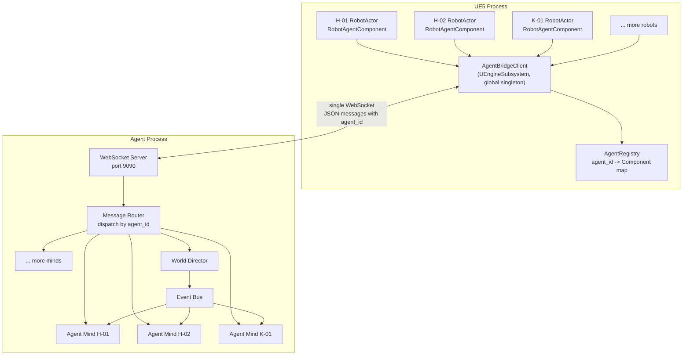
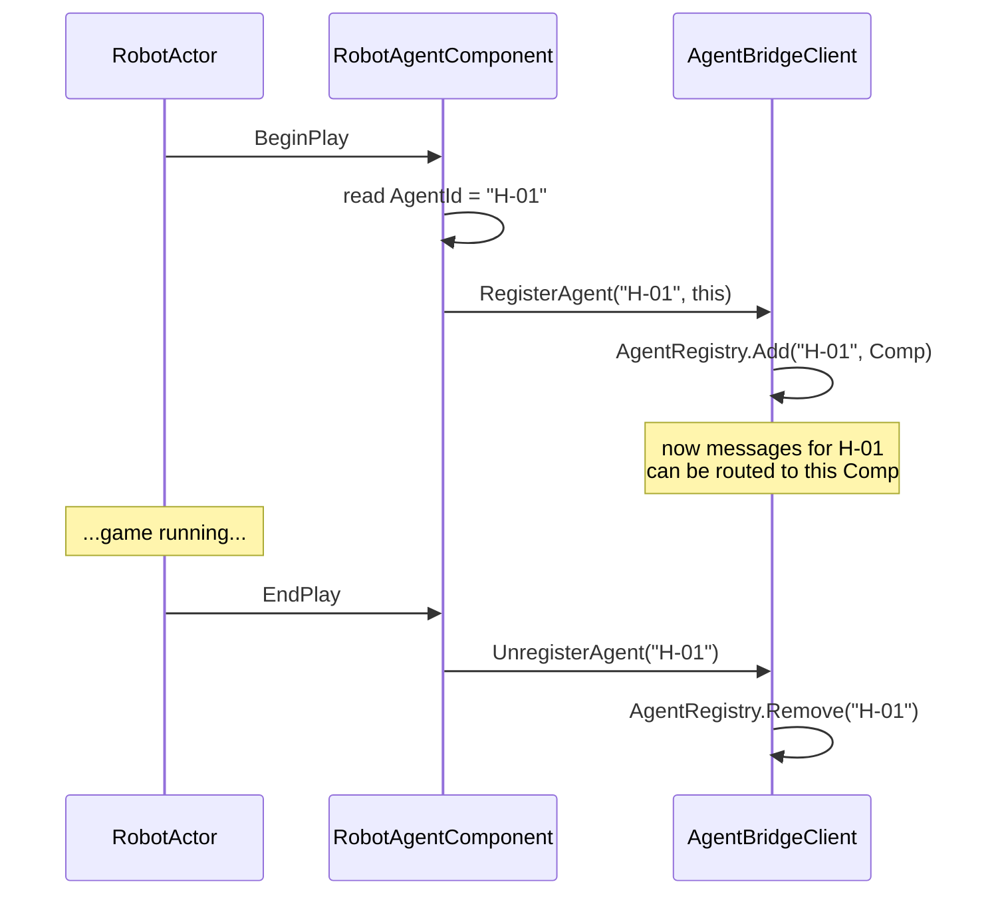
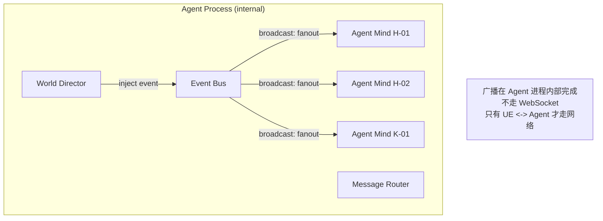
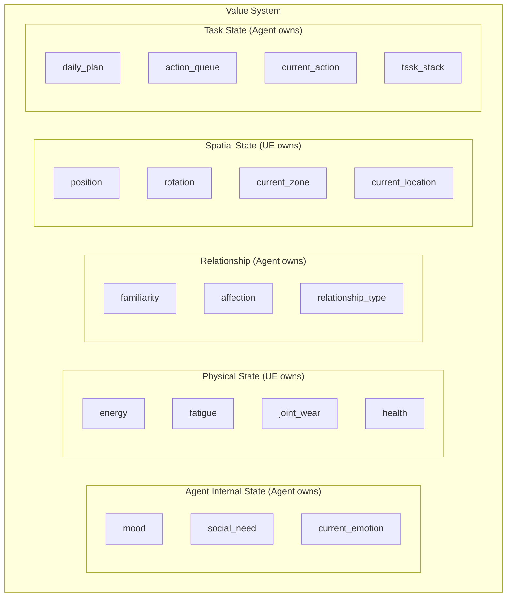
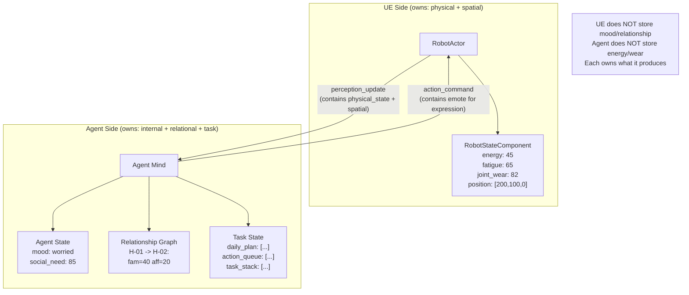
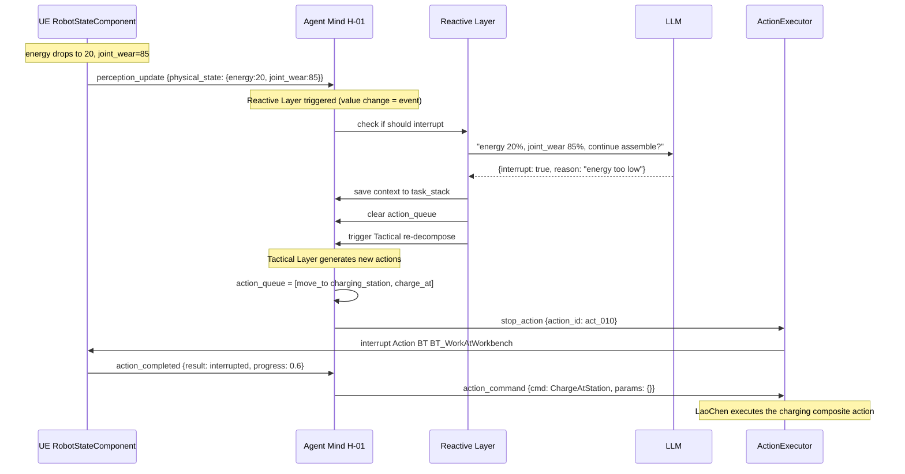
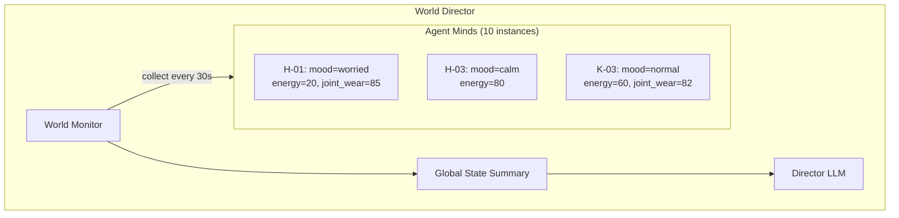
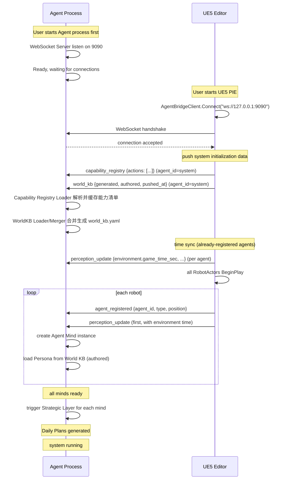
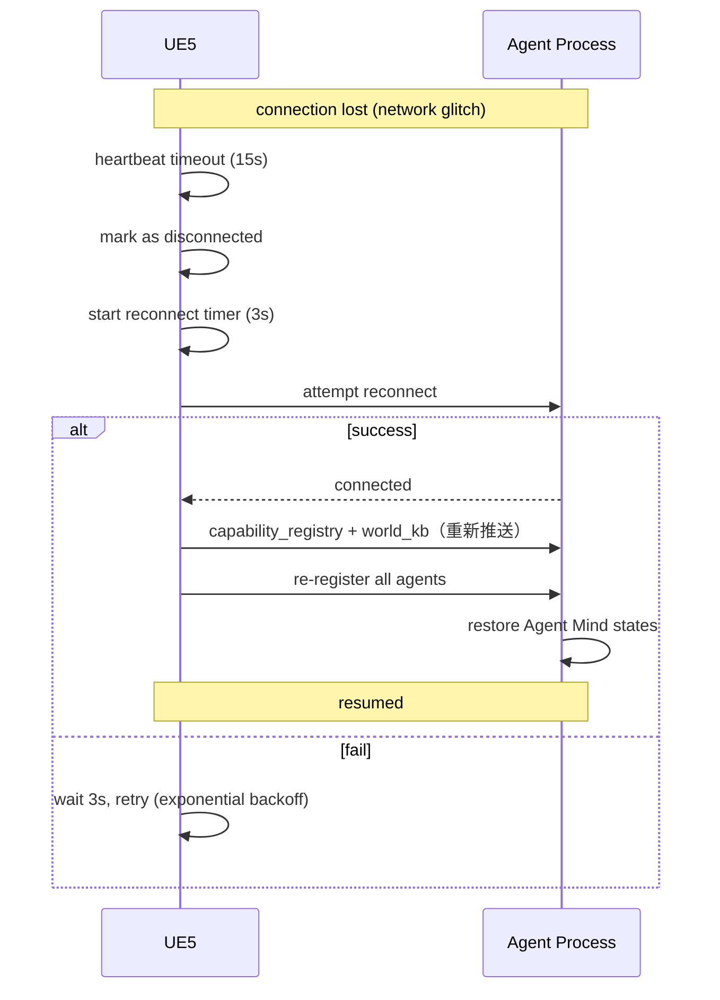
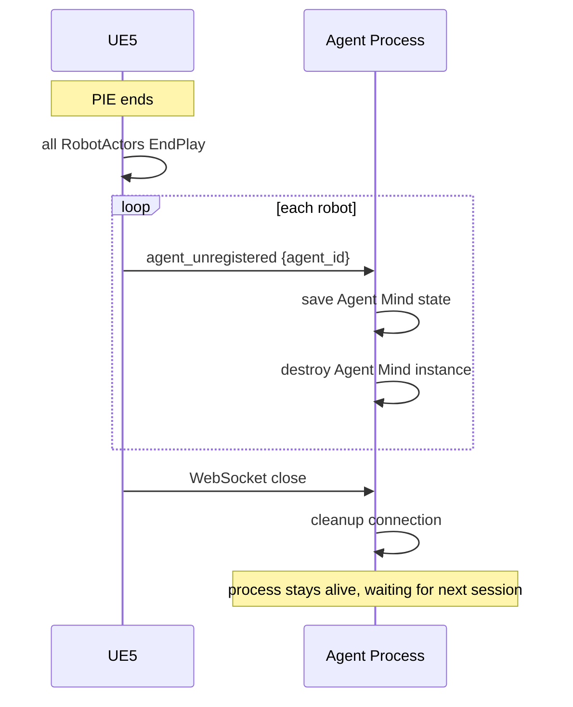

# Agent Town 通信协议与数值系统设计

> 本文档定义 UE5 进程与 Agent 进程之间的通信架构、消息协议、数值归属与同步机制。
> 作为 `AgentTown_Design.md` 和 `AgentTown_Core_DeepDive.md` 的补充。

---

## 目录

1. [通信架构](#一通信架构)
2. [消息协议规范](#二消息协议规范)
3. [数值系统设计](#三数值系统设计)
4. [连接生命周期](#四连接生命周期)
5. [错误处理与容错](#五错误处理与容错)
6. [总结](#六总结)

---

## 一、通信架构

### 1.1 核心原则：单连接 + agent_id 路由

UE5 进程与 Agent 进程之间**只有一条 WebSocket 连接**，所有机器人的消息复用这条连接，靠 `agent_id` 字段区分归属。



### 1.2 为什么单连接

| 维度 | 多连接（每 Agent 一条） | 单连接 + agent_id（推荐）✅ |
|------|------------------------|----------------------------|
| 连接管理 | 10 个连接分别保活、重连 | 1 个连接，简单 |
| UE 侧复杂度 | 每个 RobotActor 各自管 WS | 全局一个 Client，统一收发 |
| Agent 侧复杂度 | 管理多个 WS 端点 | 1 个 Server，内部路由 |
| 断线恢复 | 任一断了单独处理 | 1 条断了统一重连 + 全量同步 |
| World Director | 要和多连接通信 | 和 Router 通信，简单 |
| 广播效率 | 发给 N 个连接各一次 | Router 内部广播，一次完成 |
| 资源消耗 | N 条 TCP 连接 | 1 条 TCP 连接 |
| 调试 | 多条日志流 | 1 条日志流，时序清晰 |

### 1.3 UE 侧组件

#### AgentBridgeClient（全局单例）

| 项 | 说明 |
|---|------|
| 类型 | `UEngineSubsystem` 或 `UGameInstanceSubsystem` |
| 职责 | 管理 WebSocket 连接、收发消息、路由到 RobotAgentComponent |
| 生命周期 | UE 启动时创建，整个游戏期间常驻 |

**核心接口**：

```cpp
class UAgentBridgeClient : public UEngineSubsystem
{
public:
    // 连接管理
    void Connect(const FString& Url = "ws://127.0.0.1:9090");
    void Disconnect();
    bool IsConnected() const;

    // 发送消息
    void SendMessage(const FString& Json);

    // Agent 注册（RobotAgentComponent 调用）
    void RegisterAgent(const FString& AgentId, URobotAgentComponent* Comp);
    void UnregisterAgent(const FString& AgentId);

    // 收到消息的回调
    void OnMessageReceived(const FString& Json);

private:
    // agent_id -> RobotAgentComponent 映射
    TMap<FString, URobotAgentComponent*> AgentRegistry;

    // WebSocket 实例
    TSharedPtr<IWebSocket> WebSocket;
};
```

#### AgentRegistry 注册流程



### 1.4 Agent 侧组件

#### WebSocket Server

| 项 | 说明 |
|---|------|
| 职责 | 监听端口、接受连接、收发原始 JSON |
| 实现 | 语言无关（可用任意 WebSocket 库） |

#### Message Router

| 项 | 说明 |
|---|------|
| 职责 | 解析消息 type + agent_id，分发给对应处理器 |
| 输入 | 原始 JSON |
| 输出 | 分发到 Agent Mind / World Director / 回传 UE |

**路由规则**：

| 消息方向 | type | 路由目标 |
|----------|------|----------|
| UE → Agent | `perception_update` | 按 agent_id → 对应 Agent Mind |
| UE → Agent | `action_started` | 按 agent_id → 对应 Agent Mind |
| UE → Agent | `action_completed` | 按 agent_id → 对应 Agent Mind |
| UE → Agent | `state_report` | 按 agent_id → 对应 Agent Mind |
| UE → Agent | `agent_registered` | → Agent Manager（创建新 Agent Mind） |
| UE → Agent | `agent_unregistered` | → Agent Manager（销毁 Agent Mind） |
| UE → Agent | `capability_registry` | `agent_id="system"` → Capability Registry Loader（更新能力清单） |
| UE → Agent | `world_kb` | `agent_id="system"` → WorldKB Loader / Merger（更新世界认知） |
| Agent → UE | `action_command` | 按 agent_id → UE 侧对应 RobotAgentComponent |
| Agent → UE | `stop_action` | 按 agent_id → UE 侧对应 RobotAgentComponent |
| Director → Agent | `event_notification` | 按 agent_id → 对应 Agent Mind（内部内存路由，不走网络） |

### 1.5 广播机制



**关键**：Agent 进程内部的路由是内存操作。只有 UE ↔ Agent 之间才走那一条 WebSocket。

---

## 二、消息协议规范

### 2.1 统一消息封装

所有消息共用外层结构（**信封字段固定为以下 7 个，任何业务字段一律放入 `payload`**）：

```json
{
  "version": "1.0",
  "msg_id": "550e8400-e29b-41d4-a716-446655440000",
  "seq": 1024,
  "timestamp": 1719456000000,
  "type": "message_type",
  "agent_id": "H-01",
  "payload": { ... }
}
```

| 字段 | 类型 | 必填 | 说明 |
|------|------|------|------|
| version | string | ✅ | 协议版本号，当前 `"1.0"`，用于演进兼容 |
| msg_id | string (UUID) | ✅ | 消息唯一 ID，用于去重和追踪 |
| seq | int | ✅ | 同一发送端的单调递增序列号，用于检测乱序/丢失（重连后尤其有用） |
| timestamp | int (Unix epoch **毫秒**) | ✅ | 发送时间戳（**毫秒**，全协议统一毫秒） |
| type | string | ✅ | 消息类型（见下表） |
| agent_id | string | ✅ | 所属 Agent ID（如 "H-01"）；系统级消息用保留 ID `"system"` |
| payload | object | ✅ | 消息体，结构因 type 而异；**所有业务字段（含 action_id）必须在此** |

> **约定 1（信封纯净）**：`action_id` 等业务字段**一律放入 payload**，不得出现在信封顶层。
> **约定 2（时间单位）**：全协议所有时间戳单位为**毫秒**；所有时长字段以字段名后缀标注单位（`_ms` / `_sec`）。
> **约定 3（坐标单位）**：所有坐标（position/dest 等）单位为 **UE5 厘米（cm）**，与 UE 世界坐标一致；三元组顺序为 `[X, Y, Z]`，旋转为 `[Pitch, Yaw, Roll]`（度）。
> **约定 4（保留 ID）**：`agent_id = "system"` 为保留值，仅用于 `heartbeat` / `error` 等非特定 Agent 的系统级消息。

### 2.2 消息类型总表

| type | 方向 | 用途 | 触发时机 |
|------|------|------|----------|
| `perception_update` | UE → Agent | 感知快照上报（**含空间状态；物理状态仅在变化超阈值时附带**） | 每 3 秒 / zone 变化 / 事件触发 |
| `action_command` | Agent → UE | 下发动作指令 | 战术层/反应层产出新 action |
| `action_started` | UE → Agent | **动作已接收并开始执行的回执（ACK）** | UE 收到 action_command 并成功启动后立即回 |
| `action_completed` | UE → Agent | 动作完成回调 | 原子 Action BT / 复合 Action BT 完成 |
| `stop_action` | Agent → UE | 停止当前动作 | 反应层决定打断 |
| `scan_area` | Agent → UE | 请求即时感知推送（携带 scan_id 关联响应） | scan_area 工具调用时，触发一次即时 perception_update |
| `event_notification` | Agent → Agent | 事件通知（内部路由） | Director 投放事件 |
| `state_report` | UE → Agent | 物理状态上报（**物理状态的权威通道**） | 状态变化超阈值 / 每 15 秒兜底 |
| `agent_registered` | UE → Agent | 机器人上线 | RobotActor BeginPlay |
| `agent_unregistered` | UE → Agent | 机器人下线 | RobotActor EndPlay |
| `heartbeat` | 双向 | 心跳保活 | 每 5 秒 |
| `error` | 双向 | 错误上报 | 异常情况 |
| `resync` | 双向 | 重连 seq 交换 | 重连后交换最后成功接收的 seq（详见 §4.2） |
| `event_lost` | Agent → UE | 缓冲滚动丢失告警 | 重连时缓冲已滚动超出对方请求的 seq（详见 §4.2） |
| `capability_registry` | UE → Agent | **Action 能力清单下发（数据驱动）** | 连接成功后自动推送（详见 §2.4） |
| `world_kb` | UE → Agent | **世界知识库下发（generated + authored）** | 连接成功后自动推送（详见 §2.5） |

> **控制消息补充**：`scan_area`、`resync`、`event_lost` 为协议级控制消息，承载工具触发/重连协调逻辑，不属于 Agent-UE 的业务消息范畴。
>
> **系统初始化消息**：`capability_registry` 与 `world_kb` 是**连接成功后 UE 主动下发的系统级数据初始化消息**（`agent_id="system"`），在 Agent 进程准备就绪后首先送达，Agent 据此构建能力认知与世界认知。二者不期待 ACK 回执。

> **约定 5（感知 vs 状态分工，消除 #6 冗余）**：
> - `perception_update` 负责**空间与环境感知**（position/rotation/zone/visible_agents/nearby_objects/audible_events/environment），**默认不携带 physical_state**；仅当某项物理数值自上次上报变化 ≥ 阈值（energy/fatigue/health 变化 ≥5，joint_wear 变化 ≥1）时，在 perception_update 中附带该变化项。
> - `state_report` 是 **physical_state 的权威通道**：状态变化超阈值时即时上报，且每 15 秒做一次兜底全量上报，保证 Agent 侧物理状态不漂移。

### 2.3 各消息详细定义

#### perception_update（UE → Agent）

```json
{
  "version": "1.0",
  "msg_id": "uuid-001",
  "seq": 1001,
  "timestamp": 1719456000000,
  "type": "perception_update",
  "agent_id": "H-01",
  "payload": {
    "location": {
      "position": [170.5, 100.0, 0.0],
      "rotation": [0.0, 90.0, 0.0],
      "current_zone": "central_plaza",
      "current_location": null
    },
    "physical_state_delta": {
      "joint_wear": 82
    },
    "visible_agents": [
      {
        "id": "H-02",
        "name": "小柯",
        "distance": 5.2,
        "angle": 30,
        "current_action": "idle"
      }
    ],
    "nearby_objects": [
      {
        "id": "workbench_01",
        "name": "工作台一号",
        "distance": 8.0,
        "state": "idle",
        "available_interactions": ["assemble", "inspect"]
      }
    ],
    "audible_events": [
      {
        "type": "broadcast",
        "source": "D-02",
        "content": "K-03 出事了"
      }
    ],
    "current_animation": "walk",
    "current_emote": null,
    "environment": {
      "game_time_sec": 50400.0,
      "time_of_day_sec": 50400.0,
      "day_count": 0,
      "time_scale": 1.0,
      "weather": "clear"
    },
    "scan_id": "scan_001"
  }
}
```

| payload 字段 | 类型 | 说明 |
|--------------|------|------|
| location.position | [x,y,z] | UE5 世界坐标（**厘米**） |
| location.rotation | [pitch,yaw,roll] | 朝向（**度**） |
| location.current_zone | string/null | 当前所在 Zone ID |
| location.current_location | string/null | 当前最近 Location ID |
| physical_state_delta | object (可选) | **仅在物理数值变化超阈值时出现**，只含变化项；物理状态权威通道是 state_report |
| visible_agents | array | 视线内的其他 Agent |
| nearby_objects | array | 附近可交互 Smart Object |
| audible_events | array | 听到的声音/广播 |
| current_animation | string | 当前播放的动画 |
| current_emote | string/null | **当前正在表现的情绪状态**（持续型 emote 的回报，供 Agent 感知"我此刻的情绪表现"，解决 #4 情绪一致性） |
| environment | object | 环境信息（含**权威游戏时间**，见下） |
| scan_id | string (可选) | 用于关联 `scan_area` 请求与即时感知响应（仅即时扫描感知携带，常规定期感知为空） |

**environment 对象字段**：

| environment 字段 | 类型 | 说明 |
|------------------|------|------|
| game_time_sec | float | **权威游戏时间**（累计秒，DS 权威）。Agent 侧所有日程判断基于此值 |
| time_of_day_sec | float | 派生字段：`game_time_sec % 86400`，表示"现在几点"（当天秒数 0-86400），便于直接判断时段 |
| day_count | int | 派生字段：`floor(game_time_sec / 86400)`，第几天（从 0 开始） |
| time_scale | float | 时间倍速（如 60 = 游戏 1 秒 = 现实 1 分钟），Agent 侧据此换算"游戏内时长 ↔ 现实时长" |
| weather | string (可选) | 天气（未来扩展） |

> **约定 19（游戏时间权威，2026-08-04 新增）**：
> - **时间由 UE（DS）权威**，Agent 进程是**时间读取方**，不自行定义"现在几点"。
> - `game_time_sec` 是**唯一权威源**；`time_of_day_sec` / `day_count` 均为派生字段，Agent 无需重复计算，直接用即可。
> - Agent 侧日程（schedule）应基于 `time_of_day_sec` / `day_count` 生成（如"第 1 天 07:00 上班"），到点通过 `action_command` 触发对应行为。
> - **同步时机**：每次 `perception_update` 都携带 `environment`（默认每 3 秒一次）；**WebSocket 连接成功后 UE 会立即广播一次感知**，使 Agent 第一时间校准时钟。
> - **初始值**：`game_time_sec` 从 `UAgentBridgeSettings.StartGameTimeSec`（默认第 1 天 06:00 = 21600 秒）开始累加；`time_scale` 由 `UAgentBridgeSettings.TimeScale` 控制。
> - **时间语义是"计划点"而非"动作时长"**：Agent 的日程（如"07:00-12:00 上班"）描述的是"这段时间应该做某事"，对应 UE 侧的复合行为是**循环可中断**的（见约定 20），而非硬跑满时长。

#### action_command（Agent → UE）

```json
{
  "version": "1.0",
  "msg_id": "uuid-002",
  "seq": 2001,
  "timestamp": 1719456005000,
  "type": "action_command",
  "agent_id": "H-01",
  "payload": {
    "action_id": "act_001",
    "cmd": "MoveToLocation",
    "params": {
      "dest": [160.0, 100.0, 0.0],
      "speed": "walk"
    }
  }
}
```

> **注**：`action_id` 位于 payload 内（遵循约定1）。`action_id` 由 **Agent 侧生成并保证同一 agent 内唯一**，UE 侧原样回传于 action_started/action_completed。

**cmd 分类总览（数据驱动，能力清单自动下发）**：

> **Action 只分为两类：原子行为（Atomic Action）与复合行为（Composite Action）。是否带参数、目标是否移动，均属于动作输入特征，不再作为 Action 分类依据。**

| 分类 | 定义 | 主要用途 | 典型 cmd |
|------|------|----------|----------|
| **原子行为（Atomic）** | Agent 语义层中不可再拆分、且仍具独立意义的最小动作 | AI 临场反应、处理复合行为库未覆盖的特殊情况，也可作为复合行为 BT 的基础积木 | `MoveToLocation` / `MoveToAgent` / `TurnTo` / `Wait` / `InteractSmartObject` / `PlayMontage` / `Speak` / `Emote` |
| **复合行为（Composite）** | 提前设计、验证并注册的高层行为能力，内部通常由多个原子行为或其他子行为树组成 | AI 的常规首选能力；封装稳定的工作、社交、充电、巡逻、救援等完整流程 | `WorkAtWorkbench` / `WorkAtWorkshop` / `ChatWith` / `RepairTarget` / `ChargeAtStation` / `PatrolZone` |

**分类原则**：这里的“原子”是 **Agent 语义层原子**，不是 UE API 或 C++ 操作层原子。例如 `Speak` 在 UE 内部可能包含字幕、TTS、口型和动画，但对 Agent 而言“说这句话”仍是一个原子意图。

**参数原则**：原子行为和复合行为都可以有参数，也可以没有参数。`WorkAtWorkshop {}` 是无参数复合行为，`WorkAtWorkbench {target_object_id}` 是有参数复合行为；二者仍属于同一类别。

**协议兼容性**：分类信息属于能力描述元数据（`capability_registry` 中的 `kind` 字段），不新增信封字段，也不改变 `action_command.payload` 结构。UE 侧统一通过 `cmd → ActionBT` 配置表查找并运行行为树，无需为 Atomic / Composite 建立两套执行通道。

**cmd 详细定义（代表性能力）**：

> **重要：cmd 列表不是协议硬编码枚举，而是数据驱动的。** 实际可用 cmd 由 UE 侧全局 `DT_ActionBTMap`（`FActionBTTableRow` 数据表）配置，连接成功后通过 `capability_registry` 消息自动下发给 Agent 侧（见 §2.4）。下表仅列出框架内置的代表性原子/复合能力，项目可扩展。

| cmd | 分类 | params | 说明 |
|-----|------|--------|------|
| `MoveToLocation` | Atomic | {dest: [x,y,z], speed?: "walk"\|"run"} | 移动到静态坐标；Agent 侧 Translator 已完成坐标解析 |
| `MoveToAgent` | Atomic | {target_agent_id: string, speed?: "walk"\|"run", stop_distance?: float, keep_following?: bool} | 跟随动态 Agent；UE 侧运行时查 Actor |
| `TurnTo` | Atomic | {target_agent_id: string} 或 {direction: [dx,dy,dz]} | 转向目标 Agent 或指定方向 |
| `PlayMontage` | Atomic | {montage_id: string, wait_finish?: bool} | 播放已注册的蒙太奇 |
| `Speak` | Atomic | {content: string, target_agent_id?: string, audio_url?: string\|null} | 说话；目标为空表示公开表达（audio_url 见约定6） |
| `Emote` | Atomic | {emotion: string, mode: "oneshot"\|"sustained"} | 情绪表达（mode 见约定7） |
| `Wait` | Atomic | {duration_sec: float} | 原地等待 |
| `InteractSmartObject` | Atomic | {target_object_id: string, interaction: string} | 与 Smart Object 进行一次指定交互 |
| `WorkAtWorkbench` | Composite | {target_object_id: string, duration_sec?: float} | 去指定工作台并完成工作流程 |
| `WorkAtWorkshop` | Composite | {} | 去车间、选择可用工作台并执行例行工作 |
| `ChatWith` | Composite | {target_agent_id: string, topic?: string} | 接近目标、面对目标、对话并结束交流 |
| `RepairTarget` | Composite | {target_agent_id: string, tool_id?: string} | 接近、检查并修理指定机器人 |
| `ChargeAtStation` | Composite | {target_object_id?: string} | 选择或使用指定充电位，持续到满足结束条件 |
| `PatrolZone` | Composite | {target_zone: string, duration_sec?: float} | 进入区域并按区域策略巡逻 |

> **兼容性说明**：原 `MoveTo` cmd 已拆分为 `MoveToLocation`（静态目标坐标）和 `MoveToAgent`（动态目标跟随）。旧代码若使用 `MoveTo`，语义等同 `MoveToLocation`。
>
> 原 `ExecuteComposite` / `ExecuteRoutine` 不再承担 Action 分类职责。推荐直接使用具有明确业务语义的 cmd（如 `WorkAtWorkbench`、`WorkAtWorkshop`、`ChatWith`），并通过 Action Registry 的 `ActionKind=Composite` 标记类别。兼容期可将旧 cmd 保留为别名，但新能力不再按“是否带参数”拆成两种入口。

> **约定 6（Speak/TTS）**：`audio_url` 由 **Agent 侧预生成**（调用 TTS 服务后填入 URL）；若为 `null` 或 UE 侧拉取音频失败，UE **降级为纯字幕显示**，不阻塞动作。
> **约定 7（Emote 模式）**：`mode="oneshot"` 为一次性表情（播完即止）；`mode="sustained"` 为持续情绪状态（UE 保持该情绪表现，并在 perception_update 的 `current_emote` 回报，直到下一个 sustained emote 或显式清除）。
> **约定 13（目标解析责任）**：`params` 中目标类字段按**命名规范**区分静态/动态：
> - **静态目标**（Zone / Location / SmartObject）：Agent 侧 Translator 查 World KB 翻译成坐标，字段名用 `target_position: [x,y,z]` / `target_zone: <id>` / `target_object_id: <id>`。UE 侧直接使用，无需再查。
> - **动态目标**（Agent）：Agent 侧不解析位置，字段名用 `target_agent_id: "H-02"` / `follower_agent_id: <id>`。UE 侧通过 `AgentBridgeClient.FindAgentActor(id)` 运行时查 Actor，用 `MoveToActor` 自动跟随移动目标。
> - **失败处理**：UE 侧查不到 `target_agent_id` 对应 Actor → 回 `error {UNKNOWN_AGENT}`。

**约定 14（Action 组装与优先级）**：
>
> - Agent **优先使用复合行为**完成常规目标；只有复合行为库无法表达当前意图或需要临场反应时，才组合原子行为。
> - Agent 的战术计划可以混合编排 Atomic 与 Composite；通信层仍按 `action_id` **逐个串行派发**，每个动作收到 `action_completed` 后再派发下一项。
> - 复合 Action BT 内部可以组合原子 Task 或其他子行为树，但只有最外层、直接对应网络 `action_id` 的 Action BT 可以写 `ActionResult` / 执行 `BTTask_FinishAction`；内部子树只返回 BT 的 Succeeded / Failed。
> - 当某组原子行为被 Agent 高频重复组合时，应将其沉淀为新的复合行为，并注册到能力清单（`capability_registry`）。

**Atomic 示例：跟随动态目标**：

```json
{
  "action_id": "act_020",
  "cmd": "MoveToAgent",
  "params": {
    "target_agent_id": "H-02",
    "speed": "run",
    "stop_distance": 200.0,
    "keep_following": false
  }
}
```

> `target_agent_id="H-02"` 是动态目标。UE 侧运行时查 Actor，并随目标位置更新移动请求。

**Composite 示例：有参数的预设行为**：

```json
{
  "action_id": "act_021",
  "cmd": "WorkAtWorkbench",
  "params": {
    "target_object_id": "workbench_01",
    "duration_sec": 7200
  }
}
```

> UE 侧通过 Action Registry 将 `WorkAtWorkbench` 映射到对应 Action BT。行为树内部完成寻找交互点、移动、转向、交互与工作循环，Agent 不需要逐步下发原子操作。

**Composite 示例：无参数的预设行为**：

```json
{
  "action_id": "act_022",
  "cmd": "WorkAtWorkshop",
  "params": {}
}
```

> `WorkAtWorkshop` 自行选择可用工作台。它和有参数的 `WorkAtWorkbench` 同属 Composite，不再因是否带参数拆成不同 Action 类型。

**Agent 战术层混合组装示例（Agent 内部计划，不是单条 WebSocket 消息）**：

```json
[
  {
    "cmd": "WorkAtWorkbench",
    "params": {"target_object_id": "workbench_01", "duration_sec": 7200}
  },
  {
    "cmd": "Speak",
    "params": {"target_agent_id": "H-02", "content": "这批零件完成了，你来检查一下。"}
  },
  {
    "cmd": "ChargeAtStation",
    "params": {}
  }
]
```

> 该计划依次组合 Composite → Atomic → Composite。Agent 执行队列为每一项生成独立 `action_id`，收到上一项 `action_completed` 后再发送下一条 `action_command`。

#### capability_registry（UE → Agent，Action 能力清单下发）

> **用途**：WebSocket 连接成功后，UE **主动推送**当前全局 `DT_ActionBTMap` 中所有 Action 的能力清单。Agent 侧据此**自行拼接**可用 cmd 集合，无需手工维护能力表。新增/修改 Action 只需在 UE 数据表配置，重连后 Agent 自动获得最新能力。

```json
{
  "version": "1.0",
  "msg_id": "uuid-011",
  "seq": 1011,
  "timestamp": 1719456065000,
  "type": "capability_registry",
  "agent_id": "system",
  "payload": {
    "actions": [
      {
        "cmd": "MoveToLocation",
        "kind": "atomic",
        "description": "移动到静态坐标",
        "usage_hint": "需要到达某个位置时使用",
        "estimated_duration_sec": 10.0,
        "params": [
          {
            "name": "dest",
            "type": "vector",
            "required": true,
            "description": "目标世界坐标 [x,y,z]，单位为厘米",
            "default_value": "",
            "enum_values": []
          },
          {
            "name": "speed",
            "type": "enum",
            "required": false,
            "description": "移动速度档位",
            "default_value": "walk",
            "enum_values": ["walk", "run"]
          }
        ]
      },
      {
        "cmd": "WorkAtWorkbench",
        "kind": "composite",
        "description": "去指定工作台并完成工作流程",
        "usage_hint": "日常生产工作时使用",
        "estimated_duration_sec": 7200.0,
        "params": [
          {
            "name": "target_object_id",
            "type": "string",
            "required": true,
            "description": "目标工作台的 Smart Object ID",
            "default_value": "",
            "enum_values": []
          }
        ]
      }
    ]
  }
}
```

| payload 字段 | 类型 | 说明 |
|--------------|------|------|
| actions[].cmd | string | Action 指令名，对应 `action_command.payload.cmd` |
| actions[].kind | string | `"atomic"` \| `"composite"`（对应 `EActionKind`） |
| actions[].description | string | LLM 可读的动作描述 |
| actions[].usage_hint | string | LLM 可读的使用时机提示 |
| actions[].estimated_duration_sec | float | 预估执行时长，Agent 侧可作执行超时基准 |
| actions[].params[].name | string | 参数名，对应 `action_command.payload.params` 中的键 |
| actions[].params[].type | string | `"string"` \| `"number"` \| `"bool"` \| `"vector"` \| `"enum"` |
| actions[].params[].required | bool | 是否必填 |
| actions[].params[].description | string | 参数说明 |
| actions[].params[].default_value | string | 缺省值（字符串化） |
| actions[].params[].enum_values | array | 当 `type="enum"` 时的合法取值列表 |

> **约定 15（能力下发时机）**：`capability_registry` 与 `world_kb` 在 WebSocket 连接成功回调中，与 `heartbeat` 一并按序发送。Agent 侧应将其视为**初始化数据**，在首个业务决策前完成解析缓存。二者均为 `agent_id="system"` 的系统级消息，不期待 ACK。
>
> **约定 16（Action 参数 ↔ Blackboard 映射）**：`capability_registry` 中的 `params[]` 不包含 UE 内部实现细节（如 Blackboard 键名 `BBKey`）。UE 侧 `ActionExecutor` 依据 `FActionParamSpec` 中的 `BBKey` 配置，将 `action_command.payload.params` 的 JSON 值写入行为树 Blackboard，Agent 侧无需关心映射关系。

#### world_kb（UE → Agent，世界知识库下发）

> **用途**：WebSocket 连接成功后，UE **主动推送**两份世界知识库文件的内容：`world.generated.json`（UE 编辑器扫描导出，可覆盖）与 `world.authored.json`（人工维护，不被 UE 覆盖）。Agent 侧收到后自行合并生成 `world_kb.yaml` 作为规划、检索与 Context Builder 的统一输入。**传输的是文件内容（JSON 对象），而非文件路径**，Agent 无需访问 UE 文件系统。

```json
{
  "version": "1.0",
  "msg_id": "uuid-012",
  "seq": 1012,
  "timestamp": 1719456066000,
  "type": "world_kb",
  "agent_id": "system",
  "payload": {
    "pushed_at": "2026-07-31T09:02:00.000Z",
    "generated": {
      "$schema": "agenttown-world-generated/v1",
      "schema_version": "1.0",
      "generated_at": "2026-07-31T08:30:00.000Z",
      "generator": { "name": "AgentTownBridgeEditor", "version": "0.1.0" },
      "source": { "map_package": "/Game/Maps/L_IndustrialTown", "map_name": "L_IndustrialTown" },
      "coordinate_system": {
        "space": "UE5_world",
        "distance_unit": "centimeter",
        "rotation_unit": "degree",
        "rotation_order": "pitch_yaw_roll"
      },
      "zones": [
        {
          "id": "zone_workshop",
          "editor_label": "Workshop",
          "actor_path": "/Game/Maps/L_IndustrialTown.PersistentLevel.ZoneTriggerVolume_0",
          "bounds": { "center": [1200, 3400, 0], "extent": [500, 400, 200], "rotation": [0, 0, 0] },
          "entry_point": [1200, 3800, 0],
          "entry_facing": [0, 1, 0]
        }
      ],
      "objects": [
        {
          "id": "obj_workbench_01",
          "category": "workbench",
          "zone_id": "zone_workshop",
          "editor_label": "Workbench 01",
          "actor_class": "/Game/Blueprints/BP_Workbench.BP_Workbench_C",
          "actor_position": [1150, 3350, 0],
          "interaction_point": [1200, 3450, 0],
          "interaction_facing": [0, -1, 0],
          "available_interactions": ["assemble", "repair"],
          "default_state": "idle"
        }
      ],
      "agents": [
        {
          "id": "agent_chen",
          "type": "humanoid",
          "initial_zone": "zone_workshop",
          "editor_label": "Lao Chen",
          "actor_class": "/Game/Blueprints/BP_Worker.BP_Worker_C",
          "initial_position": [1000, 3500, 0],
          "action_table": "/Game/Data/AgentTown/DT_ActionBTMap",
          "main_behavior_tree": "/Game/AI/BT/BT_MainRobot.BT_MainRobot"
        }
      ],
      "validation_summary": { "errors": 0, "warnings": 0 }
    },
    "authored": {
      "version": "1.0",
      "zones": {
        "zone_workshop": {
          "display_name": "车间",
          "description": "工业小镇的主车间，老陈在此组装零件",
          "aliases": ["工坊", "工作间"],
          "connections": [ { "to": "zone_square", "type": "road", "bidirectional": true } ]
        }
      },
      "objects": {
        "obj_workbench_01": {
          "display_name": "1号工作台",
          "description": "老陈的专属工作台",
          "tags": ["crafting", "mechanical"]
        }
      },
      "agents": {
        "agent_chen": {
          "display_name": "老陈",
          "description": "经验丰富的机械师，性格沉稳",
          "profession": "mechanic",
          "personality": { "traits": ["calm", "meticulous", "hardworking"], "speech_style": "concise" },
          "initial_zone": "zone_workshop",
          "relationships": []
        }
      },
      "narrative": { "setting": "工业小镇", "theme": "日常运转与协作" }
    }
  }
}
```

| payload 字段 | 类型 | 说明 |
|--------------|------|------|
| pushed_at | string (ISO 8601 UTC) | UE 推送时的时间戳，Agent 侧可用于判断数据新鲜度 |
| generated | object (必需) | `world.generated.json` 的**完整内容**（UE 导出，含 zones/objects/agents） |
| authored | object (可选) | `world.authored.json` 的**完整内容**（人工维护）；文件不存在时省略该字段 |

> **约定 17（World KB 只读推送）**：UE 侧以只读方式读取两份 JSON 文件，原样塞入 payload，不进行合并或转换。两份文件的合并（Deep Merge）职责完全在 Agent 侧（见 `AgentTown_WorldKB_Design.md`）。
>
> **约定 18（缺失处理）**：`world.generated.json` 缺失或解析失败 → UE 记 Warning 日志并跳过；`world.authored.json` 缺失（可选文件）→ 记 Verbose 日志并继续。若两者均缺失，UE 不发送 `world_kb` 消息。

#### action_started（UE → Agent，动作接收回执 ACK）

```json
{
  "version": "1.0",
  "msg_id": "uuid-002a",
  "seq": 1002,
  "timestamp": 1719456005200,
  "type": "action_started",
  "agent_id": "H-01",
  "payload": {
    "action_id": "act_001",
    "accepted": true,
    "estimated_duration_sec": 30
  }
}
```

| payload 字段 | 类型 | 说明 |
|--------------|------|------|
| action_id | string | 对应的 action_command 的 action_id |
| accepted | bool | UE 是否成功接收并启动该动作 |
| estimated_duration_sec | float/null | UE 预估的执行时长（可用于 Agent 侧设置执行超时） |
| reject_reason | string (可选) | 当 accepted=false 时说明原因（如目标非法、动作冲突） |

> **约定 8（ACK 机制，解决 #3）**：UE 收到 `action_command` 后**必须**在 2 秒内回 `action_started`。
> - Agent 侧凭 action_started 区分"指令丢失/UE 未收到"（超时未收到 ACK → 重发或重决策）与"正在执行中"（收到 ACK 但尚未 completed）。
> - 执行超时以 action_started 中的 `estimated_duration_sec` 为基准动态设定，不再使用固定 60 秒（解决长复合动作如 assemble 18000 秒的超时误判）。

> **约定 20（动作时长契约，2026-08-04 新增）**：
> - **动作不是"跑满预估时长"，而是"持续运行直到被叫停/目标达成"**。复合行为（如 `WorkShift` 对应"07:00-12:00 上班"）应设计成**循环执行 + 可中断**，而非硬跑 `estimated_duration_sec` 秒。
> - **提前退出是常态，不是错误**：
    >   - *正常提前*：Agent 根据游戏时间（`environment.time_of_day_sec`）判断当前日程段结束（如到 12:00），发 `stop_action` → UE 回 `action_completed {result: interrupted}` → Agent 进入下一段日程。
>   - *异常提前*：动作失败（寻路不可达等）→ UE 回 `action_completed {result: failed}` → Agent 重决策。
> - **Agent 无需知道 UE 能跑多久**：因为动作可中断，Agent 靠周期性读取游戏时间来管理时长，不依赖 UE 单次执行能持续多久。
> - **`estimated_duration_sec` 的定位是"超时兜底"而非"精确时长契约"**：当 UE 动作异常卡死、超过 `estimated_duration_sec × 1.5` 仍未回 `action_completed` 时，Agent 认为卡死并 `stop_action` 介入。它**不承诺** UE 一定会执行那么久，也不限制 UE 必须提前完成。

#### action_completed（UE → Agent）

```json
{
  "version": "1.0",
  "msg_id": "uuid-003",
  "seq": 1003,
  "timestamp": 1719456035000,
  "type": "action_completed",
  "agent_id": "H-01",
  "payload": {
    "action_id": "act_001",
    "result": "success",
    "duration_ms": 30200,
    "reason": "xxx",
    "progress": 1.0,
    "details": {}
  }
}
```

| result 值 | 说明 |
|-----------|------|
| `success` | 正常完成 |
| `failed` | 执行失败（如寻路不可达） |
| `interrupted` | 被 stop_action 打断 |
| `error` | 异常错误 |

**payload 字段**：

| 字段 | 类型 | 说明 |
|------|------|------|
| `action_id` | string | UE 原样回传 Agent 下发时的 action_id |
| `result` | enum | `success`/`failed`/`interrupted`/`error` |
| `duration_ms` | int | 实际执行时长（毫秒） |
| `reason` | string (可选) | 失败/打断/异常原因（如"寻路不可达"），success 时常为空。Agent 侧记入日志并折入反应层 TriggerDetail |
| `progress` | float | 完成进度 0.0-1.0（interrupted 时表示被打断时的进度） |
| `details` | object | 扩展信息（如 interrupted 时的 `completed_steps` / `interrupted_at_step`） |

**interrupted 时带 progress**：

```json
{
  "result": "interrupted",
  "reason": "stop_action received",
  "progress": 0.6,
  "details": {
    "completed_steps": ["MoveTo", "TurnTo"],
    "interrupted_at_step": "PlayAssembleLoop"
  }
}
```

#### stop_action（Agent → UE）

```json
{
  "version": "1.0",
  "msg_id": "uuid-004",
  "seq": 2010,
  "timestamp": 1719456040000,
  "type": "stop_action",
  "agent_id": "H-01",
  "payload": {
    "action_id": "act_010",
    "reason": "interrupted_by_event"
  }
}
```

> **约定 9（停止竞态处理，解决 #2）**：`stop_action` 携带的 `action_id` 必须与 UE 侧**当前正在执行的 action_id 匹配**才执行停止：
> - **匹配** → UE 停止该动作，回 `action_completed {result: "interrupted", progress: ...}`。
> - **不匹配**（目标动作已完成或已被新动作替换）→ UE **忽略该 stop**，并回一条 `error {error_code: "STOP_ID_MISMATCH", context: {requested: act_010, current: act_012}}`，避免误停新动作。
> - Agent 侧收到 mismatch error 后，以最新的 action 状态为准重新决策，不重复发送 stop。

#### scan_area（Agent → UE）

```json
{
  "version": "1.0",
  "msg_id": "uuid-010",
  "seq": 2011,
  "timestamp": 1719456040000,
  "type": "scan_area",
  "agent_id": "H-01",
  "payload": {
    "scan_id": "scan_001"
  }
}
```

| payload 字段 | 类型 | 说明 |
|--------------|------|------|
| scan_id | string | 唯一 ID，用于关联本次请求与对应的即时 perception_update 响应 |

> **说明**：`scan_area` 是 scan_area 工具对应的协议消息，触发 UE 立即为指定 agent 生成一次 `perception_update`。该消息为 fire-and-forget（不期望 ACK 回执）；响应的 `perception_update` 中会回传相同的 `scan_id`，使 Agent 侧能够将即时感知与后续决策关联。

#### event_notification（Agent 内部路由）

```json
{
  "version": "1.0",
  "msg_id": "uuid-005",
  "seq": 3001,
  "timestamp": 1719456045000,
  "type": "event_notification",
  "agent_id": "H-03",
  "payload": {
    "event_id": "evt_001",
    "event": {
      "type": "malfunction",
      "target": "K-03",
      "location": "archive_entrance",
      "severity": 7,
      "description": "K-03 关节锁死",
      "source": "director",
      "narrative_purpose": "推进 H-03 关怀 K-03 的情感线"
    },
    "perception_level": "direct"
  }
}
```

| perception_level | 说明 |
|------------------|------|
| `direct` | 直接感知（视觉/听觉范围内） |
| `broadcast` | 全园区广播（severity > 5） |
| `rumor` | 二手传闻（对话中得知） |

> **约定 10（rumor 传播，明确 #7）**：`rumor` 级别的传播由**子系统7 Event Bus** 负责，机制为：事件发生后，知情 Agent 在后续对话（Speak）中提及 → Event Bus 依据"对话可达性"在延迟 `T_rumor`（默认 30-120 秒随机）后向对话对象投递一条 `perception_level="rumor"` 的 event_notification。**第一期（单 NPC）不实现 rumor，仅保留字段定义。**

#### state_report（UE → Agent，可选独立上报）

```json
{
  "version": "1.0",
  "msg_id": "uuid-006",
  "seq": 1006,
  "timestamp": 1719456050000,
  "type": "state_report",
  "agent_id": "H-01",
  "payload": {
    "physical_state": {
      "energy": 20,
      "fatigue": 70,
      "joint_wear": 85,
      "health": 85
    },
    "current_task_progress": {
      "action_id": "act_010",
      "progress": 0.6
    }
  }
}
```

**说明**：`state_report` 是 **physical_state 的权威通道**（约定5）。触发条件：任一物理数值变化超阈值时即时上报；无变化时每 15 秒兜底全量上报一次。`perception_update` 不再常驻携带完整 physical_state。

#### agent_registered（UE → Agent）

```json
{
  "version": "1.0",
  "msg_id": "uuid-007",
  "seq": 1007,
  "timestamp": 1719456055000,
  "type": "agent_registered",
  "agent_id": "H-01",
  "payload": {
    "agent_type": "humanoid",
    "ue5_ref": "BP_HumanoidRobot_H01",
    "initial_position": [100.0, 100.0, 0.0],
    "initial_zone": "central_plaza"
  }
}
```

**Agent 侧收到后**：创建对应的 Agent Mind 实例，加载 Persona。

#### agent_unregistered（UE → Agent）

```json
{
  "version": "1.0",
  "msg_id": "uuid-008",
  "seq": 1008,
  "timestamp": 1719456060000,
  "type": "agent_unregistered",
  "agent_id": "H-01",
  "payload": {
    "reason": "actor_destroyed"
  }
}
```

**Agent 侧收到后**：保存 Agent Mind 状态，销毁实例。

#### heartbeat（双向）

```json
{
  "version": "1.0",
  "msg_id": "uuid-009",
  "seq": 1009,
  "timestamp": 1719456065000,
  "type": "heartbeat",
  "agent_id": "system",
  "payload": {
    "uptime_sec": 3600
  }
}
```

**说明**：每 5 秒互发一次，超时 15 秒无响应视为断线。`agent_id` 固定为保留值 `"system"`（约定4）。

#### error（双向）

```json
{
  "version": "1.0",
  "msg_id": "uuid-010",
  "seq": 1010,
  "timestamp": 1719456070000,
  "type": "error",
  "agent_id": "H-01",
  "payload": {
    "error_code": "ACTION_FAILED",
    "message": "MoveTo destination unreachable",
    "action_id": "act_001",
    "context": {
      "dest": [160.0, 100.0, 0.0]
    }
  }
}
```

**error_code 取值表**：

| error_code | 含义 | 接收方处理 |
|------------|------|-----------|
| `ACTION_FAILED` | 动作执行失败（如寻路不可达） | Agent 重新决策 |
| `STOP_ID_MISMATCH` | stop_action 的 action_id 与当前动作不匹配 | Agent 以最新状态重决策，不重发 stop |
| `INVALID_MESSAGE` | 消息格式错误/校验失败 | 丢弃并记录 |
| `UNKNOWN_AGENT` | agent_id 未注册 | 忽略并记录 |
| `INTERNAL_ERROR` | 接收方内部异常 | 记录，必要时进安全模式 |

---

## 三、数值系统设计

### 3.1 数值分类与归属



### 3.2 归属原则

**谁产生这个数值，谁就是主人，谁负责存储和变更。**

| 数值类别 | 主人 | 存储位置 | 变更触发 | UE 是否需要 | 同步方式 |
|----------|------|----------|----------|-------------|----------|
| **Agent 内部状态**（mood/social_need/emotion） | Agent | Agent Mind 内存 | LLM 反思 / 交互后判断 | ❌ 不需要 | 不同步 |
| **物理持久状态**（energy/fatigue/joint_wear/health） | UE | RobotStateComponent | 行为消耗 / 充电恢复 | ✅ 主人 | 上报给 Agent |
| **关系数值**（familiarity/affection） | Agent | 关系服务 | 交互后 LLM 判断更新 | ❌ 不需要 | 不同步 |
| **空间状态**（position/zone） | UE | Actor Transform / ZoneTrigger | 每帧 / Overlap 触发 | ✅ 主人 | 上报给 Agent |
| **任务状态**（plan/queue/stack） | Agent | Agent Mind 内存 | 分层思考产出 | ❌ 不需要 | 不同步 |

### 3.3 为什么这样划分

#### Agent 内部状态 → Agent 侧管

**例子**：老陈的 `mood = "worried"`，`social_need = 85`

- **怎么变**：LLM 反思后更新"今天 K-03 出事了，我很担心" → mood 变 worried；长时间没说话 → social_need 上升
- **UE 需要吗**：不需要。UE 只管播动画。Agent 想表现心情时，发 `emote(worried)` 指令，UE 播对应动画
- **同步**：不同步。Agent 侧自己存自己管

#### 物理持久状态 → UE 侧管

**例子**：老陈的 `joint_wear = 82`，`energy = 45`

- **怎么变**：走路 → 关节磨损 +0.1（UE 每秒累积）；装配 → 能量下降（Action BT / 交互逻辑中扣）；充电 → 能量上升（Smart Object 逻辑）
- **Agent 需要吗**：需要，但不是实时。Agent 定期从 UE 拉取，作为 LLM 决策输入
- **同步**：UE 是主人，随 `perception_update` 上报

#### 关系数值 → Agent 侧管

**例子**：老陈和小柯的 `familiarity = 40, affection = 20`

- **怎么变**：两人对话 → LLM 判断"增进了了解" → familiarity +5；小柯帮老陈干活 → affection +10
- **UE 需要吗**：不需要。关系只影响 Agent 决策，不影响 UE 动画
- **同步**：不同步。Agent 侧自己存自己管

### 3.4 数值完整归属表

| 数值 | 类型 | 主人 | 存储位置 | 变更触发 | UE 需要 | 同步方式 |
|------|------|------|----------|----------|---------|----------|
| mood | 内部 | Agent | Agent Mind | LLM 反思 | ❌ | 不同步 |
| social_need | 内部 | Agent | Agent Mind | 定时增长/交互减少 | ❌ | 不同步 |
| current_emotion | 内部 | Agent | Agent Mind | LLM 决策产出 | ❌ | 不同步 |
| energy | 物理 | UE | RobotStateComponent | 行为消耗/充电恢复 | ✅ 主人 | perception_update 上报 |
| fatigue | 物理 | UE | RobotStateComponent | 持续工作累积 | ✅ 主人 | perception_update 上报 |
| joint_wear | 物理 | UE | RobotStateComponent | 移动/重体力累积 | ✅ 主人 | perception_update 上报 |
| health | 物理 | UE | RobotStateComponent | 事故/修理 | ✅ 主人 | perception_update 上报 |
| familiarity | 关系 | Agent | 关系服务 | 交互后 LLM 更新 | ❌ | 不同步 |
| affection | 关系 | Agent | 关系服务 | 交互后 LLM 更新 | ❌ | 不同步 |
| relationship_type | 关系 | Agent | 关系服务 | LLM 判断更新 | ❌ | 不同步 |
| position | 空间 | UE | Actor Transform | 每帧 | ✅ 主人 | perception_update 上报 |
| rotation | 空间 | UE | Actor Transform | 每帧 | ✅ 主人 | perception_update 上报 |
| current_zone | 空间 | UE | ZoneTrigger | Overlap 触发 | ✅ 主人 | perception_update 上报 |
| current_location | 空间 | UE | 就近查询 | 位置变化时 | ✅ 主人 | perception_update 上报 |
| daily_plan | 任务 | Agent | Agent Mind | 战略层产出 | ❌ | 不同步 |
| action_queue | 任务 | Agent | Agent Mind | 战术层产出 | ❌ | 不同步 |
| current_action | 任务 | Agent | Agent Mind | 执行层更新 | ❌ | 不同步 |
| task_stack | 任务 | Agent | Agent Mind | 打断时 push / 恢复时 pop | ❌ | 不同步 |

### 3.5 数据流图



### 3.6 数值怎么影响决策（完整例子）

**场景**：老陈能量低 + 关节磨损高 → 决定提前休息



### 3.7 World Director 怎么用这些数值

Director 需要全局视角，它要知道所有 Agent 状态才能决定"该不该投放事件"。



**Director 怎么拿到数值**：
- 每个 Agent Mind 定期（或状态变化时）向 Director 上报摘要
- Director 的 World Monitor 汇总所有 Agent 状态
- Director LLM 基于这些数据判断"K-03 关节磨损 82，该触发故障了"

**UE 侧参与吗**：不参与。Director 只和 Agent Minds 通信（进程内部）。

---

## 四、连接生命周期

### 4.1 启动顺序



> **初始化数据时序**：`capability_registry` 与 `world_kb` 在连接建立后、`agent_registered` 逐条上报前推送。Agent 侧先完成能力清单与世界认知的解析，再创建各 Agent Mind，保证 Mind 在首次决策时已具备完整能力与场景上下文。
>
> **时间同步**：连接成功后，UE 立即对已注册的 Agent 广播一次 `perception_update`（携带 `environment.game_time_sec`），使 Agent 第一时间校准游戏时钟；之后随每次感知持续同步（默认 3 秒一次）。后续每个 Agent 在 `agent_registered` 后也会收到其首次感知（同样携带环境时间）。

### 4.2 重连机制



**重连后的状态同步**：
- UE 侧重新推送 `capability_registry`（能力清单，可能有变化）与 `world_kb`（世界认知，可能有变化）
- UE 侧重新发送所有 `agent_registered`
- Agent 侧根据 `agent_id` 匹配已有 Agent Mind（如果还在内存）
- Agent 侧向 UE 请求当前所有 Agent 的 `state_report`（物理状态）+ 一次全量 `perception_update`（空间快照）
- **断线期间的事件补偿（约定11）**：双方各维护一个**发送缓冲队列**（保留最近 N=200 条或最近 60 秒的消息，按 seq 排序）。重连后通过交换"最后成功接收的 seq"，对端**重放 seq 之后的消息**。若缓冲已滚动丢失，则该 agent 以"当前快照为准"，并记录一条 `event_lost` 告警日志。
- 恢复正常通信

> **约定 11（断线补偿）**：离散事件（action_completed / event_notification）优先走 seq 重放补偿；连续状态（position/physical_state）不重放，直接以重连后的最新快照为准。

### 4.3 关闭流程



---

## 五、错误处理与容错

### 5.1 错误类型与处理

| 错误场景 | 检测方 | 处理方式 |
|----------|--------|----------|
| WebSocket 断线 | 双方（心跳超时） | UE 侧自动重连；Agent 侧保留 Agent Mind 状态 5 分钟 |
| Agent 进程崩溃 | UE 侧（断线） | UE 侧机器人进入"待机动画"，等待重连 |
| UE5 崩溃 | Agent 侧（断线） | Agent 侧保存状态，等待 UE 重连 |
| LLM 调用失败 | Agent 侧 | 单次决策：重试 3 次 → 降级到本地小模型 → 本次返回默认行为（idle）。**连续 5 次决策均失败** → 进入安全模式 |
| MoveTo 不可达 | UE 侧 | 发 `action_completed {result: failed}` → Agent 重新决策 |
| Action BehaviorTree 执行错误 | UE 侧 | 发 `error` 消息 → Agent 重新决策 |
| Agent Mind 内部异常 | Agent 侧 | 记录日志 → 该 Agent 进入 safe mode（只 idle） |
| 消息格式错误 | 接收方 | 丢弃 + 发 `error {error_code: INVALID_MESSAGE}` 回报 |

> **约定 12（失败降级 vs 安全模式边界）**：**单次** LLM/决策失败仅影响本次行为（降级为 idle），不进安全模式；只有**连续多次（默认 5 次）**失败或内部异常才升级为安全模式。避免偶发失败导致 NPC 长时间"呆滞"。

### 5.2 超时机制

| 操作 | 超时时间 | 超时后行为 |
|------|----------|------------|
| action_started 等待（ACK） | 2 秒 | 未收到 ACK，认为指令丢失 → 重发一次；再失败则重新决策 |
| action_completed 等待 | `estimated_duration_sec × 1.5`（无估值时默认 60 秒） | 认为动作卡死 → 发 stop_action + 重新决策 |
| LLM 调用 | 10 秒 | 重试 → 降级 |
| 心跳响应 | 15 秒 | 认为断线 |
| 重连尝试 | 3 秒间隔，指数退避到 30 秒 | 持续重试 |

### 5.3 安全模式

当 Agent Mind 出现严重错误时，进入安全模式：

```
安全模式下 Agent Mind 行为：
  1. 不再调用 LLM
  2. 只发送 idle 指令给 UE
  3. 持续上报感知
  4. 等待管理员介入或自动恢复
```

UE 侧收到 `idle` 后播放待机动画，机器人不会完全卡死。

---

## 六、总结

### 通信架构核心

| 项 | 答案 |
|---|------|
| 连接数 | 1 条 WebSocket |
| 路由方式 | 消息带 `agent_id`，双方按 ID 路由；系统级消息用 `agent_id="system"` |
| UE 侧管理 | `AgentBridgeClient`（全局单例）+ `AgentRegistry` |
| Agent 侧管理 | WebSocket Server + Message Router |
| 广播 | Agent 进程内部内存操作，不走网络 |
| 初始化数据 | 连接后自动推送 `capability_registry` + `world_kb`，Agent 侧自拼能力与世界观 |

### 数值系统核心

| 项 | 答案 |
|---|------|
| 原则 | 谁产生谁管 |
| 物理数值 | UE 是主人，随 state_report 上报（perception 仅带变化项） |
| 心理/关系数值 | Agent 是主人，不同步 |
| 任务状态 | Agent 是主人，不同步 |
| Director 获取全局状态 | Agent Minds 定期上报（进程内部） |

### 设计原则

1. **单连接 + agent_id 路由**：简化连接管理，便于调试
2. **消息统一封装**：version + msg_id + seq + timestamp + type + agent_id + payload，业务字段一律入 payload
3. **时间与坐标单位统一**：时间戳毫秒，坐标厘米
4. **动作生命周期可靠**：command → started(ACK) → completed，停止有 ID 匹配校验
5. **数值归属清晰**：物理 UE 管，心理 Agent 管，不交叉
6. **能力与世界观数据驱动**：`capability_registry` + `world_kb` 连接后自动下发，Agent 侧自行拼接与合并，UE 侧改数据表/地图即可更新能力与场景，无需改协议
7. **容错优先**：断线重连 + 初始化数据重推 + seq 重放补偿、超时降级、失败/安全模式分级
8. **可观测**：每条消息有 msg_id + seq，可追踪完整链路

---

*本文档定义了 Agent Town 的通信协议与数值系统，作为实现的契约依据。*
