# Agent Town 通信协议与数值系统设计

> 本文档定义 UE5 进程与 Agent 进程之间的通信架构、消息协议、数值归属与同步机制。
> 作为 `AgentTown_Design.md` 和 `AgentTown_Core_DeepDive.md` 的补充。

---

## 目录

1. [通信架构](#一通信架构)
2. [消息协议规范](#二消息协议规范)
3. [数值系统设计](#三数值系统设计)
4. [连接生命周期](#四连接生命周期)
5. [错误处理与容错](#五错误处理与容错)
6. [MCP 层设计](#六mcp-层设计agent-接入层)

---

## 一、通信架构

### 1.1 核心原则：单连接 + agent_id 路由

UE5 进程与 Agent 进程之间**只有一条 WebSocket 连接**，所有机器人的消息复用这条连接，靠 `agent_id` 字段区分归属。

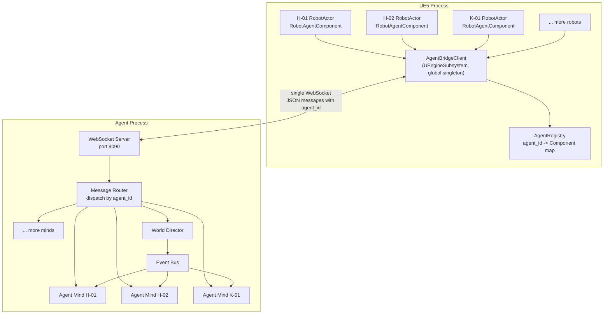

### 1.2 为什么单连接

| 维度 | 多连接（每 Agent 一条） | 单连接 + agent_id（推荐）✅ |
|------|------------------------|----------------------------|
| 连接管理 | 10 个连接分别保活、重连 | 1 个连接，简单 |
| UE 侧复杂度 | 每个 RobotActor 各自管 WS | 全局一个 Client，统一收发 |
| Agent 侧复杂度 | 管理多个 WS 端点 | 1 个 Server，内部路由 |
| 断线恢复 | 任一断了单独处理 | 1 条断了统一重连 + 全量同步 |
| World Director | 要和多连接通信 | 和 Router 通信，简单 |
| 广播效率 | 发给 N 个连接各一次 | Router 内部广播，一次完成 |
| 资源消耗 | N 条 TCP 连接 | 1 条 TCP 连接 |
| 调试 | 多条日志流 | 1 条日志流，时序清晰 |

### 1.3 UE 侧组件

#### AgentBridgeClient（全局单例）

| 项 | 说明 |
|---|------|
| 类型 | `UEngineSubsystem` 或 `UGameInstanceSubsystem` |
| 职责 | 管理 WebSocket 连接、收发消息、路由到 RobotAgentComponent |
| 生命周期 | UE 启动时创建，整个游戏期间常驻 |

**核心接口**：

```cpp
class UAgentBridgeClient : public UEngineSubsystem
{
public:
    // 连接管理
    void Connect(const FString& Url = "ws://127.0.0.1:9090");
    void Disconnect();
    bool IsConnected() const;

    // 发送消息
    void SendMessage(const FString& Json);

    // Agent 注册（RobotAgentComponent 调用）
    void RegisterAgent(const FString& AgentId, URobotAgentComponent* Comp);
    void UnregisterAgent(const FString& AgentId);

    // 收到消息的回调
    void OnMessageReceived(const FString& Json);

private:
    // agent_id -> RobotAgentComponent 映射
    TMap<FString, URobotAgentComponent*> AgentRegistry;

    // WebSocket 实例
    TSharedPtr<IWebSocket> WebSocket;
};
```

#### AgentRegistry 注册流程

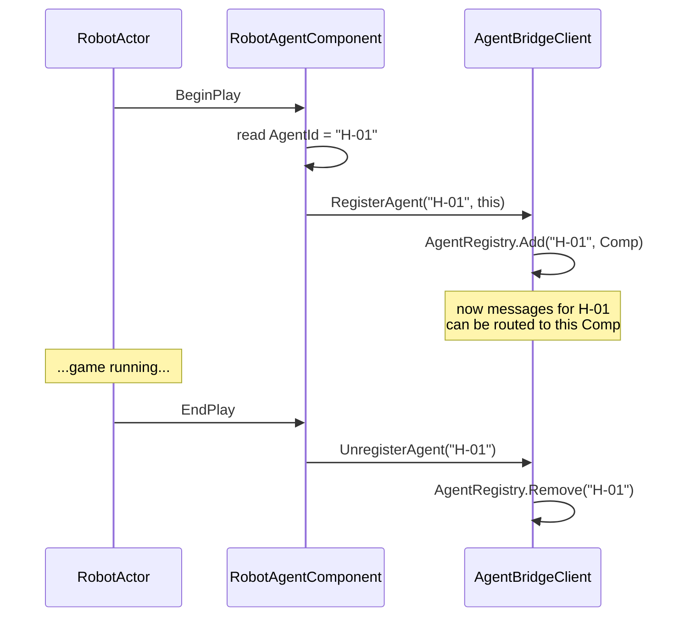

### 1.4 Agent 侧组件

#### WebSocket Server

| 项 | 说明 |
|---|------|
| 职责 | 监听端口、接受连接、收发原始 JSON |
| 实现 | 语言无关（可用任意 WebSocket 库） |

#### Message Router

| 项 | 说明 |
|---|------|
| 职责 | 解析消息 type + agent_id，分发给对应处理器 |
| 输入 | 原始 JSON |
| 输出 | 分发到 Agent Mind / World Director / 回传 UE |

**路由规则**：

| 消息方向 | type | 路由目标 |
|----------|------|----------|
| UE → Agent | `perception_update` | 按 agent_id → 对应 Agent Mind |
| UE → Agent | `action_started` | 按 agent_id → 对应 Agent Mind |
| UE → Agent | `action_completed` | 按 agent_id → 对应 Agent Mind |
| UE → Agent | `state_report` | 按 agent_id → 对应 Agent Mind |
| UE → Agent | `agent_registered` | → Agent Manager（创建新 Agent Mind） |
| UE → Agent | `agent_unregistered` | → Agent Manager（销毁 Agent Mind） |
| Agent → UE | `action_command` | 按 agent_id → UE 侧对应 RobotAgentComponent |
| Agent → UE | `stop_action` | 按 agent_id → UE 侧对应 RobotAgentComponent |
| Director → Agent | `event_notification` | 按 agent_id → 对应 Agent Mind（内部内存路由，不走网络） |

### 1.5 广播机制

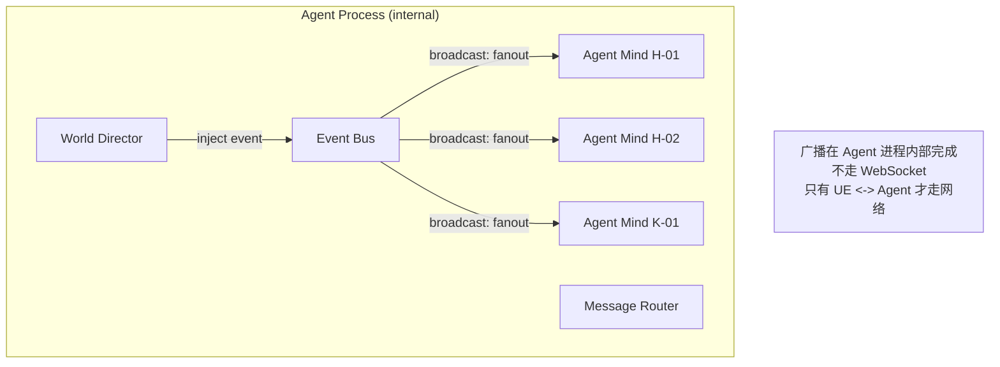

**关键**：Agent 进程内部的路由是内存操作。只有 UE ↔ Agent 之间才走那一条 WebSocket。

---

## 二、消息协议规范

### 2.1 统一消息封装

所有消息共用外层结构（**信封字段固定为以下 7 个，任何业务字段一律放入 `payload`**）：

```json
{
  "version": "1.0",
  "msg_id": "550e8400-e29b-41d4-a716-446655440000",
  "seq": 1024,
  "timestamp": 1719456000000,
  "type": "message_type",
  "agent_id": "H-01",
  "payload": { ... }
}
```

| 字段 | 类型 | 必填 | 说明 |
|------|------|------|------|
| version | string | ✅ | 协议版本号，当前 `"1.0"`，用于演进兼容 |
| msg_id | string (UUID) | ✅ | 消息唯一 ID，用于去重和追踪 |
| seq | int | ✅ | 同一发送端的单调递增序列号，用于检测乱序/丢失（重连后尤其有用） |
| timestamp | int (Unix epoch **毫秒**) | ✅ | 发送时间戳（**毫秒**，全协议统一毫秒） |
| type | string | ✅ | 消息类型（见下表） |
| agent_id | string | ✅ | 所属 Agent ID（如 "H-01"）；系统级消息用保留 ID `"system"` |
| payload | object | ✅ | 消息体，结构因 type 而异；**所有业务字段（含 action_id）必须在此** |

> **约定 1（信封纯净）**：`action_id` 等业务字段**一律放入 payload**，不得出现在信封顶层。
> **约定 2（时间单位）**：全协议所有时间戳单位为**毫秒**；所有时长字段以字段名后缀标注单位（`_ms` / `_sec`）。
> **约定 3（坐标单位）**：所有坐标（position/dest 等）单位为 **UE5 厘米（cm）**，与 UE 世界坐标一致；三元组顺序为 `[X, Y, Z]`，旋转为 `[Pitch, Yaw, Roll]`（度）。
> **约定 4（保留 ID）**：`agent_id = "system"` 为保留值，仅用于 `heartbeat` / `error` 等非特定 Agent 的系统级消息。

### 2.2 消息类型总表

| type | 方向 | 用途 | 触发时机 |
|------|------|------|----------|
| `perception_update` | UE → Agent | 感知快照上报（**含空间状态；物理状态仅在变化超阈值时附带**） | 每 3 秒 / zone 变化 / 事件触发 |
| `action_command` | Agent → UE | 下发动作指令 | 战术层/反应层产出新 action |
| `action_started` | UE → Agent | **动作已接收并开始执行的回执（ACK）** | UE 收到 action_command 并成功启动后立即回 |
| `action_completed` | UE → Agent | 动作完成回调 | MoveTo 完成 / StateTree 完成 |
| `stop_action` | Agent → UE | 停止当前动作 | 反应层决定打断 |
| `scan_area` | Agent → UE | 请求即时感知推送（携带 scan_id 关联响应） | scan_area 工具调用时，触发一次即时 perception_update |
| `event_notification` | Agent → Agent | 事件通知（内部路由） | Director 投放事件 |
| `state_report` | UE → Agent | 物理状态上报（**物理状态的权威通道**） | 状态变化超阈值 / 每 15 秒兜底 |
| `agent_registered` | UE → Agent | 机器人上线 | RobotActor BeginPlay |
| `agent_unregistered` | UE → Agent | 机器人下线 | RobotActor EndPlay |
| `heartbeat` | 双向 | 心跳保活 | 每 5 秒 |
| `error` | 双向 | 错误上报 | 异常情况 |
| `resync` | 双向 | 重连 seq 交换 | 重连后交换最后成功接收的 seq（详见 §4.2） |
| `event_lost` | Agent → UE | 缓冲滚动丢失告警 | 重连时缓冲已滚动超出对方请求的 seq（详见 §4.2） |

> **控制消息补充**：`scan_area`、`resync`、`event_lost` 为协议级控制消息，承载工具触发/重连协调逻辑，不属于 Agent-UE 的业务消息范畴。

> **约定 5（感知 vs 状态分工，消除 #6 冗余）**：
> - `perception_update` 负责**空间与环境感知**（position/rotation/zone/visible_agents/nearby_objects/audible_events/environment），**默认不携带 physical_state**；仅当某项物理数值自上次上报变化 ≥ 阈值（energy/fatigue/health 变化 ≥5，joint_wear 变化 ≥1）时，在 perception_update 中附带该变化项。
> - `state_report` 是 **physical_state 的权威通道**：状态变化超阈值时即时上报，且每 15 秒做一次兜底全量上报，保证 Agent 侧物理状态不漂移。

### 2.3 各消息详细定义

#### perception_update（UE → Agent）

```json
{
  "version": "1.0",
  "msg_id": "uuid-001",
  "seq": 1001,
  "timestamp": 1719456000000,
  "type": "perception_update",
  "agent_id": "H-01",
  "payload": {
    "location": {
      "position": [170.5, 100.0, 0.0],
      "rotation": [0.0, 90.0, 0.0],
      "current_zone": "central_plaza",
      "current_location": null
    },
    "physical_state_delta": {
      "joint_wear": 82
    },
    "visible_agents": [
      {
        "id": "H-02",
        "name": "小柯",
        "distance": 5.2,
        "angle": 30,
        "current_action": "idle"
      }
    ],
    "nearby_objects": [
      {
        "id": "workbench_01",
        "name": "工作台一号",
        "distance": 8.0,
        "state": "idle",
        "available_actions": ["assemble", "inspect"]
      }
    ],
    "audible_events": [
      {
        "type": "broadcast",
        "source": "D-02",
        "content": "K-03 出事了"
      }
    ],
    "current_animation": "walk",
    "current_emote": null,
    "environment": {
      "time_of_day": "14:23",
      "weather": "clear"
    },
    "scan_id": "scan_001"
  }
}
```

| payload 字段 | 类型 | 说明 |
|--------------|------|------|
| location.position | [x,y,z] | UE5 世界坐标（**厘米**） |
| location.rotation | [pitch,yaw,roll] | 朝向（**度**） |
| location.current_zone | string/null | 当前所在 Zone ID |
| location.current_location | string/null | 当前最近 Location ID |
| physical_state_delta | object (可选) | **仅在物理数值变化超阈值时出现**，只含变化项；物理状态权威通道是 state_report |
| visible_agents | array | 视线内的其他 Agent |
| nearby_objects | array | 附近可交互 Smart Object |
| audible_events | array | 听到的声音/广播 |
| current_animation | string | 当前播放的动画 |
| current_emote | string/null | **当前正在表现的情绪状态**（持续型 emote 的回报，供 Agent 感知"我此刻的情绪表现"，解决 #4 情绪一致性） |
| environment | object | 环境信息 |
| scan_id | string (可选) | 用于关联 `scan_area` 请求与即时感知响应（由 MCP 层注入，仅即时扫描感知携带，常规定期感知为空） |

#### action_command（Agent → UE）

```json
{
  "version": "1.0",
  "msg_id": "uuid-002",
  "seq": 2001,
  "timestamp": 1719456005000,
  "type": "action_command",
  "agent_id": "H-01",
  "payload": {
    "action_id": "act_001",
    "cmd": "MoveTo",
    "params": {
      "dest": [160.0, 100.0, 0.0],
      "speed": "walk"
    }
  }
}
```

> **注**：`action_id` 位于 payload 内（遵循约定1）。`action_id` 由 **Agent 侧生成并保证同一 agent 内唯一**，UE 侧原样回传于 action_started/action_completed。

**cmd 类型与 params 对应**：

| cmd | params | 说明 |
|-----|--------|------|
| `MoveTo` | {dest: [x,y,z], speed: "walk"\|"run"} | 原子：移动到坐标 |
| `TurnTo` | {target: agent_id} 或 {direction: [dx,dy,dz]} | 原子：转向 |
| `PlayAnimation` | {anim_id: string, duration_sec: float} | 原子：播动画 |
| `Speak` | {content: string, target: agent_id, audio_url: string\|null} | 原子：说话（audio_url 见约定6） |
| `Emote` | {emotion: "happy"\|"sad"\|"worried"\|..., mode: "oneshot"\|"sustained"} | 原子：情绪表达（mode 见约定7） |
| `Wait` | {duration_sec: float} | 原子：等待 |
| `InteractSmartObject` | {object_id: string, action: string} | 原子：交互物件 |
| `ExecuteComposite` | {name: string, params: {...}} | 复合：启动 StateTree |
| `Stop` | {} | 停止当前所有动作 |

> **约定 6（Speak/TTS）**：`audio_url` 由 **Agent 侧预生成**（调用 TTS 服务后填入 URL）；若为 `null` 或 UE 侧拉取音频失败，UE **降级为纯字幕显示**，不阻塞动作。
> **约定 7（Emote 模式）**：`mode="oneshot"` 为一次性表情（播完即止）；`mode="sustained"` 为持续情绪状态（UE 保持该情绪表现，并在 perception_update 的 `current_emote` 回报，直到下一个 sustained emote 或显式清除）。

**ExecuteComposite 示例**：

```json
{
  "action_id": "act_007",
  "cmd": "ExecuteComposite",
  "params": {
    "name": "work_assemble",
    "target": "workbench_01",
    "duration_sec": 18000
  }
}
```

#### action_started（UE → Agent，动作接收回执 ACK）

```json
{
  "version": "1.0",
  "msg_id": "uuid-002a",
  "seq": 1002,
  "timestamp": 1719456005200,
  "type": "action_started",
  "agent_id": "H-01",
  "payload": {
    "action_id": "act_001",
    "accepted": true,
    "estimated_duration_sec": 30
  }
}
```

| payload 字段 | 类型 | 说明 |
|--------------|------|------|
| action_id | string | 对应的 action_command 的 action_id |
| accepted | bool | UE 是否成功接收并启动该动作 |
| estimated_duration_sec | float/null | UE 预估的执行时长（可用于 Agent 侧设置执行超时） |
| reject_reason | string (可选) | 当 accepted=false 时说明原因（如目标非法、动作冲突） |

> **约定 8（ACK 机制，解决 #3）**：UE 收到 `action_command` 后**必须**在 2 秒内回 `action_started`。
> - Agent 侧凭 action_started 区分"指令丢失/UE 未收到"（超时未收到 ACK → 重发或重决策）与"正在执行中"（收到 ACK 但尚未 completed）。
> - 执行超时以 action_started 中的 `estimated_duration_sec` 为基准动态设定，不再使用固定 60 秒（解决长复合动作如 assemble 18000 秒的超时误判）。

#### action_completed（UE → Agent）

```json
{
  "version": "1.0",
  "msg_id": "uuid-003",
  "seq": 1003,
  "timestamp": 1719456035000,
  "type": "action_completed",
  "agent_id": "H-01",
  "payload": {
    "action_id": "act_001",
    "result": "success",
    "duration_ms": 30200,
    "progress": 1.0,
    "details": {}
  }
}
```

| result 值 | 说明 |
|-----------|------|
| `success` | 正常完成 |
| `failed` | 执行失败（如寻路不可达） |
| `interrupted` | 被 stop_action 打断 |
| `error` | 异常错误 |

**interrupted 时带 progress**：

```json
{
  "result": "interrupted",
  "progress": 0.6,
  "details": {
    "reason": "stop_action received",
    "completed_steps": ["MoveTo", "TurnTo"],
    "interrupted_at_step": "PlayAssembleLoop"
  }
}
```

#### stop_action（Agent → UE）

```json
{
  "version": "1.0",
  "msg_id": "uuid-004",
  "seq": 2010,
  "timestamp": 1719456040000,
  "type": "stop_action",
  "agent_id": "H-01",
  "payload": {
    "action_id": "act_010",
    "reason": "interrupted_by_event"
  }
}
```

> **约定 9（停止竞态处理，解决 #2）**：`stop_action` 携带的 `action_id` 必须与 UE 侧**当前正在执行的 action_id 匹配**才执行停止：
> - **匹配** → UE 停止该动作，回 `action_completed {result: "interrupted", progress: ...}`。
> - **不匹配**（目标动作已完成或已被新动作替换）→ UE **忽略该 stop**，并回一条 `error {error_code: "STOP_ID_MISMATCH", context: {requested: act_010, current: act_012}}`，避免误停新动作。
> - Agent 侧收到 mismatch error 后，以最新的 action 状态为准重新决策，不重复发送 stop。

#### scan_area（Agent → UE）

```json
{
  "version": "1.0",
  "msg_id": "uuid-010",
  "seq": 2011,
  "timestamp": 1719456040000,
  "type": "scan_area",
  "agent_id": "H-01",
  "payload": {
    "scan_id": "scan_001"
  }
}
```

| payload 字段 | 类型 | 说明 |
|--------------|------|------|
| scan_id | string | 由 MCP 层生成的唯一 ID，用于关联本次请求与对应的即时 perception_update 响应 |

> **说明**：`scan_area` 是 scan_area 工具对应的协议消息，触发 UE 立即为指定 agent 生成一次 `perception_update`。该消息为 fire-and-forget（不期望 ACK 回执）；响应的 `perception_update` 中会回传相同的 `scan_id`，使 Agent 侧能够将即时感知与后续决策关联。

#### event_notification（Agent 内部路由）

```json
{
  "version": "1.0",
  "msg_id": "uuid-005",
  "seq": 3001,
  "timestamp": 1719456045000,
  "type": "event_notification",
  "agent_id": "H-03",
  "payload": {
    "event_id": "evt_001",
    "event": {
      "type": "malfunction",
      "target": "K-03",
      "location": "archive_entrance",
      "severity": 7,
      "description": "K-03 关节锁死",
      "source": "director",
      "narrative_purpose": "推进 H-03 关怀 K-03 的情感线"
    },
    "perception_level": "direct"
  }
}
```

| perception_level | 说明 |
|------------------|------|
| `direct` | 直接感知（视觉/听觉范围内） |
| `broadcast` | 全园区广播（severity > 5） |
| `rumor` | 二手传闻（对话中得知） |

> **约定 10（rumor 传播，明确 #7）**：`rumor` 级别的传播由**子系统7 Event Bus** 负责，机制为：事件发生后，知情 Agent 在后续对话（Speak）中提及 → Event Bus 依据"对话可达性"在延迟 `T_rumor`（默认 30-120 秒随机）后向对话对象投递一条 `perception_level="rumor"` 的 event_notification。**第一期（单 NPC）不实现 rumor，仅保留字段定义。**

#### state_report（UE → Agent，可选独立上报）

```json
{
  "version": "1.0",
  "msg_id": "uuid-006",
  "seq": 1006,
  "timestamp": 1719456050000,
  "type": "state_report",
  "agent_id": "H-01",
  "payload": {
    "physical_state": {
      "energy": 20,
      "fatigue": 70,
      "joint_wear": 85,
      "health": 85
    },
    "current_task_progress": {
      "action_id": "act_010",
      "progress": 0.6
    }
  }
}
```

**说明**：`state_report` 是 **physical_state 的权威通道**（约定5）。触发条件：任一物理数值变化超阈值时即时上报；无变化时每 15 秒兜底全量上报一次。`perception_update` 不再常驻携带完整 physical_state。

#### agent_registered（UE → Agent）

```json
{
  "version": "1.0",
  "msg_id": "uuid-007",
  "seq": 1007,
  "timestamp": 1719456055000,
  "type": "agent_registered",
  "agent_id": "H-01",
  "payload": {
    "agent_type": "humanoid",
    "ue5_ref": "BP_HumanoidRobot_H01",
    "initial_position": [100.0, 100.0, 0.0],
    "initial_zone": "central_plaza"
  }
}
```

**Agent 侧收到后**：创建对应的 Agent Mind 实例，加载 Persona。

#### agent_unregistered（UE → Agent）

```json
{
  "version": "1.0",
  "msg_id": "uuid-008",
  "seq": 1008,
  "timestamp": 1719456060000,
  "type": "agent_unregistered",
  "agent_id": "H-01",
  "payload": {
    "reason": "actor_destroyed"
  }
}
```

**Agent 侧收到后**：保存 Agent Mind 状态，销毁实例。

#### heartbeat（双向）

```json
{
  "version": "1.0",
  "msg_id": "uuid-009",
  "seq": 1009,
  "timestamp": 1719456065000,
  "type": "heartbeat",
  "agent_id": "system",
  "payload": {
    "uptime_sec": 3600
  }
}
```

**说明**：每 5 秒互发一次，超时 15 秒无响应视为断线。`agent_id` 固定为保留值 `"system"`（约定4）。

#### error（双向）

```json
{
  "version": "1.0",
  "msg_id": "uuid-010",
  "seq": 1010,
  "timestamp": 1719456070000,
  "type": "error",
  "agent_id": "H-01",
  "payload": {
    "error_code": "ACTION_FAILED",
    "message": "MoveTo destination unreachable",
    "action_id": "act_001",
    "context": {
      "dest": [160.0, 100.0, 0.0]
    }
  }
}
```

**error_code 取值表**：

| error_code | 含义 | 接收方处理 |
|------------|------|-----------|
| `ACTION_FAILED` | 动作执行失败（如寻路不可达） | Agent 重新决策 |
| `STOP_ID_MISMATCH` | stop_action 的 action_id 与当前动作不匹配 | Agent 以最新状态重决策，不重发 stop |
| `INVALID_MESSAGE` | 消息格式错误/校验失败 | 丢弃并记录 |
| `UNKNOWN_AGENT` | agent_id 未注册 | 忽略并记录 |
| `INTERNAL_ERROR` | 接收方内部异常 | 记录，必要时进安全模式 |

---

## 三、数值系统设计

### 3.1 数值分类与归属

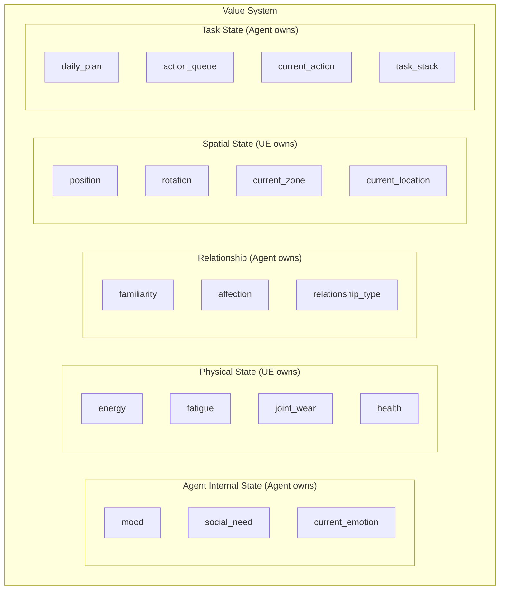

### 3.2 归属原则

**谁产生这个数值，谁就是主人，谁负责存储和变更。**

| 数值类别 | 主人 | 存储位置 | 变更触发 | UE 是否需要 | 同步方式 |
|----------|------|----------|----------|-------------|----------|
| **Agent 内部状态**（mood/social_need/emotion） | Agent | Agent Mind 内存 | LLM 反思 / 交互后判断 | ❌ 不需要 | 不同步 |
| **物理持久状态**（energy/fatigue/joint_wear/health） | UE | RobotStateComponent | 行为消耗 / 充电恢复 | ✅ 主人 | 上报给 Agent |
| **关系数值**（familiarity/affection） | Agent | 关系服务 | 交互后 LLM 判断更新 | ❌ 不需要 | 不同步 |
| **空间状态**（position/zone） | UE | Actor Transform / ZoneTrigger | 每帧 / Overlap 触发 | ✅ 主人 | 上报给 Agent |
| **任务状态**（plan/queue/stack） | Agent | Agent Mind 内存 | 分层思考产出 | ❌ 不需要 | 不同步 |

### 3.3 为什么这样划分

#### Agent 内部状态 → Agent 侧管

**例子**：老陈的 `mood = "worried"`，`social_need = 85`

- **怎么变**：LLM 反思后更新"今天 K-03 出事了，我很担心" → mood 变 worried；长时间没说话 → social_need 上升
- **UE 需要吗**：不需要。UE 只管播动画。Agent 想表现心情时，发 `emote(worried)` 指令，UE 播对应动画
- **同步**：不同步。Agent 侧自己存自己管

#### 物理持久状态 → UE 侧管

**例子**：老陈的 `joint_wear = 82`，`energy = 45`

- **怎么变**：走路 → 关节磨损 +0.1（UE 每秒累积）；装配 → 能量下降（StateTree 里扣）；充电 → 能量上升（Smart Object 逻辑）
- **Agent 需要吗**：需要，但不是实时。Agent 定期从 UE 拉取，作为 LLM 决策输入
- **同步**：UE 是主人，随 `perception_update` 上报

#### 关系数值 → Agent 侧管

**例子**：老陈和小柯的 `familiarity = 40, affection = 20`

- **怎么变**：两人对话 → LLM 判断"增进了了解" → familiarity +5；小柯帮老陈干活 → affection +10
- **UE 需要吗**：不需要。关系只影响 Agent 决策，不影响 UE 动画
- **同步**：不同步。Agent 侧自己存自己管

### 3.4 数值完整归属表

| 数值 | 类型 | 主人 | 存储位置 | 变更触发 | UE 需要 | 同步方式 |
|------|------|------|----------|----------|---------|----------|
| mood | 内部 | Agent | Agent Mind | LLM 反思 | ❌ | 不同步 |
| social_need | 内部 | Agent | Agent Mind | 定时增长/交互减少 | ❌ | 不同步 |
| current_emotion | 内部 | Agent | Agent Mind | LLM 决策产出 | ❌ | 不同步 |
| energy | 物理 | UE | RobotStateComponent | 行为消耗/充电恢复 | ✅ 主人 | perception_update 上报 |
| fatigue | 物理 | UE | RobotStateComponent | 持续工作累积 | ✅ 主人 | perception_update 上报 |
| joint_wear | 物理 | UE | RobotStateComponent | 移动/重体力累积 | ✅ 主人 | perception_update 上报 |
| health | 物理 | UE | RobotStateComponent | 事故/修理 | ✅ 主人 | perception_update 上报 |
| familiarity | 关系 | Agent | 关系服务 | 交互后 LLM 更新 | ❌ | 不同步 |
| affection | 关系 | Agent | 关系服务 | 交互后 LLM 更新 | ❌ | 不同步 |
| relationship_type | 关系 | Agent | 关系服务 | LLM 判断更新 | ❌ | 不同步 |
| position | 空间 | UE | Actor Transform | 每帧 | ✅ 主人 | perception_update 上报 |
| rotation | 空间 | UE | Actor Transform | 每帧 | ✅ 主人 | perception_update 上报 |
| current_zone | 空间 | UE | ZoneTrigger | Overlap 触发 | ✅ 主人 | perception_update 上报 |
| current_location | 空间 | UE | 就近查询 | 位置变化时 | ✅ 主人 | perception_update 上报 |
| daily_plan | 任务 | Agent | Agent Mind | 战略层产出 | ❌ | 不同步 |
| action_queue | 任务 | Agent | Agent Mind | 战术层产出 | ❌ | 不同步 |
| current_action | 任务 | Agent | Agent Mind | 执行层更新 | ❌ | 不同步 |
| task_stack | 任务 | Agent | Agent Mind | 打断时 push / 恢复时 pop | ❌ | 不同步 |

### 3.5 数据流图

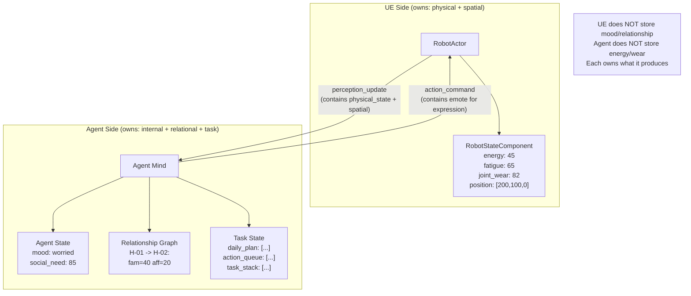

### 3.6 数值怎么影响决策（完整例子）

**场景**：老陈能量低 + 关节磨损高 → 决定提前休息

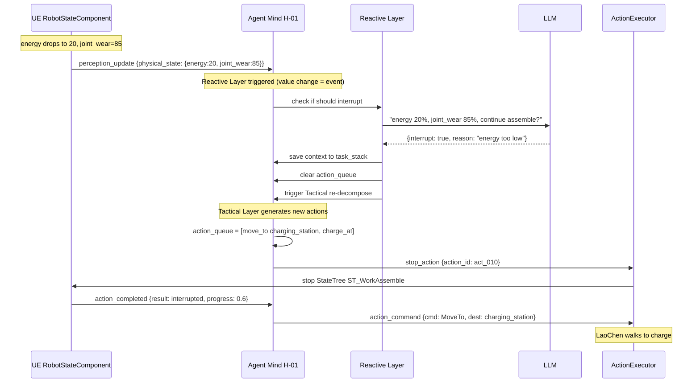

### 3.7 World Director 怎么用这些数值

Director 需要全局视角，它要知道所有 Agent 状态才能决定"该不该投放事件"。

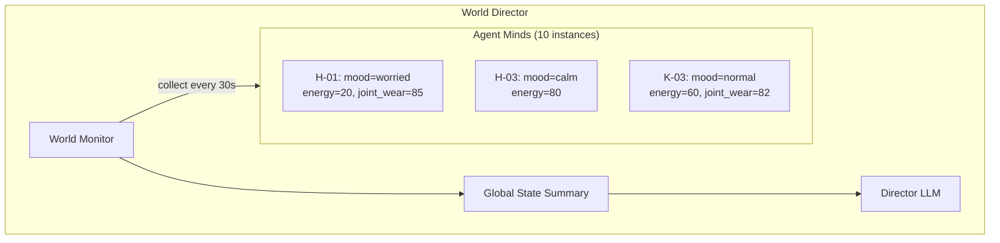

**Director 怎么拿到数值**：
- 每个 Agent Mind 定期（或状态变化时）向 Director 上报摘要
- Director 的 World Monitor 汇总所有 Agent 状态
- Director LLM 基于这些数据判断"K-03 关节磨损 82，该触发故障了"

**UE 侧参与吗**：不参与。Director 只和 Agent Minds 通信（进程内部）。

---

## 四、连接生命周期

### 4.1 启动顺序

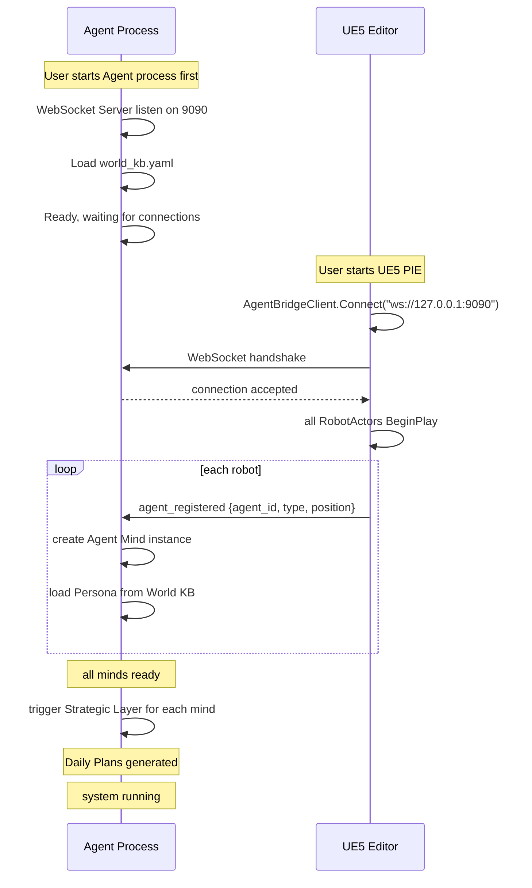

### 4.2 重连机制

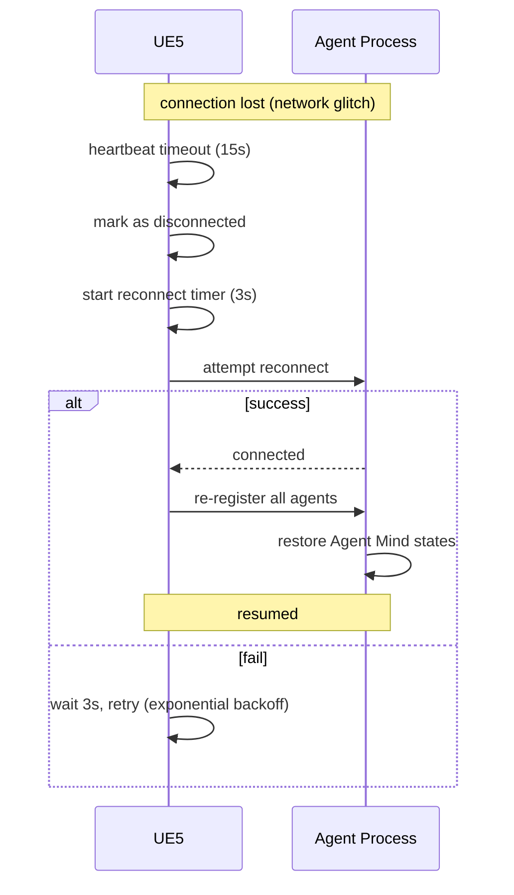

**重连后的状态同步**：
- UE 侧重新发送所有 `agent_registered`
- Agent 侧根据 `agent_id` 匹配已有 Agent Mind（如果还在内存）
- Agent 侧向 UE 请求当前所有 Agent 的 `state_report`（物理状态）+ 一次全量 `perception_update`（空间快照）
- **断线期间的事件补偿（约定11）**：双方各维护一个**发送缓冲队列**（保留最近 N=200 条或最近 60 秒的消息，按 seq 排序）。重连后通过交换"最后成功接收的 seq"，对端**重放 seq 之后的消息**。若缓冲已滚动丢失，则该 agent 以"当前快照为准"，并记录一条 `event_lost` 告警日志。
- 恢复正常通信

> **约定 11（断线补偿）**：离散事件（action_completed / event_notification）优先走 seq 重放补偿；连续状态（position/physical_state）不重放，直接以重连后的最新快照为准。

### 4.3 关闭流程

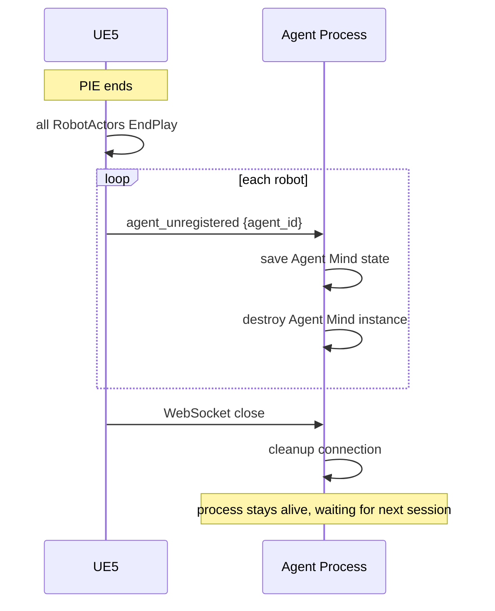

---

## 五、错误处理与容错

### 5.1 错误类型与处理

| 错误场景 | 检测方 | 处理方式 |
|----------|--------|----------|
| WebSocket 断线 | 双方（心跳超时） | UE 侧自动重连；Agent 侧保留 Agent Mind 状态 5 分钟 |
| Agent 进程崩溃 | UE 侧（断线） | UE 侧机器人进入"待机动画"，等待重连 |
| UE5 崩溃 | Agent 侧（断线） | Agent 侧保存状态，等待 UE 重连 |
| LLM 调用失败 | Agent 侧 | 单次决策：重试 3 次 → 降级到本地小模型 → 本次返回默认行为（idle）。**连续 5 次决策均失败** → 进入安全模式 |
| MoveTo 不可达 | UE 侧 | 发 `action_completed {result: failed}` → Agent 重新决策 |
| StateTree 执行错误 | UE 侧 | 发 `error` 消息 → Agent 重新决策 |
| Agent Mind 内部异常 | Agent 侧 | 记录日志 → 该 Agent 进入 safe mode（只 idle） |
| 消息格式错误 | 接收方 | 丢弃 + 发 `error {error_code: INVALID_MESSAGE}` 回报 |

> **约定 12（失败降级 vs 安全模式边界）**：**单次** LLM/决策失败仅影响本次行为（降级为 idle），不进安全模式；只有**连续多次（默认 5 次）**失败或内部异常才升级为安全模式。避免偶发失败导致 NPC 长时间"呆滞"。

### 5.2 超时机制

| 操作 | 超时时间 | 超时后行为 |
|------|----------|------------|
| action_started 等待（ACK） | 2 秒 | 未收到 ACK，认为指令丢失 → 重发一次；再失败则重新决策 |
| action_completed 等待 | `estimated_duration_sec × 1.5`（无估值时默认 60 秒） | 认为动作卡死 → 发 stop_action + 重新决策 |
| LLM 调用 | 10 秒 | 重试 → 降级 |
| 心跳响应 | 15 秒 | 认为断线 |
| 重连尝试 | 3 秒间隔，指数退避到 30 秒 | 持续重试 |

### 5.3 安全模式

当 Agent Mind 出现严重错误时，进入安全模式：

```
安全模式下 Agent Mind 行为：
  1. 不再调用 LLM
  2. 只发送 idle 指令给 UE
  3. 持续上报感知
  4. 等待管理员介入或自动恢复
```

UE 侧收到 `idle` 后播放待机动画，机器人不会完全卡死。

---

## 六、MCP 层设计（Agent 接入层）

> 因第一期采用现成 Agent（Hermes，MCP 原生），在 Agent 与 UE 通信协议之间引入 **MCP 层**。它对下用本文定义的 WebSocket 协议连接 UE，对上以标准 MCP 暴露给 Agent。

### 6.1 定位与职责

MCP 层是 **UE WebSocket 协议 ⟷ Agent(MCP)** 的适配与语义化中枢，一体承担三项职责：

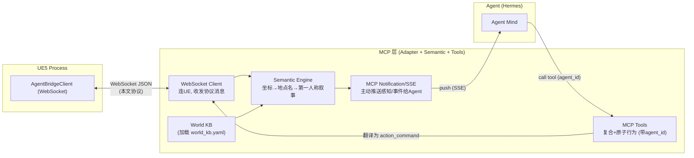

| 职责 | 说明 |
|------|------|
| **协议适配** | 作为 WebSocket 客户端连接 UE 的 `AgentBridgeClient`，收发本文第二章定义的所有协议消息 |
| **感知语义化** | 加载 World KB，将原始感知（坐标/ID）翻译为**地点名→第一人称叙事**（认知层），全部在 MCP 层完成 |
| **感知推送** | 通过 **MCP 通知 / SSE** 主动把语义化后的感知与事件推给 Agent（不依赖 Agent 轮询） |
| **工具暴露** | 向 Agent 暴露**复合 + 原子行为** MCP Tools，调用时翻译为 `action_command` 下发 UE |

> **核心权衡**：本文 WebSocket 协议是"UE 主动推送"范式，MCP 是"Agent 调用工具"范式。MCP 层通过 **SSE 推送（感知方向）+ Tool 调用（动作方向）** 弥合两种范式——感知走推送，动作走工具，方向清晰。

### 6.2 感知送达：MCP 通知 / SSE 推送

UE 推来的 `perception_update` / `event_notification` / `action_started` / `action_completed` / `state_report`，经 MCP 层语义化后，**通过 MCP 的 server 通知 / SSE 主动推送**给 Agent，而非等待 Agent 轮询。

| UE 协议消息 | MCP 层处理 | 推送给 Agent 的形式 |
|-------------|-----------|--------------------|
| `perception_update` | 语义化为第一人称叙事 | SSE 通知：`perception`（含叙事文本） |
| `event_notification` | 语义化事件描述 | SSE 通知：`event`（紧急事件即时推送，供反应层打断） |
| `action_started` | 透传 | SSE 通知：`action_ack` |
| `action_completed` | 透传（含 result/progress） | SSE 通知：`action_result` |
| `state_report` | 附加到感知上下文 | 随下次 `perception` 通知携带 |

> **反应层打断**：`event`（紧急事件）通过 SSE 即时推送，保证反应层能及时收到并决定是否打断当前动作。

### 6.3 感知语义化（全部在 MCP 层）

三层感知翻译（对应子系统5）**全部在 MCP 层内完成**，Agent 拿到的是"成品叙事"：

```
Layer1 原始感知(UE)  →  Layer2 语义(查World KB)  →  Layer3 认知(第一人称叙事)
[245.3,128.7,0]        "档案馆修理台"              "你现在在档案馆的修理台旁..."
K-03 distance=2.1      "K-03 三条腿"              "你看到 K-03 三条腿(你最亲近的伙伴)就在旁边"
```

MCP 层语义化后推送给 Agent 的示例（叙事文本 + 结构化附带）：

```json
{
  "notify_type": "perception",
  "agent_id": "H-03",
  "narrative": "你现在在档案馆的修理台旁。时间 14:23。\n你看到：K-03 三条腿（你最亲近的伙伴）就在旁边，正在休息。\n你附近可用：修理台（闲置）、档案终端（闲置）。\n你听到：D-02 小八在广场广播：\"K-03 出事了！\"",
  "structured": {
    "current_zone": "archive_room",
    "current_location": "repair_table",
    "visible_agents": ["K-03"],
    "usable_objects": ["repair_table", "archive_terminal"]
  }
}
```

> `narrative` 供 LLM 直接理解；`structured` 供 Agent 需要精确判断时使用（如距离/可用动作校验）。

### 6.4 MCP Tools 定义（复合 + 原子，均带 agent_id）

Tools 参照子系统6，**复合行为 + 必要原子行为均开放给 LLM 调用**。**所有 tool 的第一个参数固定为 `agent_id`**（单 MCP Server 服务多 NPC 的隔离手段）。MCP 层收到调用后翻译为对应 `action_command` 下发 UE。

**复合行为 Tools**（默认优先使用）：

| MCP Tool | 参数 | 翻译为 action_command |
|----------|------|----------------------|
| `work_assemble` | agent_id, target, duration_min | ExecuteComposite {name:"work_assemble"} |
| `patrol_route` | agent_id, route_id | ExecuteComposite {name:"patrol_route"} |
| `charge_at` | agent_id, station_id, duration_min | ExecuteComposite {name:"charge_at"} |
| `repair_target` | agent_id, target_agent_id | ExecuteComposite {name:"repair_target"} |
| `social_chat_with` | agent_id, target_agent_id | ExecuteComposite {name:"social_chat_with"} |
| `rest_idle` | agent_id, duration_min | ExecuteComposite {name:"rest_idle"} |
| `archive_research` | agent_id, duration_min | ExecuteComposite {name:"archive_research"} |

**原子行为 Tools**（需精细控制时使用）：

| MCP Tool | 参数 | 翻译为 action_command |
|----------|------|----------------------|
| `move_to` | agent_id, target（语义ID/描述） | MoveTo（MCP层查 World KB 解析坐标） |
| `turn_to` | agent_id, target | TurnTo |
| `speak` | agent_id, content, target | Speak（MCP层可调 TTS 填 audio_url） |
| `emote` | agent_id, emotion, mode | Emote |
| `interact` | agent_id, object_id, action | InteractSmartObject |
| `wait` | agent_id, duration_sec | Wait |
| `scan_area` | agent_id | 主动请求一次 perception_update |
| `stop` | agent_id | Stop / stop_action |

> **语义目标解析**：原子 tool 接受**语义目标**（如 `move_to(target="工作台")`），由 MCP 层查 World KB 的 `resolve_target` / `get_position` 解析为坐标，再填入 action_command 的 `dest`。Agent 无需接触任何坐标。

### 6.5 多 NPC 隔离：单 Server + agent_id 参数

- **单个 MCP Server** 服务所有 NPC（第一期仅 1 个，但架构就绪）。
- 每个 tool 调用**必须带 `agent_id`**，MCP 层据此翻译为对应 agent 的 `action_command`。
- SSE 推送按 `agent_id` 分流：Agent 侧订阅自己 NPC 的感知/事件流。
- **第一期**：只有 1 个 agent_id，流程完全打通即可；多 NPC 时无需改协议，仅扩展订阅路由。

### 6.6 MCP 层与本协议的关系小结

| 方向 | 范式 | 承载 |
|------|------|------|
| UE → Agent（感知/事件） | 推送 | WebSocket 协议消息 → 语义化 → **MCP SSE 通知** |
| Agent → UE（动作） | 调用 | **MCP Tool 调用** → 翻译 → WebSocket `action_command` |

> **结论**：MCP 层让本文定义的 WebSocket 协议对 Agent "隐形"——Agent 只看到"推来的叙事"和"可调的工具"，完全不感知底层坐标与协议细节。这既满足 Hermes 的 MCP 接入需求，又保持了 UE 端与协议层的独立与可复用。

---

## 七、总结

### 通信架构核心

| 项 | 答案 |
|---|------|
| 连接数 | 1 条 WebSocket |
| 路由方式 | 消息带 `agent_id`，双方按 ID 路由 |
| UE 侧管理 | `AgentBridgeClient`（全局单例）+ `AgentRegistry` |
| Agent 侧管理 | WebSocket Server + Message Router |
| 广播 | Agent 进程内部内存操作，不走网络 |

### 数值系统核心

| 项 | 答案 |
|---|------|
| 原则 | 谁产生谁管 |
| 物理数值 | UE 是主人，随 state_report 上报（perception 仅带变化项） |
| 心理/关系数值 | Agent 是主人，不同步 |
| 任务状态 | Agent 是主人，不同步 |
| Director 获取全局状态 | Agent Minds 定期上报（进程内部） |

### MCP 层核心

| 项 | 答案 |
|---|------|
| 定位 | UE WebSocket 协议 ⟷ Agent(MCP) 的适配 + 语义化中枢 |
| 感知送达 | MCP 通知 / SSE **推送**（含紧急事件即时推送供打断） |
| 语义化 | **全部在 MCP 层**：坐标→地点名→第一人称叙事 |
| Tools | 复合 + 原子行为，均开放给 LLM，**统一带 agent_id** |
| 多 NPC | 单 MCP Server + agent_id 参数隔离 |

### 设计原则

1. **单连接 + agent_id 路由**：简化连接管理，便于调试
2. **消息统一封装**：version + msg_id + seq + timestamp + type + agent_id + payload，业务字段一律入 payload
3. **时间与坐标单位统一**：时间戳毫秒，坐标厘米
4. **动作生命周期可靠**：command → started(ACK) → completed，停止有 ID 匹配校验
5. **数值归属清晰**：物理 UE 管，心理 Agent 管，不交叉
6. **感知/动作范式分离**：感知走 SSE 推送，动作走 MCP Tool 调用
7. **容错优先**：断线重连 + seq 重放补偿、超时降级、失败/安全模式分级
8. **可观测**：每条消息有 msg_id + seq，可追踪完整链路
9. **MCP 层隔离底层**：Agent 只见叙事与工具，不感知坐标与协议细节

---

*本文档定义了 Agent Town 的通信协议、数值系统与 MCP 接入层，作为实现的契约依据。*
