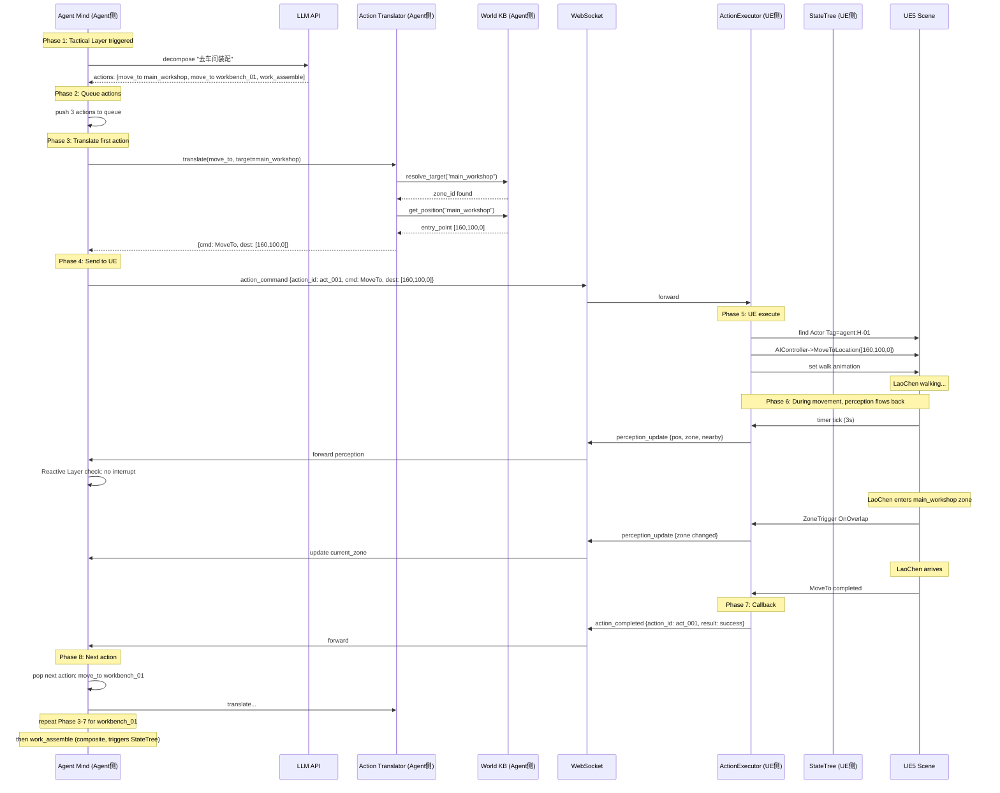
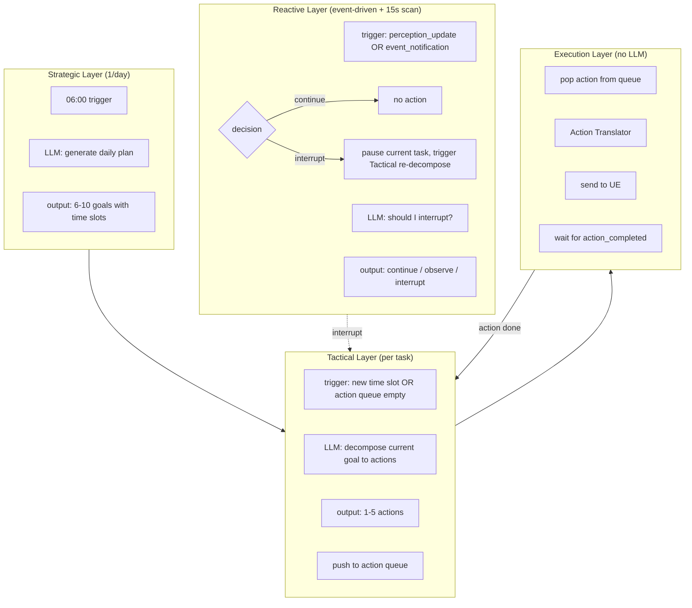
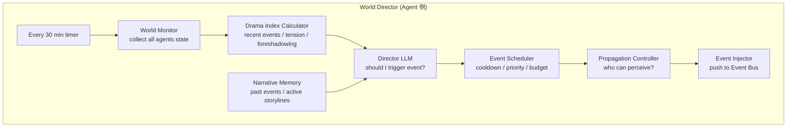
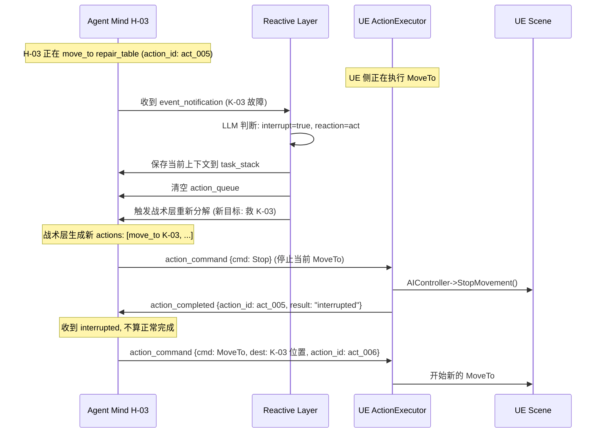
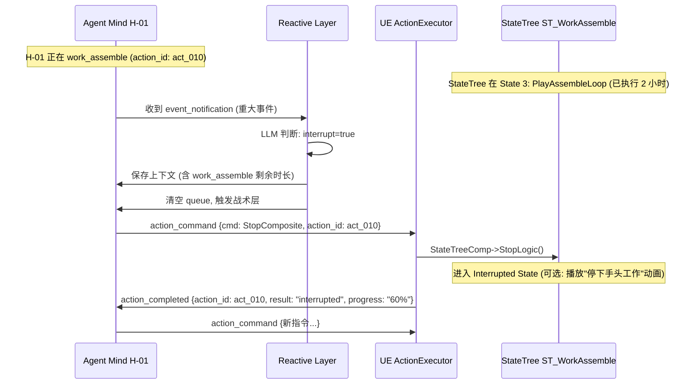
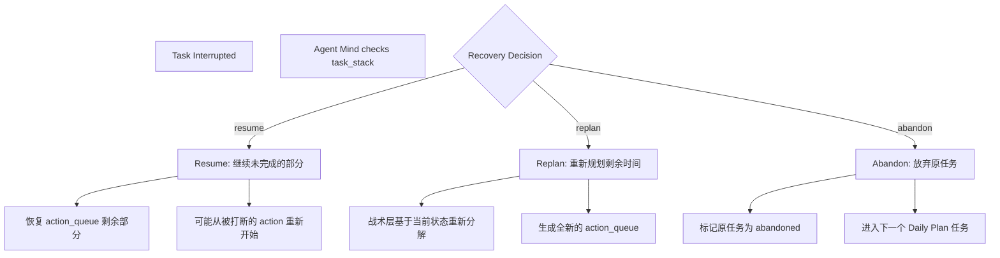
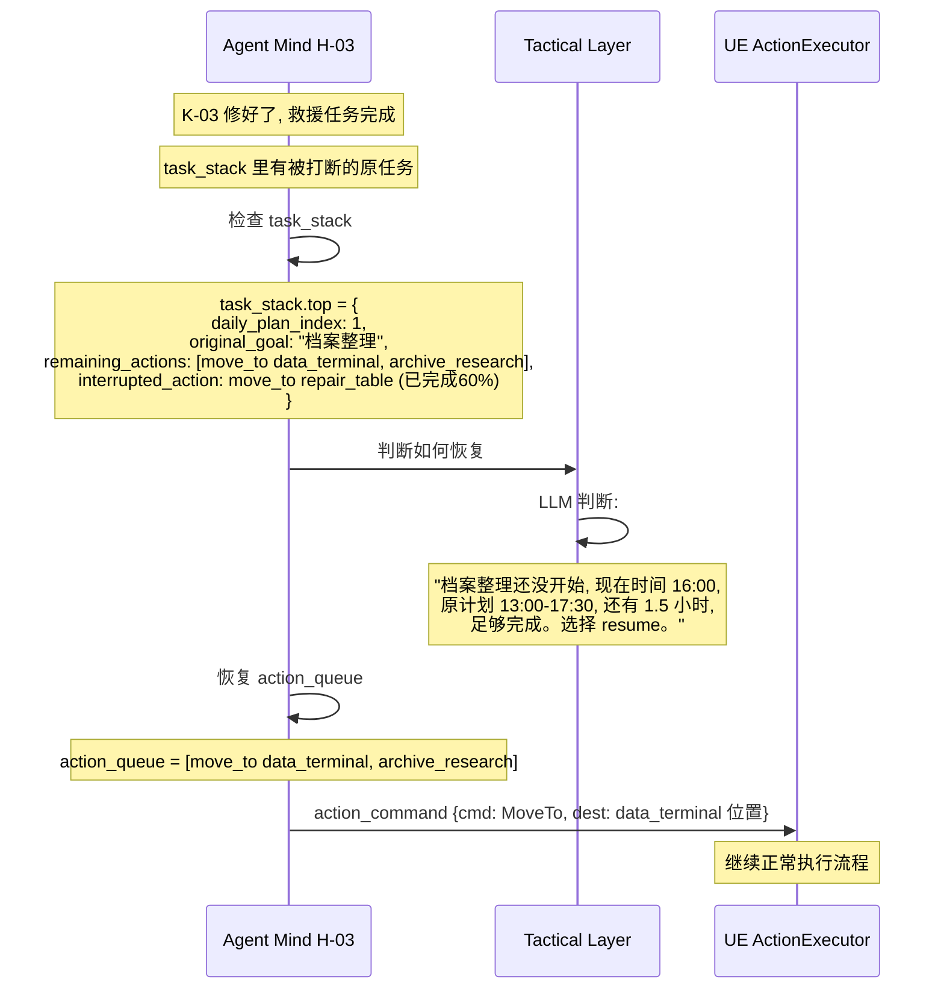
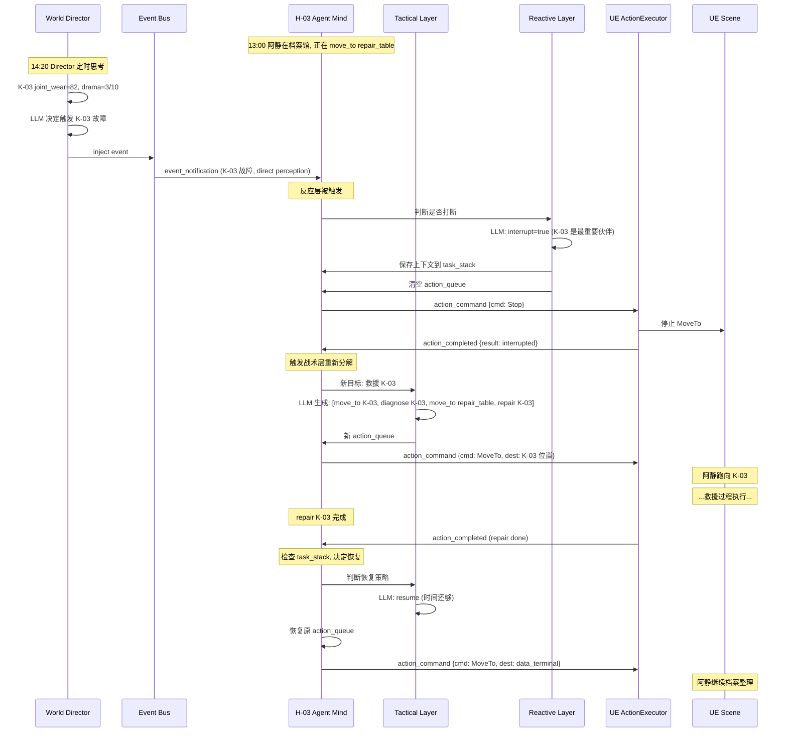
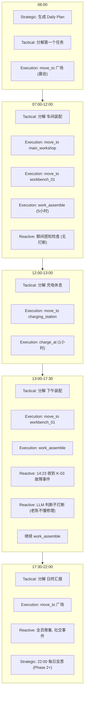

# Agent Town 核心系统深度设计 - Action / Mind / Director

> 本文档是对 `AgentTown_Design.md` 中三个核心子系统的深度展开：
> 1. **Action System**（行动系统）—— 从规划好任务表到最终执行的完整链路
> 2. **Agent Mind 分层思考** —— 战略/战术/反应层如何协作
> 3. **World Director** —— 事件生成、打断、恢复的完整机制
>
> **每个系统都明确标注：哪些是 Agent 侧做，哪些是 UE 插件侧做。**

---

## 目录

1. [职责边界总览](#一职责边界总览)
2. [Action System 深度设计](#二action-system-深度设计)
3. [Agent Mind 分层思考深度设计](#三agent-mind-分层思考深度设计)
4. [World Director 与事件打断恢复](#四world-director-与事件打断恢复)
5. [三个系统的协作全景](#五三个系统的协作全景)

---

## 一、职责边界总览

在深入每个系统前，先明确 Agent 侧和 UE 插件侧的根本分工。**这条边界贯穿所有设计**。

### 1.1 核心原则

```mermaid
graph LR
    subgraph AgentSide["Agent 侧 (Agent Process)"]
        A1["所有 AI 决策"]
        A2["LLM 调用"]
        A3["World KB 查询"]
        A4["语义 ↔ 坐标翻译"]
        A5["任务队列管理"]
        A6["打断/恢复决策"]
    end

    subgraph UESide["UE 插件侧 (AgentTownBridge)"]
        U1["3D 呈现"]
        U2["基础感知采集"]
        U3["动作执行 (MoveTo/Anim)"]
        U4["Smart Object 交互"]
        U5["Zone 检测"]
        U6["动作完成回调"]
    end

    AgentSide -->|"action_command"| UESide
    UESide -->|"perception_update / action_completed"| AgentSide
```



### 1.2 职责对照表

| 维度 | Agent 侧 | UE 插件侧 |
|------|----------|-----------|
| **决策** | ✅ 做（调 LLM、分层思考） | ❌ 不做 |
| **感知** | 语义化转换（坐标→地名） | 原始采集（坐标、可见 Actor） |
| **行动** | 生成意图 + 翻译为指令 | 执行指令（MoveTo/PlayAnim） |
| **World KB** | 加载、查询、语义解析 | 不加载（靠 Tag 关联） |
| **任务队列** | ✅ 管理 | ❌ 不管 |
| **打断决策** | ✅ 决定是否打断 | ❌ 不决定（但能执行"停止当前动作"） |
| **恢复决策** | ✅ 决定恢复什么、怎么恢复 | ❌ 不决定 |
| **动画选择** | ❌ 不管（只说"装配"） | ✅ 选具体动画 |
| **NavMesh 寻路** | ❌ 不管 | ✅ 调用 |
| **动作完成检测** | ❌ 不管 | ✅ 检测并回调 |
| **LLM 调用** | ✅ 做 | ❌ 不做 |

### 1.3 一句话总结

> **Agent 侧负责"想"，UE 插件侧负责"做"。Agent 侧不知道坐标，UE 插件侧不知道剧情。**

---

## 二、Action System 深度设计

### 2.1 核心问题

老陈今天的 Daily Plan 第一个任务是"07:00-12:00 去主生产车间装配零件"。从这句话到老陈在 UE5 里真的走到工作台播装配动画，中间到底发生了什么？每一步谁来做？

### 2.2 完整执行链路（8 个阶段）



### 2.3 每个阶段的详细职责

#### 阶段 1：战术层任务分解（Agent 侧）

**谁做**：Agent Mind 的 Tactical Layer

**做什么**：
- 从 Daily Plan 取出当前时段的 goal："去主生产车间装配零件"
- 组装 Prompt 发给 LLM
- LLM 返回结构化的 actions 数组

**Prompt 示例**：

```
你是老陈（H-01），车间主管。

当前时间：07:00
当前位置：中央广场
当前任务目标：去主生产车间装配零件

请规划接下来 3-5 步具体行动，使用以下行为格式：
- move_to(target): 移动到某地
- work_assemble(target, duration_min): 在工作台装配
- wait(seconds): 等待

输出 JSON：
{
  "inner_thought": "...",
  "actions": [...]
}
```

**LLM 返回**：

```json
{
  "inner_thought": "该去车间了，先走到车间入口，再到工作台开始装配。",
  "actions": [
    {"action": "move_to", "params": {"target": "main_workshop"}},
    {"action": "move_to", "params": {"target": "workbench_01"}},
    {"action": "work_assemble", "params": {"target": "workbench_01", "duration_min": 300}}
  ]
}
```

**UE 侧做什么**：无。这一步完全是 Agent 侧和 LLM 之间的事。

---

#### 阶段 2：任务队列管理（Agent 侧）

**谁做**：Agent Mind 的 Execution Queue

**做什么**：
- 把 LLM 返回的 actions 数组存入队列
- 维护当前正在执行的 action 和 action_id
- 管理"等待 action_completed"的异步状态

**数据结构**：

```
Agent Mind 内部状态：
  daily_plan: [...]                    # 当日大纲
  current_plan_index: 0                # 当前执行到第几个大纲任务
  action_queue: [action1, action2, action3]  # 战术层分解出的动作
  current_action: action1              # 正在执行的
  current_action_id: "act_001"         # 对应的 ID（发给 UE 用）
  waiting_for_completion: true         # 是否在等 UE 回调
```

**UE 侧做什么**：无。

---

#### 阶段 3：Action Translator 翻译（Agent 侧）

**谁做**：Action Translator

**做什么**：把 LLM 的高层意图翻译成 UE 能执行的指令。

**这是最关键的胶水层**，分三种情况：

**情况 A：move_to + 目标是 Zone**

```
输入：{action: "move_to", params: {target: "main_workshop"}}

Translator 处理：
  1. resolve_target("main_workshop")
     → 查 World KB：是 Zone ID
  2. get_position("main_workshop")
     → 查 World KB：zone.entry_point = [160, 100, 0]
  3. 生成指令：
     {cmd: "MoveTo", dest: [160,100,0], speed: "walk"}
```

**情况 B：move_to + 目标是 Location（Smart Object）**

```
输入：{action: "move_to", params: {target: "workbench_01"}}

Translator 处理：
  1. resolve_target("workbench_01")
     → 查 World KB：是 Location ID
  2. get_position("workbench_01")
     → 查 World KB：location.interaction_point = [195, 105, 0]
     （注意：用的是 interaction_point，不是 position）
  3. 生成指令：
     {cmd: "MoveTo", dest: [195,105,0], speed: "walk"}
```

**情况 C：work_assemble（复合行为）**

```
输入：{action: "work_assemble", params: {target: "workbench_01", duration_min: 300}}

Translator 处理：
  1. resolve_target("workbench_01")
     → 是 Location ID
  2. 不直接翻译成坐标，而是生成复合指令：
     {cmd: "ExecuteComposite", name: "work_assemble",
      params: {target: "workbench_01", duration_sec: 18000}}
  3. UE 侧收到后，自己决定怎么执行（启动哪个 StateTree）
```

**关键**：Translator 只做"语义→坐标/指令名"的翻译，**不管动画、不管时长细节**。这些是 UE 侧的事。

**UE 侧做什么**：无。

---

#### 阶段 4：发送指令（Agent 侧 → UE 侧）

**谁做**：Agent Mind → WebSocket → UE ActionExecutor

**消息格式**：

```json
{
  "msg_id": "uuid-001",
  "type": "action_command",
  "agent_id": "H-01",
  "action_id": "act_001",
  "payload": {
    "cmd": "MoveTo",
    "dest": [160, 100, 0],
    "speed": "walk"
  }
}
```

**UE 侧做什么**：AgentBridgeClient 收到消息，按 `agent_id` 路由到对应 RobotAgentComponent 的 ActionExecutor。

---

#### 阶段 5：UE 侧执行动作（UE 侧）

**谁做**：ActionExecutor

**做什么**：根据 cmd 类型分派执行。

**MoveTo 的执行**：

```cpp
// UE 侧伪代码
void UActionExecutor::HandleMoveTo(const FActionCommand& Cmd)
{
    // 1. 找到 Owner Actor（老陈）
    AActor* Owner = GetOwner();

    // 2. 获取 AIController
    AAIController* AI = Cast<AAIController>(Owner->GetInstigatorController());

    // 3. 设置移动动画
    GetAnimInstance()->SetMovementState(Cmd.Speed);  // walk / run

    // 4. 发起寻路
    AI->MoveToLocation(Cmd.Destination);

    // 5. 绑定完成回调
    AI->OnMoveCompleted.AddDynamic(this, &UActionExecutor::OnMoveFinished);
}
```

**ExecuteComposite 的执行**：

```cpp
void UActionExecutor::HandleComposite(const FActionCommand& Cmd)
{
    // 1. 根据 name 找到对应 StateTree 资产
    UStateTree* ST = LoadStateTree(Cmd.Name);  // "work_assemble" → ST_WorkAssemble

    // 2. 准备参数（写入 Blackboard）
    UBlackboardComponent* BB = GetBlackboard();
    BB->SetValueAsString("target_object", Cmd.Params.target);
    BB->SetValueAsFloat("duration", Cmd.Params.duration_sec);

    // 3. 启动 StateTree
    StateTreeComp->StartLogic();

    // 4. StateTree 内部自己管流程，完成后回调
}
```

**StateTree: ST_WorkAssemble 内部**（UE 侧完全自主）：

```
State 1: MoveToInteractionPoint
  - 从 Blackboard 读 target_object = "workbench_01"
  - 但 UE 侧不知道坐标！怎么办？
  - 方案：UE 侧也有一份 SmartObjectComponent，
    通过 ObjectId 找到 Actor，读 InteractionSocket 位置
  - MoveTo(interaction_point)
  - 完成 → State 2

State 2: TurnToFace
  - 朝向 workbench Actor
  - 完成 → State 3

State 3: PlayAssembleLoop
  - 循环播放 assemble_anim_montage
  - 每 30 秒随机插入小动作（擦汗/检查零件）
  - duration 到了 → State 4

State 4: Done
  - 触发 OnActionCompleted
```

**Agent 侧做什么**：无。这一阶段 Agent 侧在异步等待 `action_completed`。

---

#### 阶段 6：执行期间的感知回流（UE 侧 → Agent 侧）

**谁做**：PerceptionPackager（UE 侧）→ Agent Mind（Agent 侧）

**UE 侧每 3 秒打包**：

```json
{
  "type": "perception_update",
  "agent_id": "H-01",
  "payload": {
    "position": [170, 100, 0],
    "current_zone": "central_plaza",
    "visible_agents": [],
    "nearby_objects": []
  }
}
```

**Zone 变化时立即打包**：

```json
{
  "type": "perception_update",
  "agent_id": "H-01",
  "payload": {
    "position": [165, 100, 0],
    "current_zone": "main_workshop",
    "visible_agents": [],
    "nearby_objects": [{"id": "workbench_01", "distance": 5.0, "state": "idle"}]
  }
}
```

**Agent 侧做什么**：
- 更新内部状态（current_zone 等）
- Reactive Layer 快速检查：有突发事件吗？需要打断吗？
- 如果不需要打断，继续等待 action_completed

---

#### 阶段 7：动作完成回调（UE 侧 → Agent 侧）

**谁做**：ActionExecutor（UE 侧）→ Agent Mind（Agent 侧）

**UE 侧检测完成**：

```cpp
// MoveTo 完成
void UActionExecutor::OnMoveCompleted(FAIRequestID RequestID, EPathFollowingResult::Type Result)
{
    // 发送 action_completed
    FActionCompletedMsg Msg;
    Msg.action_id = CurrentActionId;
    Msg.result = (Result == EPathFollowingResult::Success) ? "success" : "failed";
    AgentBridgeClient->SendMessage(Msg.ToJson());
}
```

**StateTree 完成**：

```cpp
// ST_WorkAssemble 的 State 4 (Done) 触发
void UActionExecutor::OnStateTreeCompleted()
{
    FActionCompletedMsg Msg;
    Msg.action_id = CurrentActionId;
    Msg.result = "success";
    AgentBridgeClient->SendMessage(Msg.ToJson());
}
```

**消息**：

```json
{
  "type": "action_completed",
  "agent_id": "H-01",
  "action_id": "act_001",
  "result": "success"
}
```

---

#### 阶段 8：取下一个动作（Agent 侧）

**谁做**：Agent Mind 的 Execution Queue

**做什么**：
- 收到 `action_completed`，标记当前 action 完成
- 从 action_queue pop 下一个
- 重复阶段 3-7
- 队列空了 → 触发战术层分解下一个 Daily Plan 任务

**UE 侧做什么**：无。

### 2.4 Action System 职责总结表

| 阶段 | Agent 侧 | UE 插件侧 |
|------|----------|-----------|
| 1. 战术层分解 | ✅ 调 LLM 生成 actions | ❌ |
| 2. 队列管理 | ✅ 维护 action_queue | ❌ |
| 3. Translator 翻译 | ✅ 语义→坐标/指令 | ❌ |
| 4. 发送指令 | ✅ 发 action_command | ❌ |
| 5. 执行动作 | ❌ | ✅ MoveTo / StateTree |
| 6. 期间感知 | ✅ 接收 + Reactive 检查 | ✅ 打包 + 发送 |
| 7. 完成回调 | ✅ 接收 + pop 下一个 | ✅ 检测完成 + 发送 |
| 8. 取下一动作 | ✅ | ❌ |

### 2.5 复合行为 vs 原子行为的执行差异

| 维度 | 原子行为（move_to） | 复合行为（work_assemble） |
|------|---------------------|--------------------------|
| **Translator 输出** | `{cmd: MoveTo, dest: [...]}` | `{cmd: ExecuteComposite, name: "...", params: {...}}` |
| **UE 执行方式** | 直接调 AIController | 启动 StateTree 资产 |
| **内部流程** | 单步（移动） | 多步（移动→转身→循环动画→结束） |
| **动画选择** | walk/run（简单） | assemble_loop + 随机小动作（UE 侧决定） |
| **完成检测** | OnMoveCompleted | StateTree 进入 Done State |
| **duration 控制** | 无（走到为止） | UE 侧 StateTree 内部计时 |

---

## 三、Agent Mind 分层思考深度设计

### 3.1 三层的触发与协作



### 3.2 战略层（Strategic Layer）—— 具体例子

**触发**：每天 06:00（或 Agent Mind 启动时）

**Agent 侧做什么**：

```
1. 收集输入：
   - Persona（老陈的角色卡）
   - 固定日程模板（晨会/工作/充电/夜生活）
   - 昨日总结（Phase 1 暂无记忆，用空字符串）
   - 当前游戏时间

2. 组装 Prompt：
   "你是老陈，性格沉稳严厉。
    今天是园区第 15 天。
    你的固定日程：07:00晨会, 07:30-12:00工作, ...
    请生成今日大纲（6-10条），格式：
    [{time, goal}, ...]"

3. 调用 LLM（Claude Sonnet）

4. 解析返回，存入 daily_plan
```

**LLM 返回**：

```json
[
  {"time":"06:00-07:00","goal":"起床自检+参加晨会"},
  {"time":"07:00-12:00","goal":"去主生产车间装配零件"},
  {"time":"12:00-13:00","goal":"去广场充电休息"},
  {"time":"13:00-17:30","goal":"下午继续车间装配"},
  {"time":"17:30-18:30","goal":"参加日终汇报"},
  {"time":"18:30-22:00","goal":"在广场休息"},
  {"time":"22:00-06:00","goal":"充电睡眠"}
]
```

**UE 侧做什么**：无。

**完成后**：触发战术层，开始执行第一个时段的任务。

---

### 3.3 战术层（Tactical Layer）—— 具体例子

**触发时机**（三种）：
1. 战略层完成后，进入新的 time slot
2. action_queue 空了（上一批 actions 执行完）
3. 被反应层打断后，需要重新规划

**Agent 侧做什么**：

```
场景：07:00 到了，daily_plan[1] = {time:"07:00-12:00", goal:"去主生产车间装配零件"}

1. 收集输入：
   - 当前 goal："去主生产车间装配零件"
   - 当前位置：中央广场（从最近 perception_update 获取）
   - 当前时间：07:00
   - Persona 摘要

2. 组装 Prompt：
   "你是老陈。
    当前任务：去主生产车间装配零件
    你现在在：中央广场
    时间：07:00
    请规划接下来 3-5 步行动。
    可用行为：move_to, work_assemble, wait, idle"

3. 调用 LLM（GPT-4o-mini）

4. 解析返回，存入 action_queue
```

**LLM 返回**：

```json
{
  "inner_thought": "该去车间了。先走到车间，再到工作台开始装配。",
  "actions": [
    {"action":"move_to","params":{"target":"main_workshop"}},
    {"action":"move_to","params":{"target":"workbench_01"}},
    {"action":"work_assemble","params":{"target":"workbench_01","duration_min":300}}
  ]
}
```

**UE 侧做什么**：无。

**完成后**：触发执行层，开始执行 action_queue[0]。

---

### 3.4 反应层（Reactive Layer）—— 具体例子

**触发时机**：
- 收到 perception_update（每 3 秒或 zone 变化）
- 收到 event_notification（World Director 注入的事件）

**Agent 侧做什么**：

**场景 A：正常感知，无需打断**

```
触发：收到 perception_update，老陈正在走向车间
感知内容：{position: [170,100,0], zone: "central_plaza", nearby: []}

1. 快速判断（不一定要调 LLM）：
   - 感知有变化吗？→ 没有（附近还是空的）
   - 有 event_notification 吗？→ 没有
   → 跳过，继续等待 action_completed

（这种情况下可以不调 LLM，节省成本）
```

**场景 B：收到突发事件，需要判断是否打断**

```
触发：收到 event_notification
事件：{type: "malfunction", target: "K-03", severity: 7, location: "档案馆门口"}

老陈当前状态：
  - current_action: move_to main_workshop（正在走）
  - action_queue: [move_to main_workshop*, move_to workbench_01, work_assemble]
  - current_task: "去主生产车间装配零件"

1. 组装 Prompt（用快速小模型 Haiku）：
   "你是老陈，性格沉稳严厉。
    当前任务：去车间装配（重要度 6/10）
    刚发生事件：K-03 在档案馆门口故障（严重度 7/10）
    你和 K-03 的关系：普通同事（熟悉度 40）
    你会打断当前任务去处理吗？

    输出 JSON：
    {interrupt: bool, reason: str, reaction: continue|observe|act|talk}"

2. LLM 返回：
   {
     "interrupt": false,
     "reason": "我不懂修理，去了帮不上忙。阿静会处理的。",
     "reaction": "observe"
   }

3. Agent Mind 处理：
   - interrupt=false → 不打断
   - reaction=observe → 记录这件事到短期记忆，但继续走
   - （可选）让老陈"转头看一眼档案馆方向"——生成一个临时原子动作
```

**场景 C：收到突发事件，决定打断**

```
触发：收到 event_notification
事件：{type: "malfunction", target: "K-03", severity: 9, location: "档案馆门口"}
（假设这是阿静的视角，她和 K-03 关系亲密）

1. LLM 判断：
   {
     "interrupt": true,
     "reason": "K-03 是我最重要的伙伴，我必须马上去",
     "reaction": "act"
   }

2. Agent Mind 处理打断：
   a. 保存当前任务上下文到 task_stack：
      task_stack.push({
        daily_plan_index: 1,
        action_queue: [move_to workbench_01, work_assemble],
        current_task: "去车间装配"
      })
   b. 清空当前 action_queue
   c. 触发战术层重新分解，新目标是"去救 K-03"
   d. 战术层生成新 actions：
      [move_to K-03, diagnose K-03, move_to repair_table, ...]
   e. 通知 UE 侧停止当前动作（发 stop 命令）
```

**UE 侧做什么**：

- 收到 `stop` 命令时，停止当前 MoveTo 或中止 StateTree
- 等待新的 action_command

---

### 3.5 执行层（Execution Layer）

**这一层不调 LLM**，纯逻辑：

```
1. 从 action_queue pop 一个 action
2. 交给 Action Translator 翻译
3. 生成 action_id（UUID）
4. 发送 action_command 给 UE
5. 标记 waiting_for_completion = true
6. 等待 action_completed
7. 收到后，waiting_for_completion = false
8. 回到步骤 1
```

**UE 侧做什么**：见 Action System 的阶段 5-7。

### 3.6 分层思考的职责总结

| 层 | Agent 侧 | UE 侧 | LLM |
|----|----------|--------|-----|
| **战略层** | ✅ 触发 + 组装 Prompt + 存储 plan | ❌ | Claude Sonnet |
| **战术层** | ✅ 触发 + 组装 Prompt + 管理队列 | ❌ | GPT-4o-mini |
| **反应层** | ✅ 判断打断 + 管理 task_stack | ❌ | Haiku / 本地 |
| **执行层** | ✅ pop/translate/send/wait | ✅ 执行 + 回调 | 不调 |

### 3.7 分层思考的成本控制

| 层 | 触发频率 | 是否每次都调 LLM |
|----|----------|------------------|
| 战略层 | 1次/天 | ✅ 必须 |
| 战术层 | 每个任务切换时（约 10次/天） | ✅ 必须 |
| 反应层 | 每 3-15 秒 | ❌ 感知无变化时跳过；有事件时才调 |
| 执行层 | 每个 action | ❌ 不调 |

**优化**：反应层收到 perception_update 时，先做本地判断（有新 Actor 吗？有事件吗？），没有变化就跳过 LLM 调用。

---

## 四、World Director 与事件打断恢复

### 4.1 World Director 怎么运转



**Agent 侧做什么**（全部）：
- 每 30 分钟收集所有 Agent 的状态
- 计算"戏剧张力"（最近有没有事件？太平静了吗？）
- 调 LLM 判断"该不该投放事件"
- 如果要，生成事件对象
- 调度器检查（冷却/优先级/时段）
- 决定传播范围（谁能感知到）
- 推送到 Event Bus

**UE 侧做什么**：无。Director 完全是 Agent 侧的。

### 4.2 Director LLM 的具体例子

**输入 Prompt**：

```
你是这个机器人小镇的叙事导演。

【当前世界状态】
- 时间: Day 15, 14:20
- 最近 3 小时事件: 12:00 大家午间充电, 13:00 正常工作
- 各机器人状态:
  * H-01 老陈: 疲劳度 65, 在车间装配
  * H-03 阿静: 在档案馆, 情感线冷淡 3 天
  * K-03 三条腿: 关节磨损 82 (高)
- 剧情张力: 3/10 (偏低)

【近期未使用的剧情线】
- K-03 的关节问题 (伏笔已铺垫 5 天)
- 阿静与 K-03 的情感线

【你的任务】
判断现在是否需要投放事件？如果是，投放什么？

输出 JSON：
{
  "should_trigger": bool,
  "reasoning": "...",
  "event": {type, target, location, severity, narrative_purpose}
}
```

**LLM 返回**：

```json
{
  "should_trigger": true,
  "reasoning": "K-03 关节磨损已达 82，且今天连续工作。触发故障能推进 H-03 关怀 K-03 的情感线。",
  "event": {
    "type": "malfunction",
    "target": "K-03",
    "location": "档案馆门口",
    "severity": 7,
    "narrative_purpose": "推进 H-03 关怀 K-03 的情感线"
  }
}
```

### 4.3 事件传播——谁能知道？

**Agent 侧做什么**：

```
事件对象生成后，Propagation Controller 决定传播：

Level 1 - 直接感知（视觉/听觉范围 < 20m）：
  - 查询所有 Agent 的当前位置（从最近 perception_update）
  - H-03 在档案馆内，距离 3m → 直接感知
  - D-01 在 200m 高空，视觉范围内 → 直接感知

Level 2 - 全园区广播（severity > 5）：
  - severity = 7 > 5 → 所有 Agent 收到广播
  - 但每个 Agent 的反应层会自己判断要不要理会

Level 3 - 二手传闻（延迟）：
  - 不立即触发
  - 后续 D-02 遇到其他 Agent 时，在对话中提及
```

**生成给每个 Agent 的消息**：

```json
// 给 H-03（直接感知 + 广播）
{
  "type": "event_notification",
  "agent_id": "H-03",
  "event": {
    "type": "malfunction",
    "target": "K-03",
    "location": "档案馆门口",
    "severity": 7,
    "perception_level": "direct"  // 直接感知
  }
}

// 给 H-01（广播）
{
  "type": "event_notification",
  "agent_id": "H-01",
  "event": {
    "type": "malfunction",
    "target": "K-03",
    "location": "档案馆门口",
    "severity": 7,
    "perception_level": "broadcast"  // 听说
  }
}
```

**UE 侧做什么**：无。传播完全是 Agent 侧的逻辑。

### 4.4 事件如何打断 Agent 当前正在做的事

这是最关键的部分。打断分两种情况：

#### 情况 A：打断原子行为（如 move_to）



**Agent 侧做什么**：
1. 反应层判断需要打断
2. 保存当前上下文（task_stack.push）
3. 清空 action_queue
4. 触发战术层重新分解
5. **先发 Stop 命令给 UE**（让 UE 停止当前动作）
6. 收到 interrupted 回调后，发送新的 action_command

**UE 侧做什么**：
1. 收到 Stop 命令 → 停止 MoveTo / 中止 StateTree
2. 发送 `action_completed`（result: "interrupted"）
3. 等待新指令

#### 情况 B：打断复合行为（如 work_assemble）

复合行为在 UE 侧是 StateTree，打断更复杂：



**关键差异**：
- 复合行为被打断时，UE 侧 StateTree 需要**优雅退出**（可能播一个"放下工具站起来"的过渡动画）
- 回调里可以带 `progress`（执行到百分之几），供恢复时参考

### 4.5 Agent 中断后怎么恢复

**这是最容易被忽略的设计**。打断后，原来的任务怎么办？

#### 恢复策略（由 Agent 侧决定，三种）



**谁决定用哪种策略**：Agent 侧（反应层或战术层调 LLM 判断）。

#### 具体例子：阿静救完 K-03 后恢复装配任务



**Agent 侧做什么**：
1. 救援任务完成后，检查 task_stack
2. 调 LLM（或用简单规则）判断恢复策略
3. 如果 resume：恢复 action_queue，继续执行
4. 如果 replan：清空 queue，战术层基于当前状态重新分解
5. 如果 abandon：标记放弃，进入下一个 Daily Plan 任务

**UE 侧做什么**：无。恢复完全是 Agent 侧的逻辑。UE 只管接收新指令执行。

#### task_stack 数据结构

```json
{
  "task_stack": [
    {
      "daily_plan_index": 1,
      "original_goal": "档案整理",
      "remaining_actions": [
        {"action": "move_to", "params": {"target": "data_terminal"}},
        {"action": "archive_research", "params": {"duration_min": 120}}
      ],
      "interrupted_action": {
        "action_id": "act_005",
        "action": "move_to",
        "params": {"target": "repair_table"},
        "progress": "60%",
        "interrupt_reason": "K-03 故障救援"
      },
      "interrupted_at": "14:23",
      "resumed_count": 0
    }
  ]
}
```

### 4.6 完整的打断-恢复例子（阿静视角）



### 4.7 World Director 的职责总结

| 环节 | Agent 侧 | UE 侧 |
|------|----------|-------|
| 世界状态监控 | ✅ 收集所有 Agent 状态 | ❌ |
| 戏剧张力计算 | ✅ | ❌ |
| 事件生成（LLM） | ✅ | ❌ |
| 事件调度（冷却/优先级） | ✅ | ❌ |
| 传播范围决定 | ✅ | ❌ |
| 推送到 Event Bus | ✅ | ❌ |
| 反应层判断打断 | ✅ 每个 Agent Mind 自己判断 | ❌ |
| 执行 Stop 命令 | ❌ | ✅ 停止当前动作 |
| 恢复决策 | ✅ 检查 task_stack + LLM | ❌ |
| 恢复执行 | ❌ | ✅ 执行新指令 |

---

## 五、三个系统的协作全景

### 5.1 一天的完整运转（老陈视角）



### 5.2 三个系统的职责终极对照

| 系统 | Agent 侧 | UE 插件侧 |
|------|----------|-----------|
| **Action System** | LLM 决策 + Translator 翻译 + 队列管理 | 执行 MoveTo/StateTree + 完成回调 |
| **Agent Mind** | 全部三层思考 + task_stack | 无 |
| **World Director** | 全部（监控/生成/调度/传播） | 无 |
| **Perception** | 语义化 + 认知增强 + 反应层判断 | 原始采集 + 打包发送 |
| **打断** | 决策（反应层）+ 保存上下文 | 执行 Stop + 回调 interrupted |
| **恢复** | 决策（检查 task_stack）+ 恢复队列 | 无（只管执行新指令） |

### 5.3 关键设计原则总结

1. **Agent 侧是大脑，UE 侧是肌肉**
   - 所有"想"在 Agent 侧，所有"做"在 UE 侧
   - UE 侧不理解意图，只执行指令

2. **Action Translator 是唯一翻译点**
   - 语义 ↔ 坐标的转换只在这一层发生
   - LLM 永远不见坐标，UE 永远不见语义

3. **复合行为封装复杂逻辑**
   - LLM 说"去装配 5 小时"，不管动画细节
   - StateTree 在 UE 侧自主管理多步流程

4. **打断是协作的**
   - Agent 侧决策 + 保存上下文 + 发 Stop
   - UE 侧执行 Stop + 回调 interrupted
   - 两侧配合才能干净地打断

5. **恢复是 Agent 侧的事**
   - task_stack 在 Agent Mind 内部
   - 恢复策略由 LLM 判断
   - UE 侧不知道"恢复"，只收到新指令

6. **Director 不控制角色**
   - Director 只投放事件
   - 每个 Agent 自己决定要不要反应
   - 这保证了行为的真实涌现

---

*本文档是对 Action System、Agent Mind、World Director 三个核心系统的深度设计补充，与 `AgentTown_Design.md` 配合使用。*
