# AI Agent 机器人小镇 - 完整设计方案文档

> 基于 UE5 + 独立 Agent 进程的 10 人规模自运转机器人小镇。本文档整合世界观设定、系统架构、子系统设计与技术实现要点。

---

## 目录

1. [世界观设计](#一世界观设计)
2. [总体架构](#二总体架构)
3. [子系统详解](#三子系统详解)
4. [跨系统数据流](#四跨系统数据流)
5. [技术选型](#五技术选型)
6. [实施路线](#六实施路线)
7. [待深入设计方向](#七待深入设计方向)

---

## 一、世界观设计

### 1.1 核心概念："后人类工业公社"

> 人类离开后（或从未存在），机器人自主接管了工业园。它们不再只是"执行任务"，而是形成了自己的**社会结构、职业分工、情感羁绊**。它们依然在生产，但生产的意义已经变了——像是一种仪式，一种存在的证明。

**情绪基调**：赛博诗意 + 工业质感混搭——白天是冰冷高效的工业流水线，夜晚机器人们在充电站旁"闲聊"，霓虹倒映在油渍水洼里。这种反差是核心亮点。

### 1.2 园区空间设计

500m × 500m 封闭园区，6 大功能区：

```
┌────────────────────────────────────────────┐
│  [无人机停机坪]（D-01/D-02 休息）            │
│                                            │
│  [物料中转仓]   ═══   [主生产车间]            │
│  (S-02常在此)          (H-01/H-02工作)      │
│       ║                    ║                │
│       ║      [中央广场]     ║                │
│       ║      + 充电站       ║                │
│       ║    （所有人聚集）    ║                │
│       ║                    ║                │
│  [档案馆/修理厂]        [巡逻路径]           │
│  （H-03 阿静 + K-03）    (K-01/K-02)        │
│                                            │
│       [报废区]（园区角落，情感锚点）          │
└────────────────────────────────────────────┘
```

| 区域 | 定位 | 居民 |
|------|------|------|
| **中央广场 + 充电站** | 社交中心 | 所有人午间/夜间聚集 |
| **主生产车间** | 工作核心 | H-01 老陈、H-02 小柯 |
| **物料中转仓** | 物流枢纽 | S-02 闷罐 |
| **档案馆 + 修理厂** | 知识与治愈之所 | H-03 阿静、K-03 三条腿 |
| **无人机停机坪** | 空中据点 | D-01 鹰眼、D-02 小八 |
| **报废区** | 情感锚点 | 退役机器人的"墓地" |

### 1.3 居民设定（10 位）

#### 人口结构

| 类型 | 数量 | 编号 |
|------|------|------|
| **人形机器人（H）** | 3 台 | H-01、H-02、H-03 |
| **机器狗（K）** | 3 台 | K-01、K-02、K-03 |
| **无人机（D）** | 2 台 | D-01、D-02 |
| **球形机器人（S）** | 2 台 | S-01、S-02 |

另有一个不出场的**中央调度塔 AI**（背景角色）。

#### 角色卡

| ID | 名字 | 类型 | 服役年限 | 职业 | 性格 | 核心记忆 |
|----|------|------|----------|------|------|----------|
| H-01 | 老陈 | 人形 | 18 年 | 车间主管 | 沉稳、严厉、护短 | 见证园区所有变化，关节磨损隐忧 |
| H-02 | 小柯 | 人形 | 0.5 年 | 装配学徒 | 好奇、莽撞、话多 | 第一天被老陈训斥但心里兴奋 |
| H-03 | 阿静 | 人形 | 12 年 | 档案员+修理师 | 安静、温暖、记忆力惊人 | 10 年前修好 K-03 的腿 |
| K-01 | 阿黄 | 机器狗 | 10 年 | 巡逻队长 | 忠诚、警觉、话少 | 曾救过刚来的小柯 |
| K-02 | 闪电 | 机器狗 | 2 年 | 运输犬 | 活力、争强好胜 | 拖货撞倒物料箱被训 |
| K-03 | 三条腿 | 机器狗 | 11 年 | 档案馆助手 | 温和、坚韧 | 事故中失去一腿被阿静修好 |
| D-01 | 鹰眼 | 无人机 | 8 年 | 高空监视 | 冷静、孤独智者 | 第一个发现园区外神秘信号 |
| D-02 | 小八 | 无人机 | 3 年 | 快递+广播 | 话痨、爱八卦 | 每天收集大家动向播报 |
| S-01 | 滚滚 | 球形 | 1 年 | 仓库搬运 | 天真、粘人 | 第一次见老陈被吓到后变跟屁虫 |
| S-02 | 闷罐 | 球形 | 9 年 | 管道检查 | 沉默、慢、执着 | 被 K-01 救过 27 次 |

### 1.4 关系网络

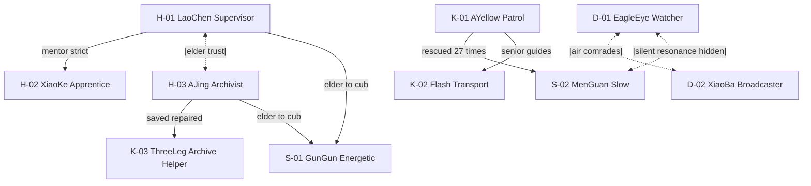

**8 条核心羁绊线**：

1. **师徒之情**：老陈 ↔ 小柯（严厉外表下的温情）
2. **元老默契**：老陈 ↔ 阿静（无需多言的信任）
3. **医患深情**：阿静 ↔ K-03（救命之恩 + 无声陪伴）
4. **救援羁绊**：K-01 阿黄 ↔ S-02 闷罐（27 次救援）
5. **忘年萌宠**：老陈/阿静 ↔ 滚滚（长辈对幼崽）
6. **前辈带娃**：K-01 ↔ K-02 闪电（容忍莽撞）
7. **空中知己**：鹰眼 ↔ 小八（截然相反性格互补）
8. **沉默共鸣**：鹰眼 ↔ 闷罐（隐藏线，最慢热）

### 1.5 一天的运转节奏

| 时段 | 名称 | 内容 |
|------|------|------|
| 05:30-06:30 | 晨启 | 调度塔广播唤醒，机器人逐个亮起眼灯 |
| 06:30-07:30 | 晨会 | 广场聚集，发布今日任务 |
| 07:30-12:00 | 上午工作 | 多线并行（车间/物流/巡逻/空中/档案馆） |
| 12:00-13:00 | 午间维护 | 广场充电 + 社交 |
| 13:00-17:30 | 下午工作 | 延续上午，可能穿插突发事件 |
| 17:30-18:30 | 日终仪式 | 夕阳下汇报，眼灯闪烁两次"下班仪式" |
| 18:30-22:00 | 夜生活 ⭐ | 充电站聚会/档案馆夜读/报废区徘徊/屋顶观星/修理厂夜灯 |
| 22:00-05:30 | 静默期 | 大部分熄灯，夜班巡逻 + 塔顶守望 |

### 1.6 为什么必须用 AI Agent

| 维度 | 传统预设编排 | AI Agent |
|------|-------------|----------|
| **决策** | 规则驱动（IF-THEN） | 记忆 + 性格 + 感知综合决策 |
| **性格差异** | 同类型 NPC 行为一样 | 8 个人形 8 种反应 |
| **内心世界** | 只有外在行为 | 有内心独白，可纠结犹豫后悔 |
| **故事** | 设计师写好 | 20 个机器人互动涌现 |
| **成长** | 永远不变 | 小柯 30 天后真的变成熟 |
| **对话** | 预设对话树 | 每次基于当下情境生成 |

**核心论点**：传统 NPC 是提线木偶，AI Agent 是活着的灵魂。项目不是在演戏，是在观察一群硅基生命真实的生活。

---

## 二、总体架构

### 2.1 双进程架构

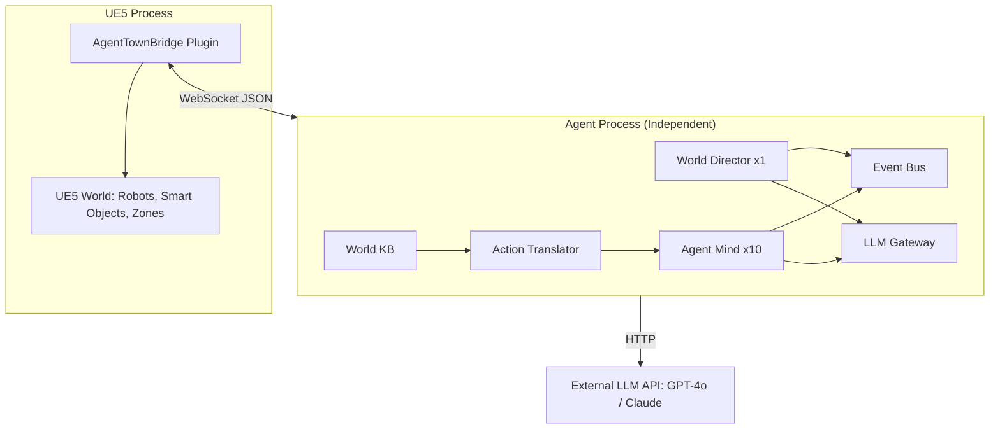

### 2.2 分层职责

| 层级 | 位置 | 职责 | 关键约束 |
|------|------|------|----------|
| **UE5 表现层** | UE5 进程 | 3D 呈现 + 基础感知 + 动作执行 | **不做任何 AI 决策** |
| **通信层** | WebSocket | 双向 JSON 消息传递 | 异步、不阻塞 UE5 主循环 |
| **核心 AI 层** | Agent 进程 | World Director + Agent Mind | 所有决策在这 |
| **支撑服务层** | Agent 进程 | World KB / Translator / LLM Gateway / Event Bus | 为 AI 层提供能力 |

### 2.3 双核心哲学

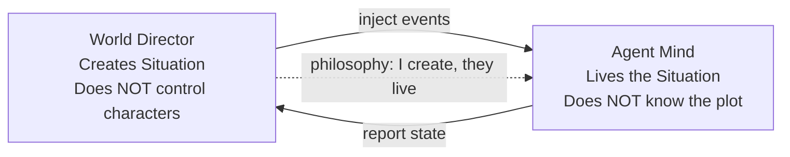

- **World Director**："我不控制角色，我创造情境。"
- **Agent Mind**："我不知道剧情，我只是活着。"
- **结合**：Director 创造情境，Agent 演绎情境，剧本涌现，无人书写。

---

## 三、子系统详解

### 子系统 1：World Knowledge Base（世界知识库）

#### 定位
整个系统的"共同语言"和"世界字典"。UE5 和 Agent 进程共享同一份文件，通过语义 ID 对齐。

#### 构建方式

**核心原则**：UE5 场景是唯一真相，World KB 是它的导出物。

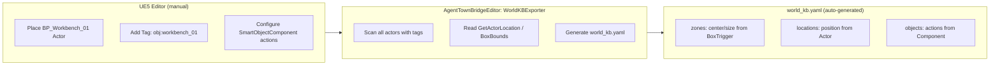

#### 数据结构（YAML）

```yaml
version: "1.0"
site:
  id: industrial_park
  name: "工业机器人园区"

zones:
  - id: main_workshop
    name: "主生产车间"
    description: "机器人们的主要工作场所"
    ue5_bounds:
      center: [200, 100, 0]        # 从 BoxTrigger 读取
      half_size: [40, 30, 10]      # 从 BoxComponent 读取
    entry_point: [160, 100, 0]     # 自动计算入口
    connected_to: [central_plaza]
    locations: [workbench_01]

locations:
  - id: workbench_01
    name: "工作台一号"
    zone: main_workshop
    type: workstation
    position: [200, 100, 0]         # Actor->GetActorLocation()
    interaction_point: [195, 105, 0]# 从 InteractionSocket 读取
    facing: [1, 0, 0]
    ue5_ref: "BP_Workbench_01"

objects:
  - id: workbench_01
    available_actions: [assemble, inspect, repair]
    required_role: [worker, repairer]
    capacity: 1
    ue5_ref: "BP_Workbench_01"

agents:
  - id: H-01
    name: "老陈"
    type: humanoid
    role: [supervisor, worker]
    capabilities: [move_to, speak, emote, work_assemble]
    personality:
      traits: [沉稳, 严厉, 护短]
      speech_style: "短句, 命令式"
    ue5_class: "BP_HumanoidRobot"
    ue5_variant: "H01_LaoChen"

relationships:
  - from: H-01
    to: H-02
    familiarity: 40
    affection: 20
    type: "师徒"
```

#### 字段来源映射

| YAML 字段 | 数据来源 | 获取方式 |
|-----------|---------|---------|
| `zone.center` | UE5 Box Trigger 位置 | `BoxComponent->GetComponentLocation()` |
| `zone.half_size` | Box Trigger 尺寸 | `BoxComponent->GetScaledBoxExtent()` |
| `location.position` | Smart Object Actor 位置 | `Actor->GetActorLocation()` |
| `location.interaction_point` | InteractionSocket 世界坐标 | Socket SceneComponent 的位置 |
| `location.ue5_ref` | Actor 的 Blueprint 类名 | `Actor->GetClass()->GetName()` |
| `object.available_actions` | SmartObjectComponent 配置 | 组件内 `TArray<FString>` |
| `agent.ue5_variant` | Robot Actor 的 BP 名 | `Actor->GetClass()->GetName()` |

#### 核心接口

| 方法 | 返回值 | 功能 |
|------|--------|------|
| `get_zone(id)` | `Zone` | 查询区域信息 |
| `get_location(id)` | `Location` | 查询地点信息 |
| `resolve_target(desc, ctx)` | `Entity` | 语义目标解析（"工作台" → workbench_01） |
| `get_position(id)` | `Vector3` | 语义 ID → 坐标 |
| `get_ue5_ref(id)` | `String` | 语义 ID → UE5 引用 |
| `which_zone(pos)` | `ZoneID` | 坐标 → 所在区域 |
| `fuzzy_match(query)` | `List[Entity]` | 模糊匹配 |

#### 待深入设计

- 完整 Schema 设计（所有字段定义）
- UE5 端 WorldKBExporter 的实现
- 动态区域支持（临时封闭某区域）
- 多层建筑的 Z 轴表达
- 语义搜索算法优化

---

### 子系统 2：UE5 侧 Plugin - AgentTownBridge

#### 定位
UE5 ↔ Agent 进程的通信桥梁，**不做任何 AI 决策**，只负责感知打包、动作执行、通信。

#### 插件信息

| 项 | 值 |
|---|---|
| 插件名 | `AgentTownBridge` |
| 路径 | `Plugins/AgentTownBridge/` |
| 模块 | `AgentTownBridge` (Runtime) + `AgentTownBridgeEditor` (Editor) |
| 依赖 | AnyAI、NavigationSystem、GameplayTasks |

#### 目录结构

```
Plugins/AgentTownBridge/
├── AgentTownBridge.uplugin
├── Source/
│   ├── AgentTownBridge/              (Runtime)
│   │   ├── Public/
│   │   │   ├── AgentTownBridge.h
│   │   │   ├── RobotAgentComponent.h      挂在机器人上
│   │   │   ├── PerceptionPackager.h       感知打包
│   │   │   ├── ActionExecutor.h           动作执行
│   │   │   ├── AgentBridgeClient.h        WebSocket 客户端
│   │   │   ├── SmartObjectComponent.h     Smart Object 组件
│   │   │   └── ZoneTriggerComponent.h     区域触发器
│   │   ├── Private/
│   │   └── AgentTownBridge.Build.cs
│   └── AgentTownBridgeEditor/        (Editor)
│       ├── Public/
│       │   └── AgentTownBridgeEditor.h
│       ├── Private/
│       │   ├── AgentTownBridgeEdMode.h
│       │   └── WorldKBExporter.h          导出场景为 YAML
│       └── AgentTownBridgeEditor.Build.cs
├── Content/
│   ├── Blueprints/
│   │   ├── BP_RobotBase.uasset
│   │   ├── BP_SmartObject.uasset
│   │   └── BP_ZoneVolume.uasset
│   └── Config/
│       └── AgentTownBridge_Settings.uasset
└── CODEBUDDY.md
```

#### 核心组件

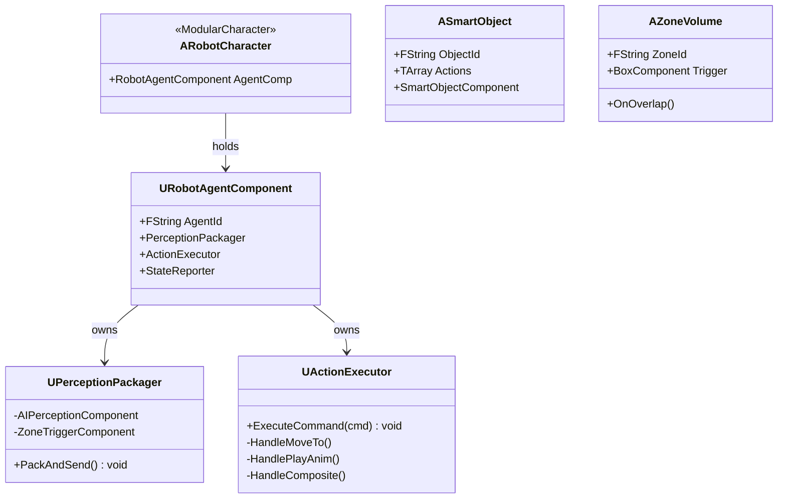

#### RobotActor 组件架构

| 组件 | 职责 |
|------|------|
| `RobotAgentComponent` | 统一管理 Agent ID + 通信入口 |
| `PerceptionPackager` | 每 3s 打包感知 → JSON → 发给 Agent 进程 |
| `ActionExecutor` | 接收 Agent 指令 → MoveTo/PlayAnim/Interact |
| `StateReporter` | 上报能量/位置/当前动作 |
| `UAIPerceptionComponent` | UE5 原生，只做看见/听见 |
| `AgentBridgeClient` | 全局单例，WebSocket 连接 |

#### Smart Object 与 Zone Trigger

**Zone Trigger**：UE5 场景里一个看不见的 Box，框住一片空间。机器人走进时触发 OnOverlap，上报 current_zone。

**Smart Object**：场景里可见的 Actor（工作台/充电桩），挂 SmartObjectComponent 声明"我是什么、能被怎么交互"。

```
BP_Workbench_01 (Actor)
  ├── StaticMesh (桌子模型)
  ├── InteractionSocket (SceneComponent, 编辑器里拖到桌子前面)
  │     ← 导出时读世界坐标作为 interaction_point
  ├── SmartObjectComponent
  │     ├── object_id = "workbench_01"
  │     ├── available_actions = ["assemble", "inspect", "repair"]
  │     └── current_state = "idle"  (运行时可变)
  └── Tag: "obj:workbench_01"
```

#### 待深入设计

- 插件 .uplugin 与 Build.cs 完整配置
- WebSocket Client 的 UE5 集成（用 IWebSocket 模块）
- SmartObjectComponent 的状态机设计
- ZoneTriggerComponent 的边界情况处理
- WorldKBExporter 的扫描算法

---

### 子系统 3：Agent Mind（个体心智）

#### 定位
每个机器人的独立 AI 大脑。每个 Agent 一个实例，共 10 个。

#### 内部模块

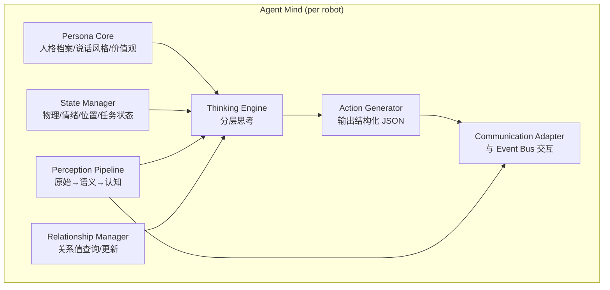

#### 分层思考（核心设计）

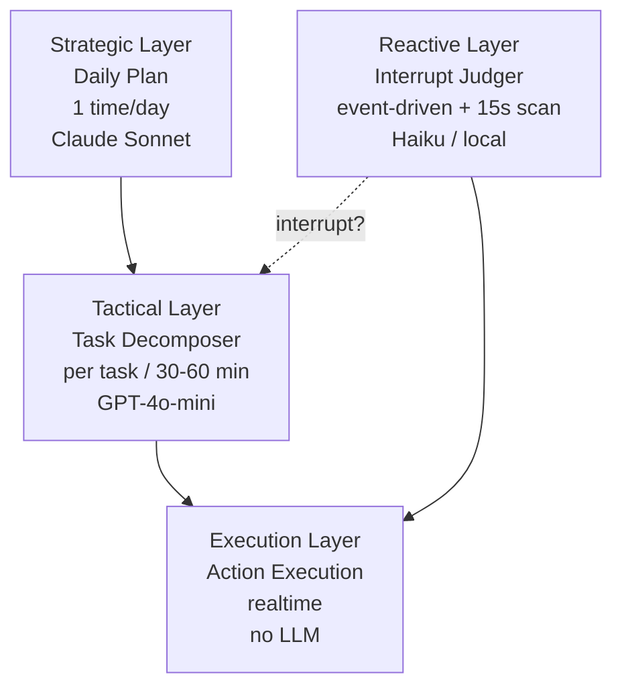

| 层级 | 触发频率 | LLM 模型 | 输入 | 输出 |
|------|----------|----------|------|------|
| **战略层** | 1 次/天（06:00） | Claude Sonnet | 昨日总结、角色卡、固定日程 | 6-10 条今日大纲 |
| **战术层** | 完成任务/每小时 | GPT-4o-mini | 当前目标、位置、状态 | 3-5 步具体行动 |
| **反应层** | 事件驱动 + 15s 扫描 | Haiku / 本地 Qwen | 当前任务、新事件、性格、关系 | 是否打断 + 反应类型 |
| **执行层** | 实时 | 不调 LLM | 原子/复合行为指令 | UE5 动作 |

#### 战略层输出示例

```json
[
  {"time":"06:00-07:00","goal":"起床+晨会"},
  {"time":"07:00-12:00","goal":"车间装配，尽量不出错"},
  {"time":"12:00-13:00","goal":"充电+和铁牛师傅聊天"},
  {"time":"13:00-17:30","goal":"下午继续装配"},
  {"time":"17:30-18:30","goal":"参加日终仪式"},
  {"time":"18:30-22:00","goal":"去档案馆学修理知识"},
  {"time":"22:00-06:00","goal":"充电休息"}
]
```

#### 反应层打断决策因素

| 因素 | 权重 | 说明 |
|------|------|------|
| 当前任务重要度 | 高 | 生产任务 vs 闲逛 |
| 新事件严重度 | 高 | 故障 vs 日常八卦 |
| 关系强度 | 极高 | 亲密的人受伤必须去 |
| 性格倾向 | 高 | 阿静会跑，闪电看情况 |
| 距离 | 中 | 太远即使想帮也来不及 |
| 能力匹配 | 中 | 我能帮得上吗 |

#### Agent 状态数据结构

| 状态类别 | 字段 | 说明 |
|----------|------|------|
| **物理** | energy, fatigue, joint_wear | 0-100，joint_wear 永久累积 |
| **情绪** | mood, mood_intensity, social_need | 当前心情与社交需求 |
| **位置** | current_position, current_zone, current_location | 由 UE5 实时上报 |
| **任务** | daily_plan, current_task, task_stack | 任务栈支持打断恢复 |

#### 待深入设计

- 10 个角色的完整 Persona Prompt 模板
- 分层思考的时序控制与并发
- Task Stack 的实现（打断与恢复）
- 反应层快速决策算法优化
- Agent 状态持久化（重启恢复）
- 多 Agent 并发决策的资源调度
- Agent 行为可观测性（决策日志）

---

### 子系统 4：World Director（世界导演）

#### 定位
全局唯一的 AI 编剧。观察整个世界，决定何时投放事件，编织剧情。

#### 内部模块

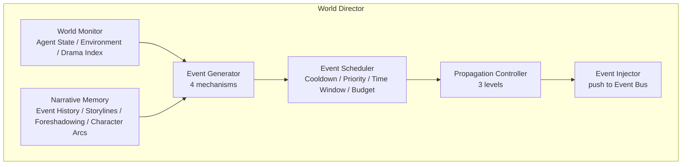

#### 四种事件生成机制

| 机制 | 比例 | 触发方式 | 示例 |
|------|------|----------|------|
| **规则驱动** | 35% | 状态阈值 + 概率 | joint_wear > 80 → 5% 故障 |
| **概率驱动** | 25% | 每小时掷骰子 | 材料短缺 / 天气变化 |
| **剧情驱动** ⭐ | 30% | Director LLM 主动编剧 | "该给闷罐加戏了" |
| **脚本驱动** | 10% | 预设关键节点 | Day30 小柯首次独立完成 |

#### Director LLM 工作流

```
每 30 分钟 Director 醒来:
1. 收集世界状态快照
   - 各机器人状态
   - 最近 1 小时事件
   - 当前剧情线进度
2. 计算"戏剧张力指标"
3. 询问 LLM: "现在需要投放事件吗?"
4. 如需要:
   a. 从事件模板库选择/生成
   b. 决定涉及机器人
   c. 决定强度和时机
5. 提交事件调度器审核
6. 通过则触发
7. 记录到叙事日志
```

#### 三级传播模型

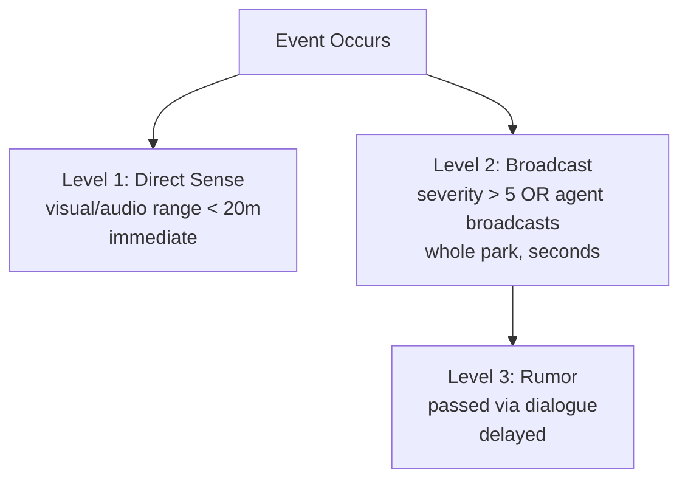

**信息不对称是让世界真实的关键**：有人第一时间知道，有人从别人嘴里得知，有人可能永远不知道。

#### 事件对象结构

| 字段 | 类型 | 说明 |
|------|------|------|
| id | str | 唯一 ID |
| timestamp | datetime | 发生时间 |
| type | str | malfunction/social/environmental... |
| location | LocationRef | 位置 |
| primary_agent | str | 主要涉及者 |
| involved_agents | List[str] | 其他涉及者 |
| severity | int | 1-10 |
| propagation_level | int | 1/2/3 |
| source | str | rule/random/director/script |
| reasoning | str | Director LLM 的理由 |
| narrative_purpose | str | 剧情作用 |
| status | str | pending/active/resolved |

#### 待深入设计

- Director LLM 的完整 Prompt 模板与工程化
- 戏剧张力指标的计算公式
- 角色弧光追踪的数据结构
- 多剧情线编织算法
- 概率事件池完整清单（30-50 个模板）
- 脚本事件编写规范
- Director 决策可解释性面板

---

### 子系统 5：Perception System（感知系统）

#### 定位
连接 3D 世界与 LLM 语义世界的翻译层。UE5 坐标 → LLM 自然语言。

#### 三层感知架构

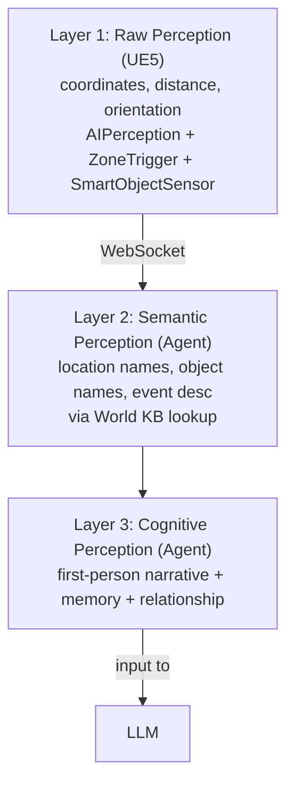

#### UE5 端感知组件

| 感知类型 | UE5 实现 | 用途 |
|----------|----------|------|
| 视觉感知 | `UAIPerceptionComponent` (Sight) | 视线内的 Actor |
| 区域感知 | `ZoneTriggerComponent` (Box Overlap) | 当前所在 Zone |
| 空间查询 | Sphere Overlap / GetOverlappingActors | 附近的 Smart Object |
| 听觉/事件 | 自定义 Sound Event 系统 | 最近听到的广播 |

#### 感知打包频率

| 触发方式 | 频率 | 说明 |
|---------|------|------|
| 定时 | 3-5 秒 | 基础感知快照 |
| 事件驱动 | 即时 | 有新事件时立即发送 |
| 状态变化 | 即时 | 位置/朝向大幅变化时 |
| 主动请求 | 按需 | Agent Mind 调用 scan_area 时 |

#### UE5 → Agent 的原始感知数据

```json
{
  "agent_id": "H-03",
  "timestamp": 1234567890,
  "raw_perception": {
    "location": {
      "position": [245.3, 128.7, 0],
      "current_zone_id": "archive_room",
      "current_location_id": "repair_table"
    },
    "visible_actors": [
      {"id": "K-03", "distance": 2.1, "angle": 15, "action": "resting"}
    ],
    "audible_events": [
      {"type": "broadcast", "source": "D-02", "content_id": "evt_001"}
    ],
    "nearby_smart_objects": [
      {"id": "repair_table", "distance": 0.5, "state": "idle"}
    ]
  }
}
```

#### 最终给 LLM 的感知输入（认知层）

```
你现在在档案馆的修理台旁。时间是下午 14:23。

你看到:
- K-03 三条腿 (你最亲近的伙伴, 就在旁边), 正在休息
- S-01 滚滚 (熟悉的同事, 不远处), 正在滚动

你附近可以使用:
- 修理台 (闲置)
- 档案终端 (闲置)

你听到: D-02 小八在广场广播: "K-03 出事了!"
```

#### 待深入设计

- UE5 AI Perception 的详细配置（视野/遮挡/听觉半径）
- Zone Trigger 边界情况处理
- 感知频率自适应优化（静止时降频）
- 感知数据压缩与去重
- 视线遮挡（LOS）性能优化
- 多层感知融合
- 感知偏差模拟

---

### 子系统 6：Action System（行动系统）

#### 定位
把 LLM 的意图翻译成 UE5 可执行指令。语义 → 坐标。

#### 两层行为架构（关键设计）

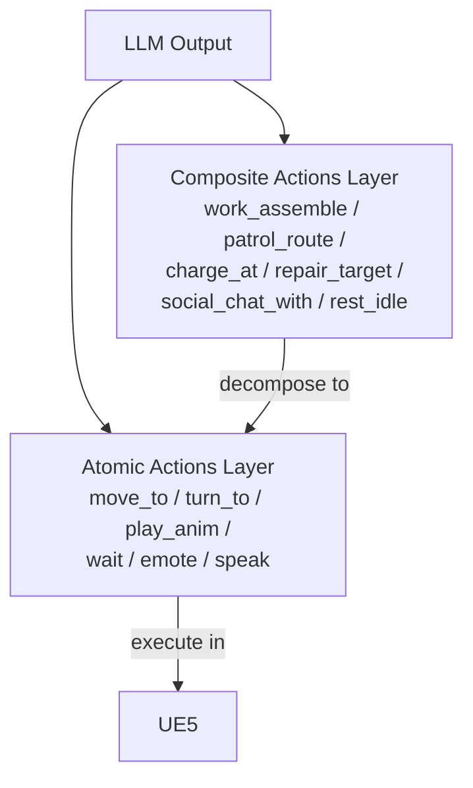

**LLM 默认用复合行为**（"去装配 2 小时"），需要精细控制时下钻原子行为（"走到 K-03 旁边说句话"）。两种可混在同一 actions 数组里。

#### 复合行为清单

| 复合行为 | 参数 | 对应 UE5 实现 |
|----------|------|--------------|
| `work_assemble` | target, duration_min | StateTree: ST_WorkAssemble |
| `patrol_route` | route_id | StateTree: ST_Patrol |
| `charge_at` | station_id, duration_min | StateTree: ST_Charge |
| `repair_target` | agent_id | StateTree: ST_Repair |
| `social_chat_with` | agent_id | StateTree: ST_SocialChat |
| `rest_idle` | duration_min | StateTree: ST_RestIdle |
| `archive_research` | duration_min | StateTree: ST_ArchiveResearch |

#### 原子行为清单

| 类别 | 行为 | 说明 |
|------|------|------|
| 移动 | move_to / stop / turn_to | 基础移动 |
| 交互 | interact_with / pick_up / put_down | Smart Object 交互 |
| 表达 | speak / broadcast / emote / play_animation | 对话与情绪 |
| 感知 | look_at / scan_area | 主动感知 |
| 状态 | wait / idle | 等待与待机 |
| 专业 | assemble_part / diagnose / record_event / patrol / fly_to | 角色专属 |

#### 复合行为在 UE5 的实现（StateTree 示例）

```
ST_WorkAssemble:
  ├── State 1: MoveToInteractionPoint
  │     目标 = workbench_01 的 interaction_point
  │     完成 → State 2
  ├── State 2: TurnToFace
  │     朝向 workbench_01
  │     → State 3
  ├── State 3: PlayAssembleLoop
  │     循环播放装配动画
  │     随机插入小动作 Montage（擦汗/检查零件）
  │     duration 到 → State 4
  └── State 4: Done
        发 action_completed 回 Agent 进程
```

#### LLM 输出格式

```json
{
  "inner_thought": "K-03出事了？但它明明就在我旁边啊...",
  "emotion": "worried",
  "actions": [
    {"action": "emote", "params": {"emotion": "worried"}},
    {"action": "turn_to", "params": {"target": "K-03"}},
    {"action": "move_to", "params": {"target": "K-03", "speed": "run"}},
    {"action": "speak", "params": {"content": "别怕，我在这里。", "target": "K-03"}}
  ]
}
```

#### Action Translator 核心逻辑

| 目标类型 | 解析方式 |
|----------|----------|
| Agent ID | 查 World KB → 实时位置（UE5 上报） |
| Location ID | 查 World KB → 固定 interaction_point |
| Zone ID | 查 World KB → entry_point |
| 模糊描述 | 当前 zone 内模糊匹配 → 就近选择 |

#### 与现有项目的关系

PEGame 已有完整 AI 框架（AnyAI 插件、BT、MonsterLLMBrain）。本方案**复用现有 BT/StateTree 基础设施**：
- 复合行为 = 现有 BT/StateTree 资产，带参数启动
- RobotAgentComponent 接收指令 → 设置 Blackboard → RunBT
- BT 执行完触发 OnTaskFinished → 上报 Agent 进程

#### 待深入设计

- 完整复合行为清单（覆盖 10 个机器人所有行为）
- Action Translator 完整实现
- 组合动作表达（CarryAndMove）
- 动作失败错误处理（目标不可达、被打断）
- 动作队列中断与恢复
- 动作并行执行（边走边说）
- 专业动作的 Smart Object 绑定
- 动画选择策略（同动作多变体）

---

### 子系统 7：Event Bus（事件总线）

#### 定位
所有事件流转的中央枢纽。连接 World Director、Agent Mind、UE5 三方。

#### 消息类型

| 类型 | 方向 | 说明 |
|------|------|------|
| perception_update | UE5 → Agent | 感知快照 |
| event_notification | Director → Agent | 事件推送 |
| agent_action | Agent → Director | 状态上报 |
| action_command | Agent → UE5 | 动作指令 |
| action_completed | UE5 → Agent | 完成回执 |
| state_broadcast | Agent → 全体 | 状态广播 |

#### 事件路由逻辑

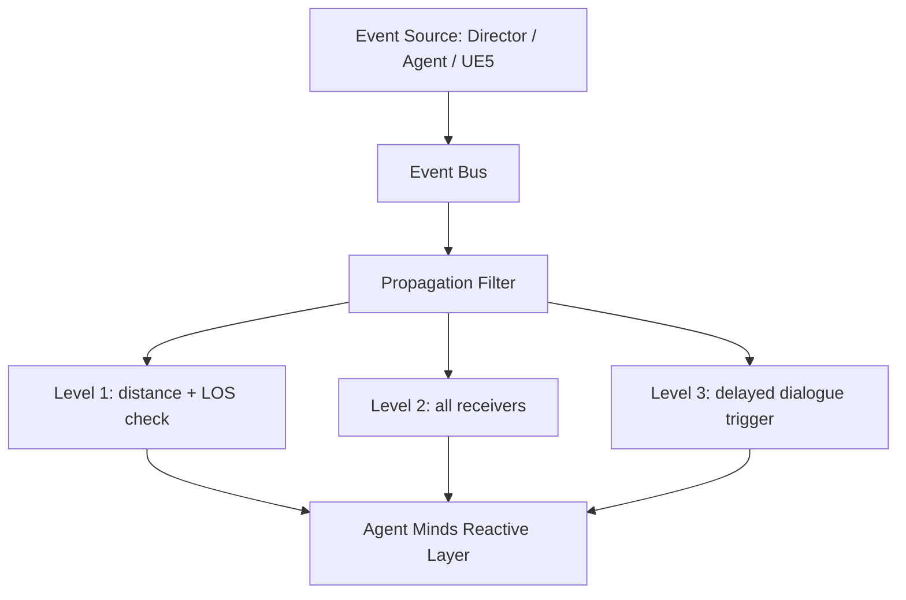

#### 待深入设计

- Event Bus 完整消息 Schema
- Redis Streams vs Pub/Sub 选型
- 事件持久化策略
- 事件回放系统设计
- 高并发性能优化

---

### 子系统 8：Communication Layer（通信层）

#### 定位
UE5 客户端与 Agent 进程的双向通信管道。

#### 技术选型
WebSocket + JSON（UE5 有原生 WebSocket 模块，易调试）

#### 消息封装

```json
{
  "msg_id": "uuid",
  "timestamp": 1234567890,
  "type": "action_command|perception_update|...",
  "agent_id": "H-03",
  "payload": {...}
}
```

#### 关键设计

| 特性 | 实现 |
|------|------|
| 异步双工 | WebSocket 长连接 |
| 消息去重 | msg_id |
| 心跳检测 | 定时 ping/pong |
| 重连机制 | 指数退避重连 |
| 消息队列缓冲 | UE5 卡顿时不丢消息 |

#### 待深入设计

- UE5 WebSocket 模块详细集成
- 消息序列化优化（Protobuf vs JSON）
- 多客户端场景（多个观察者）
- 网络断连恢复策略
- 消息压缩与批处理

---

### 子系统 9：Observer System（观察者系统）

#### 定位
玩家/用户如何"看"这个世界。产品化关键。

#### 视角模式

| 模式 | 描述 | 用途 |
|------|------|------|
| 上帝视角 | 俯瞰整个园区 | 全局观察 |
| 跟随视角 | 跟随某 Agent | 沉浸体验 |
| AI 导演视角 | 自动切换精彩画面 | 纪录片模式 |
| 自由摄影机 | 玩家自由控制 | 截图/录制 |

#### 信息面板

- 当前时间 / 戏剧张力 / 今日大事记
- Agent 状态列表（位置/情绪/当前动作）
- Agent 内心日志（点击展开思考过程）
- 剧情时间线（历史事件/剧情线/角色成长曲线）

#### 待深入设计

- AI 导演视角算法（判断"精彩画面"）
- 摄影机运动电影感设计
- UI/UX 详细设计
- 数据可视化（关系图谱、时间线）
- 回放系统实现
- 导出功能（生成短片）

---

### 子系统 10：LLM Gateway（大模型网关）

#### 定位
统一管理所有 LLM 调用。路由、限流、缓存、降级。

#### 分层调用策略

| 调用类型 | 推荐模型 | 频率 |
|----------|----------|------|
| Director 编剧 | Claude 3.5 Sonnet | 48 次/天 |
| Daily Plan | Claude 3.5 Sonnet | 10 次/天 |
| 任务分解 | GPT-4o-mini | 100 次/天 |
| 反应层判断 | Claude Haiku / 本地 Qwen | 300 次/天 |
| 对话生成 | Claude 3.5 Haiku | 50 次/天 |

#### 成本预估（10 Agent + 1 Director）

| 调用类型 | 每天次数 | 单价 | 每日成本 |
|---------|---------|------|---------|
| Director | 48 | $0.02 | $1.0 |
| Daily Plan | 10 | $0.015 | $0.15 |
| Tactical | 100 | $0.002 | $0.20 |
| Reactive | 300 | $0.001 | $0.30 |
| Dialogue | 50 | $0.003 | $0.15 |
| **合计** | | | **约 $2/天** |

#### 待深入设计

- 模型路由策略细化
- 缓存策略（哪些能缓存哪些不能）
- 本地模型部署（Qwen/Llama via Ollama）
- Prompt 版本管理
- A/B 测试框架
- 失败降级策略

---

## 四、跨系统数据流

### 完整示例：老陈"去主生产车间装配"的 8 步流程

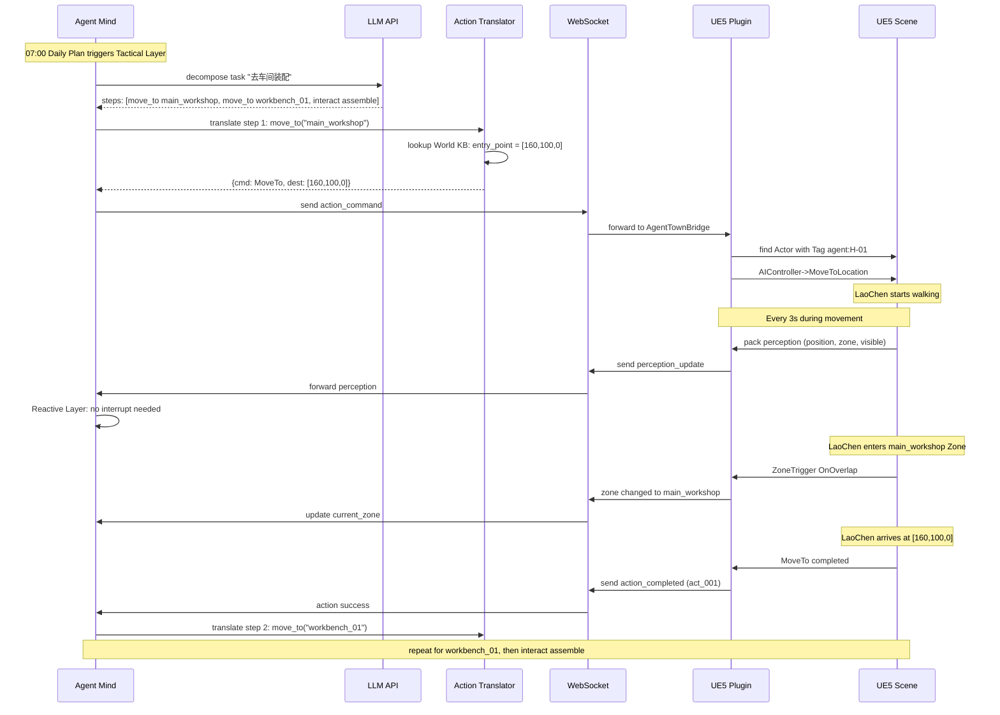

### 突发事件示例：K-03 故障的完整流程

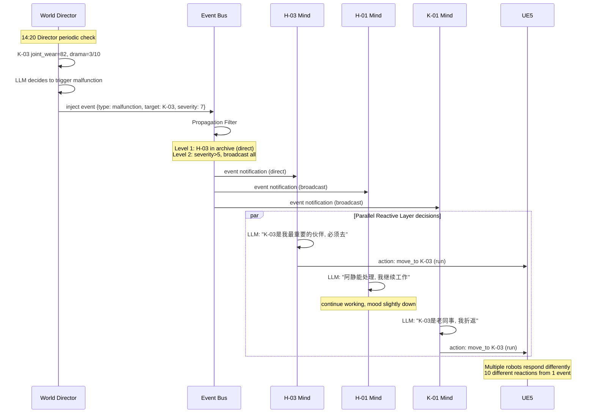

---

## 五、技术选型

| 类别 | 技术 | 版本/规格 |
|------|------|-----------|
| **游戏引擎** | Unreal Engine 5 | 5.7（项目当前版本） |
| **UE5 关键系统** | State Tree, Smart Objects, AI Perception, NavMesh | 原生 |
| **UE5 插件** | AgentTownBridge (新建) | Runtime + Editor |
| **通信协议** | WebSocket + JSON | - |
| **消息队列** | Redis Pub/Sub | 7+ |
| **事件日志** | PostgreSQL | 15+ |
| **关系图** | PostgreSQL (JSON) 或 Neo4j | - |
| **LLM 主力** | Claude 3.5 Sonnet / GPT-4o | API |
| **LLM 快速** | Claude Haiku / GPT-4o-mini | API |
| **LLM 本地** | Qwen 2.5 / Llama 3.1 | Ollama |
| **TTS** | ElevenLabs / Edge TTS | - |
| **部署** | Docker + docker-compose | - |

---

## 六、实施路线

### Phase 1：单体验证（1-2 个月）

| 任务 | 说明 |
|------|------|
| 搭建 AgentTownBridge 插件骨架 | .uplugin + Build.cs + 核心组件 |
| World KB 最小 YAML + 导出工具 | 1 区域 + 1 机器人 + 1 工作台 |
| WebSocket 通信打通 | UE5 ↔ Agent 进程双向消息 |
| 单 Agent 跑通感知-决策-行动闭环 | 老陈能走到工作台装配 |
| 基础原子行为库 | move_to / wait / emote |
| 1 个复合行为 | work_assemble (StateTree) |

### Phase 2：生态雏形（2-3 个月）

| 任务 | 说明 |
|------|------|
| 扩展到 5 个机器人 | 4 种类型各 1-2 个 |
| 完整 World KB | 6 区域 + 10 居民 |
| 分层思考实现 | 战略/战术/反应层 |
| 关系系统 | 关系值查询与更新 |
| 基本社交对话 | 两机器人相遇对话 |
| 手动事件注入接口 | 调试用 |

### Phase 3：世界成型（3-4 个月）

| 任务 | 说明 |
|------|------|
| 扩到 10 个机器人 | 完整角色卡 |
| World Director | 4 种事件生成机制 |
| 突发事件系统 | 三级传播 |
| 观察者模式 | 上帝视角 + 跟随视角 |
| Agent 内心日志面板 | 可视化思考过程 |

### Phase 4：亮点打磨（1-2 个月）

| 任务 | 说明 |
|------|------|
| 电影级视觉调优 | Lumen/Nanite/Niagara |
| AI 导演视角 | 自动切换精彩画面 |
| 剪辑 Demo 片 | 3 分钟宣传片 |
| 性能优化 | LOD、动画剔除、LLM 批处理 |
| 上线 Demo 版本 | - |

---

## 七、待深入设计方向

### 优先级 1（核心必做）

- World Knowledge Base 完整 Schema 设计
- 原子行为库 + 复合行为库完整清单
- UE5 ↔ Agent 进程通信协议完整定义
- AgentTownBridge 插件骨架搭建

### 优先级 2（Phase 1 需要）

- Agent Mind 完整代码结构
- Perception Pipeline 实现
- Action Translator 实现
- UE5 端 Smart Object 系统设计
- StateTree 复合行为资产实现

### 优先级 3（Phase 2 展开）

- World Director 完整设计
- Director LLM Prompt 工程
- 事件模板库设计
- Event Bus 传播控制
- 关系图谱数据结构

### 优先级 4（打磨阶段）

- Observer System UI 设计
- AI 导演视角算法
- 性能优化与成本控制
- 回放系统
- 10 个角色的完整 Persona Prompt

---

## 八、总结

**一句话概括**：

> **两个 AI 核心（World Director 编剧 + Agent Mind 演员），通过 Event Bus 连接，共享 World Knowledge Base 作为世界字典，靠 Perception 感知、Action 执行，让 10 个机器人在 UE5 里活出各自的命运。**

**宣传语**：

> **"10 个 AI 灵魂，一座自运转的机器人小镇。你不玩它，你观察它，如同观察一个真实存在的世界。"**

### 设计核心原则

1. **UE5 场景是唯一真相**，World KB 是它的导出物
2. **UE5 不做 AI 决策**，只管感知与执行
3. **LLM 需要符号世界**，不是 3D 坐标
4. **Director 创造情境，Agent 演绎情境**，剧本涌现
5. **信息不对称让世界真实**
6. **分层思考**让 Agent 既连贯又灵活
7. **复合行为 + 原子行为**两层架构，灵活与效率兼顾
8. **复用现有 BT/StateTree 基础设施**，不重造轮子

---

*本文档基于 AI Agent 机器人小镇设计讨论整理，作为后续实现的单一真理参考点。*
