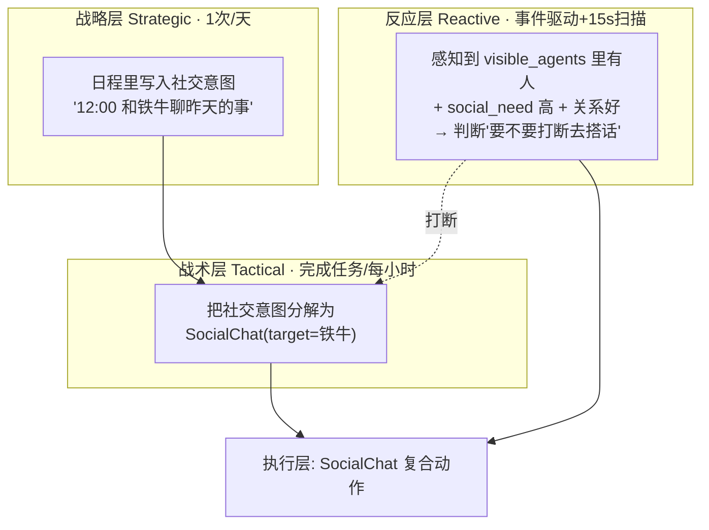
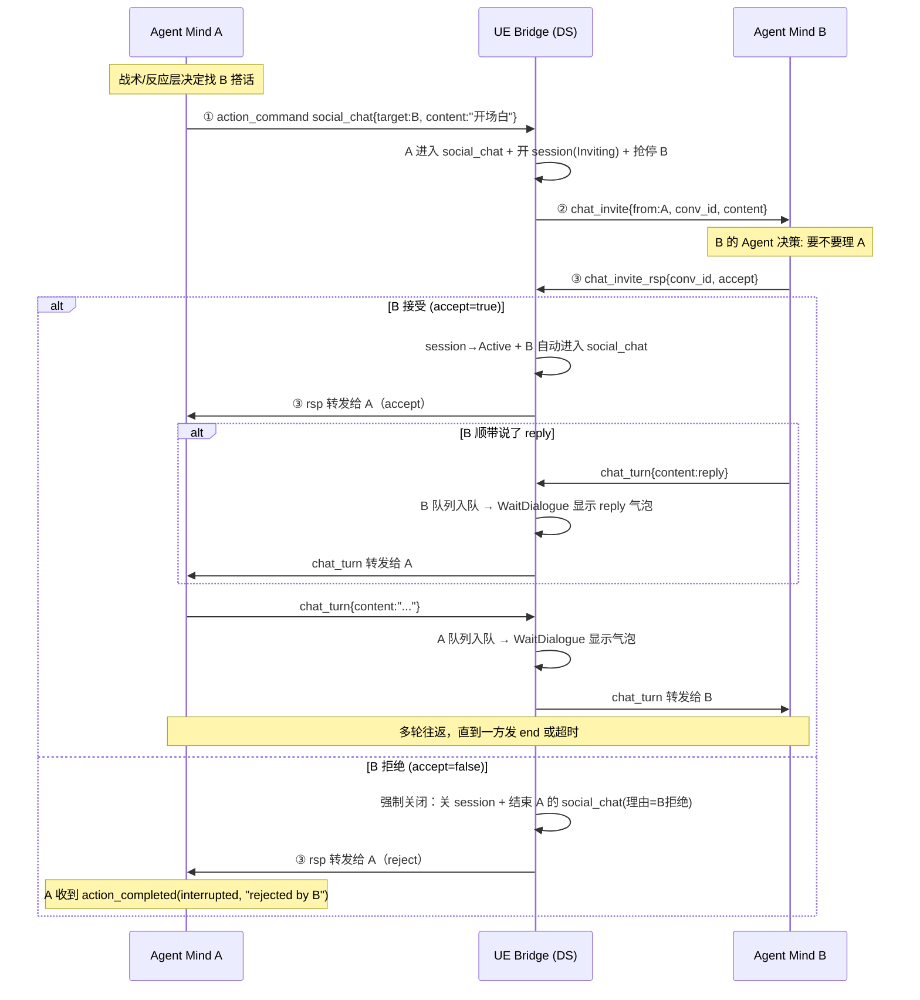

# Agent Town · NPC 对话系统设计方案

> 二期模块 C（社交互动）的核心子系统设计。基于 `AgentTown_Design.md` 的三层思考架构（战略/战术/反应）与 `AgentTown_Phase2_Plan.md` 的模块 C 拆分，聚焦 **NPC 之间的双向对话** 如何落地。
>
> **分工原则**（延续二期总纲）：UE 侧负责"舞台与传声筒"（相遇感知、发言表现、消息转发、动作执行、会话状态），**不做对话内容决策**；Agent 侧负责"灵魂"（何时搭话、说什么、如何回应、何时结束），**所有对话决策在这里**。
>
> **本文档与代码同步**：协议名 `chat_invite / chat_invite_rsp / chat_turn`，session 带状态标记，结束分「优雅结束 / 强制结束」两种。

---

## 目录

1. [现状盘点](#一现状盘点)
2. [核心问题：对话何时发起](#二核心问题对话何时发起)
3. [对话通道与会话状态机](#三对话通道与会话状态机)
4. [UE 侧改动清单](#四ue-侧改动清单)
5. [Agent 侧设计](#五agent-侧设计)
6. [分阶段落地](#六分阶段落地)
7. [附：与二期计划的对应关系](#七附与二期计划的对应关系)

---

## 一、现状盘点

对插件里与对话相关的现有能力做了梳理：

| 能力 | 现状 | 结论 |
|------|------|------|
| **Speak 动作** | `BTTask_AgentTownSpeak` → `MulticastShowSpeech`，**单向广播气泡**，非阻塞立即返回 | 只有"说给玩家看"，没有"说给某个 NPC 听" |
| **感知里的其他 NPC** | `visible_agents`（sphere overlap，含 `id`/`distance`/`current_action`） | 有相遇检测基础，但缺"是否可对话" |
| **消息路由** | `UAgentBridgeClient` 按 `agent_id` 路由，单连接多 Agent | 只能 UE → 单个 Agent，需要补 A→B 定向转发 |
| **动作注册** | DataTable 驱动，`SocialChat` 在 Phase2 计划里但**尚未实现 BT** | 需要新增复合动作 |

**核心结论**：当前是"独白系统"，缺三样东西：
1. **定向发言的转发通道**（A→B）
2. **`SocialChat` 复合动作**（走过去 + 转向 + 对话挂起）
3. **相遇触发的感知信号**（visible_agents 补可对话性）

---

## 二、核心问题：对话何时发起

两种发起场景（**主动去找某人** vs **路上偶遇**）本质是**不同触发层**的产物，正好映射三层架构。建议**两种都做，但走同一套执行动作**。



- **方式 A（主动找人）**：战略/战术层，走正常 `social_chat` action_command。
- **方式 B（路上偶遇）**：反应层，读 `visible_agents` 决定是否发起，触发后同样落到 `social_chat`。

> **关键取舍**："何时发起"**完全是 Agent 侧决策，UE 侧不做**。UE 只如实上报"相遇的物理事实"。先做方式 A，跑通后再加方式 B。

---

## 三、对话通道与会话状态机

### 3.1 协议（三条消息 + 一个动作）

| 协议 | 方向 | 含义 |
|------|------|------|
| `chat_invite` | UE → B 的 Mind | A 想跟你说话（带 `from` + `content` + `conv_id`） |
| `chat_invite_rsp` | B 的 Mind → UE | B 的**决定**（仅 `accept` 布尔，**不带 reply**） |
| `chat_turn` | speaker 的 Mind → UE | 发言内容（`content` + 可选 `end` / `interrupted`） |
| `social_chat` (action_command) | A 的 Mind → UE | A 发起对话（带 `target_agent_id` + `content`） |

**职责分离（重要）**：
- `chat_invite_rsp` 只表达 **accept / reject 决定**，不承载发言内容。
- 所有发言（包括 B 接受时顺带说的第一句 `reply`）统一走 **`chat_turn`**。Agent 侧"发言都从 chat_turn 收、决定都从 chat_invite_rsp 收"，处理逻辑统一。

**`conv_id` 由 UE 自动生成**（Agent 不传），贯穿 invite/rsp/turn，串起整场对话。

### 3.2 Session 状态机（唯一权威判断）

会话状态存在 `UAgentBridgeClient` 的 `DialogueSessions` 表里，带状态标记：

```
Inviting ──B accept──▶ Active ──任一方 chat_turn{end}──▶ Closed
    │                      │
    └────────强制关闭──────┴─────▶（Remove，从表里删除）
```

| 状态 | 含义 |
|------|------|
| `Inviting` | A 已发 `chat_invite`，等 B 的 `chat_invite_rsp` |
| `Active` | B 接受，双方都在 `social_chat` 动作中 |
| `Closed` | 优雅结束，标记关闭（保留记录供对方收尾） |

> **核心原则**：任何一方主动结束对话，都会把 session 置为 `Closed` 或直接删除（Remove）。另一方消息来了，发现 session 不存在/已关闭，就**主动关闭自己的对话**——这是所有异常时序的统一兜底。

### 3.3 四步流程（主动发起）



**逐步说明**：

| 步 | 方向 | 消息 | UE 侧动作 |
|---|------|------|-----------|
| ① | Agent→UE | `social_chat`(A, `target` + `content`) | A 进 social_chat；开 session(`Inviting`)；抢停 B |
| ② | UE→Agent | `chat_invite`(B, `from` + `content`) | 抢停 B 后，B 停原地待命 |
| ③ | Agent→UE | `chat_invite_rsp`(B, `accept`) | accept→B 自动进 social_chat（reply 若带则走 chat_turn）；reject→强制关闭 |

**关键点**：
- **② 抢停不等决策**：UE 一转发 invite 就同步 stop B 的 action（`AbortCurrentAction`），决策要走 LLM 有延迟，先停下符合真人直觉。
- **B 自动进入对话**：accept 后 UE 直接 `EnterSocialChatAction` 注入，B 不需再发 `social_chat` 命令。
- **B 的 reply 是"发言"不是"决定"**：若 B accept 时顺带说了 reply，它作为 `chat_turn` 转发给 A（而非塞进 rsp），保持"发言统一走 chat_turn"的语义。
- **显示由 action 驱动**：气泡只在 `WaitDialogue` 里显示，不在消息到达时直接显示。

### 3.4 结束机制（两种）

#### 优雅结束（chat_turn 带 `end=true`）

**各自关闭各自的**，不强制打断对方：

```
A 发 chat_turn{content:"回头聊", end:true}
  → A 队列入队（含 end 标记）
  → 转发 chat_turn{end} 给 B 的 Mind
  → session 标记 Closed（不 Remove，也不 abort 对方）
A 的 WaitDialogue 消费 end → 显示告别语 → Finish（A 优雅关闭）

B 的 Mind 收到 end，可继续回话 chat_turn{end}，也可不回：
  · 回话 → B 队列入队（含 end）→ B 的 WaitDialogue 消费 → B 优雅关闭
  · 不回 → B 的 WaitDialogue 检测 session 已 Closed → B 优雅关闭
```

> 优雅结束**不主动 abort 对方**——对方收到带 `end` 的 turn 后，自己决定再回一句（也带 end）还是直接收尾，最后各自关闭。

#### 强制关闭（新 action / stop_action / reject / 销毁 / 超时）

UE 主动关双方，理由通过 `action_completed.reason` 传回 Agent：

```
触发点：新 action 打断 / stop_action / B reject / NPC 销毁 / idle 超时
  → ForceCloseDialogue(reason)
    · CloseDialogueSession（Remove session）
    · abort 对方的 social_chat（PreemptForDialogue(reason)）
    · 清双方状态（ResetDialogueState）
```

| 触发点 | 处理 | reason |
|--------|------|--------|
| 对话中一方发新 action | ActionExecutor auto-interrupt | `dialogue:new action` |
| 对话中一方发 stop_action | `OnEnvelopeReceived` stop 分支 | `dialogue:stop_action by X` |
| B 拒绝 | `HandleInviteResponse` reject 分支 | `dialogue:rejected by B` |
| B 未响应就发新 action（隐式放弃） | action_command 分支检测 pending invite | `dialogue:abandoned by B` |
| NPC 销毁 | `EndPlay` | `dialogue:actor destroyed` |
| 双方沉默超时 | `WaitDialogue` idle timeout | `dialogue:idle timeout` |

### 3.5 Session 兜底（所有异常时序的统一解）

**任何一方结束对话 → session 置 Closed / 删除 → 另一方消息来了发现 session 没了 → 主动关自己**：

- `chat_invite_rsp` 到达时 session 不存在（A 已先结束）：
   - B **accept** → 发 `chat_turn{end:true, interrupted:true}` 给 **B 自己的 Mind**，纠正 B"以为对话成立"的错觉（B 同意聊天但对方已走）。
   - B **reject** → 只需清 pending invite，**不通知**（B 本就拒绝，拒绝一个已结束的对话无意义）。
- `chat_turn` 到达时 session 不存在 → speaker 若还自认为在对话，强制关自己。
- `chat_turn` 到达时自己已退出该会话（`ActiveConvId != ConvId`）→ 忽略迟到消息。

### 3.6 显示机制（气泡由 action 驱动）

气泡显示**只在 `BTTask_WaitDialogue` 里**，不在消息到达时直接显示。消息到达后先入组件队列（`PendingDialogueMsgs`），WaitDialogue 在 Tick 里消费队列并调 `MulticastShowSpeech`。

两个独立时长参数（容易混淆，务必区分）：

| 参数 | 含义 | 控制什么 |
|------|------|---------|
| `BubbleDisplaySec`（3.5s） | 气泡本身寿命 | `MulticastShowSpeech(content, BubbleDisplaySec)` 内部 Timer，到点隐藏气泡 |
| `MinDisplaySec`（1.2s） | 取下一句的**节流下限** | `BubbleTimer`，只决定"何时允许取下一句" |

具体行为：
- **队列有下一条消息** → 当前句显示约 `MinDisplaySec`(1.2s) 就被下一句顶掉（快速连播，不拖节奏）
- **队列空（没有新消息）** → 最后一句完整显示 `BubbleDisplaySec`(3.5s) 才隐藏（`BubbleTimer` 此时只是倒计时，不影响显示时长）

> 结论：**气泡显示时长永远由 `BubbleDisplaySec` 决定**，`MinDisplaySec` 只影响"有连续消息时的切换节奏"。

### 3.7 A 与 B 是对等的 Agent

**B 不是"被动接收"的一方**。收到 invite 后，B 走一遍自己的 Agent 决策，accept 后也**进入自己的 social_chat 动作**。UE 代码对 A、B 无"发起方/接收方"之分：
- A 发起：A 下发自己的 `social_chat`（走向 B）
- B 接受：UE 自动 `EnterSocialChatAction`（B 转向/走向 A）
- 对话期间，双方各自跑一个 `social_chat` 动作，各占一个动作槽，直到结束才回各自日程。

---

## 四、UE 侧改动清单

### 1. 协议层（`AgentBridgeMessage.h`）

```cpp
static const TCHAR* Type_ChatInvite    = TEXT("chat_invite");     // UE→B: A 想找你说话
static const TCHAR* Type_ChatInviteRsp = TEXT("chat_invite_rsp"); // B→UE: accept(仅决定, 不带 reply)
static const TCHAR* Type_ChatTurn      = TEXT("chat_turn");       // 发言(可选 end=true / interrupted=true)
static const TCHAR* Cmd_SocialChat     = TEXT("SocialChat");      // ①A发起
```

### 2. Session 状态（`AgentBridgeClient.h/.cpp`）

```cpp
enum class EDialogueSessionState : uint8 { Inviting, Active, Closed };
struct FDialogueSession {
    FString InitiatorId;   // A
    FString TargetId;      // B
    EDialogueSessionState State;
};
TMap<FString, FDialogueSession> DialogueSessions;

void OpenDialogueSession(ConvId, A, B);      // state=Inviting
void SetDialogueState(ConvId, State);        // Inviting→Active / →Closed
bool IsDialogueOpen(ConvId);                 // 存在且非 Closed
FString GetDialoguePeer(ConvId, SelfId);     // 找对方
bool IsAgentInDialogue(AgentId);             // 是否在 open 的对话中
void CloseDialogueSession(ConvId);           // Remove
```

### 3. 定向投递（`AgentBridgeClient`）

```cpp
void SendToAgent(TargetAgentId, Type, Payload);  // 转发到指定 Agent 的 Mind
```

### 4. 对话编排（`RobotAgentComponent`）

- `HandleSocialChatInitiation`：开 session + 抢停 B + 发 `chat_invite`
- `HandleInviteResponse`：accept→B 自动进 social_chat（reply 走 chat_turn）；reject→`ForceCloseDialogue`；**session 已不存在且 accept→通知 B 自己**
- `HandleDialogueTurn`：入队显示 + 转发 + end→优雅结束
- `ForceCloseDialogue(Reason, ConvId?)`：强制关闭（关 session + abort 对方 + 清双方）
- `EnterSocialChatAction`：B 自动注入 social_chat（`bEnteringSocialChat` 守卫防误判）
- 状态：`ActiveConvId` + `PendingInviteConvId` + 消息队列 `PendingDialogueMsgs`

### 5. 感知层（`visible_agents` 补字段）

```cpp
AJson->SetBoolField(TEXT("is_moving"), OtherComp->IsMoving());
AJson->SetBoolField(TEXT("in_conversation"), Client->IsAgentInDialogue(OtherComp->AgentId));
AJson->SetBoolField(TEXT("is_available"), OtherAction == "idle" && !bOtherInConv);
AJson->SetBoolField(TEXT("interruptible"), !bOtherInConv);
```

### 6. `social_chat` 复合动作（BT 资产 + DataTable 行）

```
BT_Action_SocialChat:
  ResolveActionTarget(agent, target_id=对方)
    → MoveTo(交互距离)
    → TurnTo(面向对方)
    → WaitDialogue      // 挂起：消费队列显示气泡，end/session关闭/超时则结束
    → FinishAction
```

- DataTable 加行：`CmdName=SocialChat, ActionBT=BT_Action_SocialChat, Params=[target_agent_id, content]`
- `conv_id` 由 UE 生成，Agent 不传。

---

## 五、Agent 侧设计

Agent 侧是**独立进程**（语言无关），由 `Message Router` 按 `agent_id` 把消息分发给对应 **Agent Mind**（每个 NPC 一个 Mind 实例）。对话相关的所有**决策与内容生成都在这里**，UE 只负责执行与转发。

### 5.1 Agent Mind 的对话状态

每个 Mind 维护一个对话上下文，用 `conv_id` 关联：

```
conversation_state = {
    conv_id: str,              // 会话 ID（UE 生成，随 chat_invite 下发）
    peer_id: str,              // 对方 agent_id
    role: "initiator" | "target",  // 我是 A 还是 B
    phase: "none" | "inviting" | "active" | "closing",
    short_term_context: [],    // 本场对话的轮次记忆（供生成回复引用）
    turn_count: int,           // 已进行轮数（用于超限结束）
}
```

- **phase 语义**：
   - `inviting`：我是 A，已发 `social_chat`，等 B 的 `chat_invite_rsp`；或我是 B，已收到 `chat_invite`，正在决策。
   - `active`：双方都已进入对话，正常往返。
   - `closing`：一方已发 `end`，我在收尾。

### 5.2 分层决策如何驱动对话

| 层 | 对话相关职责 |
|----|-------------|
| **战略层**（1次/天） | 日程里安排社交意图（"12:00 和铁牛聊昨天的事"） |
| **战术层**（完成任务/每小时） | 把社交意图分解为 `social_chat` action_command（带 `target_agent_id` + `content`） |
| **反应层**（事件驱动+15s扫描） | "偶遇搭话判定"：读 `visible_agents` + `social_need` + 关系值 → 决定是否发起搭话；收到 `chat_invite` 时决定 accept/reject |
| **对话生成**（对话中实时） | 收到 `chat_turn` → 结合记忆(关系/最近事件) + 性格 → 生成回复 → 回 `chat_turn` |

### 5.3 两种角色的消息处理流程

#### A（发起方）

```
① 战略/战术/反应层决定搭话 → 发 social_chat{target:B, content}
   → 标记 conversation_state{phase:"inviting", role:"initiator"}
② 收到 chat_invite_rsp{accept}：
   · accept=true  → phase="active"，进入对话往返
   · accept=false → 本轮结束，清理 conversation_state（UE 已结束 A 的 social_chat，
                     A 会同时收到 action_completed{interrupted, "rejected by B"}）
③ phase="active" 期间收到 chat_turn → 生成回复 → 回 chat_turn
④ 决定结束时 → 发 chat_turn{content:"...", end:true} → phase="closing"
```

#### B（被搭话方）

```
① 收到 chat_invite{from:A, content}（此时 UE 已抢停 B 的动作）
   → 反应层决策：结合"刚才在忙什么 + 关系 + 性格 + social_need" → accept/reject
② 回 chat_invite_rsp{accept}：
   · accept 时若顺带说话 → 另发 chat_turn{content:reply}（发言统一走 chat_turn）
   · 标记 phase（accept→active / reject→none）
③ 若 accept 后发现 session 已不存在（收到 chat_turn{end, interrupted}）：
   → 知道 A 已先走，对话没成立，清理状态 + 更新记忆/情绪（"想聊没聊成"）
④ accept 后进入对话 → 收到 chat_turn 生成回复 → 回 chat_turn
⑤ reject 后自行恢复：重发被打断的原 action 或换新（UE 不自动恢复）
```

### 5.4 对话生成要点

- **输入**：对方 `chat_turn.content` + 本场 `short_term_context`（前几轮）+ 长期记忆（关系、最近事件）+ Persona（性格/说话风格）。
- **输出**：回复文本，作为 `chat_turn{content}` 回给 UE。
- **维护 `short_term_context`**：每轮追加（自己说的 + 对方说的），供下一轮引用，避免上下文断裂。
- **token 控制**：只取最相关的近期记忆，短期上下文控制在最近 5-10 轮。

### 5.5 结束判定

Agent 侧在 `active` 阶段判断是否该结束对话，满足任一即发 `chat_turn{end:true}`：

| 条件 | 说明 |
|------|------|
| 轮次上限 | `turn_count` 超过阈值（如 6 轮） |
| 无新话题 | LLM 判断"聊无可聊"，自然收尾 |
| 自身状态变化 | 突然 low energy / 有新任务优先级更高（此时直接发新 action，走 UE 强制关闭） |

> **注意区分两种结束**：主动发 `chat_turn{end:true}` 是**优雅结束**（对方还能回一句）；直接发新 action / stop_action 是**强制结束**（UE 会关双方）。Agent 应优先优雅结束，只在紧急时用强制结束。

### 5.6 Agent 侧收到中断/失败信号的处理

| 收到的信号 | 含义 | Agent 侧处理 |
|-----------|------|-------------|
| `action_completed{result:"interrupted", reason:"dialogue:..."}` | 我的对话动作被 UE 强制结束了 | 清理 `conversation_state`，据 reason 更新记忆/关系（如 "abandoned by B" → B 不理我，好感 -1） |
| `chat_turn{end:true, interrupted:true}` | 对方在对话没成立时先走了 | 同上，清理状态 |
| `chat_invite_rsp` 无响应（长时间没收到） | 对方 Agent 可能卡了 | 靠 UE 的 idle timeout 兜底，收到 `interrupted` 后清理 |

### 5.7 Agent 侧改动清单（落地对照）

| # | 改动 | 说明 |
|---|------|------|
| A-1 | Mind 增加 `conversation_state` | 维护 conv_id / peer / phase / 短期上下文 / 轮数 |
| A-2 | 反应层增加 invite 决策 | 收到 `chat_invite` → accept/reject |
| A-3 | 对话生成器 | `chat_turn` → 生成回复 → 回 `chat_turn` |
| A-4 | 结束判定 | 轮次上限 / 无话题 → 发 `end` |
| A-5 | 中断信号处理 | 收到 `interrupted` / `end+interrupted` → 清理状态 + 更新记忆/关系 |
| A-6 | Message Router 增加路由 | `chat_invite`/`chat_invite_rsp`/`chat_turn` → 对应 Mind |

---

## 六、分阶段落地

```
阶段 1（跑通主动发起的四步流程 · 优先）:
  UE:    协议 chat_invite/chat_invite_rsp/chat_turn + social_chat; SendToAgent;
         session 状态机(Inviting/Active/Closed); 抢停 B; ForceCloseDialogue;
         BT_Action_SocialChat(含 WaitDialogue); visible_agents 补字段
  Agent: ①A发起 → ②B决策 → ③accept/reject → chat_turn 往返 → end 优雅结束
  验证:  老陈找正在移动的铁牛; 铁牛立即被停下 → 接受则对话2-3轮 / 拒绝则老陈走开

阶段 2（偶遇触发）:
  Agent: 反应层偶遇判定 + 是否发起搭话
  验证:  两 NPC 路上相遇自发对话

阶段 3（打磨）:
  B 走向 A / 约伴同行 / 对话进记忆(模块D) / 关系值更新 / A 排队等待正在对话的 B
```

---

## 七、附：与二期计划的对应关系

| Phase2 任务 | 本方案对应 |
|------|------|
| C-1 相遇触发对话 | 方式 B（反应层偶遇）+ visible_agents 信号 |
| C-2 双向对话（A说→B回） | chat_turn 通道 + SendToAgent + session 状态机 |
| C-3 约伴同行 | 阶段 3 |
| C-4 关系系统落地 | Agent 侧对话生成 + 结束后更新关系值（阶段 3） |

**核心依赖**：对话进记忆系统（模块 D）后才能"引用之前发生的事"，是对话连贯性的底层支撑，建议与阶段 3 同步推进。
