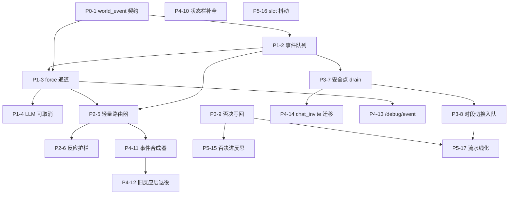

# AgentTown 事件驱动异步 Agent —— 实现路径

> 基于 `AgentTown_EventDrivenAgent_Design.html`（事件驱动异步 Agent 设计，单一真理参考点）与 `AgentTown_WorldEvent_Protocol.md` v1.0（UE 事件上传协议）拆分。
> **拆分日期**：2026-09-17。**范围**：Agent 侧（Go `agenttown-mcp`）。UE 侧需新增项见 §十。
> **目标**：把系统从"做得很讲究的定时任务调度器"改造成事件驱动的异步 Agent——时间驱动主干保证连贯，事件驱动打断保证真实，两者在安全点交汇。

---

## 目录

1. [现状盘点](#一现状盘点设计文档--代码)
2. [总体路径](#二总体路径)
3. [P0 契约层](#三p0-契约层1-个)
4. [P1 事件内核](#四p1-事件内核3-个)
5. [P2 路由器](#五p2-路由器2-个)
6. [P3 战术层三输入](#六p3-战术层三输入3-个)
7. [P4 状态栏与兼容层](#七p4-状态栏与兼容层5-个)
8. [P5 反思与韧性](#八p5-反思与韧性3-个)
9. [实施顺序与依赖](#九实施顺序与依赖)
10. [UE 侧依赖与 Agent 先行策略](#十ue-侧依赖与-agent-先行策略)
11. [验证策略](#十一验证策略)

---

## 一、现状盘点（设计文档 → 代码）

逐章对照设计文档核对代码现状（2026-09-17，master 分支）。

### 1.1 已具备的底座

| 设计文档条目 | 现状 | 落点 |
|------|------|------|
| §6.1 状态栏基础版 | ✅ 4 行：游戏时间 / 物理分档 / 日程+剩余 / 动作+剩余 | `agent_state_bar.go`（dcbbf1f） |
| §7.4 过期决策（Agent 侧） | ✅ decision_epoch 全工具携带 + guardedExecutor 校验 | `guardedExecutor` |
| 心跳只刷状态栏 | ✅ perception 纯状态刷新，不触发决策 | 配合压缩摘要改造（a3645ad） |
| §6.3 反思/压缩/关系底座 | ✅ Stage 4 日终记忆 + Stage 5 关系数值 | `memory.go` / `relationship.go` |
| 唯一指令出口（咽喉点） | ✅ 所有 action 下发收口 `guardedExecutor.SendAction` | `guarded_executor.go` |
| 绝对截止（半成） | ⚠️ LLM 填秒数 → `ArmTimeStop` 换算绝对 game_time 目标 | 缺"从时段结束推导 + 总时长裁决" |
| world_event 协议契约 | 📝 文档定稿 v1.0（七类别 + force 通道 + 边沿触发纪律） | `docs/AgentTown_WorldEvent_Protocol.md` |

### 1.2 缺口清单

| 设计文档条目 | 现状 | 缺什么 |
|------|------|--------|
| §4.2 force 硬保证通道 | ❌ 无 | runtime 无 force 分支；现有 reactive 层的去抖 / `upgradeIfPhysicalAlert` 恰是文档明令禁止的"可否决"逻辑 |
| §4.3 轻量路由器 | ❌ 无 | 现有 Ollama continue/observe/replan 是旧模型（默认禁用） |
| §4.4 事件队列 + 安全点 drain | ❌ 无 | `agentstate` 只有 QueueStatus（SmartObject 排队），无事件队列 |
| §5.1 战术层三输入 | ⚠️ 2/3 | 有战略规划 + 实时状态；无事件输入（`TacticalInput` 无 Events 字段） |
| §4.5 时段切换入队 | ❌ 无 | `advanceSlotIfNeeded` 直接 `ClearForSlotSwitch` 强切 |
| §5.5 战略否决写回 | ❌ 无 | 重规划不写回 dailyPlan，状态栏会与实际行为脱节 |
| §3.5 绝对截止推导 | ⚠️ 半成 | 末段"干到时段结束"的推导 + 多段总时长超出时段的裁决 |
| §3.3 掐断在途 LLM | ❌ 无 | 战术层 LLM 调用不可 cancel |
| §6.1 状态栏完整版 | ⚠️ 缺 3 字段 | 未完成任务槽 / 上次动作结束原因 / 已执行时长 |
| §6.3 反思含否决记录 | ❌ 无 | Stage 4 记忆无否决输入 |
| §7.2 并发抖动 | ❌ 无 | known issue #3：22:00 五 NPC 同时切睡眠时段 → 战术层请求并发 → venus 排队超时 |
| world_event Go 侧实现 | ❌ 零 | `contract/protocol` 无该消息类型，`runtime.go` 无分发 |

---

## 二、总体路径

**6 阶段、17 个任务**。粒度≈一次提交；每完成一项主动 commit（项目规范）。

```
P0 契约层 ─── world_event 消息类型（1）
                    │
P1 事件内核 ─ 事件队列（2）→ force 通道（3）→ 在途 LLM 可取消（4）
                    │              │
P2 路由器 ──── 轻量路由器（5）→ 反应护栏（6）
                    │
P3 三输入 ──── 安全点 drain（7）→ 时段切换入队（8）
                                    战略否决写回（9，可并行）
                    │
P4 兼容层 ─── 事件合成器（11）→ 旧反应层退役（12）
              状态栏补全（10，可并行）  chat_invite 迁移（14）
              /debug/event（13，建议提前）
                    │
P5 韧性 ────── 否决进反思（15，依赖 9）
              slot 抖动（16，无依赖可插空）
              流水线化预分解（17，可选，最后）
```

依赖关系（mermaid）：



---

## 三、P0 契约层（1 个）

### P0-1 world_event 消息类型与 payload

按 `docs/AgentTown_WorldEvent_Protocol.md` v1.0 在 `contract/protocol` 落地：

- `envelope.go` 新增 `TypeWorldEvent = "world_event"` 常量（UE → Agent）
- `messages.go` 新增 `WorldEventPayload`：`event_id / category / event_type / force / severity / subject / game_time / location / occurred_at / data(json.RawMessage)`
- 七类别（`physical_threshold / spatial / social / action_anomaly / world / player_interaction` + `command`）与 event_type 枚举常量
- 序列化单测（与协议文档 §8 示例逐字段对齐）

纯契约层，无行为变更；UE 侧同按此实现，是两侧的共同基准。

---

## 四、P1 事件内核（3 个）

### P1-2 per-agent 事件队列

`pkg/agentstate` 新增有界事件队列（容量 ~64）：

- `Enqueue / DrainAll（一次取全部，不是 pop 一个）/ Clear`
- **event_id 去重**：wsserver 断线重连会 seq 重放离散消息，重放的事件不得重复入队
- 清理点对齐 `ClearForSlotSwitch / ClearForReplan / Stop`
- 超上限丢弃策略：丢最旧 + warn（事件是决策输入，不是账本）
- 单测覆盖去重 / 边界 / 清理

### P1-3 runtime 分发 + force 硬保证通道

`runtime.go HandleMessage` 新增 `case protocol.TypeWorldEvent`：

- **force=true** → 零 LLM、零去抖、**不可否决**（§4.2）：立即 stop 当前动作 → 记录打断事实（"上次结束原因"字段，供状态栏与重规划）→ 走 `tacticalRefillForReplan` 路径带事件事实重规划
- **force=false** → 入队（P1-2），等路由器裁决或安全点 drain
- ⚠️ 此路径必须**绕过**现有 reactive 层的 `lastReactiveAt` 去抖和 `upgradeIfPhysicalAlert`——那是旧模型的否决逻辑
- 日志带 `event_id / category / severity`，便于全链路关联

### P1-4 在途 LLM 请求可取消（唯一盲区，§3.3）

force/紧急打断到达时 cancel 正在飞的战术层 LLM 请求：

- context cancellation 贯穿 `agenticTurn` → `venus.SendLoop / SendLoopStreaming`
- 丢弃半截思考（不落会话历史），事件并入重规划后的新一轮
- 设计取舍：宁可浪费一次调用，不留不可打断窗口
- 需处理取消后的会话状态一致性（半截 assistant/tool 消息不得入库）

---

## 五、P2 路由器（2 个）

### P2-5 轻量路由器：非 force 事件裁决

§4.3——每个非 force 事件一次轻量 LLM 调用：

- **模型**：战术层 flash 模型经 Venus（不用 Ollama——冷启动超时是旧反应层瘫痪的根因）
- **输入**：角色性格 + 人际关系（Stage 5 数据现成）+ 当前动作与进度 + 事件事实（谁/何时/何地/客观 severity）
- **输出**：`{interrupt: bool, severity: int, reason: string}`
- **纪律**：判不准 → 入队（代价不对称：误打断拖出一整轮重规划，误入队只是晚几分钟）；只判紧急，不规划——规划留给战术层
- **验收点**：同一条事件不同 NPC 因关系/性格产生不同裁决（K-03 故障：阿静打断、老陈入队）

### P2-6 反应护栏

§4.5 两条护栏，防打断链失控：

1. 反应任务（因打断产生的重规划动作段）**带绝对截止时间**，不能无界——超时回到原时段/队列
2. 正在执行反应任务时，新事件要打断它必须 **severity 严格更高**，否则入队

实现在路由器裁决处（`AgentState` 记录"当前是否在反应任务 + 其 severity"）。

---

## 六、P3 战术层三输入（3 个）

### P3-7 安全点 drain：事件队列 → 第三输入

§4.4 + §5.1——`action_completed` 处理点（安全点 = WAITING STATE）一次性 drain 全部入队事件：

- `TacticalInput` 新增 `Events` 字段 → user prompt 新增【发生的事件】段
- 每条格式化为自然语言：类别 / 事实 / 游戏时间 / 客观严重度
- 与【全天日程】【实时状态】并列凑齐三输入
- 缺事件输入时该段省略（现状兼容）
- 一次性交出 vs 逐个处理的价值（§4.4）：LLM 看到全貌输出统筹过的安排——顺路去食堂、路上还工具、回来前充电

### P3-8 时段切换入队化

§4.5——`advanceSlotIfNeeded` 不再直接 `ClearForSlotSwitch` 强切：

- 改为投递内部 slot 切换事件进**同一队列**，等安全点消费（自然等当前动作完成）
- 收益：反应任务期间定时器到点**无需任何压制特殊分支**
- 需梳理：slot 过期检测在 worker 轮询、drain 在 completion 点，两者统一到"安全点消费"语义
- 内部事件不走路由（直达队列或标记必处理），避免被误判为可入队低优先级

### P3-9 战略层否决写回

§5.5——战术层重规划偏离当前时段 goal 时：

- 识别口径：重规划结果与 slot goal 不一致，或 LLM 输出显式否决理由字段
- 把实际目标 + 修订记录写回 dailyPlan（内存 + `Store` 持久化 `agent_schedule_state`）
- 三条约束落地：只改时段内**做法**不改目标**类别**；修订记录留痕；否决理由进当晚反思（对接 P5-15）
- 不写回的后果：状态栏显示"充电"而 NPC 在干别的，下个时段决策基于已作废计划
- 无硬依赖，可与 P3-7 并行

---

## 七、P4 状态栏与兼容层（5 个）

### P4-10 状态栏补全

§6.1 完整版——现有 4 行基础上补 3 个字段：

| 字段 | 作用 | 缺失的后果 |
|------|------|------------|
| 未完成任务槽 | 打断时记录：原任务 + 进度 + 离开原因 | 重规划靠模型回忆，触发幻觉 |
| 上次动作结束原因 | success / interrupted / failed + 触发事件 | 把失败当成功继续往下走（最典型幻觉源，§3.4） |
| 已执行时长 | 感知当前进度 | 反复重启同一动作 |

`AgentState` 新增字段（`RecordActionInterrupted` 等），渲染复用 `agent_state_bar.go` 现有模式。字段与渲染可先行，打断事实的落笔依赖 P1-3。

### P4-11 perception→event 边沿检测合成器（UE 未就绪兼容层）

UE 侧 world_event 尚未开发，Agent 侧先从现有消息流合成事件灌入**同一队列**：

- zone 变化（perception_update 对比上次）
- 物理跨阈值**边沿**检测（上次值与本次值跨线才触发，不是电平触发——协议 §五）
- 动作失败（`action_completed result=failed`，对齐协议"业务级异常不走 error 通道"的收敛）

flag 控制，UE 就绪后一处关闭。同时收编旧 reactive 层的触发源。

### P4-12 旧反应层退役

`reactive_runner.go` + `reactive.go`（Ollama continue/observe/replan、`lastReactiveAt` 去抖、`upgradeIfPhysicalAlert`、periodic 触发）在新链路稳定后移除：

- `docs/AgentTown_Reactive_Layer.md` 与 CLAUDE.md 同步改写
- 方向："反应层的代码量应该很小：一个 force 分支，一次路由调用，一个队列"

### P4-13 /debug/event 注入端点

仿 `/debug/action`、`/debug/schedule` 模式：

- POST 合成 world_event（全字段可控：category / event_type / force / severity / data），直达 P1-3 分发入口
- 无 UE 也能联调 force 打断、路由裁决、队列 drain 全链路
- debug UI 加面板
- **这是后续所有任务的验证工具，建议紧随 P1-3 提前做**

### P4-14 chat_invite 迁移到事件队列

按协议 §3.3 / §七：

- UE 停发独立 `chat_invite`，改推 `world_event`（`social.chat_invite_incoming`，原 conv_id/from/content 并入 data）
- Agent 侧 `dialogueRunner` 入口改从事件队列 drain 消费
- `chat_invite_rsp` / `chat_turn` 不变
- 过渡期双兼容（旧消息类型保留消费分支，UE 切换后删）

---

## 八、P5 反思与韧性（3 个）

### P5-15 否决记录进睡眠期反思

§6.3 三阶段（反思/压缩/关系更新）中"反思"输入补当日否决记录：

- 数据源：P3-9 产出的修订留痕（新 Store 表或 action_history 聚合）
- 否决是最有价值的学习信号：每次否决都说明战略层对世界建模有偏差
- 归纳后喂次日战略层，形成「规划 → 执行 → 偏差 → 修正」闭环
- 复用 Stage 4 `generateDailyMemories` 骨架

### P5-16 slot 边界随机抖动

§7.2——时段定时器加游戏时间几十秒量级随机抖动：

- 解决 known issue #3（22:00 五 NPC 同时切睡眠 → 5 个战术层请求 18 秒内并发 → venus 排队 4 个 60s 超时）
- 抖动加在"分解触发时刻"而非"逻辑 slot 边界"（计划本身的绝对起止时间不变）
- 无依赖，随时可插空做，收益立竿见影

### P5-17（可选）高倍率流水线化预分解

§7.1——TimeScale≥60 时战术层 LLM 往返占比 ~5%，需流水线化：

- 当前时段执行期间预先算好下个时段的拆解（预分解结果缓存，slot 事件消费时直接用）
- 注意与 P3-8 时段入队化、P3-9 否决写回的交互（预分解基于的快照过期时丢弃重算）
- 放最后：先跑通正确性再优化延迟

---

## 九、实施顺序与依赖

推荐顺序（编号即任务号）：

```
1 → 2 → 3 → (13 提前) → 4 / 5 → 6 → 7 → 8 → 11 → 12
                              ↘ 9（与 7 并行）→ 15
10（与 7~12 并行均可）   14（7 之后任意）   16（随时插空）   17（最后，可选）
```

关键路径：**1 → 2 → 3 → 5 → 7**（force 通道 + 路由器 + 三输入——事件驱动主干成形），其余围绕主干展开。

每完成一项主动 commit：`<type>(<scope>): <subject>` 中文提交信息（项目规范）。

---

## 十、UE 侧依赖与 Agent 先行策略

### 10.1 UE 侧需新增（设计文档 §8.2，Agent 侧无法替代）

| 新增项 | 位置 | 说明 |
|--------|------|------|
| world_event 推送 | RobotAgentComponent | 按协议 v1.0 七类别推事件，边沿触发纪律 |
| force 打标 | 通信协议 | 强制打断的旁路标识，UE 侧硬编码打标 |
| 动作进度上报 | UActionExecutor | 支撑"装配了 3/8 个零件"（未完成任务槽的进度字段） |
| 动作失败事件 | UActionExecutor | action_failed / smartobject_occupied（不再走 error 通道） |
| 中断过渡 | StateTree / BT | 紧急打断时的短促收尾动画（复用 PreemptForDialogue） |
| 序号校验 | OnEnvelopeReceived | 丢弃基于过期状态的指令（Agent 侧 event_seq 依据随指令下发） |

### 10.2 Agent 先行策略

UE 未就绪期间，Agent 侧靠两件套先行闭环：

1. **P4-11 事件合成器**：从现有 perception/state_report/action_completed 流合成事件——语义上与 UE 推送完全同构，UE 就绪后关 flag 即切换
2. **P4-13 /debug/event**：手动注入任意事件，联调 force / 路由 / 队列 / drain 全链路

切换判据：UE 侧 world_event 落地后，关合成器 flag，跑对照仿真确认行为无回归，随后做 P4-12 旧反应层退役。

---

## 十一、验证策略

### 11.1 单元测试

- 每个任务自带 `*_test.go`（项目规范：新增包必须有测试，命名 `Test<Func>_<Scenario>`）
- 用 `fakeTransport` / `InMemoryTransport`，禁止启真实子进程
- 事件队列：去重（seq 重放）/ 容量边界 / 清理点
- force 通道：不可否决性（去抖不生效）/ 零 LLM（路由器不被调用）
- 路由器：判不准入队 / severity 递增护栏
- LLM 取消：半截 assistant/tool 不入会话历史

### 11.2 无 UE 联调（/debug/event）

- force 事件 → 立即打断（日志时间戳差）→ 重规划 prompt 含事件事实
- 非 force 事件 → 路由裁决 → 打断 or 入队
- 攒多条事件 → 队列 drain → 战术层 prompt【发生的事件】段含全部
- 反应期间 slot 到点 → 无特殊分支，安全点自然切换

### 11.3 端到端仿真验收点

| 设计文档承诺 | 验收观察 |
|--------------|----------|
| 同一事件 N 种反应（§4.3） | K-03 故障广播：关系近的 NPC 打断、远的入队 |
| force 微秒级（§4.2） | 消息到达到 stop 指令的日志间隔，无 LLM 调用记录 |
| 静默时零成本（§7.3） | 无事件时段路由调用次数 = 0 |
| 一次性统筹（§4.4） | 多条入队事件 drain 后战术层输出顺路式规划 |
| 时段切换无特殊分支（§4.5） | 反应任务期间 slot 到点，代码路径与普通事件一致 |
| 否决写回一致（§5.5） | 状态栏"当前战略任务"与 NPC 实际行为一致 |
| 反思闭环（§6.3） | 次日战略层 prompt 含前日否决归纳 |
