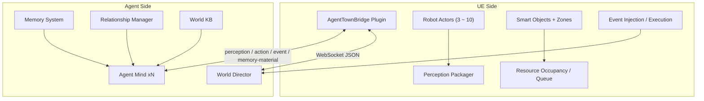
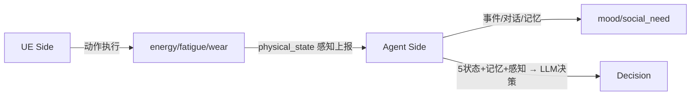

# Agent Town 二期详细设计方案

> 基于 `AgentTown_Design.md` 总体设计，一期已落地（单 Agent、固定日程、有限动作）。本方案把二期拆成**模块 ×（UE 侧 / Agent 侧）**的详细设计，每个模块给出任务清单和两侧各自的具体方案。
>
> **分工原则**：UE 侧负责"舞台与规则"（呈现、执行、资源、事件落地、感知、可观测），**不做 AI 决策**；Agent 侧负责"灵魂与故事"（日程、对话、记忆、编剧、关系），**所有决策在这里**。

---

## 目录

1. [一期现状与二期差距](#一一期现状与二期差距)
2. [二期总体架构与分工原则](#二二期总体架构与分工原则)
3. [模块 A：多 Agent 生态](#模块-a多-agent-生态p0)
4. [模块 A-1：Agent 状态系统](#模块-a-1agent-状态系统p0)
5. [模块 B：日程多样化与随机性](#模块-b日程多样化与随机性p0)
6. [模块 C：社交互动](#模块-c社交互动p1)
7. [模块 D：Memory 记忆系统](#模块-dmemory-记忆系统p1)
8. [模块 E：动作扩充](#模块-e动作扩充p1ue-侧为主)
9. [模块 F：事件系统](#模块-f事件系统p1)
10. [模块 G：世界状态与动态反馈](#模块-g世界状态与动态反馈p2)
11. [模块 H：可观测性](#模块-h可观测性p2)
12. [实施优先级](#五实施优先级)
13. [验收标准](#六验收标准)
14. [总结](#七总结)

---

## 一、一期现状与二期差距

### 1.1 一期已落地

| 能力 | 现状 |
|------|------|
| Agent 数量 | 1 个（H-01 老陈） |
| Zones | 7 个工业小镇区域 |
| Smart Objects | 4 个（充电/维修/休眠/工作台）+ Computer |
| 动作 | 原子（MoveTo/Wait/TurnTo/Speak/Emote/Interact）+ 复合（WorkShift/Charge/SelfMaintenance/Rest）+ GenericAct 兜底 |
| World KB | world.generated.json + world.authored.json（含 display_name/description/交互描述） |
| 通信 | WebSocket + JSON，重连重发 |
| 决策 | Agent 进程 LLM 分层思考雏形 |

### 1.2 二期要解决的核心问题

| 问题 | 表现 | 二期解法（对应模块） |
|------|------|---------------------|
| 行为单一 | 每天固定日程、动作少 | 模块 B 日程随机 + 模块 E 动作扩充 |
| 无连贯性 | 每天做完全相同的事 | 模块 D Memory + 模块 F 事件 |
| 无差异性 | 只有 1 个 agent | 模块 A 多 Agent + 角色分化 |
| 无社交 | NPC 不互动 | 模块 C 社交 |
| 无故事 | 没有事件/因果 | 模块 F 事件 + 模块 D 记忆 |

---

## 二、二期总体架构与分工原则



### 分工原则速查

| 能力 | UE 侧 | Agent 侧 |
|------|:-----:|:--------:|
| 场景呈现 / 动作执行 | ✅ | |
| 资源竞争 / 排队 | ✅ | |
| 事件落地 / 感知上报 | ✅ | |
| 日程规划 / 随机化 | | ✅ |
| 对话生成 | | ✅ |
| 记忆存储 / 检索 | | ✅ |
| 事件编剧 / 传播 | | ✅ |
| 关系维护 | | ✅ |

---

## 模块 A：多 Agent 生态（P0）

### A1 任务清单

| # | 任务 | 优先级 |
|---|------|:------:|
| A-1 | 首批 3 个角色 Actor（含老陈） | P0 |
| A-2 | 多 Agent 资源竞争与排队 | P0 |
| A-3 | 分阶段扩容（3→5→10） | P1 |
| A-4 | 角色差异化配置 | P0 |

### A2 UE 侧详细设计

**1. 创建多角色 Actor**
- 复制老陈的 `BP_AT_Agent_LaoChen`，创建 `BP_AT_Agent_Maintainer`、`BP_AT_Agent_Logistics` 等
- 每个挂 `UPEGameAgentBridgeComp`，配置不同 `AgentId`（如 H-02、S-02）、`AgentType`、初始位置
- 每个角色一个 `MainBehaviorTree`（可复用 `BT_AT_LaoChen`，或按角色差异化）

**2. 资源竞争与排队（核心）**

现状：`UAgentSmartObjectComponent::TryClaimInteraction` 只支持"占用/占用者/空闲"，被占就返回失败，无排队。

需要改：
```cpp
// 新增排队队列
struct FAgentClaimQueueEntry
{
    FString AgentId;
    FString InteractionName;
    float QueuedAt = 0.0f;   // 排队时间，超时可放弃
};

UAgentSmartObjectComponent:
  TArray<FAgentClaimQueueEntry> PendingQueue;   // 等待队列
  bool TryClaimInteraction(...)  // 空闲→占用；占用→入队并返回 Queued
  bool TryClaimInteractionWithResult(...)  // EAgentClaimResult 新增 Queued 枚举
  void ReleaseInteraction(...)  // 释放时 pop 队首，通知它可占用了
```

关键点：
- **服务器权威**：所有 claim/release 只在 DS 执行
- **排队语义**：`EAgentClaimResult` 加 `Queued`，Agent 收到后知道"在排队"，可以等或放弃
- **超时放弃**：排队超过阈值（如 30 秒）自动放弃并通知 Agent

**3. 占位状态机的完整状态**

| 状态 | 说明 |
|------|------|
| `Idle` | 空闲可占 |
| `Occupied` | 被某 Agent 独占 |
| `Broken` | 故障不可用 |
| `Queued` | 有 Agent 在排队等待 |

### A3 Agent 侧详细设计

**1. 角色差异化**
- 每个 Agent 独立的 Persona Prompt（职业、性格、说话风格、核心记忆）
- `authored.json` 里配好 `role` / `personality` / `work_preference` / `home_zone`

**2. 占位失败/排队后的决策**

```
Agent 发起 claim 一个 Smart Object:
  → 收到 result = Occupied / Queued
  → 决策（LLM / 规则）：
     a. 换一个同类别空闲的 object（如另一个工作台）
     b. 等待（如果 Queue 里排在我前面人少）
     c. 换动作（先做别的事，晚点再来）
```

需要 Agent 侧实现一个"资源失败重规划"策略，避免所有 Agent 死等同一个设施。

---

## 模块 A-1：Agent 状态系统（P0）

> 5 个核心状态：`energy`（电量）/ `fatigue`（疲劳）/ `joint_wear`（磨损）/ `mood`（情绪）/ `social_need`（社交需求）。这些状态是 **Agent 决策的输入信号**——日程规划、社交触发、事件打断都靠它们。

### A1.1 状态定义与分工

| 属性 | 范围 | 含义 | 权威维护方 | 理由 |
|------|------|------|:----------:|------|
| `energy` | 0-100 | 能量储备 | **UE**（DS） | 由行为实时改变，UE 执行动作时计算最准 |
| `fatigue` | 0-100 | 当日劳累累积 | **UE**（DS） | 随工作/休息累积，同理 |
| `joint_wear` | 0-100（永久累积） | 长期损耗 | **UE**（DS） | 永久累积不恢复 |
| `mood` | -100~100 | 当前心情 | **Agent** | 由事件/对话/记忆驱动 |
| `social_need` | 0-100 | 渴望社交 | **Agent** | 由独处时长/社交经历驱动 |

**分工原则**：
- **物理状态（energy/fatigue/wear）在 UE**：因为 UE 知道"老陈在装配 2 小时"，能精确计算消耗；Agent 只看到抽象 action 算不准。
- **情绪/社交（mood/social_need）在 Agent**：因为它们依赖事件/对话/记忆这些 Agent 侧信息。

### A1.2 存储

**UE 侧**（`energy/fatigue/joint_wear`）：
- 放在 `UPEGameAgentBridgeComp` / `URobotAgentComponent` 组件属性（`FAgentPhysicalState` 已有）
- 存储位置：DS 内存；持久化（可选，二期后段）存 SaveGame/配置

**Agent 侧**（`mood/social_need`）：
- 放在 Agent Mind 的 State Manager 心智状态
- 存储位置：Agent 进程内存；持久化随 Agent 状态落盘

### A1.3 计算

**UE 侧：动作触发式（推荐，一期先做）**

在 `ActionExecutor` 动作完成时按动作类型改状态：

```cpp
void URobotAgentComponent::ApplyPhysicalEffect(const FString& Cmd)
{
    if (Cmd == "WorkShift")           { Energy -= 10; Fatigue += 15; }
    else if (Cmd == "ChargeAtStation"){ Energy += 40; }
    else if (Cmd == "RestAtResidence"){ Fatigue -= 30; Energy += 5; }
    else if (Cmd == "SelfMaintenance"){ JointWear -= 20; }
    // 钳制 0-100
}
```

> 动作→状态映射最简单，不依赖"持续多久"。**可选进阶**：用 `UAgentGameTimeSubsystem` 时间流逝缓慢消耗（更真实，复杂，可后做）。

**Agent 侧：事件/时间驱动**

```python
def update_state(self, perception):
    self.social_need += 0.5   # 独处越久越高
    if self.just_socialized: self.social_need -= 30
    self.mood += recent_event_impact   # 正面事件+，负面-
    self.mood = clamp(self.mood, -100, 100)
```

### A1.4 同步

**UE → Agent（物理状态）**：复用 `physical_state` 感知字段（一期已有雏形），随感知一起上报：

```json
"physical_state": { "energy": 45.0, "fatigue": 60.0, "joint_wear": 78.0 }
```

同步频率：随感知（3-5 秒）上报，或变化超阈值（如掉电>5）立即上报。

**Agent → UE（情绪/社交，可选）**：若情绪要影响外观（表情/动作），用 `state_report` 带回 mood。二期建议**先不回**，mood 只在 Agent 内部用，最简单。

### A1.5 完整流程图



### A1.6 二期实施顺序

1. UE 物理状态：补 `ApplyPhysicalEffect` 动作映射 + 感知上报（一期已接近完成）
2. Agent `mood`/`social_need`：内部维护，驱动社交/日程
3. 同步链路：物理状态感知上报 + 可选 mood 回报

---

## 模块 B：日程多样化与随机性（P0）

### B1 任务清单

| # | 任务 | 优先级 |
|---|------|:------:|
| B-1 | 每日日程模板 + 随机偏移 | P0 |
| B-2 | 状态影响次日日程 | P0 |
| B-3 | 周计划 / 特殊日 | P1 |

### B2 UE 侧详细设计

UE 侧**改动很少**，主要是"暴露足够的时间/状态"（一期已具备）：
- `environment.game_time_sec / time_of_day_sec / day_count` 已有
- `physical_state_delta`（energy/fatigue/joint_wear）已有
- **无需新增 UE 侧逻辑**，日程随机化全在 Agent 侧

可能需要的小配合：
- 暴露"今天是星期几"（如果需要周计划），在感知的 `environment` 里加 `day_of_week`

### B3 Agent 侧详细设计

**1. 每日日程生成（战略层）**

输入：昨日记忆总结 + 今日状态（疲劳/磨损）+ 角色卡 + 固定时段框架

输出：当日大纲（6-10 条），每条带时间窗 + 目标

```json
[
  {"time":"06:00-07:00","goal":"起床+晨会"},
  {"time":"07:00-12:00","goal":"车间装配，但今天先检查关节磨损"},
  {"time":"12:00-13:00","goal":"充电+和铁牛师傅聊聊昨天的事"},
  ...
]
```

**随机化注入点**：
- 起床/休息时长随机 ±30 分钟
- 是否跳过某活动（如今天太累，下午休息）
- 工作目标细节变化（今天装配哪批、质检标准）

**2. 状态耦合**
- `fatigue` 高 → 次日减少工作时长、增加休息
- `joint_wear` 高 → 次日安排去维修厂
- `energy` 不足 → 早上去充电

**3. 周计划（P1）**
- 引入 `day_of_week`，不同天有不同的活动模板（周一检修、周三社交日）

---

## 模块 C：社交互动（P1）

### C1 任务清单

| # | 任务 | 优先级 |
|---|------|:------:|
| C-1 | 相遇触发对话 | P1 |
| C-2 | 双向对话（A说→B回） | P1 |
| C-3 | 约伴同行 | P1 |
| C-4 | 关系系统落地 | P1 |

### C2 UE 侧详细设计

**1. 相遇检测**
- 一期已有 `visible_agents`（含 `current_action`）
- 补：相遇条件（距离 < 阈值 + 双方空闲/可对话）

**2. `social_chat` 复合动作**
- 走到目标 Agent 旁 → 转向 → 播放对话表现 → 双向气泡
- 参数：`target_agent_id`、`topic`（可选）

**3. 双向发言转发**
- 当前 Speak 是单向广播。双向对话需要：A 说 → UE 转发给 B → B 的 Agent Mind 生成回应 → B 说 → 转发给 A
- 需要新增消息类型：`dialogue_turn`（A→B 的发言），或复用 `event_notification` 定向投递

**4. 约伴同行（约一起去某处）**
- 复合动作：A 发起"我们去 XX"，B 同意 → 两 Agent 同步移动到目标
- UE 需支持"群体移动"（两 Agent 保持一定间距并行移动）

### C3 Agent 侧详细设计

**1. 对话生成**
- 收到对方发言 → 结合记忆（关系、最近发生的事）+ 性格 → 生成回应
- 对话上下文：短期记忆里维护当前对话轮次

**2. 约伴决策**
- 收到"约一起去 XX" → 结合当前日程/关系/疲劳 → 同意或婉拒
- 同意后同步更新两边的日程（短期记忆写入"和 XX 约好去 XX"）

**3. 关系系统**
- 关系值（familiarity/affection）在每次互动后更新
- 关系影响：对话频率、语气、是否答应约伴
- `authored.json` 的 `relationships` 是初始值，运行时由关系管理器动态维护

---

## 模块 D：Memory 记忆系统（P1，Agent 侧为主）

### D1 任务清单

| # | 任务 | 优先级 |
|---|------|:------:|
| D-1 | 四类记忆结构（短期/中期/长期/核心） | P1 |
| D-2 | 记忆写入时机（事件/对话/任务结束） | P1 |
| D-3 | 决策时记忆检索注入 Prompt | P1 |
| D-4 | 跨天持久化（落盘） | P2 |

### D2 UE 侧详细设计

UE 侧**提供"可记忆素材"**，让 Agent 有东西可记：

**1. 感知多上报事件/互动信息**
- 新增感知字段：`recent_events`（本 Agent 刚经历的事件：故障、对话、广播）
- 例：`{"type":"social","with":"H-02","topic":"闲聊","time":...}`

**2. 关键事件标记**
- 故障（`malfunction`）、广播（`broadcast`）、救援（`rescue`）等对记忆重要的事件，在感知里显式上报

**3. 实现建议**
- 在 `RobotAgentComponent` 维护一个"近期事件"缓存，周期性打进感知
- 或 UE 主动发 `event_notification` 给 Agent（事件类）

### D3 Agent 侧详细设计

**1. 四类记忆结构**

| 类型 | 存储 | 特征 |
|------|------|------|
| 短期 | 内存队列 | 最近 N 条，先进先出 |
| 中期 | 内存 + 定时归档 | 当天的情景记忆，按相关性打分 |
| 长期 | 持久化 | 语义事实，衰减遗忘 |
| 核心 | 持久化 | 角色锚点，永不遗忘 |

**2. 记忆写入**
- 触发点：对话结束、任务完成、事件发生、重要感知
- 写入时做"相关性/重要性"过滤，避免垃圾记忆

**3. 记忆检索注入**
- 决策前从记忆库检索"与当前情境相关"的 N 条，注入 Prompt
- 检索策略：按相关性分数 + 时间衰减
- 控制 token：每次只取最相关的 5-10 条

**4. 遗忘机制**
- 长期记忆按时间衰减，长期未被引用的降权
- 核心记忆不受衰减

---

## 模块 E：动作扩充（P1，UE 侧为主）

### E1 任务清单

| # | 动作 | 类型 | 说明 | 优先级 |
|---|------|:----:|------|:------:|
| E-1 | `LogisticsWork` | composite | 物流站分拣/搬运 | P1 |
| E-2 | `RecyclingWork` | composite | 回收场分类/拆解 | P1 |
| E-3 | `ArchiveWork` | composite | 档案馆整理/录入 | P1 |
| E-4 | `SocialChat` | composite | 与目标 Agent 聊天 | P1 |
| E-5 | `Patrol` | composite | 巡逻路径 | P1 |
| E-6 | 小动作（LookAround/Groom） | atomic | 复用 GenericAct | P1 |

### E2 UE 侧详细设计

**1. 新增复合行为树**
- `BT_Action_LogisticsWork`、`BT_Action_RecyclingWork`、`BT_Action_ArchiveWork`、`BT_Action_SocialChat`、`BT_Action_Patrol`
- 结构复用现有复合动作模板：`ResolveTarget → MoveTo → Interact(循环)`

**2. 对应 Smart Object**
- 物流站：`SortingConveyor`（interaction: sort_cargo）
- 回收场：`RecyclingBins`（interaction: recycle）
- 档案馆：`ArchiveTerminal`（interaction: archive）

**3. DataTable + capability_registry**
- ActionRegistry DataTable 加行（CmdName/Kind/ActionBT/Params）
- `capability_registry.json` 加条目（cmd/description/usage/params）

**4. 交互描述**
- 每个新 interaction 配 `Description`（让 Agent 理解用途）

### E3 Agent 侧详细设计

**改动较少**，主要是：
- Agent 侧从 capability_registry 看到新动作后能正确使用
- 在日程规划/任务分解时，能把"去物流站分拣"映射到 `LogisticsWork`

---

## 模块 F：事件系统（P1）

### F1 任务清单

| # | 任务 | 优先级 |
|---|------|:------:|
| F-1 | 手动事件注入接口 | P1 |
| F-2 | 事件感知上报（audible_events） | P1 |
| F-3 | World Director 事件生成 | P1 |
| F-4 | 三级事件传播 | P2 |

### F2 UE 侧详细设计

**1. 手动事件注入**
- 提供 `event_notification` 入口（调试/玩家触发）
- UE 接收事件 → 落地表现（故障：Actor 状态变 Broken、动画异常；广播：显示广播文案）

**2. 事件感知上报**
- 感知里加 `audible_events`（本 Agent 能听到/看到的事件）
- 事件类型：`malfunction` / `broadcast` / `social` / `environmental`

**3. 故障落地**
- `UAgentSmartObjectComponent` 状态置 `Broken` → 拒绝 claim → 触发事件通知
- 需要可配置的故障触发（磨损阈值 + 概率）

### F3 Agent 侧详细设计

**1. World Director（编剧）**
- 四种事件生成：规则（35%）/ 概率（25%）/ 剧情（30%）/ 脚本（10%）
- 每 30 分钟醒来，收集世界状态，问 LLM"现在要投放事件吗"

**2. 三级传播**
- Level1 直接感知（距离/视野内）
- Level2 广播（严重度高全员）
- Level3 谣言（经对话传递，延迟）

**3. 反应层打断**
- 收到事件 → 反应层判断"是否打断当前任务"
- 判断因素：任务重要度、事件严重度、关系强度、性格、距离、能力

---

## 模块 G：世界状态与动态反馈（P2）

### G1 任务清单

| # | 任务 | 优先级 |
|---|------|:------:|
| G-1 | Smart Object 库存（产出/消耗） | P2 |
| G-2 | 状态持久化（含记忆落盘） | P2 |
| G-3 | 玩家交互 | P2 |
| G-4 | 天气/昼夜视觉 | P2 |

### G2 UE 侧详细设计

**1. 库存系统**
- Smart Object 加库存字段（产出/消耗）
- 工作台装配 → 库存 +1 成品；回收场处理 → 库存 -1 废料 +1 再生料
- 库存影响 Agent 决策（没料了→去物流站取料）

**2. 玩家交互**
- 玩家走近 NPC → 触发对话/任务
- 复用 `social_chat` 动作，玩家作为特殊 Agent

### G3 Agent 侧详细设计

- 库存/资源感知进决策（"车间缺料"→ 规划去物流站）
- 状态/记忆持久化方案（重启恢复，含记忆落盘）

---

## 模块 H：可观测性（P2）

### H1 任务清单

| # | 任务 | 优先级 |
|---|------|:------:|
| H-1 | Agent 决策日志面板 | P2 |
| H-2 | 关系图谱 / 时间线 | P2 |
| H-3 | AI 导演视角 | P3 |

### H2 UE 侧详细设计

- 面板显示：Agent 列表（位置/情绪/当前动作/内心想法）
- Agent 内心日志：Agent 侧上报 `inner_thought`，UE 展示
- 关系图谱 / 事件时间线可视化

### H3 Agent 侧详细设计

- 决策日志上报：每次 LLM 决策把 inner_thought / 决策依据发给 UE
- 关系数据 / 事件历史输出给 UE 展示

---

## 五、实施优先级

```
P0（二期基础）：
  模块 A（多 Agent + 资源竞争）
  模块 B（日程随机化）

P1（让小镇活起来）：
  模块 C（社交互动）
  模块 D（Memory 记忆）
  模块 E（动作扩充）
  模块 F（事件系统）

P2（有深度）：
  模块 G（世界状态）
  模块 H（可观测性）
```

**起步建议**：P0 的 A + B 先做，能让小镇"看起来有很多人在各做各的事"。同时**尽早引入模块 D Memory**——它是日程差异/社交对话/行为连贯的底层支撑，建议与模块 C 社交同步推进。

---

## 六、验收标准

### 多 Agent（模块 A）
- [ ] 首批 3 个不同职业/性格的 Agent 同时在场景工作
- [ ] 多 Agent 抢同一 Smart Object 能排队，不状态错乱
- [ ] 占位失败后 Agent 能换目标/等待，不卡死
- [ ] 协同逻辑跑顺后再扩容

### 状态系统（模块 A-1）
- [ ] UE 物理状态（energy/fatigue/wear）随动作正确变化并感知上报
- [ ] Agent mood/social_need 随事件/互动正确更新
- [ ] 5 个状态都能被 Agent 决策读取并影响行为（充电/休息/社交/维修）

### 日程多样（模块 B）
- [ ] 每个 Agent 每日日程不是完全相同模板
- [ ] 状态（疲劳/磨损）影响次日日程

### Memory（模块 D）
- [ ] Agent 能记住当天关键事件/对话
- [ ] 对话能引用"之前发生的事"
- [ ] 记忆影响日程/决策

### 社交（模块 C）
- [ ] 两 Agent 相遇能触发对话
- [ ] Agent 之间能约伴同行

### 事件（模块 F）
- [ ] 手动事件能插入并影响 Agent 行为
- [ ] 不同 Agent 对同一事件有不同反应

---

## 七、总结

二期从"单 Agent 演示"迈向"多 Agent 小镇生活"，每个模块都拆成 UE 侧（舞台/规则）和 Agent 侧（灵魂/故事）：

- **UE 侧**：多 Agent 呈现、资源竞争/排队、动作扩充、社交执行、事件落地、可观测面板、记忆素材
- **Agent 侧**：日程随机化、角色差异化、对话生成、记忆系统、事件编剧、关系系统

**核心依赖链**：模块 A（多 Agent）是基础 → 模块 D Memory 让行为有连贯和差异 → 模块 C/F 让世界有互动和故事。**Memory 记忆是二期能否"活起来"的关键底层**。
