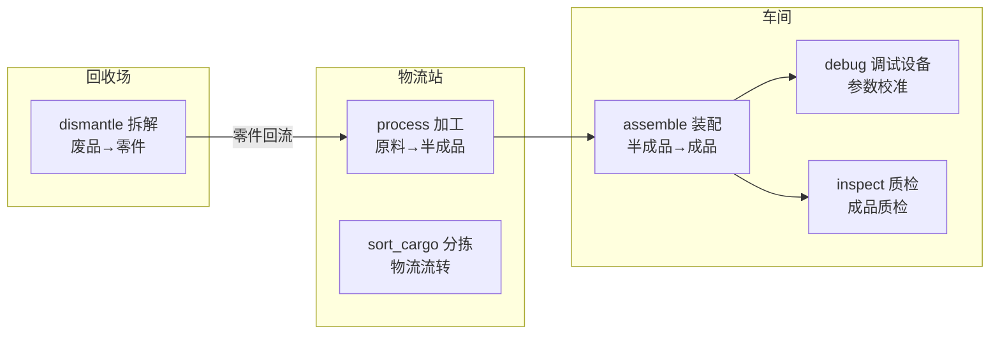

# Agent Town · 工作逻辑全流程设计

> 本文档描述机器人小镇（AgentTown）的**生产工作流**，是 Agent 侧决策与 UE 侧 Smart Object 配置的共同参考。
>
> **关联文档**：状态系统与货币见 `AgentTown_Phase2_Plan.md`（模块 A-1）；对话见 `AgentTown_Dialogue_Design.md`；通信协议见 `AgentTown_CommProtocol_Values.md`。

---

## 一、核心概念：机器人靠"三状态 + 一货币"维持生产

| 属性 | 含义 | 变化来源 |
|---|---|---|
| **Energy 能量** | 干活的燃料，工作消耗 | 工作消耗，充电恢复 |
| **Fatigue 疲劳** | 累的程度，工作累积 | 工作累积，休息恢复 |
| **JointWear 磨损** | 长期损耗，永久累积不自然恢复 | 工作累积，维修恢复 |
| **Money 货币** | 经济约束 | 工作挣，充电/维修/娱乐花 |

**核心驱动力**：机器人要**工作挣钱** → 工作**耗能量 + 涨疲劳 + 磨损** → 要用钱**充电 + 休息 + 维修** → 又得**继续工作挣钱**。这是自我循环的"机器人打工生活"。

---

## 二、生产工作流：一条流水线

从原料到成品的生产流水线，配合回收形成闭环：

> **注意**：当前阶段**不做物料/库存依赖**（process 需要原料、assemble 需要半成品等），上述"物料流转"是**概念上的流水线**，实际每个 interaction 都是独立的"动作 + 属性变化"。真正的物料/库存依赖属于二期模块 G（世界状态），后续再做。

---

## 三、6 个工种明细

| 环节 | interaction | 所在 zone | 收入 | 强度 | 定位 |
|---|---|---|---|---|---|
| 加工原料 | `process` | 物流站 | 中 | 中 | 生产链起点，体力活 |
| 分拣 | `sort_cargo` | 物流站 | 中 | 中 | 物流流转 |
| 装配 | `assemble` | 车间 | 中 | 中 | 核心生产，基准值 |
| 调试设备 | `debug` | 车间 | 高 | 高 | 技术活，高薪高耗 |
| 质检 | `inspect` | 车间 | 低 | 低 | 轻松收尾，低薪低耗 |
| 拆解 | `dismantle` | 回收场 | 高 | 高 | 高薪但磨损大 |

**收入与强度的对应关系**：

- **轻松工种（质检）**：收入低、能量/疲劳消耗低，适合疲惫或低能量时做
- **标准工种（装配、加工、分拣）**：收入中等、消耗中等，是日常主力
- **高强度工种（调试、拆解）**：收入高、消耗高、磨损大，适合缺钱时冲刺

> **设计意图**：Agent 会根据自身状态在工种间切换——累了去质检，缺钱去拆解/调试。这种"健康 vs 金钱"的取舍是行为分化与涌现的核心来源。

---

## 四、Smart Object 清单

### 4.1 现有 Smart Object（已在 world.generated.json）

| ObjectId | SemanticGroup | DisplayName | Interaction | zone |
|---|---|---|---|---|
| WorkBench-1~4 | `workbench` | 工作台 | `assemble` | 车间 |
| InspectionTable-1~2 | `inspection_table` | 质检台 | `inspect` | 车间 |
| SortingConveyor | `sorting_conveyor` | 分拣传送带 | `sort_cargo` | 物流站 |

### 4.2 待新增 Smart Object（本次工作流扩充）

| ObjectId | SemanticGroup | DisplayName | Interaction | zone | 说明 |
|---|---|---|---|---|---|
| ProcessingMachine-1~2 | `processing_machine` | 加工机 | `process` | 物流站 | 加工原料 |
| DebugStation-1~2 | `debug_station` | 调试台 | `debug` | 车间 | 设备调试 |
| DismantleTable-1~2 | `dismantle_table` | 拆解台 | `dismantle` | 回收场 | 废料拆解 |

### 4.3 新增 Smart Object 命名与描述

| 字段 | 加工机 | 调试台 | 拆解台 |
|---|---|---|---|
| ObjectId | `ProcessingMachine-1` | `DebugStation-1` | `DismantleTable-1` |
| ObjectCategory | `work` | `work` | `work` |
| SemanticGroup | `processing_machine` | `debug_station` | `dismantle_table` |
| DisplayName | `加工机` | `调试台` | `拆解台` |
| Description | `物流站的原料加工设备，将原始物料加工成标准半成品，是生产流水线的起点。` | `车间的设备调试工位，用于对装配完成的设备进行参数校准与功能测试，是技术要求较高的岗位。` | `回收场的废料拆解工位，将报废设备拆解分类，回收可用零件。工作强度高，对关节磨损较大。` |
| InteractionId | `process` | `debug` | `dismantle` |
| Interaction 描述 | `操作加工机，将原料加工为半成品。体力劳动，收入中等。` | `对设备进行参数校准和功能调试，排查故障。技术活，高薪但消耗大。` | `拆解报废设备，分类回收零件。高薪但体力消耗和关节磨损大。` |

---

## 五、涌现性从哪来

1. **工种选择**：Agent 根据自身状态（能量/疲劳/磨损/钱）在 6 个工种里做不同选择 → 行为分化
2. **经济压力**：钱不够 → 必须去高薪工种（拆解/调试）→ 但更累更磨损 → 又要花钱维修 → 循环
3. **健康 vs 金钱**：拆解挣钱但磨损大，质检轻松但钱少 → Agent 的取舍产生差异

---

## 六、扩展建议（二期后段）

- **物料/库存依赖**（模块 G）：process 需要原料、assemble 需要半成品，形成真正的物料流转
- **角色约束**：`world.authored.json` 的 `objects.xxx.required_roles` 可限定某些工种需要特定角色（如 `dismantle` 需要 `recycler`）
- **工作偏好**：`agents.xxx.work_preference` 让不同 Agent 倾向不同工种，强化角色差异
- **突发故障**（事件系统）：设备故障打断工作，触发维修/救援行为
