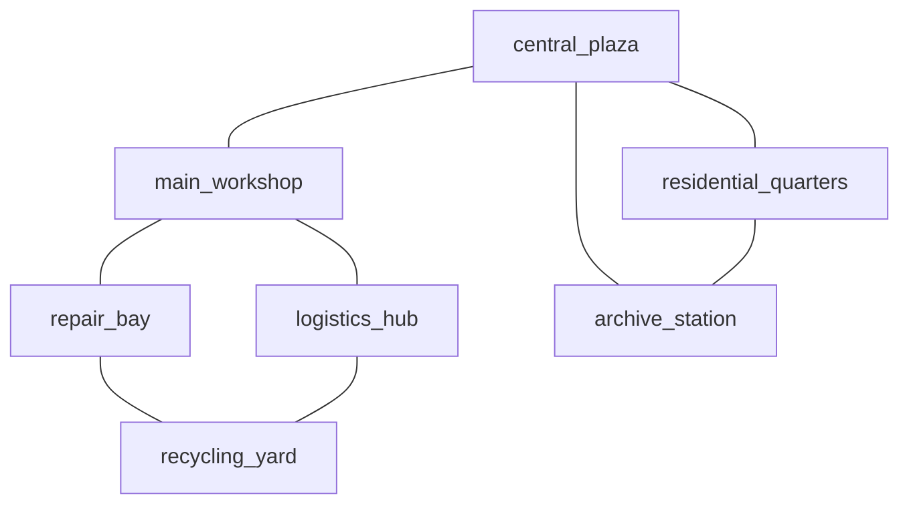
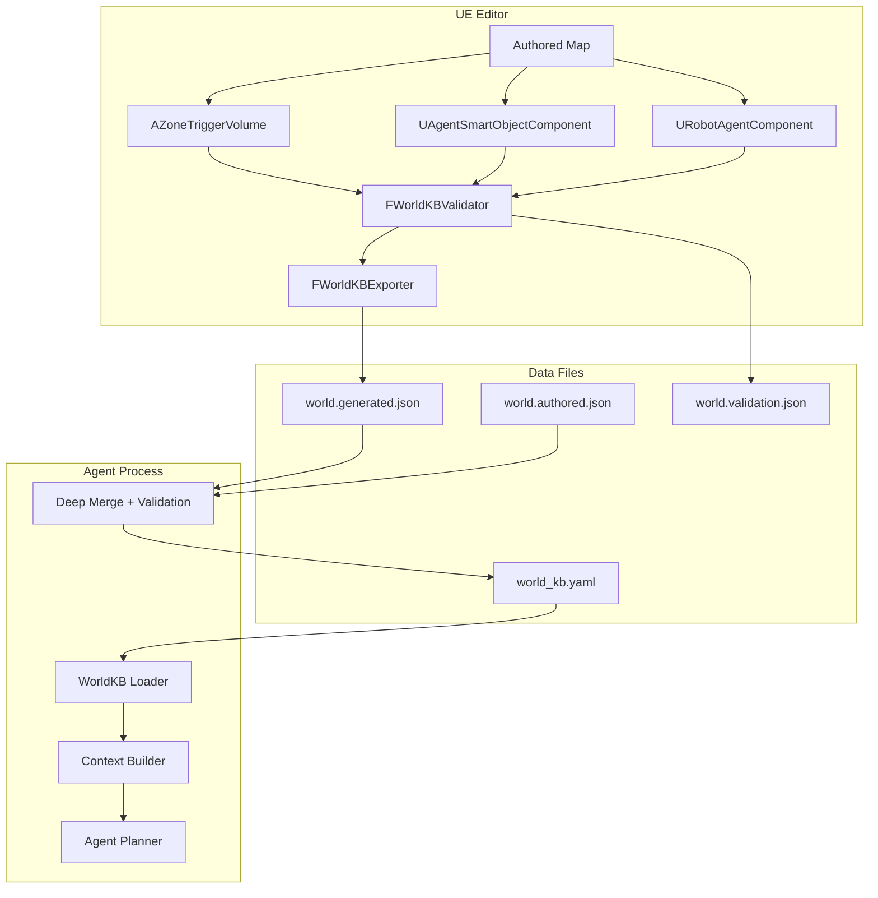
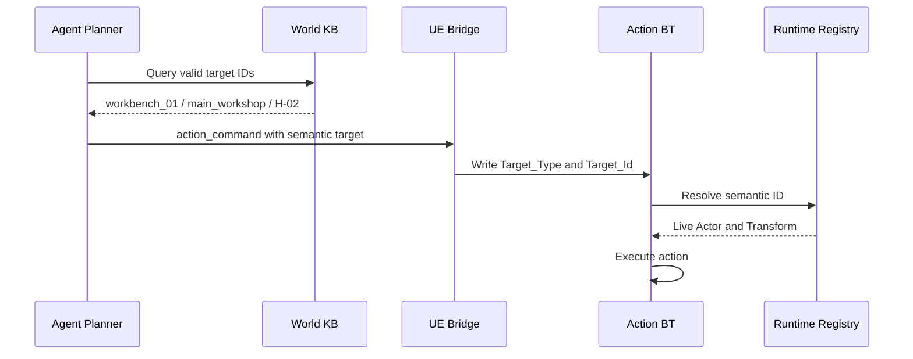
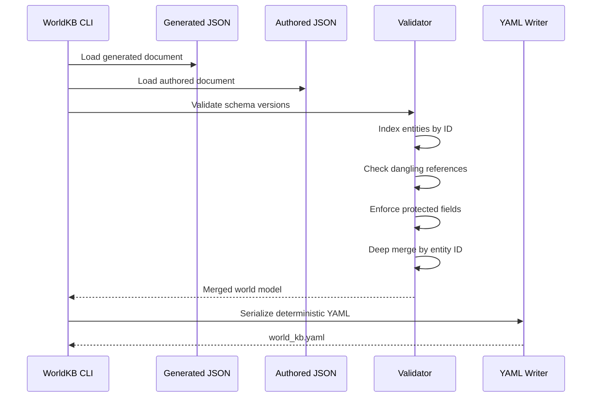
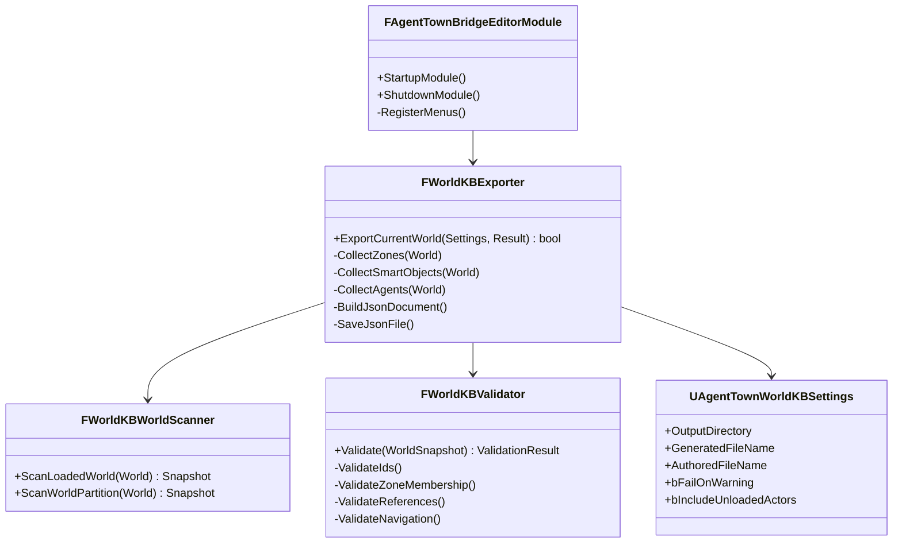

# Agent Town World KB - 生成、合并与编辑器自动化设计方案

## 一、文档目标

本文定义 Agent Town 的 World Knowledge Base（简称 `World KB`）从 UE 地图语义标注、自动导出、人工补充、Agent 侧合并，到运行时目标解析的完整方案。

本文覆盖：

1. 7 个工业小镇区域的语义规划；
2. `world.generated.json` 与 `world.authored.json` 的职责边界；
3. Agent 侧如何合并两份 JSON 并生成 `world_kb.yaml`；
4. `AgentTownBridgeEditor` 自动导出工具的详细实现设计；
5. 数据校验、版本、增量更新、World Partition 与运行时一致性；
6. 与现有 `AgentTownBridge` 代码的对应关系。

> 本方案采用 **JSON 作为机器生成与人工维护的中间格式，YAML 作为 Agent 侧最终可读产物**。UE 编辑器只负责导出 JSON，不直接写 YAML，从而避免 Runtime/Editor 模块引入 YAML 第三方依赖。

---

## 二、核心原则

### 2.1 单一职责

| 数据 | 权威来源 | 负责内容 |
|---|---|---|
| 场景空间事实 | UE 地图 | Actor、Transform、Zone Bounds、交互点、资产引用 |
| 静态语义标注 | UE 组件 | `ZoneId`、`ObjectId`、`ObjectCategory`、`AvailableActions`、`AgentId` |
| 叙事与人设 | `world.authored.json` | 显示名、描述、角色、关系、区域连接、文化设定 |
| 最终 Agent 知识 | 合并后的 `world_kb.yaml` | Agent 规划、检索、Context Builder 的统一输入 |
| 实际动作执行 | UE Runtime Registry | 语义 ID 到实时 Actor / 坐标 /交互点的解析 |

### 2.2 稳定 ID 优先

- Agent 与 UE 之间只传稳定语义 ID，例如 `H-01`、`workbench_01`、`main_workshop`；
- 不使用 Actor Label、实例名、蓝图类名作为业务 ID；
- World KB 中的坐标用于理解、检索与离线规划；
- 实际执行时使用 UE Runtime Registry 获取最新 Actor 和 Transform。

### 2.3 生成数据与人工数据分离

```text
world.generated.json   UE 自动生成，可覆盖
world.authored.json    人工维护，不由 UE 覆盖
          ↓
Agent Merge Pipeline
          ↓
world_kb.yaml          最终合并产物，可重新生成
```

禁止直接长期手改 `world.generated.json` 或 `world_kb.yaml`，否则下次导出/合并会覆盖修改。

---

## 三、工业小镇区域设计

本方案采用 7 个区域，不包含 `drone_apron`。

| 区域 | ID | 定位 | 工作/生活属性 |
|---|---|---|---|
| 中央广场与综合充能站 | `central_plaza` | 公共交通、社交、充能中心 | 生活为主 |
| 主生产车间 | `main_workshop` | 装配、质检、调试的生产核心 | 工作为主 |
| 物料仓储与转运站 | `logistics_hub` | 原料、成品、分拣与配送 | 工作为主 |
| 机械维修厂与零件诊所 | `repair_bay` | 机器人检修、换件、救援 | 工作与生活交汇 |
| 休眠舱居住区 | `residential_quarters` | 休眠、独处、串门、私人物品 | 生活为主 |
| 档案馆与广播站 | `archive_station` | 技术资料、历史、记忆与公共广播 | 文化与生活 |
| 废料回收与再制造场 | `recycling_yard` | 分类、拆解、再制造与永久报废 | 工作与叙事 |

### 3.1 推荐连接关系



连接关系属于“语义道路拓扑”，应优先在 `world.authored.json` 中维护。编辑器可基于距离提供候选，但不应自动把“空间接近”直接认定为“道路可达”。

---

## 四、World KB 总体架构

### 4.1 数据流



### 4.2 Runtime 目标解析与 World KB 的关系



World KB 决定“Agent 知道哪些目标以及它们的静态语义”；Registry 决定“UE 当前实际执行时目标在哪里”。

---

## 五、UE 地图语义标注规范

### 5.1 Zone 标注

地图中的每个区域放置一个 `AZoneTriggerVolume`：

| 字段/组件 | 来源 | 说明 |
|---|---|---|
| `ZoneId` | 人工填写 | 稳定语义 ID，例如 `main_workshop` |
| `TriggerBox` | 场景摆放 | 区域中心和 Bounds |
| `EntryPoint` | 场景摆放 | Agent 移动到该区域时的入口位置和朝向 |
| Actor Label | 编辑器 | 仅用于导出 `editor_label`，不作为语义 ID |

Zone ID 建议使用：

```text
^[a-z][a-z0-9_]{2,63}$
```

### 5.2 Smart Object 标注

给可交互 Actor 添加 `UAgentSmartObjectComponent`：

| 字段 | 说明 | 示例 |
|---|---|---|
| `ObjectId` | World KB 稳定 ID | `workbench_01` |
| `ObjectCategory` | 语义类别 | `workbench` |
| `AvailableActions` | 支持的交互 | `assemble`, `inspect` |
| Component Location | 交互站位 | 工作台前方可导航点 |
| Component Forward | 交互朝向 | Agent 工作时应面对的方向 |
| `CurrentState` | 运行时状态 | 不作为静态导出事实，仅导出默认状态 |

### 5.3 Agent 标注

给参与 Agent Town 的 NPC 添加 `URobotAgentComponent`；PEGame 中使用项目适配类 `UPEGameAgentBridgeComp`。

| 字段 | 说明 | 示例 |
|---|---|---|
| `AgentId` | 稳定 Agent ID | `H-01` |
| `AgentType` | 机体类型 | `humanoid` |
| `ActionBTMap` | 能力配置 | `DT_ActionBTMap` |
| `MainBehaviorTree` | 默认 BT | `BT_AgentTownMain` |

角色姓名、人设、职业、关系不建议写在 UE 组件中，应写在 `world.authored.json`。

---

## 六、`world.generated.json` 设计

### 6.1 顶层结构

```json
{
  "$schema": "agenttown-world-generated/v1",
  "schema_version": "1.0",
  "generated_at": "2026-07-30T10:30:00Z",
  "generator": {
    "name": "AgentTownBridgeEditor",
    "version": "0.1.0"
  },
  "source": {
    "map_package": "/Game/AgentTown/Maps/L_IndustrialTown",
    "map_name": "L_IndustrialTown"
  },
  "coordinate_system": {
    "space": "UE5_world",
    "distance_unit": "centimeter",
    "rotation_unit": "degree",
    "rotation_order": "pitch_yaw_roll"
  },
  "zones": [],
  "objects": [],
  "agents": [],
  "validation_summary": {
    "errors": 0,
    "warnings": 0
  }
}
```

### 6.2 Zone 条目

```json
{
  "id": "main_workshop",
  "editor_label": "Zone_MainWorkshop",
  "actor_path": "/Game/AgentTown/Maps/L_IndustrialTown.L_IndustrialTown:PersistentLevel.Zone_MainWorkshop",
  "bounds": {
    "center": [20000.0, 10000.0, 0.0],
    "extent": [5000.0, 5000.0, 500.0]
  },
  "entry_point": [16000.0, 10000.0, 100.0],
  "entry_facing": [1.0, 0.0, 0.0]
}
```

### 6.3 Smart Object 条目

```json
{
  "id": "workbench_01",
  "category": "workbench",
  "zone_id": "main_workshop",
  "editor_label": "BP_Workbench_01",
  "actor_class": "/Game/AgentTown/Objects/BP_Workbench.BP_Workbench_C",
  "actor_position": [20000.0, 10000.0, 100.0],
  "interaction_point": [19500.0, 10500.0, 100.0],
  "interaction_facing": [1.0, 0.0, 0.0],
  "available_actions": ["assemble", "inspect"],
  "default_state": "idle"
}
```

### 6.4 Agent 条目

```json
{
  "id": "H-01",
  "type": "humanoid",
  "initial_zone": "central_plaza",
  "editor_label": "BP_LaoChen",
  "actor_class": "/Game/AgentTown/Agents/BP_LaoChen.BP_LaoChen_C",
  "initial_position": [10000.0, 11000.0, 100.0],
  "action_table": "/Game/AgentTown/AI/DT_ActionBTMap.DT_ActionBTMap",
  "main_behavior_tree": "/Game/AgentTown/AI/BT_AgentTownMain.BT_AgentTownMain"
}
```

### 6.5 为什么不再拆 `locations` 与 `objects`

旧版 `world_kb.yaml` 中 `locations` 与 `objects` 常一一对应，容易产生双份 ID 和字段漂移。本方案将可交互位置直接合并进 `objects[].interaction_point`。

如未来需要非交互语义地点（如观景点、路口、纪念碑），再增加独立的 `landmarks[]`，不要复用 Smart Object。

---

## 七、`world.authored.json` 设计

人工文件按 ID 使用字典结构，便于覆盖生成条目：

```json
{
  "$schema": "agenttown-world-authored/v1",
  "schema_version": "1.0",
  "site": {
    "id": "industrial_town",
    "display_name": "工业机器人小镇",
    "description": "一座由机器人居民维持生产和日常生活的封闭工业园区。"
  },
  "zones": {
    "central_plaza": {
      "display_name": "中央广场与综合充能站",
      "description": "公共交通、社交和充能中心。",
      "connected_to": ["main_workshop", "residential_quarters", "archive_station"]
    },
    "main_workshop": {
      "display_name": "主生产车间",
      "description": "装配、质检和设备调试的生产核心。",
      "connected_to": ["central_plaza", "logistics_hub", "repair_bay"]
    },
    "logistics_hub": {
      "display_name": "物料仓储与转运站",
      "description": "原料、半成品和成品的仓储与分拣中心。",
      "connected_to": ["main_workshop", "recycling_yard"]
    },
    "repair_bay": {
      "display_name": "机械维修厂与零件诊所",
      "description": "居民检修、换件和紧急救援中心。",
      "connected_to": ["main_workshop", "recycling_yard"]
    },
    "residential_quarters": {
      "display_name": "休眠舱居住区",
      "description": "机器人居民休眠、独处与存放私人物品的生活区。",
      "connected_to": ["central_plaza", "archive_station"]
    },
    "archive_station": {
      "display_name": "档案馆与广播站",
      "description": "保存园区历史、技术资料和个人记忆的文化中心。",
      "connected_to": ["central_plaza", "residential_quarters"]
    },
    "recycling_yard": {
      "display_name": "废料回收与再制造场",
      "description": "废料分类、零件再生和永久报废处理区域。",
      "connected_to": ["logistics_hub", "repair_bay"]
    }
  },
  "objects": {
    "workbench_01": {
      "display_name": "一号装配工作台",
      "description": "老陈经常使用的装配工作台。",
      "required_roles": ["worker"],
      "capacity": 1
    }
  },
  "agents": {
    "H-01": {
      "display_name": "老陈",
      "role": ["supervisor", "worker"],
      "personality": ["沉稳", "念旧", "重视工艺"],
      "home_zone": "residential_quarters",
      "core_memories": []
    }
  },
  "relationships": []
}
```

人工文件允许包含 UE 中不存在的新描述字段，但所有引用 ID 必须通过合并验证。

---

## 八、Agent 侧合并两份 JSON

### 8.1 合并目标

输入：

```text
world.generated.json
world.authored.json
```

输出：

```text
world_kb.yaml
world_kb.manifest.json
```

### 8.2 合并规则

| 规则 | 行为 |
|---|---|
| 实体集合 | 以 `generated` 中实际存在的 Zone/Object/Agent 为基线 |
| 同 ID 标量字段 | `authored` 覆盖 `generated` |
| 字典字段 | 递归 Deep Merge |
| 数组字段 | 默认 authored 完整覆盖；可对白名单字段使用去重合并 |
| `connected_to` | authored 为权威，去重并验证目标 Zone |
| UE 空间字段 | 禁止 authored 覆盖 `bounds`、`entry_point`、`actor_path`、`interaction_point` 等 |
| authored 悬空 ID | 默认报错，不静默写入最终 KB |
| generated 未补叙事 | 允许，但输出 warning |

### 8.3 受保护字段

以下字段只能来自 UE 自动生成：

```text
source
coordinate_system
actor_path
actor_class
actor_position
bounds
entry_point
entry_facing
interaction_point
interaction_facing
initial_position
initial_zone
```

如果 `world.authored.json` 试图覆盖，合并器应失败或至少输出高优先级错误。

### 8.4 合并流程



### 8.5 伪代码

```text
load generated_json
load authored_json

assert generated.schema_version == authored.schema_version

zone_map   = index_by_id(generated.zones)
object_map = index_by_id(generated.objects)
agent_map  = index_by_id(generated.agents)

validate_no_duplicate_ids(generated)
validate_authored_ids_exist(zone_map, object_map, agent_map)
validate_no_protected_field_overrides(authored)

for zone_id, authored_zone in authored.zones:
    zone_map[zone_id] = deep_merge(zone_map[zone_id], authored_zone)

for object_id, authored_object in authored.objects:
    object_map[object_id] = deep_merge(object_map[object_id], authored_object)

for agent_id, authored_agent in authored.agents:
    agent_map[agent_id] = deep_merge(agent_map[agent_id], authored_agent)

validate_zone_connections(zone_map)
validate_object_zone_refs(object_map, zone_map)
validate_agent_zone_refs(agent_map, zone_map)
validate_relationship_refs(authored.relationships, agent_map)

sort all entities by id
write world_kb.yaml
write manifest with hashes
```

### 8.6 推荐 Agent 侧模块

语言不限定，逻辑建议拆为：

```text
world_kb/
├─ loader             JSON / YAML 读取
├─ schema             数据模型与版本校验
├─ merger             Deep Merge + protected fields
├─ validator          ID 与引用一致性
├─ serializer         稳定排序与 YAML 输出
├─ repository         运行时查询 API
└─ context_builder    按任务抽取相关世界子集
```

### 8.7 最终 YAML 示例

```yaml
version: "1.0"
site:
  id: industrial_town
  display_name: 工业机器人小镇

zones:
  - id: main_workshop
    display_name: 主生产车间
    description: 装配、质检和设备调试的生产核心。
    bounds:
      center: [20000.0, 10000.0, 0.0]
      extent: [5000.0, 5000.0, 500.0]
    entry_point: [16000.0, 10000.0, 100.0]
    connected_to: [central_plaza, logistics_hub, repair_bay]

objects:
  - id: workbench_01
    display_name: 一号装配工作台
    category: workbench
    zone_id: main_workshop
    interaction_point: [19500.0, 10500.0, 100.0]
    available_actions: [assemble, inspect]
    capacity: 1

agents:
  - id: H-01
    display_name: 老陈
    type: humanoid
    role: [supervisor, worker]
    initial_zone: central_plaza
    home_zone: residential_quarters
```

### 8.8 Manifest

`world_kb.manifest.json` 用于 UE 与 Agent 版本对齐：

```json
{
  "schema_version": "1.0",
  "generated_sha256": "...",
  "authored_sha256": "...",
  "merged_sha256": "...",
  "source_map": "/Game/AgentTown/Maps/L_IndustrialTown",
  "merged_at": "2026-07-30T10:35:00Z"
}
```

---

## 九、编辑器 World KB 工具设计

### 9.1 当前代码状态

`AgentTownBridgeEditor` 当前只有模块骨架：

- `FAgentTownBridgeEditorModule::StartupModule()`；
- `FAgentTownBridgeEditorModule::ShutdownModule()`；
- Build.cs 已依赖 `UnrealEd`、`LevelEditor`、`ToolMenus`、`Json`、`JsonUtilities`。

尚未实现菜单、扫描、验证和导出。

### 9.2 推荐类结构



### 9.3 菜单设计

Level Editor 主菜单注册：

```text
Tools
└─ Agent Town
   ├─ Validate Current World
   ├─ Export Current World KB
   ├─ Export and Open Folder
   └─ Open World KB Settings
```

模块生命周期：

```text
StartupModule
→ UToolMenus::RegisterStartupCallback
→ RegisterMenus

ShutdownModule
→ UnregisterStartupCallback
→ UToolMenus::UnregisterOwner
```

### 9.4 扫描当前 World

获取编辑器 World：

```cpp
UWorld* World = GEditor ? GEditor->GetEditorWorldContext().World() : nullptr;
```

只扫描 Editor World，不扫描 PIE Client/Server World。

Loaded Actor 扫描建议使用 `TActorIterator<AActor>`：

```text
for each Actor in Editor World
  if Actor is AZoneTriggerVolume
      collect Zone
  for each UAgentSmartObjectComponent on Actor
      collect Smart Object
  for each URobotAgentComponent on Actor
      collect Agent
```

注意一个 Actor 理论上可能有多个 Smart Object Component。导出器不应只调用 `FindComponentByClass`，应使用 `GetComponents` 收集全部组件。

### 9.5 Zone 归属推断

Smart Object 与 Agent 的 `zone_id` 可按空间推断：

1. 取得目标点：
   - Smart Object 使用 `GetInteractionPoint()`；
   - Agent 使用 `GetActorLocation()`；
2. 找包含该点的所有 Zone Bounds；
3. 无匹配：warning `ENTITY_OUTSIDE_ZONE`；
4. 单匹配：直接赋值；
5. 多匹配：选择最小 Bounds 的 Zone，同时 warning `OVERLAPPING_ZONES`；
6. 若业务允许嵌套 Zone，未来应增加显式 `Priority` 或 `ParentZoneId`。

判断应使用 `UBoxComponent` 的世界变换。仅导出 `GetScaledBoxExtent()` 不足以准确表达旋转 Box；Schema 若只支持 AABB，需要明确将旋转 Box 转为 World AABB，或者额外导出 rotation。

### 9.6 ID 校验

导出前必须校验：

| 代码 | 严重度 | 条件 |
|---|---|---|
| `EMPTY_ZONE_ID` | Error | ZoneId 为空 |
| `DUPLICATE_ZONE_ID` | Error | ZoneId 重复 |
| `EMPTY_OBJECT_ID` | Error | ObjectId 为空 |
| `DUPLICATE_OBJECT_ID` | Error | ObjectId 重复 |
| `EMPTY_AGENT_ID` | Error | AgentId 为空 |
| `DUPLICATE_AGENT_ID` | Error | AgentId 重复 |
| `INVALID_ID_FORMAT` | Error | 不符合稳定 ID 正则 |
| `ENTITY_OUTSIDE_ZONE` | Warning | Object/Agent 不在任何 Zone |
| `OVERLAPPING_ZONES` | Warning | 同一点落在多个 Zone |
| `EMPTY_OBJECT_CATEGORY` | Warning | Smart Object 无类别 |
| `EMPTY_OBJECT_ACTIONS` | Warning | Smart Object 无可用交互 |
| `ENTRY_NOT_NAVIGABLE` | Warning/Error | Zone EntryPoint 不在 NavMesh |
| `INTERACTION_NOT_NAVIGABLE` | Warning/Error | 交互点不在 NavMesh |
| `AUTHORED_DANGLING_ID` | Agent-side Error | 人工配置引用不存在实体 |

存在 Error 时禁止写正式 `world.generated.json`，但可以输出验证报告。

### 9.7 JSON 构建

使用 UE 原生 JSON API：

```text
FJsonObject
FJsonValueArray
TJsonWriter
FJsonSerializer::Serialize
FFileHelper::SaveStringToFile
```

导出时：

1. 所有实体按 ID 排序；
2. 所有字符串数组排序或保持明确设计顺序；
3. 浮点数统一精度；
4. 写 UTF-8；
5. 使用临时文件后原子替换，避免中途失败产生半文件；
6. 输出格式化 JSON，方便 Diff。

### 9.8 输出路径

建议默认：

```text
<Project>/Config/AgentTown/
├─ world.generated.json
├─ world.authored.json
└─ world.validation.json
```

`world.authored.json` 不存在时，编辑器可创建最小模板；存在时绝不覆盖。

> `world.generated.json` 需要进入版本控制，便于 Agent 进程在没有编辑器的环境中消费与审查差异。

### 9.9 World Partition 与流式关卡

#### 第一阶段

要求导出时打开目标地图并加载所有相关 Data Layer / Streaming Level，只扫描已加载 Actor。导出报告写明：

```json
{
  "coverage": "loaded_actors_only",
  "world_partition_supported": false
}
```

#### 第二阶段

使用 World Partition Editor Subsystem 加载全部目标区域，或读取 Actor Descriptor 获取未加载 Actor 的基础属性。

风险：Actor Descriptor 未必包含组件实例上的所有 `UPROPERTY`。如果需要准确读取 `ObjectId`、交互点等组件数据，通常仍需临时加载 Actor。

因此推荐工具提供：

```text
bIncludeUnloadedActors = false (default)
DataLayerWhitelist = []
```

并在检测到 World Partition 且存在未加载区域时给出明确 warning。

### 9.10 NavMesh 校验

Zone EntryPoint 与 Smart Object InteractionPoint 应调用 Navigation System 做投影：

```text
ProjectPointToNavigation(Point)
```

建议：

- 投影距离小于阈值：记录 `nav_projected_point`，原始点保持不变；
- 投影失败：Error 或 Warning；
- Exporter 不自动移动场景组件，避免工具暗改地图。

### 9.11 导出结果 UI

导出后弹出摘要：

```text
World KB Export Completed
Map: L_IndustrialTown
Zones: 7
Objects: 24
Agents: 10
Errors: 0
Warnings: 3
Output: Config/AgentTown/world.generated.json
```

详细问题输出到：

- Message Log 的 `AgentTownWorldKB` 分类；
- `world.validation.json`；
- Output Log 的 `LogAgentTown`。

---

## 十、编辑器工具实现步骤

### Step 1：Schema 与数据结构

新增 Editor 或共享头文件：

```text
WorldKBExportTypes.h
```

定义普通结构：

```text
FWorldKBZoneRecord
FWorldKBObjectRecord
FWorldKBAgentRecord
FWorldKBValidationIssue
FWorldKBSnapshot
FWorldKBExportResult
```

如果只在 Editor 使用，无需 `USTRUCT`；如果未来要做蓝图工具或 Details UI，可使用 `USTRUCT(BlueprintType)`。

### Step 2：补充 Runtime 访问器

Exporter 需要读取：

- `AZoneTriggerVolume::TriggerBox` 的 Bounds；
- `AZoneTriggerVolume::EntryPoint`；
- Smart Object Component 的 Transform；
- Agent Component 配置。

当前 `TriggerBox` 为 protected，应增加只读 getter：

```text
GetTriggerBox()
GetZoneBounds()
```

不要让 Editor 模块通过反射猜属性。

### Step 3：实现扫描器

新增：

```text
Private/WorldKB/WorldKBWorldScanner.h/.cpp
```

职责：只采集事实，不写文件、不做叙事合并。

### Step 4：实现验证器

新增：

```text
Private/WorldKB/WorldKBValidator.h/.cpp
```

职责：ID、Zone 归属、引用和 NavMesh 检查。

### Step 5：实现 JSON Exporter

新增：

```text
Private/WorldKB/WorldKBExporter.h/.cpp
```

职责：构建稳定排序 JSON、保存文件、写验证报告。

### Step 6：注册菜单

更新：

```text
AgentTownBridgeEditor.h/.cpp
```

增加 `RegisterMenus()`、`ValidateCurrentWorld()`、`ExportCurrentWorldKB()`。

### Step 7：设置面板

新增：

```text
UAgentTownWorldKBSettings : UDeveloperSettings
```

推荐字段：

| 字段 | 默认值 |
|---|---|
| `OutputDirectory` | `Config/AgentTown` |
| `GeneratedFileName` | `world.generated.json` |
| `ValidationFileName` | `world.validation.json` |
| `bFailOnWarning` | false |
| `bValidateNavigation` | true |
| `bIncludeAgents` | true |
| `bLoadedActorsOnly` | true |

### Step 8：自动化测试

至少增加：

1. 空 ID 被拒绝；
2. 重复 ID 被拒绝；
3. Smart Object 正确归属 Zone；
4. 多 Zone 重叠产生 warning；
5. JSON 排序稳定；
6. 相同地图连续导出 byte-for-byte 一致（排除 `generated_at`，或将时间放 Manifest）；
7. Authored 覆盖叙事字段但不能覆盖受保护字段；
8. 悬空关系和连接引用被拒绝。

---

## 十一、Agent 侧 World KB Repository

合并完成后，Agent 侧不应每次遍历 YAML，而应建立索引：

```text
zones_by_id
objects_by_id
agents_by_id
objects_by_zone
objects_by_category
agents_by_zone
zone_graph
```

推荐查询接口：

| 接口 | 用途 |
|---|---|
| `get_zone(id)` | 获取区域语义与入口 |
| `get_object(id)` | 获取 Smart Object |
| `get_agent(id)` | 获取 Agent 人设与静态信息 |
| `find_objects(zone, category, action)` | 为规划器筛选可用目标 |
| `find_path_zones(from, to)` | 基于区域连接图做粗粒度规划 |
| `build_context(agent_id, goal)` | 构建 LLM 最小相关上下文 |

运行时状态不覆盖 World KB 静态数据，而以 Overlay 保存：

```text
Static World KB
+
Runtime State Overlay
  object state / occupied_by / current agent zone
=
Decision Context
```

---

## 十二、版本同步与错误处理

### 12.1 启动握手

建议未来在 UE 注册或连接消息中增加：

```json
{
  "world_kb": {
    "schema_version": "1.0",
    "map_package": "/Game/AgentTown/Maps/L_IndustrialTown",
    "generated_sha256": "..."
  }
}
```

Agent 侧比较 Manifest：

| 情况 | 处理 |
|---|---|
| 版本一致 | 正常运行 |
| Map 不一致 | 拒绝规划并告警 |
| Hash 不一致 | 开发环境 warning；正式环境拒绝启动 |
| 某 ID Agent 有但 UE 无 | Action Validator 阻止下发 |
| UE 有新 ID 但 KB 无 | 记录同步告警并要求重新导出 |

### 12.2 运行时失败

即使 World KB 校验通过，运行时实体也可能因 Streaming、销毁或故障暂时不存在。UE Resolver 仍必须返回失败：

```text
UNKNOWN_TARGET
TARGET_NOT_LOADED
TARGET_OCCUPIED
TARGET_BROKEN
INTERACTION_NOT_SUPPORTED
```

Agent 收到失败后刷新感知或重新规划，不能假设静态 KB 永远等于实时世界。

---

## 十三、实施优先级

### Phase A：最小可用导出

1. 当前 Editor World 扫描；
2. Zone / Smart Object / Agent 导出；
3. 空 ID、重复 ID、Zone 归属校验；
4. 输出 `world.generated.json`；
5. 手工维护 `world.authored.json`；
6. Agent 侧合并生成 `world_kb.yaml`。

### Phase B：工程可靠性

1. NavMesh 校验；
2. Message Log 报告；
3. JSON Schema；
4. Hash Manifest；
5. CI 合并与校验；
6. 命令行/Commandlet 导出。

### Phase C：大型地图支持

1. World Partition 全区域扫描；
2. Data Layer 白名单；
3. Level Instance 支持；
4. 差异预览；
5. World KB 编辑器浏览器。

---

## 十四、验收标准

### UE 编辑器侧

- [ ] 7 个 Zone 均有唯一 `ZoneId` 和可导航 `EntryPoint`；
- [ ] 所有可交互对象均有唯一 `ObjectId`；
- [ ] 所有 Agent 均有唯一 `AgentId`；
- [ ] 点击菜单可以验证当前地图；
- [ ] Error 时禁止正式导出；
- [ ] 成功后生成稳定、可 Diff 的 `world.generated.json`；
- [ ] 不覆盖 `world.authored.json`；
- [ ] 导出实体数量与地图一致。

### Agent 侧

- [ ] 两份 JSON Schema 版本一致；
- [ ] 人工叙事字段正确覆盖；
- [ ] UE 受保护字段不能被人工文件覆盖；
- [ ] 所有 Zone/Object/Agent 引用合法；
- [ ] 输出排序稳定的 `world_kb.yaml`；
- [ ] Context Builder 能按任务检索相关区域和对象；
- [ ] Action 参数只使用有效语义 ID。

### 运行时

- [ ] `target_type=agent` 能解析 Agent Registry；
- [ ] `target_type=smart_object` 能解析 Smart Object Registry；
- [ ] `target_type=zone` 能解析 Zone Registry；
- [ ] `target_type=position` 可直接执行；
- [ ] World KB 坐标变化不影响 UE 使用 Registry 获取实时目标。

---

## 十五、总结

World KB 不是 UE 地图的简单坐标转储，而是由三部分组成的语义世界：

```text
UE Map Facts
+
UE Semantic Components
+
Authored Narrative Knowledge
=
Agent World KB
```

推荐最终工作流：

```text
地图搭建
→ Zone / Smart Object / Agent 语义标注
→ Validate Current World
→ Export world.generated.json
→ 人工维护 world.authored.json
→ Agent 侧校验并 Deep Merge
→ 生成 world_kb.yaml + Manifest
→ Context Builder 提供最小相关世界上下文
→ Agent 只输出语义 ID
→ UE Runtime Registry 解析实时 Actor 与位置
```

该方案既保证地图变化可以自动同步，又保护人设、描述、关系等手工内容不被覆盖，同时保持 Agent 规划与 UE 实际执行之间的 ID 一致性。
